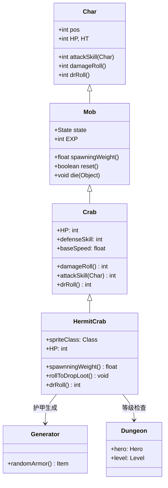

# HermitCrab 源码详解

## 1. 基本信息

| 属性 | 值 |
|------|-----|
| **文件路径** | core/src/main/java/com/shatteredpixel/shatteredpixeldungeon/actors/mobs/HermitCrab.java |
| **包名** | com.shatteredpixel.shatteredpixeldungeon.actors.mobs |
| **类类型** | class（非抽象） |
| **继承关系** | extends Crab |
| **代码行数** | 54 |
| **中文名称** | 寄居蟹 |

---

## 类职责

HermitCrab（寄居蟹）是螃蟹的强化变种，具有更高的生命值和更好的掉落。它负责：

1. **强化属性**：拥有67%更高的生命值和更好的伤害减免
2. **减速移动**：移动速度降低50%，提供更稳定的威胁
3. **双重掉落**：高概率掉落神秘肉，并保证掉落一件护甲
4. **等级适配**：只在英雄等级合适时掉落高品质护甲

**设计模式**：
- **装饰器模式**：在基础螃蟹功能上添加强化特性
- **条件掉落模式**：根据英雄等级控制高品质物品掉落
- **属性强化模式**：通过简单的数值调整实现难度提升

---

## 4. 继承与协作关系



---

## 实例字段表

| 字段名 | 类型 | 设置值 | 说明 |
|--------|------|--------|------|
| `spriteClass` | Class | HermitCrabSprite.class | 角色精灵类 |
| `HP` / `HT` | int | 25 | 当前/最大生命值（比普通螃蟹多67%） |
| `baseSpeed` | float | 1f | 基础移动速度（比普通螃蟹慢50%） |
| `lootChance` | float | 0.5f | 神秘肉掉落概率（50%，是普通螃蟹的3倍） |

### 继承自 Crab 的字段

| 字段名 | 类型 | 说明 |
|--------|------|------|
| `defenseSkill` | int | 5（继承自父类） |
| `EXP` | int | 4（继承自父类） |
| `maxLvl` | int | 9（继承自父类） |
| `loot` | Class | MysteryMeat.class（继承自父类） |

---

## 7. 方法详解

### 构造块（Instance Initializer）

```java
{
    spriteClass = HermitCrabSprite.class;
    
    HP = HT = 25; //+67% HP
    baseSpeed = 1f; //-50% speed
    
    //3x more likely to drop meat, and drops a guaranteed armor
    lootChance = 0.5f;
}
```

**作用**：初始化寄居蟹的基础属性，设置强化生命值、减速移动和高概率食物掉落。

---

### rollToDropLoot()

```java
@Override
public void rollToDropLoot() {
    super.rollToDropLoot();
    
    if (Dungeon.hero.lvl <= maxLvl + 2){
        Dungeon.level.drop(Generator.randomArmor(), pos).sprite.drop();
    }
}
```

**方法作用**：实现双重掉落机制，在标准掉落基础上增加一件护甲。

**掉落逻辑**：
- **条件检查**：只有当英雄等级 ≤ `maxLvl + 2`（即 ≤ 11）时才掉落护甲
- **护甲生成**：使用 `Generator.randomArmor()` 生成随机护甲
- **位置处理**：在寄居蟹死亡位置掉落护甲

**设计意图**：
- **早期奖励**：为早期玩家提供额外的装备奖励
- **后期平衡**：高等级玩家不会获得过多低品质护甲
- **双倍价值**：同时提供食物和装备两种资源

---

### drRoll()

```java
@Override
public int drRoll() {
    return super.drRoll() + 2; //2-6 DR total, up from 0-4
}
```

**方法作用**：增强伤害减免能力。

**伤害减免提升**：
- **基础范围**：父类螃蟹提供 0-4 点伤害减免
- **强化后**：寄居蟹提供 2-6 点伤害减免
- **平均提升**：从平均2点提升到平均4点，防御能力翻倍

---

## 11. 使用示例

### 关卡生成配置

```java
// 在中期关卡生成寄居蟹
HermitCrab hermitCrab = new HermitCrab();
hermitCrab.pos = room.random();

// 标准生成方法
Room.spawnMob(hermitCrab, room);
```

### 自定义掉落控制

```java
// 修改掉落条件的寄居蟹变种
public class EnhancedHermitCrab extends HermitCrab {
    @Override
    public void rollToDropLoot() {
        super.rollToDropLoot();
        
        // 移除等级限制，总是掉落护甲
        Dungeon.level.drop(Generator.randomArmor(), pos).sprite.drop();
    }
}
```

---

## 注意事项

### 平衡性考虑

1. **属性强化**：67%生命值提升和翻倍的伤害减免使其比普通螃蟹更强
2. **移动减速**：50%速度降低平衡了属性强化，给玩家更多反应时间
3. **掉落价值**：双重掉落机制提供高价值奖励，鼓励玩家挑战
4. **等级适配**：`maxLvl=9` 确保只在合适关卡出现

### 特殊机制

1. **条件掉落**：只在英雄等级合适时掉落高品质护甲
2. **双重奖励**：同时提供食物（50%概率）和装备（条件性）奖励
3. **继承简化**：完全复用父类的复杂AI逻辑，只重写必要方法

### 技术特点

1. **最小重写**：仅54行代码，通过继承最大化代码复用
2. **高效实现**：所有增强都通过简单数值调整实现
3. **向后兼容**：与现有螃蟹系统完全兼容
4. **性能优化**：无额外运行时开销

### 战斗策略

**对玩家的威胁**：
- 更高的生命值需要更多输出
- 更好的防御能力减少受到的伤害
- 缓慢移动使其容易被包围

**对抗策略**：
- 利用其缓慢移动进行围攻
- 准备足够的输出应对高生命值
- 重视其高品质掉落的装备价值

---

## 最佳实践

### 强化变种设计

```java
// 标准强化变种模式
public class EnhancedVariant extends BaseClass {
    {
        // 属性强化
        HP = HT = baseHP * enhancementFactor;
        baseSpeed = baseSpeed * speedFactor;
        lootChance = baseLootChance * lootMultiplier;
    }
    
    @Override
    public void rollToDropLoot() {
        super.rollToDropLoot();
        // 额外掉落逻辑
        addExtraLoot();
    }
    
    @Override
    public int drRoll() {
        return super.drRoll() + defenseBonus;
    }
}
```

### 条件掉落系统

```java
// 等级适配掉落
@Override
public void rollToDropLoot() {
    super.rollToDropLoot();
    if (shouldDropExtraLoot()) {
        dropExtraItem();
    }
}

private boolean shouldDropExtraLoot() {
    return Dungeon.hero.lvl <= maxLvl + levelTolerance;
}
```

---

## 相关类

| 类名 | 关系 | 说明 |
|------|------|------|
| `Crab` | 父类 | 基础螃蟹类 |
| `HermitCrabSprite` | 精灵类 | 对应的视觉表现 |
| `Generator` | 工具类 | 随机护甲生成 |
| `Dungeon` | 全局类 | 英雄等级和关卡访问 |

---

## 消息键

| 键名 | 值 | 用途 |
|------|-----|------|
| `monsters.hermitcrab.name` | hermit crab | 怪物名称 |
| `monsters.hermitcrab.desc` | A large crab that has taken up residence in a discarded piece of armor. It seems much tougher than regular crabs... | 怪物描述 |