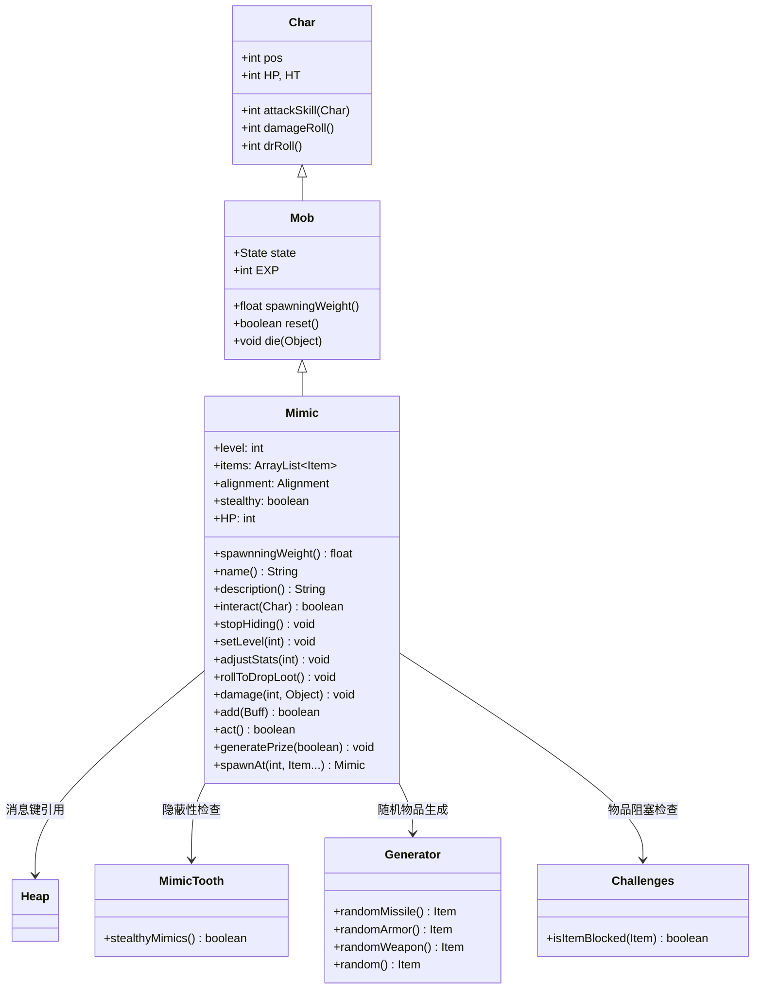

# Mimic 源码详解

## 1. 基本信息

| 属性 | 值 |
|------|-----|
| **文件路径** | core/src/main/java/com/shatteredpixel/shatteredpixeldungeon/actors/mobs/Mimic.java |
| **包名** | com.shatteredpixel.shatteredpixeldungeon.actors.mobs |
| **类类型** | class（非抽象） |
| **继承关系** | extends Mob |
| **代码行数** | 361 |
| **中文名称** | 拟态怪 |

---

## 类职责

Mimic（拟态怪）是游戏中具有伪装能力的特殊敌人。它负责：

1. **伪装机制**：初始时表现为普通箱子，只有在被互动或攻击时才显现真面目
2. **动态属性**：根据关卡深度动态调整生命值、攻击力等属性
3. **丰富战利品**：除了伪装的物品外，还会额外掉落随机奖励
4. **任务集成**：作为多个任务的关键目标，死亡时触发任务进度
5. **隐蔽模式**：与"拟态牙"饰品配合，提供更难察觉的隐蔽行为

**设计模式**：
- **状态模式**：通过 `Alignment.NEUTRAL` 和 `Alignment.ENEMY` 实现伪装/战斗状态切换
- **工厂模式**：提供多种静态方法用于在不同场景生成拟态怪
- **动态配置模式**：根据关卡深度自动调整属性强度

---

## 4. 继承与协作关系



---

## 实例字段表

| 字段名 | 类型 | 默认值 | 说明 |
|--------|------|--------|------|
| `spriteClass` | Class | MimicSprite.class | 角色精灵类 |
| `level` | int | - | 拟态怪等级，影响所有属性 |
| `items` | ArrayList<Item> | null | 掉落物品列表（包含伪装物品和额外奖励） |
| `alignment` | Alignment | NEUTRAL | 对齐状态（NEUTRAL=伪装，ENEMY=战斗） |
| `stealthy` | boolean | false | 是否启用隐蔽模式 |
| `EXP` | int | 0 | 击败后获得的经验值（伪装状态下为0） |

### 特殊属性

| 属性 | 说明 |
|------|------|
| `Property.DEMONIC` | 恶魔单位，具有特殊免疫和弱点 |

### 状态管理

| 状态字段 | 类型 | 初始值 | 说明 |
|----------|------|--------|------|
| `state` | State | PASSIVE | 初始状态为被动 |
| `alignment` | Alignment | NEUTRAL | 初始对齐为中立（伪装） |

---

## 7. 方法详解

### 构造块（Instance Initializer）

```java
{
    spriteClass = MimicSprite.class;
    
    properties.add(Property.DEMONIC);
    
    EXP = 0;
    
    //mimics are neutral when hidden
    alignment = Alignment.NEUTRAL;
    state = PASSIVE;
}
```

**作用**：初始化拟态怪的基础属性，设置恶魔属性、伪装状态和被动行为。

---

### 核心伪装机制

#### name() 和 description()

```java
@Override
public String name() {
    if (alignment == Alignment.NEUTRAL){
        return Messages.get(Heap.class, "chest");
    } else {
        return super.name();
    }
}

@Override
public String description() {
    if (alignment == Alignment.NEUTRAL){
        if (MimicTooth.stealthyMimics()){
            return Messages.get(Heap.class, "chest_desc");
        } else {
            return Messages.get(Heap.class, "chest_desc") + "\n\n" + Messages.get(this, "hidden_hint");
        }
    } else {
        return super.description();
    }
}
```

**作用**：根据伪装状态返回不同的名称和描述。

**伪装表现**：
- **名称**：显示为"chest"（箱子）
- **描述**：
  - 隐蔽模式：仅显示标准箱子描述
  - 普通模式：显示箱子描述 + 隐藏提示（"...but something seems off about it."）

#### interact(Char c)

```java
@Override
public boolean interact(Char c) {
    if (alignment != Alignment.NEUTRAL || c != Dungeon.hero){
        return super.interact(c);
    }
    stopHiding();
    
    Dungeon.hero.busy();
    Dungeon.hero.sprite.operate(pos);
    if (Dungeon.hero.invisible <= 0
            && Dungeon.hero.buff(Swiftthistle.TimeBubble.class) == null
            && Dungeon.hero.buff(TimekeepersHourglass.timeFreeze.class) == null){
        return doAttack(Dungeon.hero);
    } else {
        sprite.idle();
        alignment = Alignment.ENEMY;
        Dungeon.hero.spendAndNext(1f);
        return true;
    }
}
```

**作用**：处理玩家与"箱子"的互动，触发伪装解除。

**激活逻辑**：
- **正常情况**：立即对英雄发动攻击
- **特殊状态**：如果英雄处于隐身、时间泡泡或时间冻结状态，则只解除伪装但不攻击

#### stopHiding()

```java
public void stopHiding(){
    state = HUNTING;
    if (sprite != null) sprite.idle();
    if (Actor.chars().contains(this) && Dungeon.level.heroFOV[pos]) {
        enemy = Dungeon.hero;
        target = Dungeon.hero.pos;
        GLog.w(Messages.get(this, "reveal") );
        CellEmitter.get(pos).burst(Speck.factory(Speck.STAR), 10);
        Sample.INSTANCE.play(Assets.Sounds.MIMIC);
    }
}
```

**作用**：停止伪装并激活战斗状态。

**激活效果**：
- **状态切换**：从PASSIVE切换到HUNTING
- **视觉特效**：播放星光粒子效果
- **音效**：播放拟态怪特有的音效
- **消息提示**：显示"revealed"警告消息（"The chest suddenly opens its eyes!"）

---

### 属性动态调整

#### setLevel(int level) 和 adjustStats(int level)

```java
public void setLevel(int level){
    this.level = level;
    adjustStats(level);
}

public void adjustStats(int level) {
    HP = HT = (1 + level) * 6;
    defenseSkill = 2 + level/2;
    
    enemySeen = true;
}
```

**作用**：根据等级动态调整属性。

**属性计算**：
- **生命值**：`(1 + level) * 6`
- **防御技能**：`2 + level/2`
- **等级来源**：通常使用 `Dungeon.scalingDepth()` 获取当前关卡深度

**示例**：
| 关卡深度 | 生命值 | 防御技能 |
|----------|--------|----------|
| 1 | 12 | 2 |
| 5 | 36 | 4 |
| 10 | 66 | 7 |
| 20 | 126 | 12 |

---

### 战利品系统

#### generatePrize(boolean useDecks)

```java
protected void generatePrize(boolean useDecks){
    Item reward = null;
    do {
        switch (Random.Int(5)) {
            case 0:
                reward = new Gold().random();
                break;
            case 1:
                reward = Generator.randomMissile(!useDecks);
                break;
            case 2:
                reward = Generator.randomArmor();
                break;
            case 3:
                reward = Generator.randomWeapon(!useDecks);
                break;
            case 4:
                reward = useDecks ? Generator.random(Generator.Category.RING) : Generator.randomUsingDefaults(Generator.Category.RING);
                break;
        }
    } while (reward == null || Challenges.isItemBlocked(reward));
    items.add(reward);
    
    if (MimicTooth.stealthyMimics()){
        //add an extra random item if player has a mimic tooth
        items.add(Generator.randomUsingDefaults());
    }
}
```

**作用**：生成额外的随机奖励物品。

**奖励类型**（均匀分布）：
1. **金币**：随机数量的金币
2. **投掷武器**：随机投掷武器
3. **护甲**：随机护甲
4. **武器**：随机近战武器
5. **戒指**：随机戒指

**特殊机制**：
- **挑战检查**：跳过被当前挑战阻塞的物品
- **隐蔽奖励**：如果玩家有"拟态牙"饰品，额外增加一个随机物品

#### rollToDropLoot()

```java
@Override
public void rollToDropLoot(){
    if (items != null) {
        for (Item item : items) {
            Dungeon.level.drop(item, pos).sprite.drop();
        }
        items = null;
    }
    super.rollToDropLoot();
}
```

**作用**：掉落所有物品（包括伪装物品和额外奖励）。

---

### 激活触发条件

拟态怪会在以下任一条件下激活：

1. **玩家互动**：尝试打开"箱子"
2. **受到伤害**：被任何攻击击中
3. **负面Buff**：受到任何负面状态效果
4. **AI状态改变**：从PASSIVE切换到其他状态
5. **防御处理**：在PASSIVE状态下受到攻击

所有这些条件都会调用 `stopHiding()` 方法完成激活。

---

### 工厂方法

#### spawnAt() 系列方法

```java
public static Mimic spawnAt(int pos, Item... items){
    return spawnAt(pos, Mimic.class, items);
}

public static Mimic spawnAt(int pos, Class mimicType, Item... items){
    return spawnAt(pos, mimicType, true, items);
}

public static Mimic spawnAt(int pos, boolean useDecks, Item... items){
    return spawnAt(pos, Mimic.class, useDecks, items);
}

public static Mimic spawnAt(int pos, Class mimicType, boolean useDecks, Item... items){
    Mimic m;
    if (mimicType == GoldenMimic.class){
        m = new GoldenMimic();
    } else if (mimicType == CrystalMimic.class) {
        m = new CrystalMimic();
    } else if (mimicType == EbonyMimic.class) {
        m = new EbonyMimic();
    } else {
        m = new Mimic();
    }
    
    m.items = new ArrayList<>(Arrays.asList(items));
    m.setLevel(Dungeon.scalingDepth());
    m.pos = pos;
    
    //generate an extra reward for killing the mimic
    m.generatePrize(useDecks);
    
    if (MimicTooth.stealthyMimics()){
        m.stealthy = true;
    }
    
    return m;
}
```

**作用**：提供灵活的拟态怪生成接口。

**参数说明**：
- `pos`：生成位置
- `mimicType`：拟态怪类型（普通、黄金、水晶、黑檀木）
- `useDecks`：是否使用完整物品池（影响戒指生成）
- `items`：伪装的物品列表

---

## 11. 使用示例

### 基础拟态怪生成

```java
// 创建带有特定物品的拟态怪
Item[] chestContents = {new Gold(50), new PotionOfHealing()};
Mimic mimic = Mimic.spawnAt(position, chestContents);

// 添加到游戏场景
GameScene.add(mimic);
Dungeon.level.mobs.add(mimic);
```

### 特殊类型拟态怪

```java
// 生成黄金拟态怪
Mimic goldenMimic = Mimic.spawnAt(position, GoldenMimic.class, gold, weapon);

// 生成不使用完整物品池的拟态怪
Mimic basicMimic = Mimic.spawnAt(position, false, simpleItems);
```

### 自定义拟态怪

```java
// 创建自定义拟态怪变种
public class CustomMimic extends Mimic {
    @Override
    protected void generatePrize(boolean useDecks) {
        // 调用父类生成基础奖励
        super.generatePrize(useDecks);
        
        // 添加特殊物品
        items.add(new SpecialArtifact());
    }
}
```

---

## 注意事项

### 平衡性考虑

1. **动态难度**：属性随关卡深度自动调整，保持适当挑战性
2. **战利品价值**：额外奖励物品提供高价值回报，鼓励玩家挑战
3. **生成控制**：`spawningWeight()` 返回0确保不会自然生成
4. **经验奖励**：伪装状态下EXP=0，激活后获得正常经验值

### 特殊机制

1. **完全伪装**：在伪装状态下完全被动，不会主动攻击
2. **多重激活**：多种条件都能触发激活，防止玩家滥用
3. **隐蔽模式**：与"拟态牙"饰品的深度集成
4. **挑战兼容**：自动跳过被当前挑战阻塞的物品

### 技术特点

1. **状态持久化**：完整的Bundle保存/恢复逻辑
2. **类型安全**：使用泛型和instanceof确保类型安全
3. **向后兼容**：支持所有拟态怪变种的统一接口
4. **性能优化**：延迟初始化和高效的条件检查

### 战斗策略

**对玩家的威胁**：
- 完全伪装使其难以识别
- 激活后立即攻击，可能造成意外伤害
- 属性随关卡深度增强，后期更具威胁

**对抗策略**：
- 仔细观察可疑的箱子
- 准备足够的输出应对激活后的战斗
- 利用特殊状态（隐身、时间冻结）安全解除伪装

---

## 最佳实践

### 伪装敌人设计

```java
// 标准伪装模式
private Alignment alignment = Alignment.NEUTRAL;

@Override
public String name() {
    return alignment == Alignment.NEUTRAL ? getDisguiseName() : super.name();
}

@Override
public boolean interact(Char c) {
    if (alignment == Alignment.NEUTRAL) {
        activate();
        return handleActivation(c);
    }
    return super.interact(c);
}

private void activate() {
    alignment = Alignment.ENEMY;
    state = HUNTING;
    showRevealEffects();
}
```

### 动态属性系统

```java
// 关卡适配属性
public void setLevel(int depth) {
    this.level = depth;
    HP = HT = calculateHealth(depth);
    defenseSkill = calculateDefense(depth);
    // ... 其他属性
}

private int calculateHealth(int depth) {
    return baseHealth + healthPerLevel * depth;
}
```

### 灵活工厂模式

```java
// 多类型工厂方法
public static Enemy spawnAt(int pos, Class<? extends Enemy> type, Items... items) {
    Enemy enemy = createEnemyOfType(type);
    enemy.setItems(items);
    enemy.setPosition(pos);
    return enemy;
}
```

---

## 相关类

| 类名 | 关系 | 说明 |
|------|------|------|
| `Mob` | 父类 | 所有怪物的基类 |
| `MimicSprite` | 精灵类 | 对应的视觉表现 |
| `Heap` | 消息源 | 提供箱子相关的本地化消息 |
| `MimicTooth` | 饰品类 | 提供隐蔽拟态功能 |
| `Generator` | 工具类 | 随机物品生成 |
| `Challenges` | 系统类 | 挑战系统，物品阻塞检查 |

---

## 消息键

| 键名 | 值 | 用途 |
|------|-----|------|
| `monsters.mimic.name` | mimic | 怪物名称 |
| `heaps.chest` | chest | 伪装状态名称 |
| `heaps.chest_desc` | A wooden chest. | 伪装状态描述 |
| `monsters.mimic.hidden_hint` | ...but something seems off about it. | 隐藏提示（非隐蔽模式） |
| `monsters.mimic.reveal` | The chest suddenly opens its eyes! | 激活警告消息 |