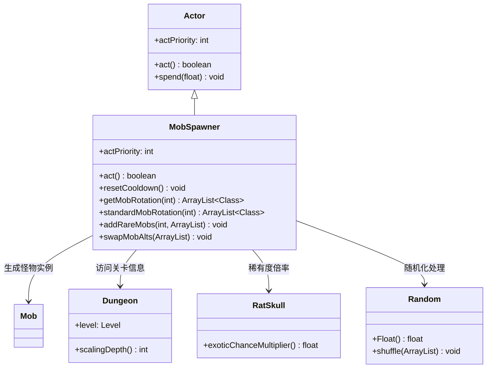

# MobSpawner 源码详解

## 1. 基本信息

| 属性 | 值 |
|------|-----|
| **文件路径** | core/src/main/java/com/shatteredpixel/shatteredpixeldungeon/actors/mobs/MobSpawner.java |
| **包名** | com.shatteredpixel.shatteredpixeldungeon.actors.mobs |
| **类类型** | class（非抽象） |
| **继承关系** | extends Actor |
| **代码行数** | 276 |
| **中文名称** | 怪物生成器 |

---

## 类职责

MobSpawner（怪物生成器）是游戏中的核心系统组件，负责动态生成和管理关卡中的怪物。它负责：

1. **自动重生**：在关卡中怪物数量不足时自动生成新怪物
2. **关卡适配**：根据当前关卡深度提供合适的怪物组合
3. **稀有怪物**：有概率生成稀有变种怪物，增加游戏多样性
4. **替代机制**：将普通怪物替换为稀有变种，提供额外挑战
5. **冷却控制**：管理怪物重生的冷却时间，防止过度生成

**设计模式**：
- **工厂模式**：通过 `getMobRotation()` 提供不同关卡的怪物配置
- **策略模式**：根据不同关卡深度使用不同的怪物组合策略
- **观察者模式**：作为Actor定期检查并执行怪物生成逻辑

---

## 4. 继承与协作关系



---

## 实例字段表

| 字段名 | 类型 | 设置值 | 说明 |
|--------|------|--------|------|
| `actPriority` | int | BUFF_PRIO | 行动优先级（与Buff相同） |

### 静态字段

| 字段名 | 类型 | 说明 |
|--------|------|------|
| `RARE_ALTS` | HashMap<Class, Class> | 普通怪物到稀有变种的映射表 |

---

## 7. 方法详解

### 构造块（Instance Initializer）

```java
{
    actPriority = BUFF_PRIO; //as if it were a buff.
}
```

**作用**：设置行动优先级，使其像Buff一样定期执行。

---

### act()

```java
@Override
protected boolean act() {
    if (Dungeon.level.mobCount() < Dungeon.level.mobLimit()) {
        if (Dungeon.level.spawnMob(12)){
            spend(Dungeon.level.respawnCooldown());
        } else {
            //try again in 1 turn
            spend(TICK);
        }
    } else {
        spend(Dungeon.level.respawnCooldown());
    }
    return true;
}
```

**方法作用**：核心怪物生成逻辑。

**生成流程**：
1. **数量检查**：如果当前怪物数量小于限制，则尝试生成
2. **生成尝试**：调用 `Dungeon.level.spawnMob(12)` 尝试生成怪物
3. **冷却设置**：
   - 成功生成：使用标准重生冷却时间
   - 失败生成：1回合后重试
   - 数量充足：直接使用重生冷却时间

**参数说明**：
- `spawnMob(12)`：传入12作为权重参数，影响生成概率

---

### resetCooldown()

```java
public void resetCooldown(){
    spend(-cooldown());
    spend(Dungeon.level.respawnCooldown());
}
```

**方法作用**：重置怪物生成冷却时间。

**使用场景**：
- 关卡重置时
- 特殊事件触发时
- 调试或测试时

---

### getMobRotation(int depth)

```java
public static ArrayList<Class<? extends Mob>> getMobRotation(int depth ){
    ArrayList<Class<? extends Mob>> mobs = standardMobRotation(depth);
    addRareMobs(depth, mobs);
    swapMobAlts(mobs);
    Random.shuffle(mobs);
    return mobs;
}
```

**方法作用**：获取指定关卡深度的完整怪物生成列表。

**处理流程**：
1. **基础配置**：获取标准怪物组合
2. **稀有添加**：有概率添加稀有关卡怪物
3. **变种替换**：将部分普通怪物替换为稀有变种
4. **随机打乱**：确保生成顺序的随机性

---

### standardMobRotation(int depth)

```java
private static ArrayList<Class<? extends Mob>> standardMobRotation(int depth){
    switch(depth){
        // Sewers (1-5)
        case 1: default:
            return Arrays.asList(Rat.class, Rat.class, Rat.class, Snake.class);
        case 2:
            return Arrays.asList(Rat.class, Rat.class, Snake.class, Gnoll.class, Gnoll.class);
        // ... more cases for each depth
    }
}
```

**方法作用**：返回指定关卡深度的标准怪物组合。

**关卡分布**：
- **下水道**（1-5层）：老鼠、蛇、狗头人、集群、螃蟹、史莱姆
- **监狱**（6-10层）：骷髅、盗贼、DM-100、守卫、死灵法师
- **洞穴**（11-15层）：蝙蝠、蛮族、萨满、纺蛛、DM-200
- **城市**（16-20层）：食尸鬼、元素、术士、僧侣、魔像
- **大厅**（21-26层）：魅魔、邪眼、蝎子

**设计特点**：
- **渐进难度**：随着关卡深度增加，怪物强度和种类逐渐提升
- **数量平衡**：早期以数量为主，后期以质量为主
- **主题一致性**：每个区域有独特的怪物主题

---

### addRareMobs(int depth, ArrayList<Class> rotation)

```java
public static void addRareMobs(int depth, ArrayList<Class<?extends Mob>> rotation){
    switch (depth){
        case 4: if (Random.Float() < 0.025f) rotation.add(Thief.class); return;
        case 9: if (Random.Float() < 0.025f) rotation.add(Bat.class); return;
        case 14: if (Random.Float() < 0.025f) rotation.add(Ghoul.class); return;
        case 19: if (Random.Float() < 0.025f) rotation.add(Succubus.class); return;
        default: return;
    }
}
```

**方法作用**：在特定关卡有2.5%概率添加稀有关卡怪物。

**稀有怪物分布**：
- **4层**：盗贼（通常出现在监狱）
- **9层**：蝙蝠（通常出现在洞穴）
- **14层**：食尸鬼（通常出现在城市）
- **19层**：魅魔（通常出现在大厅）

**设计意图**：
- 增加跨区域怪物的出现机会
- 提供意外的挑战和奖励
- 保持2.5%的低概率避免过度干扰

---

### swapMobAlts(ArrayList<Class> rotation)

```java
private static void swapMobAlts(ArrayList<Class<?extends Mob>> rotation) {
    float altChance = 1 / 50f * RatSkull.exoticChanceMultiplier();
    for (int i = 0; i < rotation.size(); i++) {
        if (Random.Float() < altChance) {
            Class<? extends Mob> cl = rotation.get(i);
            Class<? extends Mob> alt = RARE_ALTS.get(cl);
            if (alt != null) {
                rotation.set(i, alt);
            }
        }
    }
}
```

**方法作用**：将普通怪物替换为对应的稀有变种。

**替换概率**：
- **基础概率**：1/50 = 2%
- **饰品加成**：受"鼠颅骨"（RatSkull）饰品影响，可提升稀有度

**变种映射表**（RARE_ALTS）：
| 普通怪物 | 稀有变种 |
|----------|----------|
| Rat | Albino |
| Gnoll | GnollExile |
| Crab | HermitCrab |
| Slime | CausticSlime |
| Thief | Bandit |
| Necromancer | SpectralNecromancer |
| Brute | ArmoredBrute |
| DM200 | DM201 |
| Monk | Senior |
| Elemental | ChaosElemental |
| Scorpio | Acidic |

---

## 11. 使用示例

### 关卡怪物生成

```java
// 获取当前关卡的怪物列表
int currentDepth = Dungeon.depth;
ArrayList<Class<? extends Mob>> mobList = MobSpawner.getMobRotation(currentDepth);

// 在关卡生成时使用
for (Class<? extends Mob> mobClass : mobList) {
    Mob mob = mobClass.newInstance();
    // ... 设置位置和属性
    Room.spawnMob(mob, room);
}
```

### 自定义怪物配置

```java
// 创建自定义关卡的怪物配置
public static ArrayList<Class<? extends Mob>> getCustomRotation(int depth) {
    ArrayList<Class<? extends Mob>> mobs = new ArrayList<>();
    if (depth <= 5) {
        mobs.add(MyCustomMob.class);
        mobs.add(Rat.class);
    }
    // 添加稀有怪物和变种
    MobSpawner.addRareMobs(depth, mobs);
    MobSpawner.swapMobAlts(mobs);
    return mobs;
}
```

---

## 注意事项

### 平衡性考虑

1. **渐进难度**：怪物组合随关卡深度平滑过渡
2. **稀有控制**：2.5%的稀有概率和2%的变种概率保持平衡
3. **冷却机制**：防止怪物过度生成影响性能
4. **主题一致**：每个区域的怪物主题保持连贯性

### 特殊机制

1. **饰品集成**："鼠颅骨"饰品可提升稀有变种出现概率
2. **跨区域稀有**：特定关卡可能出现其他区域的怪物
3. **动态配置**：完全基于关卡深度的动态配置系统
4. **随机打乱**：确保每次生成的顺序都不同

### 技术特点

1. **高效实现**：使用静态方法避免重复实例化
2. **内存优化**：使用Class引用而非实例，减少内存占用
3. **扩展性好**：易于添加新的怪物和变种
4. **向后兼容**：支持现有所有怪物类型的无缝集成

### 性能考虑

**生成频率控制**：
- 只在怪物数量不足时生成
- 使用合理的冷却时间避免频繁检查
- 一次生成多个怪物减少调用次数

**内存管理**：
- 使用ArrayList而不是更复杂的集合类型
- 避免在运行时创建不必要的对象
- 静态配置减少重复计算

---

## 最佳实践

### 动态配置系统

```java
// 关卡适配配置模式
public static List<Class<? extends Entity>> getConfigForLevel(int level) {
    List<Class<? extends Entity>> config = getBaseConfig(level);
    applyRareAdditions(level, config);
    applyVariantSwaps(config);
    shuffle(config);
    return config;
}
```

### 概率控制系统

```java
// 可配置的概率系统
private static final float BASE_RARE_CHANCE = 0.025f;
private static final float BASE_ALT_CHANCE = 0.02f;

public static float getRareChance() {
    return BASE_RARE_CHANCE * getLuckModifier();
}

public static float getAltChance() {
    return BASE_ALT_CHANCE * getExoticModifier();
}
```

### 扩展性设计

```java
// 易于扩展的映射系统
public static void registerMobVariant(Class<? extends Mob> base, Class<? extends Mob> variant) {
    RARE_ALTS.put(base, variant);
}

public static void addRareMobForDepth(int depth, Class<? extends Mob> mob) {
    // 扩展稀有怪物配置
}
```

---

## 相关类

| 类名 | 关系 | 说明 |
|------|------|------|
| `Actor` | 父类 | 游戏中的可行动实体基类 |
| `Mob` | 生成目标 | 所有怪物的基类 |
| `Dungeon` | 依赖类 | 提供关卡和深度信息 |
| `RatSkull` | 饰品类 | 影响稀有变种出现概率 |
| `Random` | 工具类 | 提供随机化功能 |

---

## 消息键

（MobSpawner作为系统组件，不直接使用消息键）