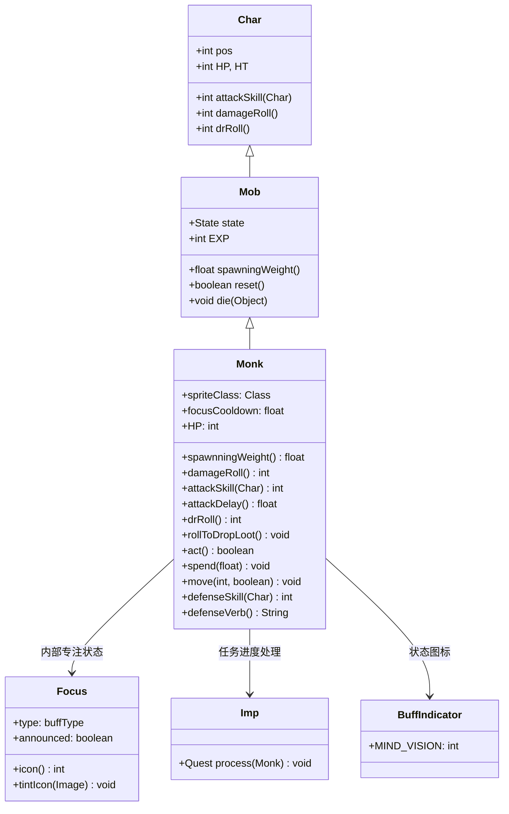

# Monk 源码详解

## 1. 基本信息

| 属性 | 值 |
|------|-----|
| **文件路径** | core/src/main/java/com/shatteredpixel/shatteredpixeldungeon/actors/mobs/Monk.java |
| **包名** | com.shatteredpixel.shatteredpixeldungeon.actors.mobs |
| **类类型** | class（非抽象） |
| **继承关系** | extends Mob |
| **代码行数** | 160 |
| **中文名称** | 武僧 |

---

## 类职责

Monk（武僧）是具有专注防御机制的亡灵敌人。它负责：

1. **专注状态**：自动获得"专注"Buff，提供完全闪避能力
2. **快速攻击**：拥有50%的攻击速度加成，能够快速连续攻击
3. **高难度威胁**：70点生命值、30点防御技能和12-25点伤害构成中期主要威胁
4. **任务集成**：死亡时触发小恶魔任务进度
5. **追逐加速**：被风筝时会更快获得专注状态，增加挑战性

**设计模式**：
- **状态模式**：通过内部 `Focus` Buff实现专注防御机制
- **追逐反馈模式**：移动速度影响状态获取，惩罚风筝战术
- **条件防御模式**：只有在特定条件下才激活完全闪避

---

## 4. 继承与协作关系



---

## 实例字段表

| 字段名 | 类型 | 设置值 | 说明 |
|--------|------|--------|------|
| `spriteClass` | Class | MonkSprite.class | 角色精灵类 |
| `HP` / `HT` | int | 70 | 当前/最大生命值 |
| `defenseSkill` | int | 30 | 防御技能等级 |
| `EXP` | int | 11 | 击败后获得的经验值 |
| `maxLvl` | int | 21 | 最大出现等级 |
| `loot` | Class | Food.class | 掉落物品类型 |
| `lootChance` | float | 0.083f | 掉落概率（约8.3%） |

### 特殊属性

| 属性 | 说明 |
|------|------|
| `Property.UNDEAD` | 亡灵单位，具有特殊免疫和弱点 |

### 专注系统

| 字段名 | 类型 | 说明 |
|--------|------|------|
| `focusCooldown` | float | 专注状态冷却时间 |

### 内部类

| 类名 | 类型 | 说明 |
|------|------|------|
| `Focus` | Buff | 专注状态，提供完全闪避能力 |

---

## 7. 方法详解

### 构造块（Instance Initializer）

```java
{
    spriteClass = MonkSprite.class;
    
    HP = HT = 70;
    defenseSkill = 30;
    
    EXP = 11;
    maxLvl = 21;
    
    loot = Food.class;
    lootChance = 0.083f;

    properties.add(Property.UNDEAD);
}
```

**作用**：初始化武僧的基础属性，设置高生命值、高防御技能和亡灵属性。

---

### damageRoll()

```java
@Override
public int damageRoll() {
    return Random.NormalIntRange(12, 25);
}
```

**方法作用**：计算攻击造成的伤害范围。

**伤害特点**：
- **高伤害输出**：12-25点伤害，平均18.5点
- **伤害波动**：14点范围提供较高的威胁性
- **中期威胁**：对中期玩家来说构成显著威胁

---

### attackSkill(Char target)

```java
@Override
public int attackSkill(Char target) {
    return 30;
}
```

**方法作用**：返回攻击技能等级，影响命中率。

**参数**：
- `target` (Char)：攻击目标

**返回值**：
- `30`：极高的攻击技能等级，几乎保证命中

---

### attackDelay()

```java
@Override
public float attackDelay() {
    return super.attackDelay()*0.5f;
}
```

**方法作用**：实现50%的攻击速度加成。

**攻击速度**：
- **基础攻击延迟**：通常为1.0回合
- **武僧攻击延迟**：0.5回合
- **实际效果**：每回合可以攻击2次

**战术影响**：
- 快速连续攻击增加压力
- 需要玩家有更高的生存能力
- 配合高伤害形成强大的输出组合

---

### drRoll()

```java
@Override
public int drRoll() {
    return super.drRoll() + Random.NormalIntRange(0, 2);
}
```

**方法作用**：计算伤害减免范围。

**伤害减免**：
- **轻微减免**：0-2点额外伤害减免
- **主要防御**：依赖高防御技能和专注状态而非伤害减免

---

### rollToDropLoot()

```java
@Override
public void rollToDropLoot() {
    Imp.Quest.process(this);
    super.rollToDropLoot();
}
```

**方法作用**：处理任务系统集成。

**任务集成**：
- 调用 `Imp.Quest.process()` 更新小恶魔任务进度
- 可能用于特定任务要求击杀武僧

---

### 核心专注机制

#### act()

```java
@Override
protected boolean act() {
    boolean result = super.act();
    if (buff(Focus.class) == null && state == HUNTING && focusCooldown <= 0) {
        Buff.affect(this, Focus.class);
    }
    return result;
}
```

**作用**：在追击状态下自动获得专注状态。

**专注条件**：
- **无专注状态**：`buff(Focus.class) == null`
- **追击状态**：`state == HUNTING`
- **冷却结束**：`focusCooldown <= 0`

#### spend(float time)

```java
@Override
protected void spend(float time) {
    focusCooldown -= time;
    super.spend(time);
}
```

**作用**：减少专注冷却时间。

**冷却机制**：
- 每消耗1回合时间，冷却减少1
- 确保专注状态定期刷新

#### move(int step, boolean travelling)

```java
@Override
public void move(int step, boolean travelling) {
    // moving reduces cooldown by an additional 0.67, giving a total reduction of 1.67f.
    // basically monks will become focused notably faster if you kite them.
    if (travelling) focusCooldown -= 0.67f;
    super.move(step, travelling);
}
```

**作用**：移动时加速专注冷却。

**风筝惩罚**：
- **正常冷却减少**：1.0（来自spend）
- **移动额外减少**：0.67
- **总冷却减少**：1.67
- **设计意图**：惩罚风筝战术，鼓励正面战斗

#### defenseSkill(Char enemy)

```java
@Override
public int defenseSkill(Char enemy) {
    if (buff(Focus.class) != null && paralysed == 0 && state != SLEEPING){
        return INFINITE_EVASION;
    }
    return super.defenseSkill(enemy);
}
```

**作用**：实现完全闪避机制。

**闪避条件**：
1. **拥有专注状态**：`buff(Focus.class) != null`
2. **未被麻痹**：`paralysed == 0`
3. **非休眠状态**：`state != SLEEPING`

**闪避效果**：
- **无限闪避**：返回 `INFINITE_EVASION`，完全避免伤害
- **状态消耗**：成功闪避后移除专注状态

#### defenseVerb()

```java
@Override
public String defenseVerb() {
    Focus f = buff(Focus.class);
    if (f == null) {
        return super.defenseVerb();
    } else {
        f.detach();
        if (sprite != null && sprite.visible) {
            Sample.INSTANCE.play(Assets.Sounds.HIT_PARRY, 1, Random.Float(0.96f, 1.05f));
        }
        focusCooldown = Random.NormalFloat(6, 7);
        return Messages.get(this, "parried");
    }
}
```

**作用**：处理闪避时的视觉和音效反馈。

**闪避反馈**：
- **音效**：播放格挡音效
- **冷却重置**：设置6-7回合的新冷却时间
- **消息提示**：显示"parried"（格挡）状态文本

---

### Focus 内部类

```java
public static class Focus extends Buff {
    {
        type = buffType.POSITIVE;
        announced = true;
    }
    
    @Override
    public int icon() {
        return BuffIndicator.MIND_VISION;
    }

    @Override
    public void tintIcon(Image icon) {
        icon.hardlight(0.25f, 1.5f, 1f);
    }
}
```

**作用**：实现专注状态的视觉表现。

**状态特性**：
- **正向Buff**：`buffType.POSITIVE`
- **公告显示**：`announced = true`（在玩家界面上显示）
- **图标**：使用 `MIND_VISION` 图标
- **颜色**：青绿色调（0.25f, 1.5f, 1f）

---

## 11. 使用示例

### 关卡生成配置

```java
// 在城市关卡生成武僧
Monk monk = new Monk();
monk.pos = room.random();

// 标准生成方法
Room.spawnMob(monk, room);
```

### 自定义专注机制

```java
// 修改专注冷却的武僧变种
public class EnhancedMonk extends Monk {
    @Override
    public String defenseVerb() {
        Focus f = buff(Focus.class);
        if (f != null) {
            f.detach();
            // 缩短冷却时间
            focusCooldown = Random.NormalFloat(3, 4);
            return Messages.get(this, "parried");
        }
        return super.defenseVerb();
    }
}
```

---

## 注意事项

### 平衡性考虑

1. **高威胁性**：70点生命值+12-25点伤害+快速攻击构成强大威胁
2. **专注机制**：完全闪避能力需要合理应对策略
3. **风筝惩罚**：移动加速专注获取，防止滥用风筝战术
4. **等级适配**：maxLvl=21确保在合适关卡出现

### 特殊机制

1. **条件闪避**：只有满足所有条件时才激活完全闪避
2. **状态可视化**：专注状态在玩家界面清晰显示
3. **冷却重置**：每次闪避后重置冷却时间
4. **任务集成**：与小恶魔任务系统的深度集成

### 技术特点

1. **完整序列化**：`focusCooldown` 状态正确保存和恢复
2. **性能优化**：条件检查高效，避免不必要的计算
3. **视觉反馈**：完整的音效和状态显示支持
4. **Buff集成**：重用现有的Buff系统实现状态管理

### 战斗策略

**对玩家的威胁**：
- 快速连续攻击造成持续压力
- 专注状态提供完全闪避，难以造成伤害
- 高生命值需要大量输出才能击败

**对抗策略**：
- 利用麻痹等控制技能禁用专注闪避
- 避免过度风筝，减少其专注获取速度
- 准备高爆发伤害在无专注时快速解决
- 使用无视闪避的伤害类型（如环境伤害）

---

## 最佳实践

### 条件防御系统

```java
// 完全闪避模式
@Override
public int defenseSkill(Char enemy) {
    if (hasSpecialBuff() && !isParalysed() && isActive()) {
        return INFINITE_EVASION;
    }
    return super.defenseSkill(enemy);
}

@Override
public String defenseVerb() {
    if (hasSpecialBuff()) {
        removeSpecialBuff();
        setCooldown(calculateCooldown());
        return getDefenseMessage();
    }
    return super.defenseVerb();
}
```

### 追逐反馈机制

```java
// 移动加速状态获取
@Override
public void move(int step, boolean travelling) {
    if (travelling) {
        reduceCooldown(movementBonus);
    }
    super.move(step, travelling);
}

@Override
protected void spend(float time) {
    reduceCooldown(time);
    super.spend(time);
}
```

### 快速攻击实现

```java
// 攻击速度加成
@Override
public float attackDelay() {
    return baseAttackDelay * speedMultiplier;
}
```

---

## 相关类

| 类名 | 关系 | 说明 |
|------|------|------|
| `Mob` | 父类 | 所有怪物的基类 |
| `MonkSprite` | 精灵类 | 对应的视觉表现 |
| `Focus` | 内部类 | 专注状态Buff实现 |
| `Imp.Quest` | 任务系统 | 小恶魔任务，处理死亡事件 |
| `BuffIndicator` | 枚举类 | 状态图标类型 |

---

## 消息键

| 键名 | 值 | 用途 |
|------|-----|------|
| `monsters.monk.name` | monk | 怪物名称 |
| `monsters.monk.desc` | A fanatical undead warrior devoted to combat. It seems to be able to dodge all attacks... | 怪物描述 |
| `monsters.monk.parried` | parried | 闪避状态文本 |