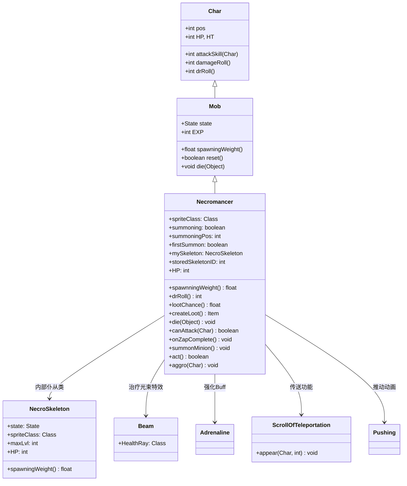

# Necromancer 源码详解

## 1. 基本信息

| 属性 | 值 |
|------|-----|
| **文件路径** | core/src/main/java/com/shatteredpixel/shatteredpixeldungeon/actors/mobs/Necromancer.java |
| **包名** | com.shatteredpixel.shatteredpixeldungeon.actors.mobs |
| **类类型** | class（非抽象） |
| **继承关系** | extends Mob |
| **代码行数** | 440 |
| **中文名称** | 死灵法师 |

---

## 类职责

Necromancer（死灵法师）是具有召唤和支援能力的亡灵施法者。它负责：

1. **骷髅召唤**：能够召唤专属的死灵骷髅作为仆从进行战斗
2. **仆从支援**：通过光束治疗或提供激素涌动强化仆从
3. **智能传送**：当仆从无法到达玩家时，会将其传送到合适位置
4. **无近战攻击**：完全依赖仆从进行战斗，自身不进行直接攻击
5. **任务集成**：死亡时确保仆从也一同死亡，清理战场

**设计模式**：
- **组合模式**：通过内部 `NecroSkeleton` 类实现仆从系统
- **状态模式**：自定义 `Hunting` 状态实现复杂的AI逻辑
- **支援机制**：通过光束效果实现远程治疗和强化

---

## 4. 继承与协作关系



---

## 实例字段表

| 字段名 | 类型 | 设置值 | 说明 |
|--------|------|--------|------|
| `spriteClass` | Class | NecromancerSprite.class | 角色精灵类 |
| `HP` / `HT` | int | 40 | 当前/最大生命值 |
| `defenseSkill` | int | 14 | 防御技能等级 |
| `EXP` | int | 7 | 击败后获得的经验值 |
| `maxLvl` | int | 14 | 最大出现等级 |
| `loot` | Class | PotionOfHealing.class | 掉落物品类型 |
| `lootChance` | float | 0.2f | 初始掉落概率（20%） |

### 特殊属性

| 属性 | 说明 |
|------|------|
| `Property.UNDEAD` | 亡灵单位，具有特殊免疫和弱点 |

### 召唤系统字段

| 字段名 | 类型 | 说明 |
|--------|------|------|
| `summoning` | boolean | 是否正在召唤过程中 |
| `summoningPos` | int | 召唤位置 |
| `firstSummon` | boolean | 是否为首次召唤 |
| `mySkeleton` | NecroSkeleton | 当前的仆从骷髅 |
| `storedSkeletonID` | int | 存储的仆从ID（用于序列化） |

### 状态定义

| 状态字段 | 类型 | 说明 |
|----------|------|------|
| `HUNTING` | Hunting | 自定义追击状态 |

---

## 7. 方法详解

### 构造块（Instance Initializer）

```java
{
    spriteClass = NecromancerSprite.class;
    
    HP = HT = 40;
    defenseSkill = 14;
    
    EXP = 7;
    maxLvl = 14;
    
    loot = PotionOfHealing.class;
    lootChance = 0.2f;
    
    properties.add(Property.UNDEAD);
    
    HUNTING = new Hunting();
}
```

**作用**：初始化死灵法师的基础属性，设置中等生命值、亡灵属性和治疗药水掉落。

---

### canAttack(Char enemy)

```java
@Override
protected boolean canAttack(Char enemy) {
    return false;
}
```

**方法作用**：禁用所有近战攻击能力。

**设计意图**：
- 死灵法师完全依赖仆从进行战斗
- 鼓励玩家优先击杀仆从来削弱死灵法师
- 增加战术复杂性，需要同时处理两个目标

---

### drRoll()

```java
@Override
public int drRoll() {
    return super.drRoll() + Random.NormalIntRange(0, 5);
}
```

**方法作用**：计算伤害减免范围。

**伤害减免**：
- **中等减免**：0-5点额外伤害减免
- **平均减免**：2.5点，提供适度的防御能力

---

### lootChance() 和 createLoot()

```java
@Override
public float lootChance() {
    return super.lootChance() * ((6f - Dungeon.LimitedDrops.NECRO_HP.count) / 6f);
}

@Override
public Item createLoot(){
    Dungeon.LimitedDrops.NECRO_HP.count++;
    return super.createLoot();
}
```

**方法作用**：实现递减概率的治疗药水掉落机制。

**递减机制**：
- **初始概率**：20%
- **后续概率**：每次掉落后续概率减少1/6
- **概率序列**：20% → 16.7% → 13.3% → 10% → 6.7% → 3.3% → 0%

**设计意图**：
- 鼓励早期挑战死灵法师获取治疗药水
-  prevent后期过度farm获得过多治疗药水
- 保持游戏经济平衡

---

### die(Object cause)

```java
@Override
public void die(Object cause) {
    if (storedSkeletonID != -1){
        Actor ch = Actor.findById(storedSkeletonID);
        storedSkeletonID = -1;
        if (ch instanceof NecroSkeleton){
            mySkeleton = (NecroSkeleton) ch;
        }
    }
    
    if (mySkeleton != null && mySkeleton.isAlive() && mySkeleton.alignment == alignment){
        mySkeleton.die(null);
    }
    
    super.die(cause);
}
```

**方法作用**：死亡时确保仆从也一同死亡。

**清理逻辑**：
- 恢复存储的仆从引用
- 如果仆从存活且同阵营，则使其死亡
- 防止仆从在死灵法师死亡后继续存在

---

### aggro(Char ch)

```java
@Override
public void aggro(Char ch) {
    super.aggro(ch);
    if (mySkeleton != null && mySkeleton.isAlive()
            && Dungeon.level.mobs.contains(mySkeleton)
            && mySkeleton.alignment == alignment){
        mySkeleton.aggro(ch);
    }
}
```

**方法作用**：当死灵法师被激怒时，其仆从也会被激怒。

**协同机制**：
- 确保仆从和主人都以同一目标为目标
- 提供完整的战斗协同体验
- 防止仆从脱离战斗

---

### act()

```java
@Override
protected boolean act() {
    if (summoning && state != HUNTING){
        summoning = false;
        if (sprite instanceof NecromancerSprite) ((NecromancerSprite) sprite).cancelSummoning();
    }
    return super.act();
}
```

**方法作用**：处理召唤状态的清理。

**状态管理**：
- 如果不在追击状态但仍在召唤，则取消召唤
- 清理视觉效果，确保状态一致性

---

### 核心召唤与支援机制

#### onZapComplete()

```java
public void onZapComplete(){
    if (mySkeleton == null || mySkeleton.sprite == null || !mySkeleton.isAlive()){
        return;
    }
    
    //heal skeleton first
    if (mySkeleton.HP < mySkeleton.HT){
        // ... 治疗逻辑
        mySkeleton.HP = Math.min(mySkeleton.HP + mySkeleton.HT/5, mySkeleton.HT);
    //otherwise give it adrenaline
    } else if (mySkeleton.buff(Adrenaline.class) == null) {
        // ... 强化逻辑
        Buff.affect(mySkeleton, Adrenaline.class, 3f);
    }
    
    next();
}
```

**作用**：对仆从进行支援，优先治疗，满血时提供激素涌动。

**支援逻辑**：
1. **治疗优先**：如果仆从生命值不满，恢复20%最大生命值
2. **强化补充**：如果仆从满血且没有激素涌动，则施加3秒激素涌动
3. **视觉反馈**：播放治疗光束特效和音效
4. **状态显示**：显示治疗数值或强化状态

#### summonMinion()

```java
public void summonMinion(){
    // ... 处理召唤位置冲突
    // ... 创建或传送仆从
    if (mySkeleton == null || !mySkeleton.isActive()) {
        mySkeleton = new NecroSkeleton();
        mySkeleton.pos = summoningPos;
        GameScene.add(mySkeleton);
        Dungeon.level.occupyCell(mySkeleton);
        
        // 继承持久性Buff
        for (Buff b : buffs()){
            if (b.revivePersists) {
                Buff.affect(mySkeleton, b.getClass());
            }
        }
    } else {
        ScrollOfTeleportation.appear(mySkeleton, summoningPos);
    }
    ((NecromancerSprite)sprite).finishSummoning();
}
```

**作用**：召唤或传送仆从到指定位置。

**召唤流程**：
1. **位置验证**：检查召唤位置是否有效（可通行且无其他角色）
2. **冲突处理**：如果有角色阻挡，尝试推到邻近位置
3. **仆从创建**：如果无仆从，创建新的死灵骷髅
4. **传送处理**：如果已有仆从，将其传送到新位置
5. **Buff继承**：将持久性Buff传递给新仆从

---

## AI状态机

### Hunting 状态

```java
private class Hunting extends Mob.Hunting{
    @Override
    public boolean act(boolean enemyInFOV, boolean justAlerted) {
        // ...
        //if enemy is seen, and enemy is within range, and we have no skeleton, summon a skeleton!
        if (enemySeen && Dungeon.level.distance(pos, enemy.pos) <= 4 && mySkeleton == null){
            // ... 召唤逻辑
        //otherwise, if enemy is seen, and we have a skeleton...
        } else if (enemySeen && mySkeleton != null){
            // ... 支援或传送逻辑
        //otherwise, default to regular hunting behaviour
        } else {
            return super.act(enemyInFOV, justAlerted);
        }
    }
}
```

**AI决策树**：
1. **无仆从**（距离≤4格）：
   - 计算最佳召唤位置（敌人周围8个方向）
   - 执行召唤动画和逻辑
2. **有仆从**：
   - **位置验证**：检查仆从是否可见且能到达玩家
   - **传送条件**：如果仆从被阻挡或距离过远，则传送到敌人附近
   - **支援行为**：如果仆从需要治疗或强化，则执行支援
3. **无目标**：使用标准追击行为

**召唤位置选择**：
- 距离死灵法师位置 ≤ 距离敌人位置 + 3
- 在敌人周围的8个邻近格子中选择
- 优先选择视野内且可通行的位置

**传送条件**：
- 仆从不在死灵法师视野内
- 仆从到玩家的路径长度 > 2 × 死灵法师到玩家的距离
- 仆从无法直接攻击玩家

---

## NecroSkeleton 内部类

```java
public static class NecroSkeleton extends Skeleton {
    {
        state = WANDERING;
        spriteClass = NecroSkeletonSprite.class;
        maxLvl = -5; //no loot or exp
        HP = 20; //20/25 health to start
    }
    
    @Override
    public float spawningWeight() {
        return 0;
    }
    
    public static class NecroSkeletonSprite extends SkeletonSprite{
        public NecroSkeletonSprite(){
            super();
            brightness(0.75f); //darker appearance
        }
        
        @Override
        public void resetColor() {
            super.resetColor();
            brightness(0.75f);
        }
    }
}
```

**仆从特性**：
- **生命值**：20点（比普通骷髅略高）
- **无掉落**：`maxLvl = -5` 确保不掉落物品和经验
- **外观**：较暗的精灵（亮度75%），便于区分
- **AI状态**：默认为游荡状态，由死灵法师控制

---

## 11. 使用示例

### 关卡生成配置

```java
// 在监狱关卡生成死灵法师
Necromancer necro = new Necromancer();
necro.pos = room.random();

// 标准生成方法
Room.spawnMob(necro, room);
```

### 自定义仆从强度

```java
// 增强版死灵法师
public class EnhancedNecromancer extends Necromancer {
    public static class EnhancedNecroSkeleton extends NecroSkeleton {
        {
            HP = 30; // 更高生命值
            // 可以添加更多属性
        }
    }
    
    @Override
    public void summonMinion() {
        // 使用增强版仆从
        mySkeleton = new EnhancedNecroSkeleton();
        // ... 其余逻辑相同
    }
}
```

---

## 注意事项

### 平衡性考虑

1. **仆从依赖**：死灵法师的威胁完全依赖于仆从的存在
2. **支援机制**：治疗和强化使仆从更难被击败
3. **智能传送**：防止仆从被困，确保持续威胁
4. **掉落平衡**：递减概率机制防止过度farm

### 特殊机制

1. **无近战**：完全依赖仆从，改变战斗策略
2. **位置智能**：召唤和传送都考虑最优位置
3. **视觉区分**：仆从外观较暗，便于识别
4. **状态持久化**：完整的序列化支持保存/加载

### 技术特点

1. **完整序列化**：所有状态字段正确保存和恢复
2. **性能优化**：路径计算只在必要时执行
3. **系统集成**：重用现有的传送和Buff系统
4. **错误处理**：完整的边界条件检查防止异常

### 战斗策略

**对玩家的威胁**：
- 需要同时处理死灵法师和仆从两个目标
- 仆从会得到持续的治疗和强化
- 智能传送确保仆从始终构成威胁

**对抗策略**：
- 优先击杀仆从来削弱死灵法师
- 利用范围攻击同时打击两个目标
- 快速解决避免仆从得到过多支援
- 准备控制技能限制死灵法师的行动

---

## 最佳实践

### 仆从系统设计

```java
// 主从组合模式
private Minion myMinion;

public void summonMinion() {
    if (myMinion == null) {
        myMinion = createMinion();
        addMinionToScene(myMinion);
    } else {
        teleportMinionToPosition(myMinion, targetPos);
    }
}

@Override
public void die(Object cause) {
    if (myMinion != null) {
        myMinion.die(null);
    }
    super.die(cause);
}
```

### 智能位置选择

```java
// 最优位置选择
private int findBestSummonPosition(Char enemy) {
    int bestPos = -1;
    for (int direction : NEIGHBOURS8) {
        int candidate = enemy.pos + direction;
        if (isValidPosition(candidate) && isBetterPosition(candidate, bestPos)) {
            bestPos = candidate;
        }
    }
    return bestPos;
}
```

### 条件支援机制

```java
// 优先级支援
public void supportMinion() {
    if (minion.HP < minion.HT) {
        healMinion();
    } else if (!minion.hasBuff(Adrenaline.class)) {
        empowerMinion();
    }
}
```

---

## 相关类

| 类名 | 关系 | 说明 |
|------|------|------|
| `Mob` | 父类 | 所有怪物的基类 |
| `NecromancerSprite` | 精灵类 | 对应的视觉表现 |
| `NecroSkeleton` | 内部类 | 死灵法师的仆从骷髅 |
| `Beam.HealthRay` | 特效类 | 治疗光束视觉效果 |
| `Adrenaline` | Buff类 | 激素涌动强化状态 |
| `ScrollOfTeleportation` | 工具类 | 传送功能实现 |
| `Skeleton` | 父类 | 基础骷髅类 |

---

## 消息键

| 键名 | 值 | 用途 |
|------|-----|------|
| `monsters.necromancer.name` | necromancer | 怪物名称 |
| `monsters.necromancer.desc` | A master of the undead arts. It seems to be able to summon and control skeletal warriors... | 怪物描述 |