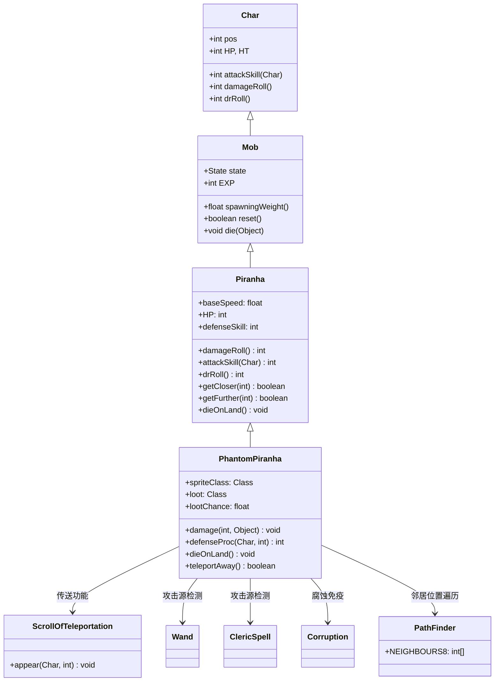

# PhantomPiranha 源码详解

## 1. 基本信息

| 属性 | 值 |
|------|-----|
| **文件路径** | core/src/main/java/com/shatteredpixel/shatteredpixeldungeon/actors/mobs/PhantomPiranha.java |
| **包名** | com.shatteredpixel.shatteredpixeldungeon.actors.mobs |
| **类类型** | class（非抽象） |
| **继承关系** | extends Piranha |
| **代码行数** | 124 |
| **中文名称** | 幻影食人鱼 |

---

## 类职责

PhantomPiranha（幻影食人鱼）是食人鱼的稀有变种，具有传送能力。它负责：

1. **伤害减半**：受到非近战攻击时伤害减半，增加生存能力
2. **智能传送**：受到远程攻击或环境伤害时会传送到安全水域
3. **必掉物品**：100%掉落幻影肉，提供高价值食物奖励
4. **水生依赖**：完全依赖水域环境，陆地上会立即死亡
5. **稀有生成**：作为食人鱼的稀有变种，有2%概率替代普通食人鱼生成

**设计模式**：
- **装饰器模式**：在基础食人鱼功能上添加传送和伤害减免机制
- **条件响应模式**：根据攻击源类型和距离动态调整行为
- **优先级传送模式**：优先传送到视野外的安全位置

---

## 4. 继承与协作关系



---

## 实例字段表

| 字段名 | 类型 | 设置值 | 说明 |
|--------|------|--------|------|
| `spriteClass` | Class | PhantomPiranhaSprite.class | 角色精灵类 |
| `loot` | Class | PhantomMeat.class | 掉落物品类型 |
| `lootChance` | float | 1f | 掉落概率（100%必掉） |

### 继承自 Piranha 的字段

| 字段名 | 类型 | 说明 |
|--------|------|------|
| `baseSpeed` | float | 2f（快速移动） |
| `EXP` | int | 0（不提供经验值） |
| `HP` / `HT` | int | 10 + depth * 5（随关卡深度增长） |
| `defenseSkill` | int | 10 + depth * 2（随关卡深度增长） |

### 特殊属性

| 属性 | 说明 |
|------|------|
| **水生单位** | 只能在水域中存活，陆地立即死亡 |
| **免疫系统** | 继承食人鱼的大部分Blob免疫 |

---

## 7. 方法详解

### 构造块（Instance Initializer）

```java
{
    spriteClass = PhantomPiranhaSprite.class;
    
    loot = PhantomMeat.class;
    lootChance = 1f;
}
```

**作用**：设置特殊的精灵类和100%幻影肉掉落。

---

### damage(int dmg, Object src)

```java
@Override
public void damage(int dmg, Object src) {
    Char dmgSource = null;
    if (src instanceof Char) dmgSource = (Char)src;
    if (src instanceof Wand || src instanceof ClericSpell) dmgSource = Dungeon.hero;
    
    if (dmgSource == null || !Dungeon.level.adjacent(pos, dmgSource.pos)){
        dmg = Math.round(dmg/2f); //halve damage taken if we are going to teleport
    }
    super.damage(dmg, src);
    
    if (isAlive() && !(src instanceof Corruption)) {
        if (dmgSource != null) {
            if (!Dungeon.level.adjacent(pos, dmgSource.pos)) {
                // ... 传送逻辑
                ArrayList<Integer> candidates = new ArrayList<>();
                for (int i : PathFinder.NEIGHBOURS8) {
                    if (Dungeon.level.water[dmgSource.pos + i] && Actor.findChar(dmgSource.pos + i) == null) {
                        candidates.add(dmgSource.pos + i);
                    }
                }
                if (!candidates.isEmpty()) {
                    ScrollOfTeleportation.appear(this, Random.element(candidates));
                    aggro(dmgSource);
                } else {
                    teleportAway();
                }
            }
        } else {
            teleportAway();
        }
    }
}
```

**方法作用**：实现伤害减免和传送机制。

**伤害减免逻辑**：
- **近战攻击**：全额伤害（相邻格子）
- **远程攻击**：伤害减半（非相邻格子）
- **环境伤害**：伤害减半（无明确攻击源）

**传送触发条件**：
1. **存活状态**：`isAlive() == true`
2. **非腐蚀伤害**：`!(src instanceof Corruption)`
3. **远程攻击**：攻击源不在相邻格子
4. **环境伤害**：攻击源为null（如陷阱、火等）

**传送优先级**：
1. **攻击源附近**：优先传送到攻击源周围的水域
2. **全局水域**：如果攻击源附近无合适位置，则传送到任意水域
3. **视野外优先**：优先选择英雄视野外的位置

---

### defenseProc(Char enemy, int damage)

```java
@Override
public int defenseProc(Char enemy, int damage) {
    return super.defenseProc(enemy, damage);
}
```

**方法作用**：保留父类的防御处理逻辑，无特殊修改。

---

### dieOnLand()

```java
@Override
public void dieOnLand() {
    if (!teleportAway()){
        super.dieOnLand();
    }
}
```

**方法作用**：当处于陆地时尝试传送，失败后才真正死亡。

**生存机制**：
- 如果成功传送到水域，则避免死亡
- 如果无法找到水域，则正常死亡

---

### teleportAway()

```java
private boolean teleportAway(){
    if (flying){
        return false;
    }
    
    ArrayList<Integer> inFOVCandidates = new ArrayList<>();
    ArrayList<Integer> outFOVCandidates = new ArrayList<>();
    for (int i = 0; i < Dungeon.level.length(); i++){
        if (Dungeon.level.water[i] && Actor.findChar(i) == null){
            if (Dungeon.level.heroFOV[i]){
                inFOVCandidates.add(i);
            } else {
                outFOVCandidates.add(i);
            }
        }
    }
    
    if (!outFOVCandidates.isEmpty()){
        if (Dungeon.level.heroFOV[pos]) GLog.i(Messages.get(this, "teleport_away"));
        ScrollOfTeleportation.appear(this, Random.element(outFOVCandidates));
        return true;
    } else if (!inFOVCandidates.isEmpty()){
        ScrollOfTeleportation.appear(this, Random.element(inFOVCandidates));
        return true;
    }
    
    return false;
}
```

**方法作用**：执行全局传送，寻找最合适的水域位置。

**传送策略**：
1. **视野外优先**：首先尝试传送到英雄视野外的水域
2. **视野内备选**：如果没有视野外位置，则使用视野内的水域
3. **消息提示**：从视野内传送到视野外时显示提示消息
4. **失败处理**：如果没有可用水域，返回false

---

## 11. 使用示例

### 稀有生成配置

```java
// 食人鱼工厂方法中的稀有生成
public static Piranha random(){
    float altChance = 1/50f * RatSkull.exoticChanceMultiplier();
    if (Random.Float() < altChance){
        return new PhantomPiranha();
    } else {
        return new Piranha();
    }
}
```

### 自定义传送逻辑

```java
// 修改传送行为的幻影食人鱼变种
public class EnhancedPhantomPiranha extends PhantomPiranha {
    @Override
    private boolean teleportAway() {
        // 优先传送到更远的位置
        ArrayList<Integer> farCandidates = findFarWaterPositions();
        if (!farCandidates.isEmpty()) {
            ScrollOfTeleportation.appear(this, Random.element(farCandidates));
            return true;
        }
        return super.teleportAway();
    }
}
```

---

## 注意事项

### 平衡性考虑

1. **伤害减免**：50%远程伤害减免平衡了其脆弱的生命值
2. **传送机制**：防止被远程玩家轻松击杀，增加挑战性
3. **100%掉落**：保证高价值食物奖励，鼓励玩家挑战
4. **稀有生成**：2%的基础概率配合"鼠颅骨"饰品可提升

### 特殊机制

1. **攻击源检测**：能正确识别法杖和牧师法术的英雄作为攻击源
2. **腐蚀例外**：腐蚀伤害不会触发传送，防止滥用
3. **水域依赖**：完全依赖水域环境，增加了位置策略
4. **视野智能**：优先传送到视野外，增加神秘感

### 技术特点

1. **完整继承**：复用父类所有复杂逻辑（水生AI、免疫系统等）
2. **最小重写**：只重写必要方法，保持代码简洁
3. **性能优化**：传送候选位置预计算，避免重复遍历
4. **向后兼容**：与现有食人鱼系统完全兼容

### 战斗策略

**对玩家的威胁**：
- 远程攻击效果减半，需要近战解决
- 传送机制使其难以被围攻
- 高机动性（baseSpeed=2f）增加追击难度

**对抗策略**：
- 利用近战攻击避免伤害减免
- 控制水域出口限制传送选择
- 准备范围攻击同时打击多个位置
- 快速解决避免多次传送骚扰

---

## 最佳实践

### 条件伤害减免

```java
// 基于攻击距离的伤害减免
@Override
public void damage(int dmg, Object src) {
    Char source = getSourceFromDamage(src);
    if (source != null && !isAdjacent(source)) {
        dmg = applyDamageReduction(dmg);
    }
    super.damage(dmg, src);
    handlePostDamageEffects(source);
}
```

### 优先级传送系统

```java
// 多级传送候选位置
private boolean teleportToSafeLocation() {
    // 1. 优先级1：视野外安全位置
    List<Integer> priority1 = findPriorityLocations(OUT_OF_FOV);
    if (!priority1.isEmpty()) {
        teleportTo(Random.element(priority1));
        return true;
    }
    
    // 2. 优先级2：视野内安全位置
    List<Integer> priority2 = findPriorityLocations(IN_FOV);
    if (!priority2.isEmpty()) {
        teleportTo(Random.element(priority2));
        return true;
    }
    
    return false;
}
```

### 攻击源解析

```java
// 复杂攻击源检测
private Char resolveDamageSource(Object src) {
    if (src instanceof Char) {
        return (Char) src;
    } else if (src instanceof Wand || src instanceof Spell) {
        return Dungeon.hero; // 法术默认来源于英雄
    }
    return null; // 环境伤害
}
```

---

## 相关类

| 类名 | 关系 | 说明 |
|------|------|------|
| `Piranha` | 父类 | 基础食人鱼类，提供水生AI和属性 |
| `PhantomPiranhaSprite` | 精灵类 | 对应的视觉表现 |
| `PhantomMeat` | 掉落物品 | 幻影肉，特殊食物 |
| `ScrollOfTeleportation` | 工具类 | 传送功能实现 |
| `Wand` | 攻击源 | 法杖攻击源类型 |
| `ClericSpell` | 攻击源 | 牧师法术攻击源类型 |
| `PathFinder` | 工具类 | 邻居位置遍历常量 |

---

## 消息键

| 键名 | 值 | 用途 |
|------|-----|------|
| `monsters.phantompiranha.name` | phantom piranha | 怪物名称 |
| `monsters.phantompiranha.desc` | A ghostly piranha that seems to phase in and out of reality. It will teleport away when threatened... | 怪物描述 |
| `monsters.phantompiranha.teleport_away` | The phantom piranha vanishes! | 传送离开消息 |