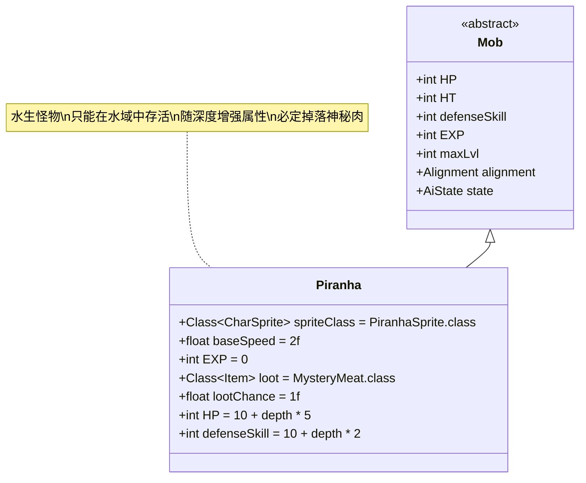

# Piranha 类文档

## 1. 基本信息
| 属性 | 值 |
|------|-----|
| 文件路径 | core/src/main/java/com/shatteredpixel/shatteredpixeldungeon/actors/mobs/Piranha.java |
| 包名 | com.shatteredpixel.shatteredpixeldungeon.actors.mobs |
| 类类型 | public class |
| 继承关系 | extends Mob |
| 代码行数 | 214行 |

## 2. 类职责说明
Piranha（食人鱼）是一种特殊的水生怪物，只能在水域中生存。它们具有高速度和随地牢深度增强的属性，是水域关卡中的主要威胁。食人鱼无法在陆地上存活，一旦离开水域就会立即死亡。

## 4. 继承与协作关系


## 静态常量表
| 常量名 | 类型 | 值 | 说明 |
|--------|------|-----|------|
| spriteClass | Class<? extends CharSprite> | PiranhaSprite.class | 怪物精灵类 |
| baseSpeed | float | 2.0f | 基础移动速度（正常为1.0） |
| EXP | int | 0 | 击败后获得的经验值（不提供经验） |
| loot | Class<? extends Item> | MysteryMeat.class | 掉落物品类型 |
| lootChance | float | 1.0f | 掉落概率（100%） |

## 实例字段表
| 字段名 | 类型 | 修饰符 | 说明 |
|--------|------|--------|------|
| (构造函数中初始化) | | | |
| HP/HT | int | - | 生命值 = 10 + 地牢深度 * 5 |
| defenseSkill | int | - | 防御技能等级 = 10 + 地牢深度 * 2 |

## 7. 方法详解

### 构造函数 Piranha()
**功能**: 初始化食人鱼的基本属性
**实现逻辑**:
- 设置HP和HT为10 + Dungeon.depth * 5（第65行）
- 设置defenseSkill为10 + Dungeon.depth * 2（第66行）

### act()
**签名**: `protected boolean act()`
**功能**: 每回合行为处理，检查是否在水域中
**返回值**: boolean - 是否完成行动
**实现逻辑**:
1. 检查当前位置是否为水域或是否具有飞行能力（第72行）
2. 如果不在水域且不飞行：
   - 显示喷射特效（如果处于漂浮状态）（第73-75行）
   - 调用dieOnLand()方法死亡（第76行）
   - 返回true（第77行）
3. 如果在水域中，调用父类act()方法（第79行）

### damageRoll()
**签名**: `public int damageRoll()`
**功能**: 计算攻击伤害范围
**返回值**: int - 伤害值
**实现逻辑**: 返回Random.NormalIntRange(Dungeon.depth, 4 + Dungeon.depth * 2)（第85行）

### attackSkill(Char target)
**签名**: `public int attackSkill(Char target)`
**功能**: 计算攻击技能等级
**参数**: target - 目标角色
**返回值**: int - 攻击技能值
**实现逻辑**: 返回20 + Dungeon.depth * 2（第90行）

### drRoll()
**签名**: `public int drRoll()`
**功能**: 计算伤害减免
**返回值**: int - 伤害减免值
**实现逻辑**: 返回super.drRoll() + Random.NormalIntRange(0, Dungeon.depth)（第95行）

### surprisedBy(Char enemy, boolean attacking)
**签名**: `public boolean surprisedBy(Char enemy, boolean attacking)`
**功能**: 判断是否会被敌人偷袭
**参数**: 
- enemy - 敌人
- attacking - 是否正在攻击
**返回值**: boolean - 是否会被偷袭
**实现逻辑**: 特殊处理英雄的偷袭逻辑，考虑视野和睡眠状态（第100-106行）

### dieOnLand()
**签名**: `public void dieOnLand()`
**功能**: 在陆地上死亡的专用方法
**实现逻辑**: 调用die(null)方法（第111行）

### die(Object cause)
**签名**: `public void die(Object cause)`
**功能**: 死亡处理，更新统计信息
**参数**: cause - 死亡原因
**实现逻辑**:
1. 调用父类die方法（第116行）
2. 增加Statistics.piranhasKilled计数（第118行）
3. 验证并可能解锁相关成就（第119行）

### spawningWeight()
**签名**: `public float spawningWeight()`
**功能**: 获取生成权重
**返回值**: float - 生成权重（始终为0）
**说明**: 食人鱼不会通过常规方式生成，而是通过特殊机制出现

### reset()
**签名**: `public boolean reset()`
**功能**: 重置状态
**返回值**: boolean - 始终返回true
**说明**: 食人鱼不需要重置逻辑

### getCloser(int target)
**签名**: `protected boolean getCloser(int target)`
**功能**: 向目标移动，只在可通行的水域中移动
**参数**: target - 目标位置
**返回值**: boolean - 是否成功移动
**实现逻辑**: 使用Dungeon.findStep在水域中寻找路径（第139行）

### getFurther(int target)
**签名**: `protected boolean getFurther(int target)`
**功能**: 远离目标，只在可通行的水域中移动
**参数**: target - 目标位置
**返回值**: boolean - 是否成功移动
**实现逻辑**: 使用Dungeon.flee在水域中寻找逃跑路径（第150行）

### random()
**签名**: `public static Piranha random()`
**功能**: 随机生成食人鱼或幻影食人鱼
**返回值**: Piranha - 生成的食人鱼实例
**实现逻辑**:
- 根据RatSkull.exoticChanceMultiplier()计算变异概率（第208行）
- 有一定概率生成PhantomPiranha（幻影食人鱼）（第209-210行）
- 否则生成普通Piranha（第211行）

## AI状态类
食人鱼重写了三种AI状态类以适应水域环境：

### Sleeping (睡眠状态)
- **特殊逻辑**: 即使敌人在视野内，也会检查是否有到敌人的水域路径（第171-178行）
- **行为**: 只有能通过水域到达敌人才会视为发现敌人

### Wandering (游荡状态)  
- **特殊逻辑**: 同样检查水域路径可达性（第183-190行）
- **行为**: 确保只在有路径的情况下才会转为狩猎状态

### Hunting (狩猎状态)
- **特殊逻辑**: 持续检查到敌人的水域路径（第196-203行）
- **行为**: 如果失去路径连接，可能回到其他状态

## 免疫系统
食人鱼具有特殊的免疫属性：
- 免疫除电击(Electricity)和冰冻(Freezing)外的所有Blob效果（第160-164行）
- 额外免疫燃烧(Burning)效果（第165行）
- 这意味着食人鱼对大部分环境危害免疫，但仍然害怕电击和冰冻

## 战斗行为
- **水生限制**: 只能在水域格子中存活，离开水域立即死亡
- **高速移动**: 移动速度是普通怪物的2倍
- **深度增强**: 所有属性随地牢深度线性增长
- **无经验**: 击败后不提供任何经验值
- **必定掉落**: 100%掉落神秘肉(MysteryMeat)
- **视野限制**: 即使敌人在视野内，也需要有水域路径才能发现

## 特殊机制
- **统计追踪**: 击败的食人鱼数量会被记录用于成就系统
- **变异生成**: 有小概率生成更强的幻影食人鱼变种
- **环境互动**: 对漂浮状态有特殊视觉效果

## 11. 使用示例
```java
// 创建食人鱼实例
Piranha piranha = new Piranha();
piranha.pos = waterTilePos; // 必须放置在水域格子上

// 食人鱼的属性会根据当前地牢深度自动调整
int currentDepth = Dungeon.depth;
int expectedHP = 10 + currentDepth * 5;

// 随机生成（可能产生变种）
Piranha randomPiranha = Piranha.random();
```

## 注意事项
1. 食人鱼必须放置在水域格子上，否则会立即死亡
2. 食人鱼对玩家的威胁随深度显著增加
3. 由于高速度，食人鱼很难被逃脱
4. 电击和冰冻效果是对抗食人鱼的有效手段
5. 食人鱼不会提供经验值，但必定掉落食物

## 最佳实践
1. 玩家应准备电击或冰冻武器来对抗食人鱼
2. 避免在深层数与大量食人鱼战斗
3. 利用食人鱼必定掉落神秘肉的特性作为食物来源
4. 在设计水域关卡时，合理控制食人鱼的数量和分布