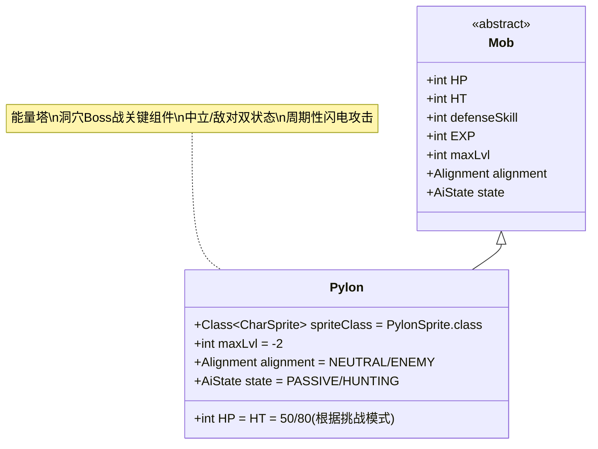

# Pylon 类文档

## 1. 基本信息
| 属性 | 值 |
|------|-----|
| 文件路径 | core/src/main/java/com/shatteredpixel/shatteredpixeldungeon/actors/mobs/Pylon.java |
| 包名 | com.shatteredpixel.shatteredpixeldungeon.actors.mobs |
| 类类型 | public class |
| 继承关系 | extends Mob |
| 代码行数 | 236行 |

## 2. 类职责说明
Pylon（能量塔）是洞穴Boss关卡中的特殊迷你Boss，具有中立和敌对两种状态。在未激活时处于中立状态且无敌，激活后会周期性释放闪电攻击周围敌人。它是DM300 Boss战的重要组成部分。

## 4. 继承与协作关系


## 静态常量表
| 常量名 | 类型 | 值 | 说明 |
|--------|------|-----|------|
| spriteClass | Class<? extends CharSprite> | PylonSprite.class | 怪物精灵类 |
| (初始块中设置) | | | |
| HP/HT | int | 50/80 | 生命值（挑战模式下为80） |
| maxLvl | int | -2 | 最大生成等级（负值表示特殊生成） |

## 实例字段表
| 字段名 | 类型 | 修饰符 | 说明 |
|--------|------|--------|------|
| targetNeighbor | int | private | 当前攻击的相邻格子索引（0-7） |
| properties | List<Property> | - | 添加多种属性标记 |

## 属性标记
Pylon具有以下特殊属性：
- **MINIBOSS**: 迷你Boss
- **BOSS_MINION**: Boss小怪
- **INORGANIC**: 无机物
- **ELECTRIC**: 电属性
- **IMMOVABLE**: 不可移动
- **STATIC**: 静态（不会主动行动）

## 7. 方法详解

### 构造函数块 {}
**功能**: 初始化Pylon的基本属性
**实现逻辑**:
- 设置spriteClass为PylonSprite.class（第52行）
- 根据是否开启"更强Boss"挑战设置HP/HT（第54行）
- 设置maxLvl为-2（第56行）
- 添加多种属性标记（第58-64行）
- 初始状态设为PASSIVE，阵营设为NEUTRAL（第65-66行）

### act()
**签名**: `protected boolean act()`
**功能**: 每回合行为处理，释放闪电攻击
**返回值**: boolean - 始终返回true
**实现逻辑**:
1. 更新视野（第74-77行）
2. 处理物品投掷（第79行）
3. 隐藏警报和丢失状态（第81-82行）
4. 如果阵营为NEUTRAL，直接消耗时间并返回（第90-93行）
5. 确定攻击的相邻格子：
   - 基础攻击1个格子（第97行）
   - 挑战模式下攻击3个格子（第99-102行）
   - 普通模式下攻击2个格子（第103-104行）
6. 显示闪电视觉效果（第106, 115-122行）
7. 对每个目标格子中的角色造成伤害（第124-126行）
8. 更新targetNeighbor为下一个方向（第128行）
9. 消耗回合时间（第130行）

### shockChar(Char ch)
**签名**: `private void shockChar(Char ch)`
**功能**: 对指定角色造成电击伤害
**参数**: ch - 目标角色
**实现逻辑**:
- 排除DM300（不对其造成伤害）（第136行）
- 角色闪白特效（第137行）
- 造成10-20点电击伤害（第138行）
- 如果目标是英雄：
  - 取消Boss挑战徽章资格（第141行）
  - 减少Boss分数（第142行）
  - 如果英雄死亡，记录失败原因并显示死亡消息（第143-146行）

### activate()
**签名**: `public void activate()`
**功能**: 激活Pylon，使其变为敌对状态
**实现逻辑**:
- 设置alignment为ENEMY（第152行）
- 设置state为HUNTING（第153行）
- 调用精灵的activate方法（第154行）

### sprite()
**签名**: `public CharSprite sprite()`
**功能**: 获取精灵实例，确保激活状态正确显示
**返回值**: CharSprite - Pylon精灵
**实现逻辑**: 如果已激活，调用activate方法（第160行）

### beckon(int cell)
**签名**: `public void beckon(int cell)`
**功能**: 响应召唤（重写为空实现）
**说明**: Pylon不可被召唤，因此不做任何操作（第166行）

### description()
**签名**: `public String description()`
**功能**: 获取描述文本
**返回值**: String - 描述文本
**实现逻辑**: 根据激活状态返回不同描述（第171-175行）

### interact(Char c)
**签名**: `public boolean interact(Char c)`
**功能**: 处理交互
**返回值**: boolean - 始终返回true
**说明**: 允许所有交互（第180行）

### add(Buff buff)
**签名**: `public boolean add(Buff buff)`
**功能**: 添加增益/减益效果
**返回值**: boolean - 是否成功添加
**实现逻辑**: 未激活时免疫所有Buff（第185-190行）

### isInvulnerable(Class effect)
**签名**: `public boolean isInvulnerable(Class effect)`
**功能**: 判断是否对某种效果无敌
**返回值**: boolean - 是否无敌
**实现逻辑**: 未激活时对所有伤害无敌（第194-196行）

### damage(int dmg, Object src)
**签名**: `public void damage(int dmg, Object src)`
**功能**: 处理受到的伤害，包含伤害减免和锁定地板时间增加
**参数**: 
- dmg - 原始伤害值
- src - 伤害来源
**实现逻辑**:
1. 应用伤害减免公式：dmg = 14 + (int)(Math.sqrt(8*(dmg - 14) + 1) - 1)/2（第200-203行）
2. 如果英雄有LockedFloor Buff，根据挑战模式增加锁定时间（第205-209行）
3. 调用父类damage方法（第210行）

### die(Object cause)
**签名**: `public void die(Object cause)`
**功能**: 死亡处理，通知关卡移除Pylon
**实现逻辑**: 调用CavesBossLevel.eliminatePylon()方法（第216行）

### storeInBundle(Bundle bundle) 和 restoreFromBundle(Bundle bundle)
**功能**: 保存和恢复状态
**实现逻辑**: 保存/恢复alignment和targetNeighbor字段（第222-234行）

## 战斗行为
- **双状态机制**: 初始为中立无敌状态，激活后变为敌对可攻击状态
- **周期性攻击**: 每回合按顺时针方向攻击相邻格子
- **挑战模式增强**: 开启"更强Boss"挑战时，生命值更高且攻击范围更大
- **伤害减免**: 具有非线性的伤害减免机制，高伤害时减免比例更高
- **锁定地板互动**: 受到伤害时会延长英雄的锁定地板时间

## 特殊机制
- **Boss分数影响**: 对英雄造成伤害会减少Boss分数
- **挑战徽章**: 被Pylon杀死会取消Boss挑战徽章资格
- **视觉效果**: 攻击时有闪电和火花粒子效果
- **音效**: 攻击时播放闪电音效

## 11. 使用示例
```java
// 创建Pylon实例
Pylon pylon = new Pylon();

// 激活Pylon（通常由关卡逻辑触发）
pylon.activate();

// 检查Pylon是否已被激活
if (pylon.alignment == Alignment.ENEMY) {
    // Pylon处于活动状态
}

// Pylon的伤害减免计算示例
// 输入伤害15 → 输出伤害15
// 输入伤害20 → 输出伤害16  
// 输入伤害36 → 输出伤害20
```

## 注意事项
1. Pylon只能在洞穴Boss关卡中出现
2. 未激活的Pylon完全无敌且不会受到任何效果影响
3. Pylon不会对DM300造成伤害（可能是为了防止友伤）
4. 挑战模式下Pylon更强但奖励也更好
5. 锁定地板时间的增加会影响Boss战策略

## 最佳实践
1. 玩家应优先击杀激活的Pylon以减少Boss分数损失
2. 在挑战模式下需要更谨慎地处理Pylon
3. 利用Pylon的固定攻击模式来规避伤害
4. 在设计类似机制时，可参考Pylon的双状态设计模式
5. 合理利用伤害减免公式来平衡游戏难度