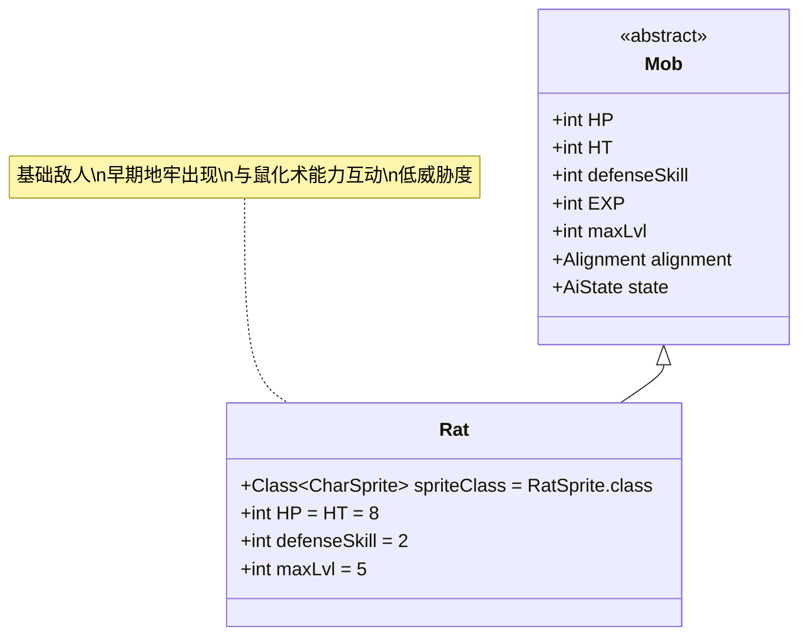

# Rat 类文档

## 1. 基本信息
| 属性 | 值 |
|------|-----|
| 文件路径 | core/src/main/java/com/shatteredpixel/shatteredpixeldungeon/actors/mobs/Rat.java |
| 包名 | com.shatteredpixel.shatteredpixeldungeon.actors.mobs |
| 类类型 | public class |
| 继承关系 | extends Mob |
| 代码行数 | 82行 |

## 2. 类职责说明
Rat（老鼠）是游戏中最基础的敌人之一，通常出现在早期地牢层数。它们具有较低的生命值和攻击力，主要用于教学目的和早期游戏体验。老鼠还与英雄的"鼠化术"(Ratmogrify)能力有特殊互动。

## 4. 继承与协作关系


## 静态常量表
| 常量名 | 类型 | 值 | 说明 |
|--------|------|-----|------|
| spriteClass | Class<? extends CharSprite> | RatSprite.class | 怪物精灵类 |
| HP/HT | int | 8 | 生命值上限 |
| defenseSkill | int | 2 | 防御技能等级 |
| maxLvl | int | 5 | 最大生成等级 |

## 实例字段表
| 字段名 | 类型 | 修饰符 | 说明 |
|--------|------|--------|------|
| (无额外字段) | | | Rat类没有额外的实例字段 |

## 7. 方法详解

### 构造函数块 {}
**功能**: 初始化Rat的基本属性
**实现逻辑**:
- 设置spriteClass为RatSprite.class（第34行）
- 设置HP和HT为8（第36行）
- 设置defenseSkill为2（第37行）
- 设置maxLvl为5（第39行）

### act()
**签名**: `protected boolean act()`
**功能**: 每回合行为处理，处理与鼠化术能力的特殊互动
**返回值**: boolean - 调用父类act()的结果
**实现逻辑**:
1. 检查是否满足以下条件（第44-46行）：
   - 当前不是盟友状态（alignment != Alignment.ALLY）
   - 英雄在视野范围内（Dungeon.level.heroFOV[pos]）
   - 英雄装备了鼠化术能力（Dungeon.hero.armorAbility instanceof Ratmogrify）
2. 如果满足条件：
   - 将阵营改为中立（Alignment.NEUTRAL）（第47行）
   - 如果敌人是英雄，则清除敌人目标（第48行）
   - 如果处于睡眠状态，则切换到游荡状态（第49行）
3. 调用父类act()方法（第51行）

### damageRoll()
**签名**: `public int damageRoll()`
**功能**: 计算攻击伤害范围
**返回值**: int - 伤害值（1-4之间）
**实现逻辑**: 返回Random.NormalIntRange(1, 4)（第56行）

### attackSkill(Char target)
**签名**: `public int attackSkill(Char target)`
**功能**: 计算攻击技能等级
**参数**: target - 目标角色
**返回值**: int - 攻击技能值（固定为8）
**实现逻辑**: 返回8（第61行）

### drRoll()
**签名**: `public int drRoll()`
**功能**: 计算伤害减免
**返回值**: int - 伤害减免值（0-1之间）
**实现逻辑**: 返回super.drRoll() + Random.NormalIntRange(0, 1)（第66行）

### storeInBundle(Bundle bundle) 和 restoreFromBundle(Bundle bundle)
**功能**: 保存和恢复状态，特别处理盟友状态
**实现逻辑**:
- 保存时：如果是盟友状态，保存标志位（第74-75行）
- 恢复时：如果存在标志位，设置为盟友状态（第80-81行）

## 战斗行为
- **基础属性**: 低生命值(8)、低防御(2)、低攻击(1-4伤害)
- **生成限制**: 只在前5层地牢生成(maxLvl=5)
- **特殊互动**: 当英雄装备鼠化术能力时，老鼠会变为中立状态
- **AI行为**: 标准的Mob AI行为（睡眠→游荡→狩猎）

## 特殊机制
- **鼠化术互动**: Ratmogrify能力会使所有视野内的老鼠变为中立
- **状态保存**: 盟友状态会在游戏保存/加载时正确保持
- **简单设计**: 作为最基础的敌人，没有复杂的特殊能力

## 11. 使用示例
```java
// 创建老鼠实例
Rat rat = new Rat();

// 老鼠的基础属性
int ratHP = rat.HP; // 8
int ratDefense = rat.defenseSkill; // 2

// 与鼠化术能力的互动
// 当英雄装备Ratmogrify能力且老鼠在视野内时：
// rat.alignment 自动变为 Alignment.NEUTRAL
// rat.enemy 如果是英雄则被清除
// rat.state 如果是SLEEPING则变为WANDERING
```

## 注意事项
1. 老鼠只在地牢前5层出现，后期不会生成
2. 鼠化术能力的效果是被动的，不需要主动激活
3. 变为中立的老鼠不会主动攻击玩家，但也不会提供帮助
4. 盟友状态的老鼠（通过其他方式获得）会被正确保存

## 最佳实践
1. 玩家可以利用鼠化术能力在老鼠密集区域安全通过
2. 在早期地牢中，老鼠是获取初始经验和金币的来源
3. 由于威胁度低，可以作为新手玩家练习战斗机制的目标
4. 在平衡游戏难度时，老鼠的数据可以作为基础参考值