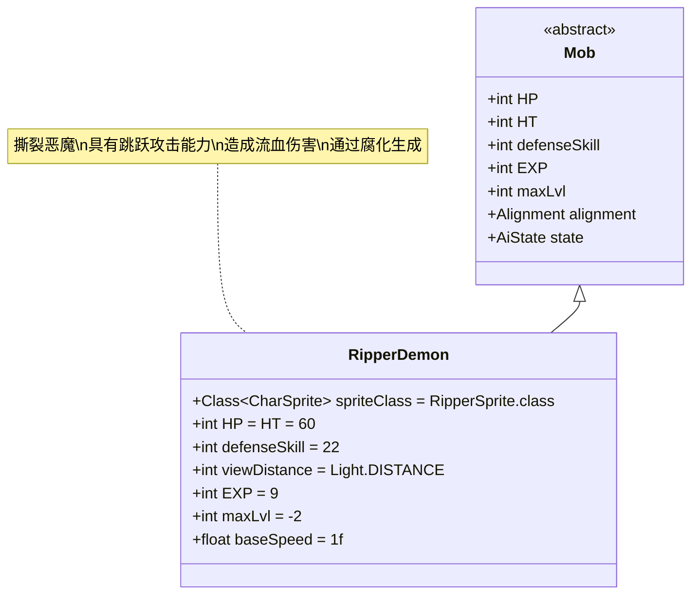

# RipperDemon 类文档

## 1. 基本信息
| 属性 | 值 |
|------|-----|
| 文件路径 | core/src/main/java/com/shatteredpixel/shatteredpixeldungeon/actors/mobs/RipperDemon.java |
| 包名 | com.shatteredpixel.shatteredpixeldungeon.actors.mobs |
| 类类型 | public class |
| 继承关系 | extends Mob |
| 代码行数 | 291行 |

## 2. 类职责说明
RipperDemon（撕裂恶魔）是一种强大的恶魔类敌人，具有独特的跳跃攻击能力。它能够远距离跳跃到目标位置，对路径上的敌人造成流血伤害，并且具有较高的攻击力和防御力。撕裂恶魔主要通过腐化机制生成，不会自然出现在地牢中。

## 4. 继承与协作关系


## 静态常量表
| 常量名 | 类型 | 值 | 说明 |
|--------|------|-----|------|
| spriteClass | Class<? extends CharSprite> | RipperSprite.class | 怪物精灵类 |
| HP/HT | int | 60 | 生命值上限 |
| defenseSkill | int | 22 | 防御技能等级 |
| viewDistance | int | Light.DISTANCE | 视野距离（受光照影响） |
| EXP | int | 9 | 击败后获得的经验值（用于腐化） |
| maxLvl | int | -2 | 最大生成等级（负值表示特殊生成） |
| baseSpeed | float | 1.0f | 基础移动速度 |

## 实例字段表
| 字段名 | 类型 | 修饰符 | 说明 |
|--------|------|--------|------|
| lastEnemyPos | int | private | 上次敌人位置 |
| leapPos | int | private | 跳跃目标位置 |
| leapCooldown | float | private | 跳跃冷却时间 |

## 属性标记
RipperDemon具有以下特殊属性：
- **DEMONIC**: 恶魔类
- **UNDEAD**: 不死族

## 7. 方法详解

### 构造函数块 {}
**功能**: 初始化RipperDemon的基本属性
**实现逻辑**:
- 设置spriteClass为RipperSprite.class（第48行）
- 设置HP和HT为60（第50行）
- 设置defenseSkill为22（第51行）
- 设置viewDistance为Light.DISTANCE（第52行）
- 设置EXP为9，maxLvl为-2（第54-55行）
- 重写HUNTING状态为自定义的Hunting类（第57行）
- 添加DEMONIC和UNDEAD属性（第61-62行）

### spawningWeight()
**签名**: `public float spawningWeight()`
**功能**: 获取生成权重
**返回值**: float - 生成权重（始终为0）
**说明**: 撕裂恶魔不会通过常规方式生成，而是通过腐化机制出现

### damageRoll()
**签名**: `public int damageRoll()`
**功能**: 计算攻击伤害范围
**返回值**: int - 伤害值（15-25之间）
**实现逻辑**: 返回Random.NormalIntRange(15, 25)（第72行）

### attackSkill(Char target)
**签名**: `public int attackSkill(Char target)`
**功能**: 计算攻击技能等级
**参数**: target - 目标角色
**返回值**: int - 攻击技能值（固定为30）
**实现逻辑**: 返回30（第77行）

### attackDelay()
**签名**: `public float attackDelay()`
**功能**: 计算攻击延迟
**返回值**: float - 攻击延迟时间（父类的一半）
**实现逻辑**: 返回super.attackDelay()*0.5f（第82行）

### drRoll()
**签名**: `public int drRoll()`
**功能**: 计算伤害减免
**返回值**: int - 伤害减免值（0-4之间）
**实现逻辑**: 返回super.drRoll() + Random.NormalIntRange(0, 4)（第87行）

### act()
**签名**: `protected boolean act()`
**功能**: 每回合行为处理，管理跳跃冷却和位置追踪
**返回值**: boolean - 调用父类act()的结果
**实现逻辑**:
1. 如果处于游荡状态，重置leapPos（第114-116行）
2. 调用父类act()方法（第119行）
3. 如果未被麻痹，减少跳跃冷却时间（第120行）
4. 更新lastEnemyPos为当前敌人或英雄位置（第123-129行）

### Hunting (内部类)
**功能**: 自定义狩猎AI状态，实现跳跃攻击逻辑
**核心逻辑**:

#### 跳跃执行阶段 (leapPos != -1)
1. 设置跳跃冷却时间为2-4回合（第144行）
2. 如果被根植，取消跳跃（第146-148行）
3. 使用Ballistica计算跳跃路径和碰撞位置（第151-152行）
4. 查找合适的落地位置：
   - 优先选择可通行的空格子（第161-165行）
   - 其次选择非固体地形（第168-174行）
   - 如果无有效位置，取消跳跃（第176-180行）
5. 执行跳跃动画和伤害：
   - 对跳跃路径上的目标造成流血伤害（第194-196行）
   - 处理落地反弹（第204-206行）
   - 更新位置并清理状态（第208-212行）

#### 正常行动阶段 (leapPos == -1)
1. 如果能攻击敌人，执行普通攻击（第219-223行）
2. 如果无法攻击但敌人在视野内，更新目标位置（第227-228行）
3. 跳跃条件判断（第235-269行）：
   - 跳跃冷却结束（leapCooldown <= 0）
   - 敌人在视野内且未被根植
   - 距离敌人至少3格
   - 使用Ballistica验证跳跃路径
4. 如果满足跳跃条件：
   - 设置leapPos为目标位置（第258行）
   - 消耗适当的时间（考虑敌人速度）（第260行）
   - 显示警告消息和目标标记（第261-263行）
   - 准备跳跃动画（第264行）
   - 中断英雄行动（第265行）
5. 如果不满足跳跃条件，执行普通移动逻辑（第271-285行）

### storeInBundle(Bundle bundle) 和 restoreFromBundle(Bundle bundle)
**功能**: 保存和恢复状态
**实现逻辑**: 保存/恢复lastEnemyPos、leapPos和leapCooldown字段（第94-108行）

## 战斗行为
- **高属性**: 高生命值(60)、高防御(22)、高攻击(15-25伤害)
- **快速攻击**: 攻击延迟只有正常的一半
- **跳跃攻击**: 能够远距离跳跃并造成流血伤害
- **智能瞄准**: 考虑敌人移动方向来预测跳跃位置
- **路径验证**: 确保跳跃路径不被障碍物阻挡
- **安全落地**: 确保跳跃后有合适的位置可以落地

## 特殊机制
- **流血伤害**: 跳跃攻击会造成基于伤害值75%的流血效果
- **腐化生成**: 主要通过腐化机制生成，而非自然生成
- **视野限制**: 视野受光照系统影响
- **冷却管理**: 跳跃有2-4回合的冷却时间
- **中断效果**: 跳跃准备会中断英雄的当前行动

## 11. 使用示例
```java
// 创建撕裂恶魔实例
RipperDemon ripper = new RipperDemon();

// 撕裂恶魔的基础属性
int ripperHP = ripper.HP; // 60
int ripperAttack = ripper.damageRoll(); // 15-25

// 跳跃攻击逻辑示例
// 当距离 >= 3格且冷却结束时：
// ripper.leapPos = targetPosition;
// ripper.spend(timeBasedOnEnemySpeed);
// 显示警告并准备跳跃动画

// 流血伤害计算
// Bleeding damage = 0.75f * damageRoll() = 11.25-18.75
```

## 注意事项
1. 撕裂恶魔不会自然生成，只能通过腐化机制出现
2. 跳跃攻击有严格的路径和落地位置要求
3. 跳跃准备阶段可以被玩家观察到并做出反应
4. 流血伤害是基于实际伤害值的百分比，不是固定值
5. 由于高速攻击，近战对抗撕裂恶魔非常危险

## 最佳实践
1. 玩家应保持距离以避免触发跳跃攻击
2. 利用障碍物阻挡撕裂恶魔的跳跃路径
3. 在撕裂恶魔准备跳跃时使用远程攻击
4. 准备治疗手段应对流血伤害
5. 在设计类似敌人时，可参考其智能瞄准和安全落地机制