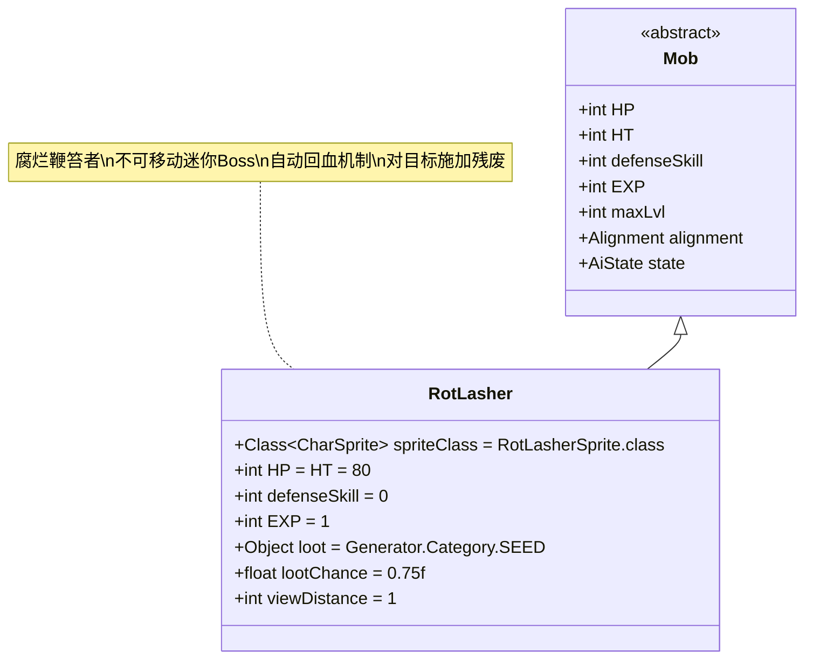

# RotLasher 类文档

## 1. 基本信息
| 属性 | 值 |
|------|-----|
| 文件路径 | core/src/main/java/com/shatteredpixel/shatteredpixeldungeon/actors/mobs/RotLasher.java |
| 包名 | com.shatteredpixel.shatteredpixeldungeon.actors.mobs |
| 类类型 | public class |
| 继承关系 | extends Mob |
| 代码行数 | 133行 |

## 2. 类职责说明
RotLasher（腐烂鞭笞者）是一种特殊的迷你Boss，具有不可移动和自动回血的特性。它通常与腐烂之心(RotHeart)一起出现，作为守护者保护腐烂之心。腐烂鞭笞者具有高生命值但防御技能为0，会对其攻击的目标施加残废效果。

## 4. 继承与协作关系


## 静态常量表
| 常量名 | 类型 | 值 | 说明 |
|--------|------|-----|------|
| spriteClass | Class<? extends CharSprite> | RotLasherSprite.class | 怪物精灵类 |
| HP/HT | int | 80 | 生命值上限 |
| defenseSkill | int | 0 | 防御技能等级（无防御能力） |
| EXP | int | 1 | 击败后获得的经验值 |
| loot | Object | Generator.Category.SEED | 掉落物品类型（种子） |
| lootChance | float | 0.75f | 掉落概率（75%） |
| viewDistance | int | 1 | 视野距离（只能看到相邻格子） |

## 实例字段表
| 字段名 | 类型 | 修饰符 | 说明 |
|--------|------|--------|------|
| (无额外字段) | | | RotLasher没有额外的实例字段 |

## 属性标记
RotLasher具有以下特殊属性：
- **IMMOVABLE**: 不可移动
- **MINIBOSS**: 迷你Boss

## 7. 方法详解

### 构造函数块 {}
**功能**: 初始化RotLasher的基本属性
**实现逻辑**:
- 设置spriteClass为RotLasherSprite.class（第40行）
- 设置HP和HT为80（第42行）
- 设置defenseSkill为0（第43行）
- 设置EXP为1（第45行）
- 设置掉落物品为种子，掉落概率75%（第47-48行）
- 设置状态为自定义的Waiting类（第50行）
- 设置视野距离为1（第51行）
- 添加IMMOVABLE和MINIBOSS属性（第53-54行）

### act()
**签名**: `protected boolean act()`
**功能**: 每回合行为处理，实现自动回血机制
**返回值**: boolean - 调用父类act()的结果
**实现逻辑**:
1. 检查是否满足回血条件（第59行）：
   - 当前生命值小于最大生命值（HP < HT）
   - 没有敌人或敌人不在相邻位置
2. 如果满足条件：
   - 显示治疗状态效果（第60行）
   - 恢复5点生命值（最多恢复到HT）（第61行）
3. 调用父类act()方法（第63行）

### damage(int dmg, Object src)
**签名**: `public void damage(int dmg, Object src)`
**功能**: 处理受到的伤害，对燃烧效果特殊处理
**参数**: 
- dmg - 伤害值
- src - 伤害来源
**实现逻辑**:
- 如果伤害来源是燃烧(Burning)，立即摧毁并死亡（第68-71行）
- 否则调用父类damage方法（第72行）

### attack(Char enemy, float dmgMulti, float dmgBonus, float accMulti)
**签名**: `public boolean attack(Char enemy, float dmgMulti, float dmgBonus, float accMulti)`
**功能**: 攻击处理，影响任务分数
**参数**: enemy - 目标敌人
**返回值**: boolean - 攻击是否成功
**实现逻辑**: 如果目标是英雄，减少任务分数（第78-80行）

### attackProc(Char enemy, int damage)
**签名**: `public int attackProc(Char enemy, int damage)`
**功能**: 攻击后处理，施加残废效果
**参数**: 
- enemy - 目标敌人
- damage - 造成的伤害
**返回值**: int - 最终伤害值
**实现逻辑**:
1. 调用父类attackProc（第86行）
2. 对目标施加2回合的残废效果（第87行）
3. 再次调用父类attackProc（第88行）

### reset()
**签名**: `public boolean reset()`
**功能**: 重置状态
**返回值**: boolean - 始终返回true
**说明**: RotLasher不需要特殊重置逻辑（第92-94行）

### getCloser(int target) 和 getFurther(int target)
**签名**: `protected boolean getCloser(int target)` / `protected boolean getFurther(int target)`
**功能**: 移动处理（重写为空实现）
**返回值**: boolean - 始终返回false
**说明**: 由于IMMOVABLE属性，无法移动（第97-104行）

### damageRoll()
**签名**: `public int damageRoll()`
**功能**: 计算攻击伤害范围
**返回值**: int - 伤害值（10-20之间）
**实现逻辑**: 返回Random.NormalIntRange(10, 20)（第108行）

### attackSkill(Char target)
**签名**: `public int attackSkill(Char target)`
**功能**: 计算攻击技能等级
**参数**: target - 目标角色
**返回值**: int - 攻击技能值（固定为25）
**实现逻辑**: 返回25（第113行）

### drRoll()
**签名**: `public int drRoll()`
**功能**: 计算伤害减免
**返回值**: int - 伤害减免值（0-8之间）
**实现逻辑**: 返回super.drRoll() + Random.NormalIntRange(0, 8)（第118行）

### Waiting (内部类)
**功能**: 自定义游荡AI状态
**核心逻辑**:
- 重写noticeEnemy()方法，在检查敌人前消耗时间（第128-131行）
- 这确保了RotLasher每回合都会消耗时间，即使没有发现敌人

### 免疫系统
RotLasher具有对毒气(ToxicGas)的免疫能力（第122行）

## 战斗行为
- **不可移动**: 完全无法移动位置，只能在固定位置战斗
- **自动回血**: 当没有相邻敌人时，每回合恢复5点生命值
- **高生命值**: 80点生命值使其相当耐打
- **无防御**: defenseSkill为0，容易被击中
- **残废效果**: 每次攻击都会使目标残废2回合
- **燃烧弱点**: 对燃烧效果极其脆弱，会立即死亡

## 特殊机制
- **任务分数影响**: 攻击英雄会减少任务分数
- **种子掉落**: 75%概率掉落随机种子
- **近战限制**: 只能攻击相邻的敌人（视野距离为1）
- **毒气免疫**: 对毒气环境完全免疫

## 11. 使用示例
```java
// 创建腐烂鞭笞者实例
RotLasher lasher = new RotLasher();

// 自动回血机制示例
// 当lasher.HP < 80且无相邻敌人时：
// lasher.HP += 5 (最多到80)
// 显示绿色治疗数字

// 燃烧脆弱性示例
Burning burning = new Burning();
lasher.damage(10, burning); // 立即死亡，不计算实际伤害

// 残废效果示例
// lasher.attack(enemy);
// Buff.affect(enemy, Cripple.class, 2f); // 施加2回合残废
```

## 注意事项
1. 腐烂鞭笞者通常与腐烂之心一起出现，需要优先处理
2. 燃烧是最有效的击杀手段，可以绕过其高生命值
3. 由于无法移动，可以安全地在远处使用远程攻击
4. 残废效果会严重影响玩家的移动能力
5. 任务分数的减少会影响相关成就的获取

## 最佳实践
1. 玩家应优先使用燃烧类武器或法术对抗腐烂鞭笞者
2. 利用其不可移动的特性进行风筝战术
3. 准备解残废的手段（如解药或特定装备）
4. 在设计类似敌人时，可参考其自动回血和特殊弱点机制
5. 合理利用高伤害减免来平衡其无防御的弱点