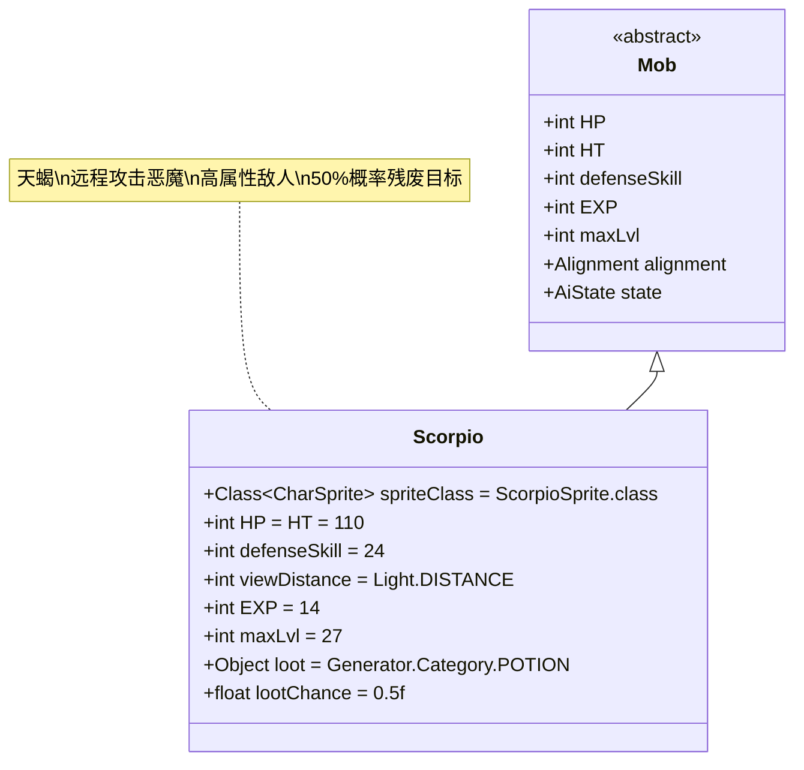

# Scorpio 类文档

## 1. 基本信息
| 属性 | 值 |
|------|-----|
| 文件路径 | core/src/main/java/com/shatteredpixel/shatteredpixeldungeon/actors/mobs/Scorpio.java |
| 包名 | com.shatteredpixel.shatteredpixeldungeon.actors.mobs |
| 类类型 | public class |
| 继承关系 | extends Mob |
| 代码行数 | 117行 |

## 2. 类职责说明
Scorpio（天蝎）是一种强大的恶魔类远程攻击敌人，具有高生命值、高攻击力和高防御力。它能够从远处发动攻击，并有50%的概率对目标施加残废效果。天蝎的特殊AI使其在狩猎状态下会主动远离敌人以保持最佳攻击距离。

## 4. 继承与协作关系


## 静态常量表
| 常量名 | 类型 | 值 | 说明 |
|--------|------|-----|------|
| spriteClass | Class<? extends CharSprite> | ScorpioSprite.class | 怪物精灵类 |
| HP/HT | int | 110 | 生命值上限 |
| defenseSkill | int | 24 | 防御技能等级 |
| viewDistance | int | Light.DISTANCE | 视野距离（受光照影响） |
| EXP | int | 14 | 击败后获得的经验值 |
| maxLvl | int | 27 | 最大生成等级 |
| loot | Object | Generator.Category.POTION | 掉落物品类型（药水） |
| lootChance | float | 0.5f | 掉落概率（50%） |

## 实例字段表
| 字段名 | 类型 | 修饰符 | 说明 |
|--------|------|--------|------|
| (无额外字段) | | | Scorpio没有额外的实例字段 |

## 属性标记
Scorpio具有以下特殊属性：
- **DEMONIC**: 恶魔类

## 7. 方法详解

### 构造函数块 {}
**功能**: 初始化Scorpio的基本属性
**实现逻辑**:
- 设置spriteClass为ScorpioSprite.class（第42行）
- 设置HP和HT为110（第44行）
- 设置defenseSkill为24（第45行）
- 设置viewDistance为Light.DISTANCE（第46行）
- 设置EXP为14，maxLvl为27（第48-49行）
- 设置掉落物品为药水，掉落概率50%（第51-52行）
- 添加DEMONIC属性（第54行）

### damageRoll()
**签名**: `public int damageRoll()`
**功能**: 计算攻击伤害范围
**返回值**: int - 伤害值（30-40之间）
**实现逻辑**: 返回Random.NormalIntRange(30, 40)（第59行）

### attackSkill(Char target)
**签名**: `public int attackSkill(Char target)`
**功能**: 计算攻击技能等级
**参数**: target - 目标角色
**返回值**: int - 攻击技能值（固定为36）
**实现逻辑**: 返回36（第64行）

### drRoll()
**签名**: `public int drRoll()`
**功能**: 计算伤害减免
**返回值**: int - 伤害减免值（0-16之间）
**实现逻辑**: 返回super.drRoll() + Random.NormalIntRange(0, 16)（第69行）

### canAttack(Char enemy)
**签名**: `protected boolean canAttack(Char enemy)`
**功能**: 判断是否可以攻击目标
**参数**: enemy - 目标敌人
**返回值**: boolean - 是否可以攻击
**实现逻辑**:
- 必须不与敌人相邻（第74行）
- 并且满足以下条件之一：
  - 父类canAttack返回true（第75行）
  - 使用Ballistica验证直线路径无障碍（第75行）

### attackProc(Char enemy, int damage)
**签名**: `public int attackProc(Char enemy, int damage)`
**功能**: 攻击后处理，施加残废效果
**参数**: 
- enemy - 目标敌人
- damage - 造成的伤害
**返回值**: int - 最终伤害值
**实现逻辑**:
1. 调用父类attackProc（第80行）
2. 50%概率对目标施加完整持续时间的残废效果（第81-83行）

### getCloser(int target)
**签名**: `protected boolean getCloser(int target)`
**功能**: 移动处理，实现保持距离的AI
**参数**: target - 目标位置
**返回值**: boolean - 是否成功移动
**实现逻辑**:
- 如果处于狩猎状态且能看到敌人，尝试远离目标（第90-91行）
- 否则调用父类getCloser（第93行）

### aggro(Char ch)
**签名**: `public void aggro(Char ch)`
**功能**: 处理仇恨机制
**参数**: ch - 仇恨目标
**实现逻辑**:
- 只有当目标在视野内时才会被激怒（第101-103行）
- 这防止了天蝎被视野外的目标激怒

### createLoot()
**签名**: `public Item createLoot()`
**功能**: 创建掉落物品
**返回值**: Item - 药水物品
**实现逻辑**:
1. 随机选择一个药水类型（第111行）
2. 排除治疗药水和力量药水（第112行）
3. 使用反射创建药水实例（第114行）

## 战斗行为
- **远程攻击**: 只能攻击非相邻的敌人，需要直线路径
- **高属性**: 高生命值(110)、高防御(24)、高攻击(30-40伤害)
- **残废效果**: 50%概率使目标残废完整持续时间
- **距离保持**: 在狩猎状态下会主动远离敌人以保持最佳攻击距离
- **视野限制**: 视野受光照系统影响，只能激怒视野内的目标

## 特殊机制
- **药水掉落**: 50%概率掉落随机药水（排除治疗和力量药水）
- **路径验证**: 使用Ballistica确保攻击路径无障碍
- **智能移动**: 根据战斗状态调整移动策略
- **仇恨过滤**: 不会被视野外的目标激怒

## 11. 使用示例
```java
// 创建天蝎实例
Scorpio scorpio = new Scorpio();

// 天蝎的基础属性
int scorpioHP = scorpio.HP; // 110
int scorpioDamage = scorpio.damageRoll(); // 30-40

// 远程攻击条件示例
// scorpio.canAttack(enemy) 返回true当：
// 1. scorpio和enemy不相邻
// 2. 两者之间有直线路径无障碍

// 残废效果示例
// scorpio.attackProc(enemy, damage);
// 50%概率：Buff.prolong(enemy, Cripple.class, Cripple.DURATION);

// 距离保持AI示例
// 当scorpio.state == HUNTING且看到敌人时：
// scorpio.getCloser(target) 实际上调用 getFurther(target)
```

## 注意事项
1. 天蝎是远程攻击者，近战对抗相对安全
2. 需要确保攻击路径上有障碍物来阻挡其远程攻击
3. 残废效果会严重影响玩家的移动能力
4. 掉落的药水中不会包含治疗药水和力量药水
5. 天蝎最高可在27层地牢生成

## 最佳实践
1. 玩家应利用障碍物阻挡天蝎的视线和攻击路径
2. 准备解残废的手段或快速消灭天蝎
3. 在设计远程敌人时，可参考其距离保持AI机制
4. 合理利用高伤害减免来平衡游戏难度
5. 考虑光照系统对敌人视野的影响