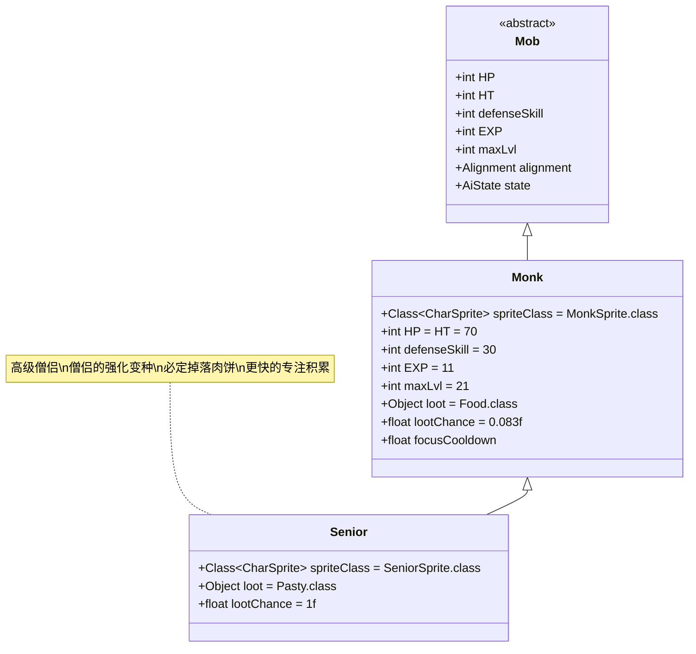

# Senior 类文档

## 1. 基本信息
| 属性 | 值 |
|------|-----|
| 文件路径 | core/src/main/java/com/shatteredpixel/shatteredpixeldungeon/actors/mobs/Senior.java |
| 包名 | com.shatteredpixel.shatteredpixeldungeon.actors.mobs |
| 类类型 | public class |
| 继承关系 | extends Monk |
| 代码行数 | 50行 |

## 2. 类职责说明
Senior（高级僧侣）是Monk（僧侣）的强化变种，具有更高的移动速度和攻击力。作为不死族敌人，高级僧侣继承了僧侣的专注(Focus)机制，但移动时能更快地积累专注状态，使其在战斗中更加危险。

## 4. 继承与协作关系


## 静态常量表
| 常量名 | 类型 | 值 | 说明 |
|--------|------|-----|------|
| spriteClass | Class<? extends CharSprite> | SeniorSprite.class | 怪物精灵类 |
| loot | Object | Pasty.class | 掉落物品类型（肉饼） |
| lootChance | float | 1.0f | 掉落概率（100%） |

## 实例字段表
| 字段名 | 类型 | 修饰符 | 说明 |
|--------|------|--------|------|
| (继承自Monk) | | | |
| focusCooldown | float | protected | 专注冷却时间 |

## 属性标记
Senior继承自Monk，具有以下特殊属性：
- **UNDEAD**: 不死族

## 7. 方法详解

### 构造函数块 {}
**功能**: 初始化Senior的基本属性
**实现逻辑**:
- 设置spriteClass为SeniorSprite.class（第31行）
- 设置掉落物品为Pasty.class（肉饼）（第33行）
- 设置掉落概率为1.0f（100%）（第34行）

### move(int step, boolean travelling)
**签名**: `public void move(int step, boolean travelling)`
**功能**: 移动处理，加速专注冷却
**参数**: 
- step - 目标位置
- travelling - 是否在移动状态
**实现逻辑**:
1. 如果处于移动状态(travelling)，额外减少1.66点专注冷却时间（第40-42行）
2. 调用父类move方法（第43行）
3. **总计效果**: 每次移动总共减少3.33点专注冷却（基础1.67 + 额外1.66），是普通僧侣的两倍

### damageRoll()
**签名**: `public int damageRoll()`
**功能**: 计算攻击伤害范围
**返回值**: int - 伤害值（16-25之间）
**实现逻辑**: 返回Random.NormalIntRange(16, 25)（第47行）
**对比**: 比普通僧侣(12-25)的最低伤害更高

## 继承的核心机制（来自Monk类）

### 专注(Focus)机制
- **自动获得**: 当处于狩猎状态且专注冷却结束时，自动获得Focus Buff（第87-88行）
- **无敌防御**: 拥有Focus时，防御技能变为无限闪避(INFINITE_EVASION)（第108-110行）
- **格挡反击**: 当被攻击时，会消耗Focus并显示"格挡"消息（第116-125行）
- **冷却重置**: 格挡后重新设置专注冷却时间为6-7回合（第124行）

### 移动与专注
- **风筝惩罚**: 玩家风筝(移动远离)僧侣会加速其专注积累（第102行）
- **高级僧侣强化**: Senior的专注积累速度是普通僧侣的两倍（第40-42行）

### 其他属性
- **高防御**: defenseSkill = 30（继承自Monk）
- **快速攻击**: attackDelay = 正常的50%（继承自Monk）
- **低伤害减免**: drRoll = 0-2（继承自Monk）
- **经验奖励**: EXP = 11，maxLvl = 21（继承自Monk）

## 战斗行为
- **高速移动**: 移动时专注冷却减少速度是普通僧侣的两倍
- **高攻击力**: 伤害范围16-25，比普通僧侣更稳定
- **必定掉落**: 100%掉落肉饼(Pasty)，是重要的食物来源
- **专注格挡**: 能够完全格挡攻击并反击
- **不死特性**: 属于不死族，对某些效果有特殊反应

## 特殊机制
- **专注系统**: 独特的防御机制，需要玩家掌握攻击时机
- **移动惩罚**: 玩家的移动会加速敌人的专注积累
- **食物掉落**: 必定掉落高价值食物（肉饼恢复10点饱食度）

## 11. 使用示例
```java
// 创建高级僧侣实例
Senior senior = new Senior();

// 高级僧侣的专注冷却机制
// 每次移动时：senior.focusCooldown -= 3.33f;
// 这使得senior比普通monk更快获得Focus状态

// 伤害计算
int seniorDamage = senior.damageRoll(); // 16-25
int monkDamage = new Monk().damageRoll(); // 12-25

// 掉落保证
// senior.loot = Pasty.class;
// senior.lootChance = 1.0f; // 100%掉落
```

## 注意事项
1. 高级僧侣的专注积累速度极快，不适合风筝战术
2. 最佳策略是在其没有Focus时进行连续攻击
3. 肉饼是游戏中最有价值的食物之一，务必收集
4. 由于是不死族，可能对某些神圣或治疗效果有特殊反应
5. 在21层及以下地牢可能出现

## 最佳实践
1. 玩家应观察高级僧侣的Buff图标，等待其Focus消失后再攻击
2. 避免频繁移动，以免加速其专注积累
3. 利用其必定掉落肉饼的特性作为稳定食物来源
4. 在设计类似敌人时，可参考其移动与能力积累的互动机制
5. 平衡高攻击力与低生命值（70点）的关系