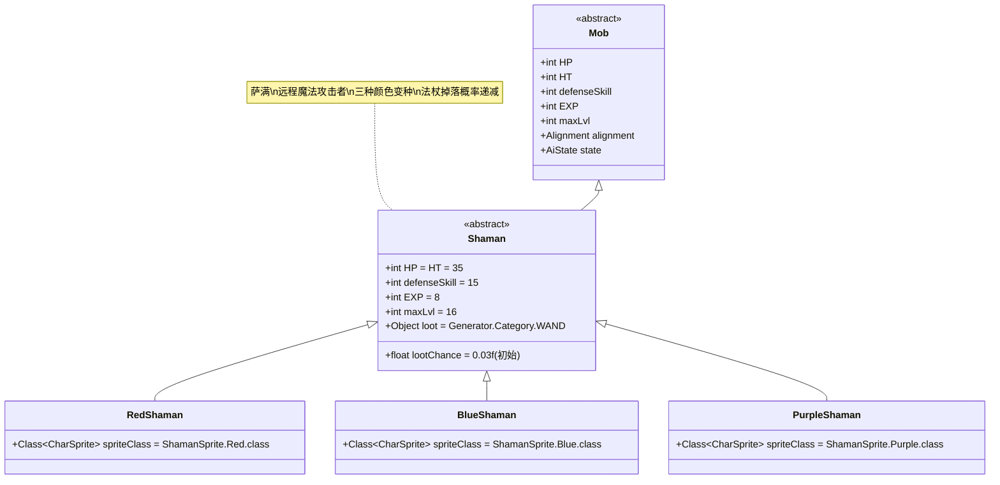

# Shaman 类文档

## 1. 基本信息
| 属性 | 值 |
|------|-----|
| 文件路径 | core/src/main/java/com/shatteredpixel/shatteredpixeldungeon/actors/mobs/Shaman.java |
| 包名 | com.shatteredpixel.shatteredpixeldungeon.actors.mobs |
| 类类型 | public abstract class |
| 继承关系 | extends Mob |
| 代码行数 | 194行 |

## 2. 类职责说明
Shaman（萨满）是一类具有远程魔法攻击能力的抽象敌人，能够发射土系魔法箭攻击远处的敌人，并对目标施加不同的减益效果。萨满有三种变种：红色萨满（施加虚弱）、蓝色萨满（施加易伤）和紫色萨满（施加诅咒）。它们还能掉落法杖，但掉落概率会随着获得次数递减。

## 4. 继承与协作关系


## 静态常量表
| 常量名 | 类型 | 值 | 说明 |
|--------|------|-----|------|
| HP/HT | int | 35 | 生命值上限 |
| defenseSkill | int | 15 | 防御技能等级 |
| EXP | int | 8 | 击败后获得的经验值 |
| maxLvl | int | 16 | 最大生成等级 |
| loot | Object | Generator.Category.WAND | 掉落物品类型（法杖） |
| lootChance | float | 0.03f | 初始掉落概率（3%） |

## 实例字段表
| 字段名 | 类型 | 修饰符 | 说明 |
|--------|------|--------|------|
| (无额外字段) | | | Shaman没有额外的实例字段 |

## 7. 方法详解

### 构造函数块 {}
**功能**: 初始化Shaman的基本属性
**实现逻辑**:
- 设置HP和HT为35（第47行）
- 设置defenseSkill为15（第48行）
- 设置EXP为8，maxLvl为16（第50-51行）
- 设置掉落物品为法杖，初始掉落概率3%（第53-54行）

### damageRoll()
**签名**: `public int damageRoll()`
**功能**: 计算近战伤害范围
**返回值**: int - 伤害值（5-10之间）
**实现逻辑**: 返回Random.NormalIntRange(5, 10)（第59行）

### attackSkill(Char target)
**签名**: `public int attackSkill(Char target)`
**功能**: 计算攻击技能等级
**参数**: target - 目标角色
**返回值**: int - 攻击技能值（固定为18）
**实现逻辑**: 返回18（第64行）

### drRoll()
**签名**: `public int drRoll()`
**功能**: 计算伤害减免
**返回值**: int - 伤害减免值（0-6之间）
**实现逻辑**: 返回super.drRoll() + Random.NormalIntRange(0, 6)（第69行）

### canAttack(Char enemy)
**签名**: `protected boolean canAttack(Char enemy)`
**功能**: 判断是否可以攻击目标
**参数**: enemy - 目标敌人
**返回值**: boolean - 是否可以攻击
**实现逻辑**:
- 满足以下条件之一即可攻击：
  - 父类canAttack返回true（相邻或标准攻击）（第74行）
  - 使用Ballistica验证魔法箭路径无障碍（第75行）

### lootChance()
**签名**: `public float lootChance()`
**功能**: 计算实际掉落概率
**返回值**: float - 调整后的掉落概率
**实现逻辑**: 
- 每获得一个法杖，后续掉落概率变为原来的1/3（第82行）
- 概率序列：3% → 1% → 0.33% → 0.11% → ...

### createLoot()
**签名**: `public Item createLoot()`
**功能**: 创建掉落物品并更新计数
**返回值**: Item - 法杖物品
**实现逻辑**: 增加Dungeon.LimitedDrops.SHAMAN_WAND计数后调用父类方法（第87-88行）

### doAttack(Char enemy)
**签名**: `protected boolean doAttack(Char enemy)`
**功能**: 攻击处理，区分近战和远程魔法攻击
**参数**: enemy - 目标敌人
**返回值**: boolean - 攻击是否完成
**实现逻辑**:
1. 如果满足近战条件（相邻或路径被阻挡），执行普通近战（第93-96行）
2. 否则执行远程魔法攻击：
   - 显示zap动画（如果可见）（第100-102行）
   - 或直接调用zap方法（不可见时）（第104-106行）

### zap()
**签名**: `private void zap()`
**功能**: 执行魔法箭攻击
**实现逻辑**:
1. 消耗1回合时间，驱散隐身状态（第114-116行）
2. 检查命中（第118行）
3. 50%概率施加减益效果（第120-123行）
4. 造成6-15点土系魔法伤害（受升天挑战修正）（第125-127行）
5. 如果杀死英雄，记录特殊死亡并显示消息（第129-133行）
6. 如果未命中，显示防御消息（第135行）

### debuff(Char enemy)
**签名**: `protected abstract void debuff(Char enemy)`
**功能**: 抽象方法，由子类实现具体的减益效果
**参数**: enemy - 目标敌人
**说明**: 不同颜色的萨满实现不同的减益效果

### onZapComplete()
**签名**: `public void onZapComplete()`
**功能**: 魔法箭动画完成后调用
**实现逻辑**: 执行zap攻击并切换到下一回合（第142-143行）

### description()
**签名**: `public String description()`
**功能**: 获取描述文本
**返回值**: String - 完整描述
**实现逻辑**: 在父类描述后追加法术描述（第148行）

### EarthenBolt (内部类)
**功能**: 土系魔法箭标记类
**说明**: 用于区分近战和魔法攻击，便于抗性系统处理（第111行）

## 萨满变种

### RedShaman (红色萨满)
- **精灵类**: ShamanSprite.Red.class（第153行）
- **减益效果**: Weakness（虚弱），持续Weakness.DURATION回合（第158行）

### BlueShaman (蓝色萨满)  
- **精灵类**: ShamanSprite.Blue.class（第164行）
- **减益效果**: Vulnerable（易伤），持续Vulnerable.DURATION回合（第169行）

### PurpleShaman (紫色萨满)
- **精灵类**: ShamanSprite.Purple.class（第175行）
- **减益效果**: Hex（诅咒），持续Hex.DURATION回合（第180行）

### 随机生成
- **概率分布**: 红色40%，蓝色40%，紫色20%（第186-192行）
- **使用方法**: Shaman.random()返回对应的萨满类

## 战斗行为
- **双模式攻击**: 近战(5-10伤害)和远程魔法(6-15伤害)
- **远程优先**: 只要路径无障碍，优先使用远程魔法攻击
- **减益随机**: 50%概率在魔法攻击时施加减益效果
- **路径验证**: 使用Ballistica.MAGIC_BOLT确保魔法箭直线飞行
- **升天挑战**: 魔法伤害受AscensionChallenge.statModifier修正

## 特殊机制
- **掉落递减**: 法杖掉落概率随获得次数指数级递减
- **特殊死亡**: 被萨满魔法杀死会触发特殊成就"Badges.validateDeathFromEnemyMagic()"
- **抗性区分**: 通过EarthenBolt类区分魔法和物理伤害
- **颜色编码**: 三种颜色对应不同的减益效果，便于玩家识别

## 11. 使用示例
```java
// 创建随机萨满
Class<? extends Shaman> shamanClass = Shaman.random();
Shaman shaman = Reflection.newInstance(shamanClass);

// 萨满的基础属性
int shamanHP = shaman.HP; // 35
int shamanDamage = shaman.damageRoll(); // 5-10 (近战)

// 魔法箭攻击示例
// 当shaman.doAttack(enemy)且满足远程条件时：
// shaman.sprite.zap(enemy.pos); // 显示动画
// shaman.onZapComplete(); // 动画完成后执行实际攻击

// 掉落概率计算
// 第1次: 3%
// 第2次: 1%  
// 第3次: 0.33%
// 第4次: 0.11%
```

## 注意事项
1. 萨满是抽象类，不能直接实例化，必须使用具体变种
2. 魔法箭只能直线飞行，会被墙壁和障碍物阻挡
3. 减益效果只有50%触发概率，不是每次魔法攻击都生效
4. 法杖掉落非常稀有，后期几乎不可能获得
5. 被魔法箭杀死会解锁特殊成就

## 最佳实践
1. 玩家应利用障碍物阻挡萨满的视线来避免远程攻击
2. 优先击杀紫色萨满（诅咒效果最危险）
3. 在设计类似敌人时，可参考其掉落概率递减机制
4. 平衡远程和近战伤害，确保不同战斗距离都有威胁
5. 利用颜色编码帮助玩家快速识别不同类型的威胁