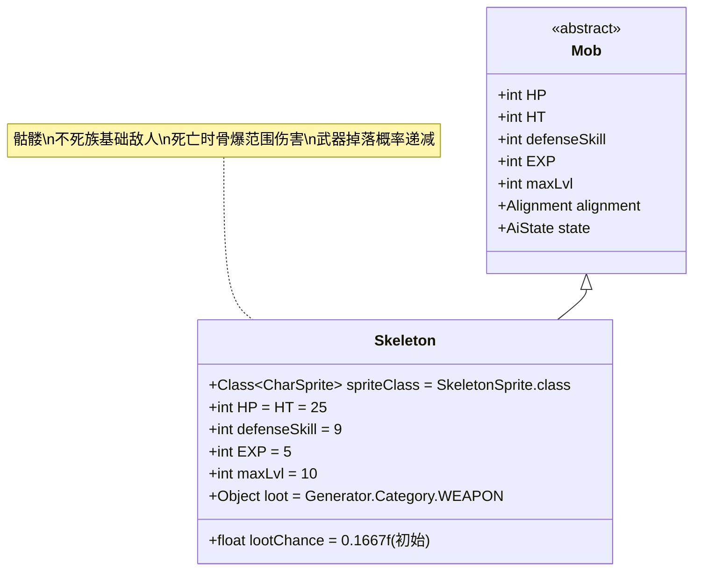

# Skeleton 类文档

## 1. 基本信息
| 属性 | 值 |
|------|-----|
| 文件路径 | core/src/main/java/com/shatteredpixel/shatteredpixeldungeon/actors/mobs/Skeleton.java |
| 包名 | com.shatteredpixel.shatteredpixeldungeon.actors.mobs |
| 类类型 | public class |
| 继承关系 | extends Mob |
| 代码行数 | 166行 |

## 2. 类职责说明
Skeleton（骷髅）是一种基础的不死族敌人，具有死亡时爆炸造成范围伤害的特殊机制。当骷髅被杀死时（非掉入深渊），会在周围8个相邻格子内对所有存活的角色造成6-12点伤害。这种骨爆伤害有特殊的防御机制，所有类型的伤害减免都会被应用两次，并且某些特定的防护效果也能提供额外保护。

## 4. 继承与协作关系


## 静态常量表
| 常量名 | 类型 | 值 | 说明 |
|--------|------|-----|------|
| spriteClass | Class<? extends CharSprite> | SkeletonSprite.class | 怪物精灵类 |
| HP/HT | int | 25 | 生命值上限 |
| defenseSkill | int | 9 | 防御技能等级 |
| EXP | int | 5 | 击败后获得的经验值 |
| maxLvl | int | 10 | 最大生成等级 |
| loot | Object | Generator.Category.WEAPON | 掉落物品类型（武器） |
| lootChance | float | 0.1667f | 初始掉落概率（约16.67%） |

## 实例字段表
| 字段名 | 类型 | 修饰符 | 说明 |
|--------|------|--------|------|
| (无额外字段) | | | Skeleton没有额外的实例字段 |

## 属性标记
Skeleton具有以下特殊属性：
- **UNDEAD**: 不死族
- **INORGANIC**: 无机物

## 7. 方法详解

### 构造函数块 {}
**功能**: 初始化Skeleton的基本属性
**实现逻辑**:
- 设置spriteClass为SkeletonSprite.class（第50行）
- 设置HP和HT为25（第52行）
- 设置defenseSkill为9（第53行）
- 设置EXP为5，maxLvl为10（第55-56行）
- 设置掉落物品为武器，初始掉落概率16.67%（第58-59行）
- 添加UNDEAD和INORGANIC属性（第61-62行）

### damageRoll()
**签名**: `public int damageRoll()`
**功能**: 计算攻击伤害范围
**返回值**: int - 伤害值（2-10之间）
**实现逻辑**: 返回Random.NormalIntRange(2, 10)（第67行）

### die(Object cause)
**签名**: `public void die(Object cause)`
**功能**: 死亡处理，触发骨爆范围伤害
**参数**: cause - 死亡原因
**实现逻辑**:
1. 如果死亡原因是掉入深渊(Chasm)，直接返回不触发爆炸（第75-76行）
2. 遍历周围8个相邻格子（第78行）
3. 对每个存活的角色造成骨爆伤害：
   - 基础伤害：6-12点（第81行）
   - 受升天挑战修正（第82行）
4. **特殊防御机制**（按顺序应用）：
   - **岩石护甲**: 伤害减免百分比应用两次（第87-92行）
   - **大地之根护甲**: 伤害减免数值应用两次（第94-98行）
   - **光之盾**: 伤害减免数值应用两次（第102-107行）
   - **被动光之盾**: 有一定概率减免2点伤害（应用两次）（第108-116行）
   - **神圣庇护**: 减免2-6点伤害（应用两次）（第118-122行）
5. **最终伤害减免**: 所有类型的DR都应用两次（第125行）
6. 造成最终伤害（第126行）
7. 如果英雄死亡，记录失败并显示消息（第137-140行）
8. 播放骨头音效（如果在视野内）（第133-135行）

### lootChance()
**签名**: `public float lootChance()`
**功能**: 计算实际掉落概率
**返回值**: float - 调整后的掉落概率
**实现逻辑**: 
- 每获得一个武器，后续掉落概率变为原来的1/3（第147行）
- 概率序列：16.67% → 5.56% → 1.85% → 0.62% → ...

### createLoot()
**签名**: `public Item createLoot()`
**功能**: 创建掉落物品并更新计数
**返回值**: Item - 武器物品
**实现逻辑**: 增加Dungeon.LimitedDrops.SKELE_WEP计数后调用父类方法（第152-153行）

### attackSkill(Char target)
**签名**: `public int attackSkill(Char target)`
**功能**: 计算攻击技能等级
**参数**: target - 目标角色
**返回值**: int - 攻击技能值（固定为12）
**实现逻辑**: 返回12（第158行）

### drRoll()
**签名**: `public int drRoll()`
**功能**: 计算伤害减免
**返回值**: int - 伤害减免值（0-5之间）
**实现逻辑**: 返回super.drRoll() + Random.NormalIntRange(0, 5)（第163行）

## 战斗行为
- **基础属性**: 低生命值(25)、低防御(9)、低攻击(2-10伤害)
- **骨爆机制**: 死亡时对周围8格造成范围伤害（6-12点）
- **双重减免**: 所有防御效果对骨爆伤害都应用两次
- **不死特性**: 属于不死族，可能对某些效果有特殊反应
- **早期敌人**: 只在前10层地牢生成

## 特殊机制
- **骨爆伤害**: 独特的死亡爆炸机制，增加战斗风险
- **防御倍增**: 所有DR类型都应用两次，鼓励玩家堆叠防御
- **掉落递减**: 武器掉落概率随获得次数指数级递减
- **特效防护**: 多种特殊Buff能提供额外的骨爆防护
- **深渊免疫**: 掉入深渊不会触发骨爆

## 11. 使用示例
```java
// 创建骷髅实例
Skeleton skeleton = new Skeleton();

// 骷髅的基础属性
int skeletonHP = skeleton.HP; // 25
int skeletonDamage = skeleton.damageRoll(); // 2-10

// 骨爆伤害计算示例
// 基础伤害: Random.NormalIntRange(6, 12) = 6-12
// 升天挑战修正: damage * AscensionChallenge.statModifier(this)
// 岩石护甲: damage = rockArmor.absorb(damage); damage *= (damage/preDmg);
// 最终DR: damage = Math.max(0, damage - (ch.drRoll() + ch.drRoll()));

// 掉落概率计算
// 第1次: 16.67%
// 第2次: 5.56%  
// 第3次: 1.85%
// 第4次: 0.62%
```

## 注意事项
1. 骷髅是游戏中最早期的不死族敌人之一
2. 骨爆伤害可以被多种防护手段有效减免
3. 在狭窄空间内击杀多个骷髅可能造成连锁伤害
4. 武器掉落虽然概率递减，但初期相对容易获得
5. 由于只有25点生命值，通常可以被一击必杀

## 最佳实践
1. 玩家应优先堆叠防御属性来应对骨爆伤害
2. 利用障碍物阻挡骨爆范围伤害
3. 在开阔区域逐一击杀骷髅，避免连锁爆炸
4. 收集早期武器掉落来提升战斗力
5. 在设计类似敌人时，可参考其死亡爆炸和防御倍增机制