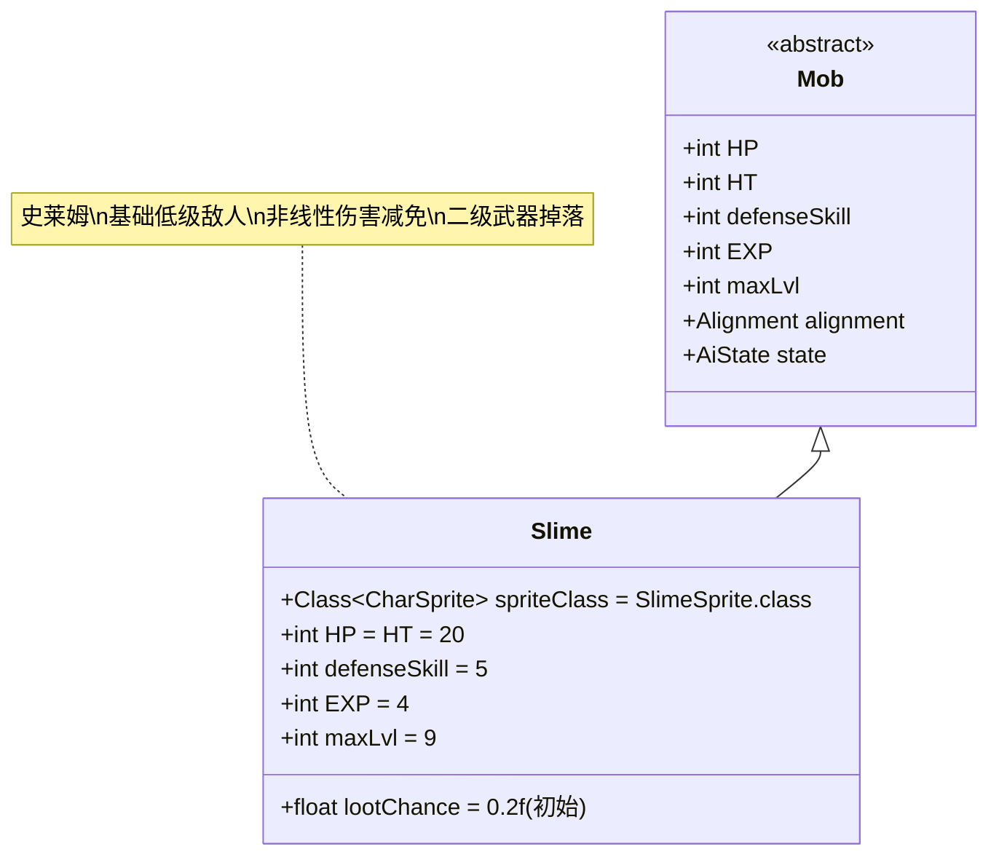

# Slime 类文档

## 1. 基本信息
| 属性 | 值 |
|------|-----|
| 文件路径 | core/src/main/java/com/shatteredpixel/shatteredpixeldungeon/actors/mobs/Slime.java |
| 包名 | com.shatteredpixel.shatteredpixeldungeon.actors.mobs |
| 类类型 | public class |
| 继承关系 | extends Mob |
| 代码行数 | 84行 |

## 2. 类职责说明
Slime（史莱姆）是一种基础的低级敌人，具有独特的伤害减免机制。当受到5点或以上的伤害时，史莱姆会应用非线性伤害减免公式，大幅减少实际承受的伤害。史莱姆还会掉落二级武器，但掉落概率会随着获得次数递减。

## 4. 继承与协作关系


## 静态常量表
| 常量名 | 类型 | 值 | 说明 |
|--------|------|-----|------|
| spriteClass | Class<? extends CharSprite> | SlimeSprite.class | 怪物精灵类 |
| HP/HT | int | 20 | 生命值上限 |
| defenseSkill | int | 5 | 防御技能等级 |
| EXP | int | 4 | 击败后获得的经验值 |
| maxLvl | int | 9 | 最大生成等级 |
| lootChance | float | 0.2f | 初始掉落概率（20%） |

## 实例字段表
| 字段名 | 类型 | 修饰符 | 说明 |
|--------|------|--------|------|
| (无额外字段) | | | Slime没有额外的实例字段 |

## 7. 方法详解

### 构造函数块 {}
**功能**: 初始化Slime的基本属性
**实现逻辑**:
- 设置spriteClass为SlimeSprite.class（第36行）
- 设置HP和HT为20（第38行）
- 设置defenseSkill为5（第39行）
- 设置EXP为4，maxLvl为9（第41-42行）
- 设置初始掉落概率为20%（第44行）

### damageRoll()
**签名**: `public int damageRoll()`
**功能**: 计算攻击伤害范围
**返回值**: int - 伤害值（2-5之间）
**实现逻辑**: 返回Random.NormalIntRange(2, 5)（第49行）

### attackSkill(Char target)
**签名**: `public int attackSkill(Char target)`
**功能**: 计算攻击技能等级
**参数**: target - 目标角色
**返回值**: int - 攻击技能值（固定为12）
**实现逻辑**: 返回12（第54行）

### damage(int dmg, Object src)
**签名**: `public void damage(int dmg, Object src)`
**功能**: 处理受到的伤害，应用特殊的伤害减免机制
**参数**: 
- dmg - 原始伤害值
- src - 伤害来源
**实现逻辑**:
1. 考虑升天挑战修正因子（第59-60行）
2. 如果修正后的伤害 >= 5，应用非线性伤害减免公式（第61-64行）：
   - 输入伤害5 → 输出伤害5
   - 输入伤害7 → 输出伤害6  
   - 输入伤害10 → 输出伤害7
   - 输入伤害14 → 输出伤害8
   - 输入伤害19 → 输出伤害9
   - 输入伤害25 → 输出伤害10
3. 重新应用升天挑战修正并调用父类damage方法（第65-66行）

### lootChance()
**签名**: `public float lootChance()`
**功能**: 计算实际掉落概率
**返回值**: float - 调整后的掉落概率
**实现逻辑**: 
- 每获得一个武器，后续掉落概率变为原来的1/4（第73行）
- 概率序列：20% → 5% → 1.25% → 0.3125% → ...

### createLoot()
**签名**: `public Item createLoot()`
**功能**: 创建掉落物品并更新计数
**返回值**: Item - 二级近战武器
**实现逻辑**:
1. 增加Dungeon.LimitedDrops.SLIME_WEP计数（第78行）
2. 从WEP_T2类别中随机选择近战武器（第79-80行）
3. 将武器等级设为0（未升级状态）（第81行）
4. 返回武器实例（第82行）

## 战斗行为
- **低属性**: 低生命值(20)、低防御(5)、低攻击(2-5伤害)
- **伤害减免**: 对5点以上伤害有显著的非线性减免
- **早期敌人**: 只在前9层地牢生成
- **经验奖励**: 提供4点经验值

## 特殊机制
- **非线性减免**: 伤害越高，减免比例越大，鼓励玩家使用多次小伤害攻击
- **武器掉落**: 掉落二级近战武器（如短剑、匕首等）
- **掉落递减**: 武器掉落概率随获得次数指数级递减
- **升天兼容**: 伤害计算正确处理升天挑战的属性修正

## 11. 使用示例
```java
// 创建史莱姆实例
Slime slime = new Slime();

// 史莱姆的基础属性
int slimeHP = slime.HP; // 20
int slimeDamage = slime.damageRoll(); // 2-5

// 伤害减免计算示例
// 输入伤害: 10
// 升天修正: 假设为1.0
// 减免后: 4 + (sqrt(8*(10-4)+1)-1)/2 = 4 + (sqrt(49)-1)/2 = 4 + (7-1)/2 = 7
// 最终伤害: 7

// 掉落武器示例
Item weapon = slime.createLoot(); // 二级近战武器，等级0

// 掉落概率计算
// 第1次: 20%
// 第2次: 5%  
// 第3次: 1.25%
// 第4次: 0.3125%
```

## 注意事项
1. 史莱姆是游戏中最早期的敌人之一
2. 伤害减免机制使其对高伤害攻击有很强的抗性
3. 最有效的策略是使用多次低伤害攻击
4. 掉落的二级武器对早期玩家来说很有价值
5. 由于只有20点生命值，通常需要2-3次攻击才能击杀

## 最佳实践
1. 玩家应避免使用高伤害单次攻击，而应使用多次低伤害攻击
2. 利用史莱姆的低防御属性进行快速连击
3. 收集早期武器掉落来提升战斗力
4. 在设计类似敌人时，可参考其非线性伤害减免机制
5. 平衡伤害减免效果，确保不会完全免疫高伤害攻击