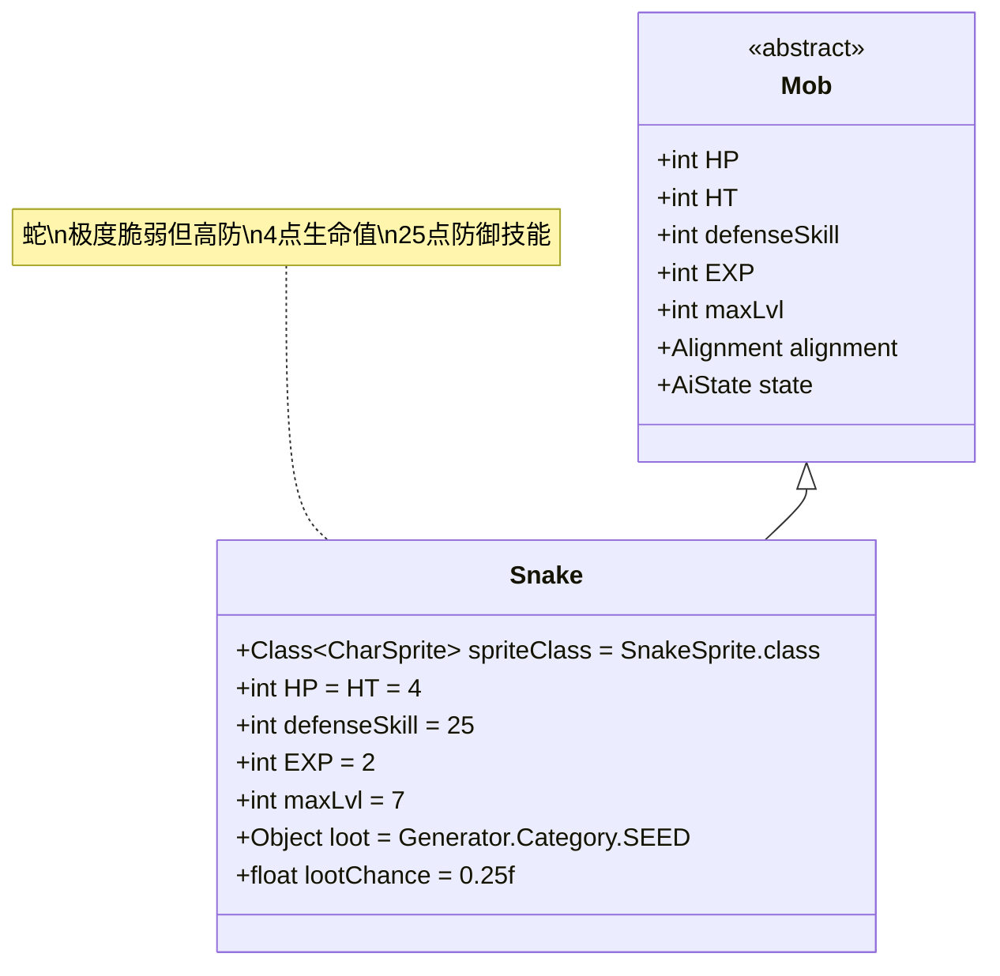

# Snake 类文档

## 1. 基本信息
| 属性 | 值 |
|------|-----|
| 文件路径 | core/src/main/java/com/shatteredpixel/shatteredpixeldungeon/actors/mobs/Snake.java |
| 包名 | com.shatteredpixel.shatteredpixeldungeon.actors.mobs |
| 类类型 | public class |
| 继承关系 | extends Mob |
| 代码行数 | 72行 |

## 2. 类职责说明
Snake（蛇）是一种极其脆弱但防御能力异常高的早期敌人。它只有4点生命值，但拥有25点的高防御技能等级，使其很难被命中。蛇还具有特殊的教学机制，当玩家多次看到蛇成功闪避攻击时，会触发冒险者指南的相关提示。

## 4. 继承与协作关系


## 静态常量表
| 常量名 | 类型 | 值 | 说明 |
|--------|------|-----|------|
| spriteClass | Class<? extends CharSprite> | SnakeSprite.class | 怪物精灵类 |
| HP/HT | int | 4 | 生命值上限 |
| defenseSkill | int | 25 | 防御技能等级 |
| EXP | int | 2 | 击败后获得的经验值 |
| maxLvl | int | 7 | 最大生成等级 |
| loot | Object | Generator.Category.SEED | 掉落物品类型（种子） |
| lootChance | float | 0.25f | 掉落概率（25%） |

## 实例字段表
| 字段名 | 类型 | 修饰符 | 说明 |
|--------|------|--------|------|
| dodges | int | private static | 全局计数器，记录蛇的闪避次数 |

## 7. 方法详解

### 构造函数块 {}
**功能**: 初始化Snake的基本属性
**实现逻辑**:
- 设置spriteClass为SnakeSprite.class（第36行）
- 设置HP和HT为4（第38行）
- 设置defenseSkill为25（第39行）
- 设置EXP为2，maxLvl为7（第41-42行）
- 设置掉落物品为种子，掉落概率25%（第44-45行）

### damageRoll()
**签名**: `public int damageRoll()`
**功能**: 计算攻击伤害范围
**返回值**: int - 伤害值（1-4之间）
**实现逻辑**: 返回Random.NormalIntRange(1, 4)（第50行）

### attackSkill(Char target)
**签名**: `public int attackSkill(Char target)`
**功能**: 计算攻击技能等级
**参数**: target - 目标角色
**返回值**: int - 攻击技能值（固定为10）
**实现逻辑**: 返回10（第55行）

### defenseVerb()
**签名**: `public String defenseVerb()`
**功能**: 处理防御行为，触发教学提示
**返回值**: String - 防御动作描述
**实现逻辑**:
1. 如果蛇在英雄视野内，增加dodges计数器（第62-64行）
2. 检查是否满足教学提示条件：
   - 条件1: dodges >= 2 且未阅读过"惊喜攻击"指南页面（第65行）
   - 条件2: dodges >= 4 且未解锁第一个Boss击败徽章（第66行）
3. 如果满足任一条件，触发冒险者指南提示并重置计数器（第67-68行）
4. 调用父类defenseVerb方法（第70行）

## 战斗行为
- **极端属性**: 极低生命值(4)但极高防御(25)
- **低威胁**: 攻击伤害仅1-4，攻击力一般(10)
- **高闪避**: 由于高防御技能，很难被玩家命中
- **早期敌人**: 只在前7层地牢生成
- **种子掉落**: 25%概率掉落随机种子

## 特殊机制
- **教学系统**: 通过多次闪避触发冒险者指南提示
- **双重条件**: 根据玩家进度提供不同级别的教学提示
- **全局计数**: dodges是静态变量，所有蛇实例共享同一个计数器
- **视野依赖**: 只有在英雄视野内才会增加闪避计数

## 11. 使用示例
```java
// 创建蛇实例
Snake snake = new Snake();

// 蛇的基础属性
int snakeHP = snake.HP; // 4
int snakeDefense = snake.defenseSkill; // 25
int snakeDamage = snake.damageRoll(); // 1-4

// 教学机制示例
// 当玩家在视野内看到蛇闪避2次（新手）或4次（有经验玩家）时：
// GameScene.flashForDocument(Document.ADVENTURERS_GUIDE, Document.GUIDE_SURPRISE_ATKS);
// 提示玩家关于惊喜攻击的教学内容

// 掉落机制
// snake.loot = Generator.Category.SEED;
// snake.lootChance = 0.25f; // 25%概率掉落种子
```

## 注意事项
1. 蛇是游戏中最脆弱的敌人之一，但也是最难命中的
2. 由于只有4点生命值，一旦命中通常能立即击杀
3. 教学机制帮助新玩家理解游戏的惊喜攻击系统
4. 种子掉落对早期玩家来说很有价值
5. 高防御技能使其成为练习精准攻击的好目标

## 最佳实践
1. 玩家应使用高命中率的武器或能力来对抗蛇
2. 利用蛇的低生命值进行快速连击训练
3. 收集种子掉落用于后期种植和合成
4. 在设计类似敌人时，可参考其极端属性对比机制
5. 教学系统的实现方式可以应用于其他游戏机制的引导