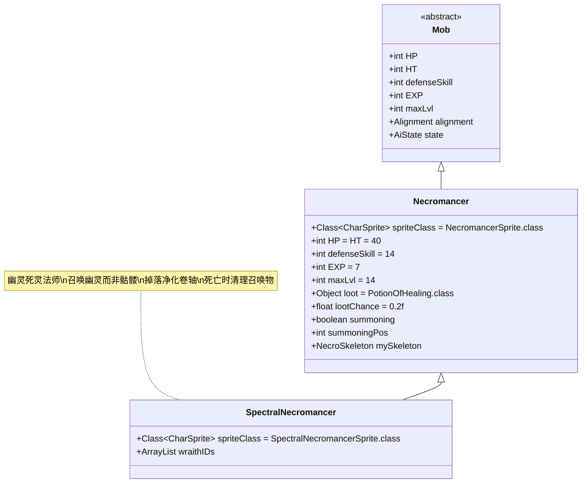

# SpectralNecromancer 类文档

## 1. 基本信息
| 属性 | 值 |
|------|-----|
| 文件路径 | core/src/main/java/com/shatteredpixel/shatteredpixeldungeon/actors/mobs/SpectralNecromancer.java |
| 包名 | com.shatteredpixel.shatteredpixeldungeon.actors.mobs |
| 类类型 | public class |
| 继承关系 | extends Necromancer |
| 代码行数 | 165行 |

## 2. 类职责说明
SpectralNecromancer（幽灵死灵法师）是Necromancer（死灵法师）的强化变种，具有召唤幽灵(Wraith)而非骷髅的能力。它继承了死灵法师的核心机制，但召唤的幽灵更加强大且具有隐形能力。幽灵死灵法师还会掉落净化卷轴，并在死亡时杀死所有由其召唤的幽灵。

## 4. 继承与协作关系


## 静态常量表
| 常量名 | 类型 | 值 | 说明 |
|--------|------|-----|------|
| spriteClass | Class<? extends CharSprite> | SpectralNecromancerSprite.class | 怪物精灵类 |

## 实例字段表
| 字段名 | 类型 | 修饰符 | 说明 |
|--------|------|--------|------|
| wraithIDs | ArrayList<Integer> | private | 存储所有召唤的幽灵ID列表 |

## 属性标记
SpectralNecromancer继承自Necromancer，具有以下特殊属性：
- **UNDEAD**: 不死族

## 7. 方法详解

### 构造函数块 {}
**功能**: 初始化SpectralNecromancer的基本属性
**实现逻辑**: 设置spriteClass为SpectralNecromancerSprite.class（第43行）

### act()
**签名**: `protected boolean act()`
**功能**: 每回合行为处理，取消非狩猎状态下的召唤
**返回值**: boolean - 调用父类act()的结果
**实现逻辑**:
- 如果处于召唤状态但不在狩猎状态，取消召唤并调用精灵的cancelSummoning方法（第49-55行）
- 调用父类act()方法（第56行）

### rollToDropLoot()
**签名**: `public void rollToDropLoot()`
**功能**: 处理掉落物品，额外掉落净化卷轴
**实现逻辑**:
1. 如果英雄等级超过maxLvl+2，不掉落任何物品（第61-62行）
2. 调用父类rollToDropLoot()处理常规掉落（第63行）
3. 在相邻的随机位置掉落一个净化卷轴(ScrollOfRemoveCurse)（第65-69行）

### die(Object cause)
**签名**: `public void die(Object cause)`
**功能**: 死亡处理，杀死所有召唤的幽灵
**参数**: cause - 死亡原因
**实现逻辑**:
1. 遍历wraithIDs列表中的所有幽灵ID（第74行）
2. 对每个存活且同阵营的幽灵调用die(null)方法（第75-78行）
3. 调用父类die方法（第81行）

### storeInBundle(Bundle bundle) 和 restoreFromBundle(Bundle bundle)
**功能**: 保存和恢复状态
**实现逻辑**:
- 保存时：将wraithIDs转换为整数数组并存入bundle（第87-91行）
- 恢复时：从bundle中读取整数数组并重建wraithIDs列表（第94-100行）

### summonMinion()
**签名**: `public void summonMinion()`
**功能**: 召唤幽灵替代骷髅，重写父类方法
**实现逻辑**:
1. **位置冲突处理**: 如果召唤位置被占用：
   - 尝试推动阻挡角色到相邻空位（第107-115行）
   - 如果无法推动，对阻挡者造成2-10点伤害（第132-140行）
   - 如果角色不可移动，则取消推动（第118-120行）
2. **召唤幽灵**: 
   - 使用Wraith.spawnAt()在指定位置生成幽灵（第149行）
   - 调整幽灵属性(+4级)（第154行）
   - 完成召唤动画（第156行）
3. **状态同步**: 
   - 将幽灵ID添加到wraithIDs列表（第163行）
   - 复制死灵法师身上的持久性Buff到幽灵（第158-162行）

## 继承的核心机制（来自Necromancer类）

### 基础属性
- **生命值**: HP = HT = 40
- **防御技能**: defenseSkill = 14
- **经验值**: EXP = 7
- **最大等级**: maxLvl = 14
- **掉落物品**: 治疗药水，基础掉落概率20%
- **不死族**: 具有UNDEAD属性

### 召唤系统
- **远程召唤**: 在敌人周围8格内选择最佳位置召唤
- **智能推动**: 自动推动阻挡召唤位置的角色
- **范围限制**: 只能在距离敌人≤4格时进行召唤
- **冷却时间**: 首次召唤1回合，后续召唤2回合

### 骨骼控制
- **治疗支援**: 对受伤的召唤物发射治疗射线
- **加速支援**: 对满血召唤物施加激素涌动Buff
- **传送支援**: 当召唤物无法有效攻击敌人时，将其传送到敌人附近

## 战斗行为
- **远程支援**: 完全无法近战攻击(canAttack返回false)
- **召唤优先**: 优先召唤幽灵而非直接战斗
- **支援治疗**: 定期治疗或强化召唤的幽灵
- **智能传送**: 根据战场情况传送幽灵到最佳位置
- **等级优势**: 召唤的幽灵比普通幽灵强4级

## 特殊机制
- **净化卷轴掉落**: 固定掉落净化卷轴，不受等级限制影响
- **召唤物管理**: 精确跟踪和管理所有召唤的幽灵
- **死亡清理**: 死亡时自动清理所有召唤物，避免遗留
- **Buff继承**: 召唤物继承死灵法师的持久性Buff
- **等级限制**: 英雄等级过高时不会掉落任何物品

## 11. 使用示例
```java
// 创建幽灵死灵法师实例
SpectralNecromancer necro = new SpectralNecromancer();

// 召唤幽灵的流程
// 1. necro.summoning = true;
// 2. necro.summoningPos = targetPosition;
// 3. necro.sprite.zap(summoningPos); // 显示召唤动画
// 4. necro.summonMinion(); // 实际召唤幽灵

// 掉落机制
// 当necro.die()时：
// - 在相邻位置掉落ScrollOfRemoveCurse
// - 杀死所有wraithIDs中的幽灵

// 幽灵属性调整
Wraith wraith = Wraith.spawnAt(position, Wraith.class);
wraith.adjustStats(4); // 幽灵比普通强4级
```

## 注意事项
1. 幽灵死灵法师完全依赖召唤物战斗，本身无法攻击
2. 净化卷轴的掉落位置是随机相邻格子，可能被障碍物阻挡
3. 幽灵具有隐形能力，比骷髅更难以应对
4. 英雄等级超过16级(necro.maxLvl+2)时不会掉落任何物品
5. 召唤的幽灵会继承死灵法师的某些Buff效果

## 最佳实践
1. 玩家应优先击杀死灵法师以防止其召唤更多幽灵
2. 利用净化卷轴掉落作为获取该稀有物品的途径
3. 注意幽灵的隐形特性，准备相应的探测手段
4. 在设计类似Boss时，可参考其召唤物管理和支援机制
5. 平衡召唤物强度与主怪威胁度的关系