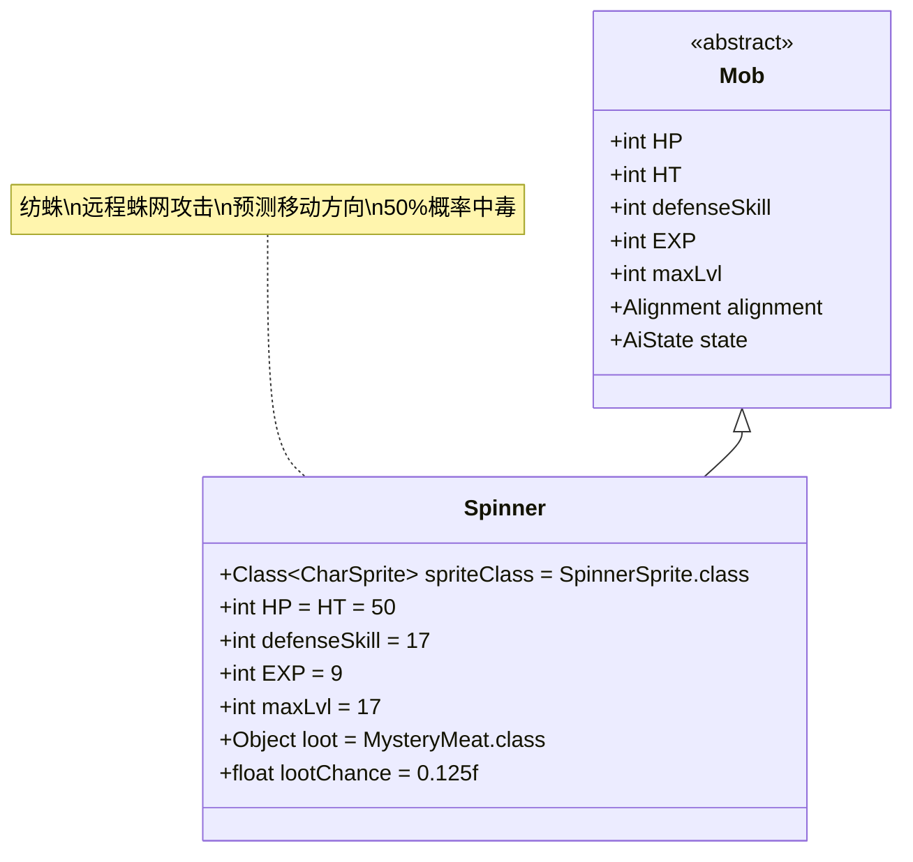

# Spinner 类文档

## 1. 基本信息
| 属性 | 值 |
|------|-----|
| 文件路径 | core/src/main/java/com/shatteredpixel/shatteredpixeldungeon/actors/mobs/Spinner.java |
| 包名 | com.shatteredpixel.shatteredpixeldungeon.actors.mobs |
| 类类型 | public class |
| 继承关系 | extends Mob |
| 代码行数 | 274行 |

## 2. 类职责说明
Spinner（纺蛛）是一种具有远程蛛网攻击能力的敌人，能够预测敌人的移动方向并精准射击蛛网。它会在攻击时有50%概率施加中毒效果，并立即切换到逃跑状态。纺蛛还能抵抗毒系伤害并对蛛网免疫，使其在特定环境中更具威胁性。

## 4. 继承与协作关系


## 静态常量表
| 常量名 | 类型 | 值 | 说明 |
|--------|------|-----|------|
| spriteClass | Class<? extends CharSprite> | SpinnerSprite.class | 怪物精灵类 |
| HP/HT | int | 50 | 生命值上限 |
| defenseSkill | int | 17 | 防御技能等级 |
| EXP | int | 9 | 击败后获得的经验值 |
| maxLvl | int | 17 | 最大生成等级 |
| loot | Object | MysteryMeat.class | 掉落物品类型（神秘肉） |
| lootChance | float | 0.125f | 掉落概率（12.5%） |

## 实例字段表
| 字段名 | 类型 | 修饰符 | 说明 |
|--------|------|--------|------|
| webCoolDown | int | private | 蛛网攻击冷却时间 |
| lastEnemyPos | int | private | 敌人上一次的位置 |
| shotWebVisually | boolean | private | 是否已进行视觉上的蛛网射击 |

## 7. 方法详解

### 构造函数块 {}
**功能**: 初始化Spinner的基本属性
**实现逻辑**:
- 设置spriteClass为SpinnerSprite.class（第44行）
- 设置HP和HT为50（第46行）
- 设置defenseSkill为17（第47行）
- 设置EXP为9，maxLvl为17（第49-50行）
- 设置掉落物品为神秘肉，掉落概率12.5%（第52-53行）
- 重写HUNTING和FLEEING状态为自定义类（第55-56行）

### damageRoll()
**签名**: `public int damageRoll()`
**功能**: 计算攻击伤害范围
**返回值**: int - 伤害值（10-20之间）
**实现逻辑**: 返回Random.NormalIntRange(10, 20)（第61行）

### attackSkill(Char target)
**签名**: `public int attackSkill(Char target)`
**功能**: 计算攻击技能等级
**参数**: target - 目标角色
**返回值**: int - 攻击技能值（固定为22）
**实现逻辑**: 返回22（第66行）

### drRoll()
**签名**: `public int drRoll()`
**功能**: 计算伤害减免
**返回值**: int - 伤害减免值（0-6之间）
**实现逻辑**: 返回super.drRoll() + Random.NormalIntRange(0, 6)（第71行）

### act()
**签名**: `protected boolean act()`
**功能**: 每回合行为处理，管理蛛网冷却和位置追踪
**返回值**: boolean - 调用父类act()的结果
**实现逻辑**:
1. 如果处于狩猎或逃跑状态，减少蛛网冷却时间（第96-98行）
2. 调用父类act()方法（第101行）
3. 更新lastEnemyPos为当前敌人或英雄位置（第105-114行）
4. 重置shotWebVisually标志（第113行）

### attackProc(Char enemy, int damage)
**签名**: `public int attackProc(Char enemy, int damage)`
**功能**: 攻击后处理，施加中毒效果并切换状态
**参数**: 
- enemy - 目标敌人
- damage - 造成的伤害
**返回值**: int - 最终伤害值
**实现逻辑**:
1. 调用父类attackProc（第121行）
2. 50%概率对目标施加7-8回合的中毒效果（受升天挑战修正）（第122-126行）
3. 重置蛛网冷却时间为0（第127行）
4. 切换到逃跑状态（第128行）

### webPos()
**签名**: `public int webPos()`
**功能**: 计算蛛网射击的目标位置
**返回值**: int - 蛛网位置（-1表示无效）
**实现逻辑**:
1. **特殊情况处理**: 如果敌人静止且可攻击，不发射蛛网（第142-143行）
2. **方向预测**:
   - 如果敌人静止，向敌人与自身连线方向射击（第149行）
   - 如果敌人移动，向敌人移动方向射击（第151行）
3. **路径计算**: 使用Ballistica找到敌人路径上的下一个格子（第154-167行）
4. **验证检查**: 确保射击路径无障碍且目标格子可通行（第170-176行）

### shootWeb()
**签名**: `public void shootWeb()`
**功能**: 执行蛛网射击
**实现逻辑**:
1. 获取蛛网目标位置（第181行）
2. **三格扩散**: 在目标位置及其左右相邻位置放置蛛网（第191-196行）
3. 设置蛛网冷却时间为10回合（第198行）
4. 中断英雄行动（如果在视野内）（第200-202行）
5. 切换到下一回合（第204行）

### applyWebToCell(int cell)
**签名**: `protected void applyWebToCell(int cell)`
**功能**: 在指定格子应用蛛网效果
**参数**: cell - 目标格子
**实现逻辑**: 在格子中添加持续20回合的Web Blob（第208行）

### 辅助方法
- **left(int direction)**: 返回左侧方向索引（第211-213行）
- **right(int direction)**: 返回右侧方向索引（第215-217行）

### Hunting (内部类)
**功能**: 自定义狩猎AI状态
**核心逻辑**:
- 当满足条件时（webCoolDown ≤ 0且有有效目标位置），执行蛛网攻击（第231-241行）
- 蛛网攻击会显示zap动画并设置shotWebVisually标志（第234-236行）

### Fleeing (内部类)
**功能**: 自定义逃跑AI状态
**核心逻辑**:
- **状态切换**: 当敌人没有中毒且自身没有恐惧效果时，切换回狩猎状态（第252-255行）
- **持续攻击**: 即使在逃跑状态，仍会尝试蛛网攻击（第258-270行）

### 抗性和免疫
- **毒抗**: 添加Poison.class到resistances列表（第220行）
- **蛛网免疫**: 添加Web.class到immunities列表（第224行）

## 战斗行为
- **远程攻击**: 能够预测敌人移动方向并精准射击蛛网
- **中毒机制**: 50%概率在近战攻击时施加中毒效果
- **状态切换**: 中毒攻击后立即切换到逃跑状态
- **智能预测**: 根据敌人移动轨迹调整蛛网射击方向
- **三格覆盖**: 蛛网攻击覆盖三个相邻格子，增加命中率

## 特殊机制
- **冷却管理**: 蛛网攻击有10回合冷却时间
- **升天兼容**: 中毒持续时间受AscensionChallenge.statModifier修正
- **视觉效果**: 蛛网射击有专门的zap动画
- **中断效果**: 蛛网攻击会中断英雄的当前行动
- **位置追踪**: 精确追踪敌人位置变化以优化攻击预测

## 11. 使用示例
```java
// 创建纺蛛实例
Spinner spinner = new Spinner();

// 蛛网攻击计算示例
int webTarget = spinner.webPos();
// 如果敌人从A移动到B，webTarget通常是B的前方格子
// 如果敌人静止，webTarget是敌人远离纺蛛的方向

// 蛛网射击示例
spinner.shootWeb();
// 在webTarget及其左右相邻位置放置Web Blob
// webCoolDown = 10;

// 中毒攻击示例
// spinner.attackProc(enemy, damage);
// 50%概率：Buff.affect(enemy, Poison.class).set(duration);
// spinner.state = FLEEING;
```

## 注意事项
1. 纺蛛的蛛网攻击需要精确的路径计算，确保不会穿墙
2. 中毒效果的持续时间受升天挑战影响，但只应用一半的修正系数
3. 跑状态下的纺蛛仍能进行远程攻击，增加了战斗难度
4. 由于对蛛网免疫，纺蛛可以在自己的蛛网中自由移动
5. 神秘肉掉落对早期玩家来说很有价值

## 最佳实践
1. 玩家应避免直线移动，以减少被蛛网命中的概率
2. 利用障碍物阻挡纺蛛的视线和攻击路径
3. 准备解毒手段应对50%的中毒概率
4. 在设计类似敌人时，可参考其移动预测和三格扩散机制
5. 平衡远程攻击频率与冷却时间的关系