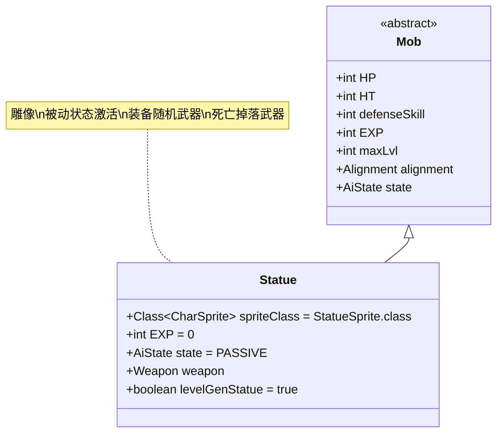

# Statue 类文档

## 1. 基本信息
| 属性 | 值 |
|------|-----|
| 文件路径 | core/src/main/java/com/shatteredpixel/shatteredpixeldungeon/actors/mobs/Statue.java |
| 包名 | com.shatteredpixel.shatteredpixeldungeon.actors.mobs |
| 类类型 | public class |
| 继承关系 | extends Mob |
| 代码行数 | 215行 |

## 2. 类职责说明
Statue（雕像）是一种特殊的敌人，初始处于被动状态，只有在受到伤害或负面效果时才会激活。每个雕像都装备有一把随机的近战武器，这把武器决定了雕像的攻击方式、伤害和特殊能力。雕像死亡时会掉落其装备的武器，使其成为获取强力装备的重要来源。

## 4. 继承与协作关系


## 静态常量表
| 常量名 | 类型 | 值 | 说明 |
|--------|------|-----|------|
| spriteClass | Class<? extends CharSprite> | StatueSprite.class | 怪物精灵类 |
| EXP | int | 0 | 击败后获得的经验值（不提供经验） |
| state | AiState | PASSIVE | 初始状态（被动） |

## 实例字段表
| 字段名 | 类型 | 修饰符 | 说明 |
|--------|------|--------|------|
| weapon | Weapon | protected | 雕像装备的近战武器 |
| levelGenStatue | boolean | public | 是否为关卡生成的雕像 |

## 属性标记
Statue具有以下特殊属性：
- **INORGANIC**: 无机物

## 7. 方法详解

### 构造函数 Statue()
**功能**: 初始化Statue的基本属性
**实现逻辑**:
- 设置HP和HT为15 + Dungeon.depth * 5（第58行）
- 设置defenseSkill为4 + Dungeon.depth（第59行）

### createWeapon(boolean useDecks)
**签名**: `public void createWeapon(boolean useDecks)`
**功能**: 为雕像创建随机武器
**参数**: useDecks - 是否使用牌组系统
**实现逻辑**:
1. 根据useDecks参数选择武器生成方式（第64-67行）
2. 设置levelGenStatue标志（第68行）
3. 移除武器的诅咒状态（第69行）
4. 随机附魔武器（第70行）

### weapon()
**签名**: `public Weapon weapon()`
**功能**: 获取雕像的武器
**返回值**: Weapon - 雕像装备的武器
**实现逻辑**: 返回weapon字段（第74行）

### damageRoll()
**签名**: `public int damageRoll()`
**功能**: 计算攻击伤害范围
**返回值**: int - 伤害值
**实现逻辑**: 委托给武器的damageRoll方法（第93行）

### attackSkill(Char target)
**签名**: `public int attackSkill(Char target)`
**功能**: 计算攻击技能等级
**参数**: target - 目标角色
**返回值**: int - 攻击技能值
**实现逻辑**: 
- 基础值：9 + Dungeon.depth
- 乘以武器的准确度因子（第98行）

### attackDelay()
**签名**: `public float attackDelay()`
**功能**: 计算攻击延迟
**返回值**: float - 攻击延迟时间
**实现逻辑**: 父类延迟乘以武器的延迟因子（第103行）

### canAttack(Char enemy)
**签名**: `protected boolean canAttack(Char enemy)`
**功能**: 判断是否可以攻击目标
**参数**: enemy - 目标敌人
**返回值**: boolean - 是否可以攻击
**实现逻辑**: 检查标准攻击范围或武器的攻击范围（第108行）

### drRoll()
**签名**: `public int drRoll()`
**功能**: 计算伤害减免
**返回值**: int - 伤害减免值
**实现逻辑**: 父类减免 + 地牢深度 + 武器防御因子（第113行）

### add(Buff buff)
**签名**: `public boolean add(Buff buff)`
**功能**: 添加增益/减益效果，处理状态激活
**参数**: buff - 要添加的效果
**返回值**: boolean - 是否成功添加
**实现逻辑**:
- 如果是负面效果且当前为被动状态，切换到狩猎状态（第119-121行）

### damage(int dmg, Object src)
**签名**: `public void damage(int dmg, Object src)`
**功能**: 处理受到的伤害，激活雕像
**参数**: 
- dmg - 伤害值
- src - 伤害来源
**实现逻辑**: 如果处于被动状态，切换到狩猎状态（第130-132行）

### attackProc(Char enemy, int damage)
**签名**: `public int attackProc(Char enemy, int damage)`
**功能**: 攻击后处理，应用武器特效
**参数**: 
- enemy - 目标敌人
- damage - 造成的伤害
**返回值**: int - 最终伤害值
**实现逻辑**:
1. 调用父类attackProc（第139行）
2. 应用武器的proc效果（第140行）
3. 如果杀死英雄，记录失败并显示消息（第141-144行）

### beckon(int cell)
**签名**: `public void beckon(int cell)`
**功能**: 处理召唤行为
**参数**: cell - 目标位置
**实现逻辑**: 只有在非被动状态下才响应召唤（第150-152行）

### die(Object cause)
**签名**: `public void die(Object cause)`
**功能**: 死亡处理，掉落武器
**参数**: cause - 死亡原因
**实现逻辑**:
1. 识别武器（第157行）
2. 在当前位置掉落武器（第158行）
3. 调用父类die方法（第159行）

### landmark()
**签名**: `public Notes.Landmark landmark()`
**功能**: 获取地标标识
**返回值**: Notes.Landmark - 地标（如果是关卡生成的雕像）
**实现逻辑**: 如果是关卡生成的雕像，返回STATUE地标（第164行）

### destroy()
**签名**: `public void destroy()`
**功能**: 销毁处理，移除地标
**实现逻辑**: 如果有地标，从笔记中移除（第169-171行）

### spawningWeight()
**签名**: `public float spawningWeight()`
**功能**: 获取生成权重
**返回值**: float - 生成权重（始终为0）
**说明**: 雕像不会通过常规方式生成（第177行）

### reset()
**签名**: `public boolean reset()`
**功能**: 重置状态
**返回值**: boolean - 始终返回true
**说明**: 雕像不需要特殊重置逻辑（第182行）

### description()
**签名**: `public String description()`
**功能**: 获取描述文本
**返回值**: String - 完整描述
**实现逻辑**: 在基础描述后追加武器描述（第187-191行）

### 随机生成方法
- **random()**: 创建使用牌组系统的随机雕像（第198-200行）
- **random(boolean useDecks)**: 创建指定生成方式的随机雕像，有小概率生成装甲雕像变种（第202-213行）

### 抗性
- **Grim抗性**: 添加Grim.class到resistances列表（第195行）

## 战斗行为
- **被动激活**: 初始为被动状态，受到伤害或负面效果后激活
- **武器依赖**: 所有战斗属性都基于装备的武器
- **动态属性**: HP、防御、攻击等属性随地牢深度增强
- **远程可能**: 根据武器特性可能具有远程攻击能力
- **无经验**: 击败后不提供任何经验值

## 特殊机制
- **武器掉落**: 死亡时必定掉落装备的武器
- **地标系统**: 关卡生成的雕像会在地图上标记为地标
- **变种生成**: 有小概率生成装甲雕像(ArmoredStatue)变种
- **附魔系统**: 武器带有随机附魔效果
- **无诅咒**: 雕像的武器永远不会被诅咒

## 11. 使用示例
```java
// 创建随机雕像
Statue statue = Statue.random();

// 雕像的基础属性（取决于地牢深度）
int currentDepth = Dungeon.depth;
int statueHP = 15 + currentDepth * 5;
int statueDefense = 4 + currentDepth;

// 武器相关属性
Weapon statueWeapon = statue.weapon();
int damage = statue.damageRoll(); // 基于武器的伤害
int attackSkill = statue.attackSkill(target); // 基于武器准确度

// 被动激活示例
// 当statue受到伤害时：
// statue.state 从 PASSIVE 变为 HUNTING
// 开始主动攻击玩家

// 死亡掉落
// statue.die(cause);
// weapon.identify(false);
// Dungeon.level.drop(weapon, pos);
```

## 注意事项
1. 雕像只会在特定位置生成，不会随机出现在地牢中
2. 武器的属性完全决定了雕像的战斗能力
3. 由于没有经验奖励，主要价值在于武器掉落
4. 被动状态下的雕像不会主动攻击，但也不能被忽视
5. 地标系统帮助玩家识别重要的雕像位置

## 最佳实践
1. 玩家应小心接近雕像，避免意外激活
2. 利用雕像作为获取强力武器的稳定来源
3. 准备足够的伤害来快速击杀激活的雕像
4. 在设计类似机制时，可参考其被动激活和武器绑定系统
5. 平衡武器掉落的价值与战斗难度的关系