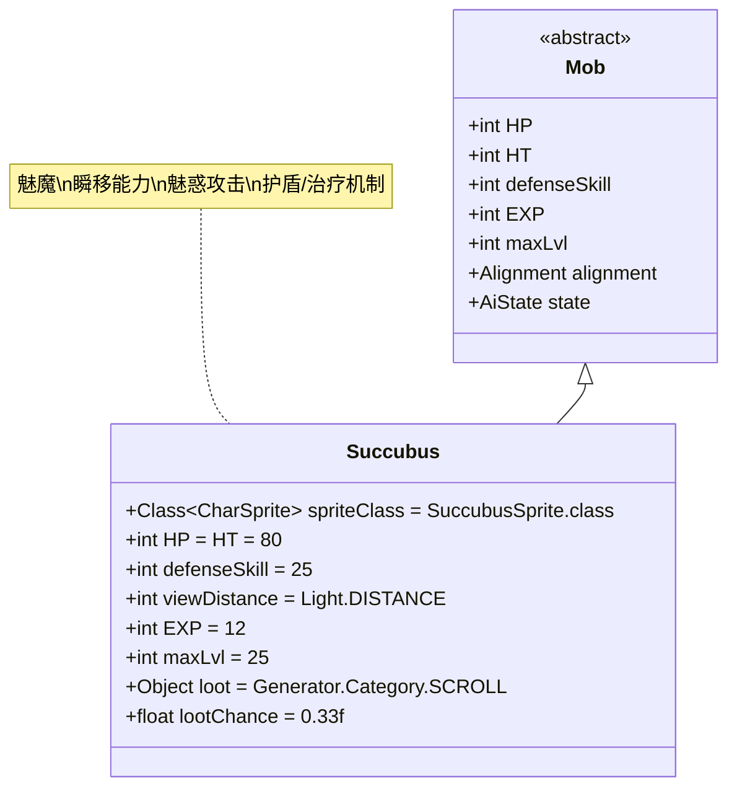

# Succubus 类文档

## 1. 基本信息
| 属性 | 值 |
|------|-----|
| 文件路径 | core/src/main/java/com/shatteredpixel/shatteredpixeldungeon/actors/mobs/Succubus.java |
| 包名 | com.shatteredpixel.shatteredpixeldungeon.actors.mobs |
| 类类型 | public class |
| 继承关系 | extends Mob |
| 代码行数 | 199行 |

## 2. 类职责说明
Succubus（魅魔）是一种强大的恶魔类敌人，具有独特的瞬移能力和魅惑攻击机制。她能够在战斗中瞬移到目标附近，并在攻击时有33%概率施加魅惑效果。当攻击已被魅惑的目标时，魅魔会获得护盾或治疗效果，使其在持续战斗中更具威胁性。

## 4. 继承与协作关系


## 静态常量表
| 常量名 | 类型 | 值 | 说明 |
|--------|------|-----|------|
| spriteClass | Class<? extends CharSprite> | SuccubusSprite.class | 怪物精灵类 |
| HP/HT | int | 80 | 生命值上限 |
| defenseSkill | int | 25 | 防御技能等级 |
| viewDistance | int | Light.DISTANCE | 视野距离（受光照影响） |
| EXP | int | 12 | 击败后获得的经验值 |
| maxLvl | int | 25 | 最大生成等级 |
| loot | Object | Generator.Category.SCROLL | 掉落物品类型（卷轴） |
| lootChance | float | 0.33f | 掉落概率（33%） |

## 实例字段表
| 字段名 | 类型 | 修饰符 | 说明 |
|--------|------|--------|------|
| blinkCooldown | int | private | 瞬移冷却时间 |

## 属性标记
Succubus具有以下特殊属性：
- **DEMONIC**: 恶魔类

## 7. 方法详解

### 构造函数块 {}
**功能**: 初始化Succubus的基本属性
**实现逻辑**:
- 设置spriteClass为SuccubusSprite.class（第56行）
- 设置HP和HT为80（第58行）
- 设置defenseSkill为25（第59行）
- 设置viewDistance为Light.DISTANCE（第60行）
- 设置EXP为12，maxLvl为25（第62-63行）
- 设置掉落物品为卷轴，掉落概率33%（第65-66行）
- 添加DEMONIC属性（第68行）

### damageRoll()
**签名**: `public int damageRoll()`
**功能**: 计算攻击伤害范围
**返回值**: int - 伤害值（25-30之间）
**实现逻辑**: 返回Random.NormalIntRange(25, 30)（第73行）

### attackProc(Char enemy, int damage)
**签名**: `public int attackProc(Char enemy, int damage)`
**功能**: 攻击后处理，实现魅惑和护盾/治疗机制
**参数**: 
- enemy - 目标敌人
- damage - 造成的伤害
**返回值**: int - 最终伤害值
**实现逻辑**:
1. **已魅惑目标**: 如果目标已被魅惑（enemy.buff(Charm.class) != null）（第80行）
   - 计算护盾值：shield = (HP - HT) + (5 + damage)（第81行）
   - 如果shield > 0：
     - 恢复HP到最大值（第83行）
     - 显示治疗状态（如果需要）（第84-86行）
     - 应用护盾效果（第88-89行）
   - 否则：直接恢复5 + damage点HP（第91-92行）
   - 播放魅惑音效（第94-96行）
2. **未魅惑目标**: 33%概率施加魅惑效果（第97-105行）
   - 魅惑持续时间为正常的一半（Charm.DURATION/2f）（第98行）
   - 设置ignoreNextHit标志以忽略魅惑的负面效果（第100行）
   - 显示爱心特效和播放音效（第102-104行）

### getCloser(int target)
**签名**: `protected boolean getCloser(int target)`
**功能**: 移动处理，实现瞬移机制
**参数**: target - 目标位置
**返回值**: boolean - 是否成功移动
**实现逻辑**:
1. **瞬移条件检查**（第112行）：
   - 目标在视野内
   - 距离目标超过2格
   - 瞬移冷却结束
   - 未被根植
2. **执行瞬移**: 调用blink方法并减少回合时间（第114-119行）
3. **普通移动**: 减少冷却时间并调用父类方法（第123-124行）

### blink(int target)
**签名**: `private boolean blink(int target)`
**功能**: 执行瞬移操作
**参数**: target - 目标位置
**返回值**: boolean - 是否成功瞬移
**实现逻辑**:
1. 使用Ballistica计算到目标的直线路径（第131-132行）
2. **障碍处理**:
   - 如果目标位置有其他角色，向后退一格（第135-136行）
   - 如果目标位置不可通行，尝试相邻的8个格子（第138-153行）
   - 如果没有有效位置，设置冷却时间并返回false（第151-153行）
3. 执行瞬移并设置4-6回合的冷却时间（第156-159行）

### attackSkill(Char target)
**签名**: `public int attackSkill(Char target)`
**功能**: 计算攻击技能等级
**参数**: target - 目标角色
**返回值**: int - 攻击技能值（固定为40）
**实现逻辑**: 返回40（第164行）

### drRoll()
**签名**: `public int drRoll()`
**功能**: 计算伤害减免
**返回值**: int - 伤害减免值（0-10之间）
**实现逻辑**: 返回super.drRoll() + Random.NormalIntRange(0, 10)（第169行）

### createLoot()
**签名**: `public Item createLoot()`
**功能**: 创建掉落物品
**返回值**: Item - 卷轴物品
**实现逻辑**:
1. 随机选择一个卷轴类型（第176行）
2. 排除鉴定卷轴和升级卷轴（第177行）
3. 使用反射创建卷轴实例（第179行）

### 免疫系统
Succubus具有对魅惑(Charm)效果的免疫能力（第183行）

### storeInBundle(Bundle bundle) 和 restoreFromBundle(Bundle bundle)
**功能**: 保存和恢复状态
**实现逻辑**: 保存/恢复blinkCooldown字段（第188-198行）

## 战斗行为
- **高属性**: 高生命值(80)、高防御(25)、高攻击(25-30伤害)
- **瞬移能力**: 能够远距离瞬移到目标附近，快速接近敌人
- **魅惑攻击**: 33%概率施加魅惑效果，使目标攻击友军
- **护盾机制**: 攻击已魅惑目标时获得护盾或治疗
- **视野限制**: 视野受光照系统影响

## 特殊机制
- **冷却管理**: 瞬移有4-6回合的冷却时间
- **护盾计算**: 护盾值基于当前HP缺口和造成的伤害
- **卷轴掉落**: 33%概率掉落随机卷轴（排除鉴定和升级卷轴）
- **音效反馈**: 魅惑效果有专门的音效和视觉特效
- **恶魔特性**: 属于恶魔类，可能对某些效果有特殊反应

## 11. 使用示例
```java
// 创建魅魔实例
Succubus succubus = new Succubus();

// 魅惑攻击示例
// succubus.attackProc(enemy, damage);
// 33%概率：Buff.affect(enemy, Charm.class, Charm.DURATION/2f);

// 护盾机制示例
// 当enemy已被魅惑时：
// int shield = (succubus.HP - 80) + (5 + damage);
// if (shield > 0) {
//     succubus.HP = 80;
//     Buff.affect(succubus, Barrier.class).setShield(shield);
// }

// 瞬移机制示例
// 当距离 > 2且冷却结束时：
// succubus.blink(target);
// succubus.spend(-1 / speed()); // 减少回合时间
```

## 注意事项
1. 魅魔的瞬移能力使其很难被风筝战术对付
2. 魅惑效果会使玩家暂时失去对角色的控制
3. 护盾机制鼓励玩家避免重复攻击已被魅惑的目标
4. 由于对魅惑免疫，魅魔不会受到自己或其他魅惑效果的影响
5. 卷轴掉落不包含最有价值的鉴定和升级卷轴

## 最佳实践
1. 玩家应准备解除魅惑的手段或快速击杀魅魔
2. 利用障碍物阻挡魅魔的瞬移路径
3. 避免在魅惑状态下与魅魔战斗
4. 在设计类似敌人时，可参考其瞬移和状态互动机制
5. 平衡高攻击力与瞬移冷却时间的关系