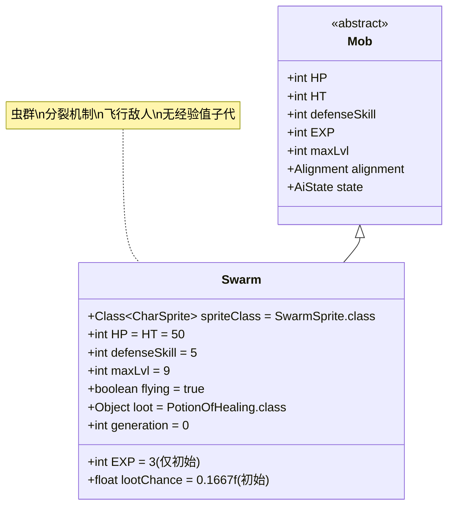

# Swarm 类文档

## 1. 基本信息
| 属性 | 值 |
|------|-----|
| 文件路径 | core/src/main/java/com/shatteredpixel/shatteredpixeldungeon/actors/mobs/Swarm.java |
| 包名 | com.shatteredpixel.shatteredpixeldungeon.actors.mobs |
| 类类型 | public class |
| 继承关系 | extends Mob |
| 代码行数 | 156行 |

## 2. 类职责说明
Swarm（虫群）是一种具有分裂能力的飞行敌人，当受到伤害且剩余生命值足够时，会分裂成两个较小的虫群。每个分裂出的虫群继承原虫群的部分状态和Buff，但不会提供经验值。虫群还会掉落治疗药水，但掉落概率会随着获得次数递减。

## 4. 继承与协作关系


## 静态常量表
| 常量名 | 类型 | 值 | 说明 |
|--------|------|-----|------|
| spriteClass | Class<? extends CharSprite> | SwarmSprite.class | 怪物精灵类 |
| HP/HT | int | 50 | 生命值上限 |
| defenseSkill | int | 5 | 防御技能等级 |
| EXP | int | 3 | 击败后获得的经验值（仅初始虫群） |
| maxLvl | int | 9 | 最大生成等级 |
| flying | boolean | true | 飞行能力 |
| loot | Object | PotionOfHealing.class | 掉落物品类型（治疗药水） |
| lootChance | float | 0.1667f | 初始掉落概率（约16.67%） |
| SPLIT_DELAY | float | 1.0f | 分裂延迟时间 |

## 实例字段表
| 字段名 | 类型 | 修饰符 | 说明 |
|--------|------|--------|------|
| generation | int | - | 虫群代数（0为初始，>0为分裂后代） |

## 7. 方法详解

### 构造函数块 {}
**功能**: 初始化Swarm的基本属性
**实现逻辑**:
- 设置spriteClass为SwarmSprite.class（第43行）
- 设置HP和HT为50（第45行）
- 设置defenseSkill为5（第46行）
- 设置EXP为3，maxLvl为9（第48-49行）
- 设置flying为true（第51行）
- 设置掉落物品为治疗药水，初始掉落概率16.67%（第53-54行）

### storeInBundle(Bundle bundle) 和 restoreFromBundle(Bundle bundle)
**功能**: 保存和恢复状态
**实现逻辑**:
- 保存时：存储generation字段（第66行）
- 恢复时：读取generation字段，如果>0则设置EXP为0（第71-73行）

### die(Object cause)
**签名**: `public void die(Object cause)`
**功能**: 死亡处理，取消飞行状态
**参数**: cause - 死亡原因
**实现逻辑**: 设置flying为false后调用父类die方法（第78-79行）

### damageRoll()
**签名**: `public int damageRoll()`
**功能**: 计算攻击伤害范围
**返回值**: int - 伤害值（1-4之间）
**实现逻辑**: 返回Random.NormalIntRange(1, 4)（第84行）

### defenseProc(Char enemy, int damage)
**签名**: `public int defenseProc(Char enemy, int damage)`
**功能**: 防御处理，实现分裂机制
**参数**: 
- enemy - 攻击者
- damage - 受到的伤害
**返回值**: int - 防御后的伤害值
**实现逻辑**:
1. **分裂条件检查**: 如果HP >= damage + 2（第90行）
2. **寻找分裂位置**: 查找相邻的4个格子中可通行且无角色的位置（第93-101行）
3. **执行分裂**:
   - 创建分裂副本clone（第105行）
   - 随机选择位置并设置为狩猎状态（第106-107行）
   - 延迟1回合添加到游戏场景（第108行）
   - 设置clone的HP为(HP - damage) / 2（第110行）
   - 显示推动动画（第111行）
   - 占据目标格子（第113行）
   - 原虫群HP减少相应值（第115行）

### attackSkill(Char target)
**签名**: `public int attackSkill(Char target)`
**功能**: 计算攻击技能等级
**参数**: target - 目标角色
**返回值**: int - 攻击技能值（固定为10）
**实现逻辑**: 返回10（第124行）

### split()
**签名**: `private Swarm split()`
**功能**: 创建分裂副本
**返回值**: Swarm - 分裂出的新虫群
**实现逻辑**:
1. 创建新的Swarm实例（第128行）
2. 设置generation为当前+1（第129行）
3. 设置EXP为0（第130行）
4. **状态继承**:
   - 如果有燃烧Buff，重新点燃（第131-132行）
   - 如果有中毒Buff，设置2回合持续时间（第134-135行）
   - 复制所有持久性Buff（第137-141行）

### lootChance() 和 createLoot()
**功能**: 处理掉落机制
**实现逻辑**:
- lootChance(): 调整掉落概率，考虑代数和已获得次数（第147-148行）
- createLoot(): 增加计数后调用父类方法（第153-155行）

## 战斗行为
- **分裂机制**: 受到伤害且HP足够时分裂成两个较小虫群
- **飞行能力**: 可以飞越障碍物和水域
- **低防御**: 防御技能只有5，容易被命中
- **低威胁**: 攻击伤害仅1-4，攻击力一般(10)
- **代数限制**: 分裂后代不再提供经验值

## 特殊机制
- **生命分配**: 分裂时生命值按(HP - damage) / 2分配
- **状态继承**: 分裂后代继承重要的Buff状态
- **延迟添加**: 分裂有1回合延迟，防止连锁反应
- **位置选择**: 智能选择相邻的最佳分裂位置
- **掉落递减**: 治疗药水掉落概率随获得次数递减

## 11. 使用示例
```java
// 创建虫群实例
Swarm swarm = new Swarm();

// 虫群的基础属性
int swarmHP = swarm.HP; // 50
int swarmDefense = swarm.defenseSkill; // 5
int swarmDamage = swarm.damageRoll(); // 1-4

// 分裂机制示例
// 当swarm受到damage伤害且swarm.HP >= damage + 2时：
// Swarm clone = swarm.split();
// clone.generation = swarm.generation + 1;
// clone.HP = (swarm.HP - damage) / 2;
// swarm.HP -= clone.HP;

// 掉落机制
// swarm.loot = PotionOfHealing.class;
// swarm.lootChance = 0.1667f * (5 - Dungeon.LimitedDrops.SWARM_HP.count) / 5f;
```

## 注意事项
1. 只有初始虫群(generation=0)会提供经验值
2. 分裂需要足够的剩余生命值(HP >= damage + 2)
3. 分裂位置必须是相邻的可通行格子
4. 燃烧和中毒状态会被正确传递给分裂后代
5. 由于飞行能力，虫群可以到达许多其他敌人无法到达的位置

## 最佳实践
1. 玩家应使用高伤害攻击快速击杀虫群，避免其分裂
2. 利用虫群的低防御属性进行精准打击
3. 收集治疗药水掉落来补充生命值
4. 在狭窄空间中小心虫群分裂，避免被包围
5. 在设计类似敌人时，可参考其分裂机制和状态继承系统