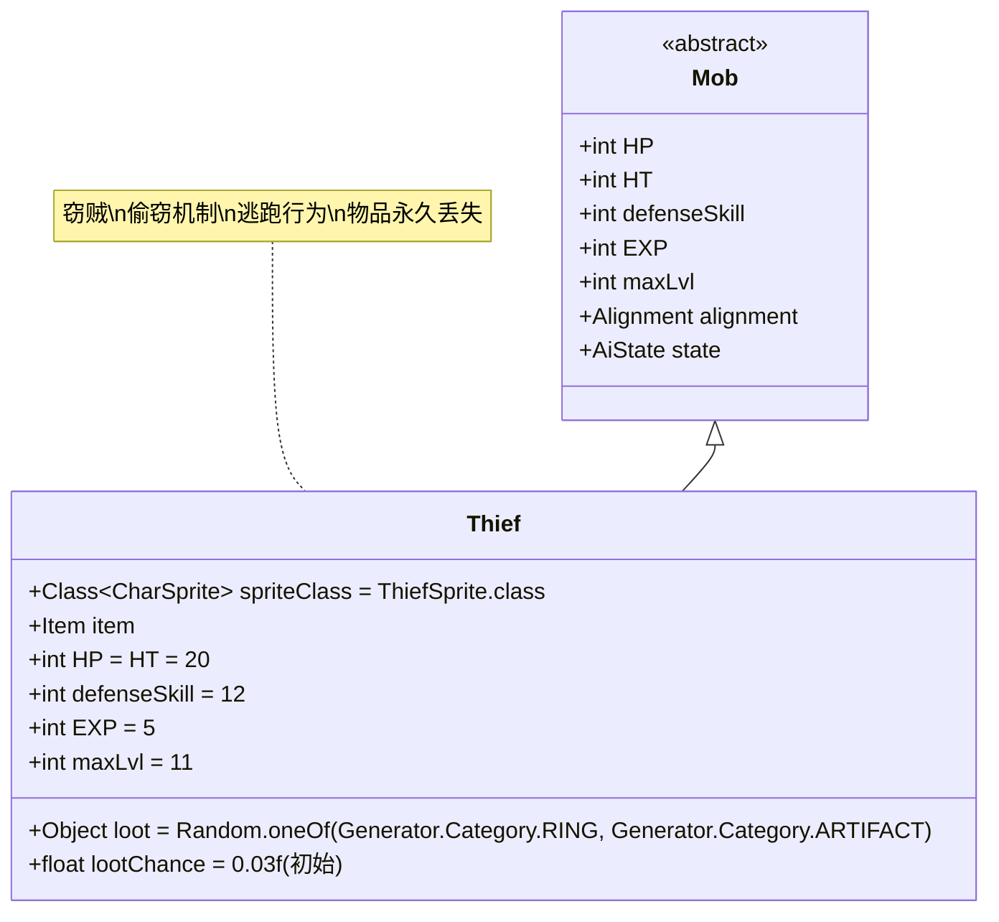

# Thief 类文档

## 1. 基本信息
| 属性 | 值 |
|------|-----|
| 文件路径 | core/src/main/java/com/shatteredpixel/shatteredpixeldungeon/actors/mobs/Thief.java |
| 包名 | com.shatteredpixel.shatteredpixeldungeon.actors.mobs |
| 类类型 | public class |
| 继承关系 | extends Mob |
| 代码行数 | 230行 |

## 2. 类职责说明
Thief（窃贼）是一种具有偷窃能力的不死族敌人，能够从英雄背包中随机偷取非唯一、未升级的物品。成功偷窃后会立即切换到逃跑状态，并在逃跑时掉落金币。如果窃贼成功逃脱，偷窃的物品将永久丢失。窃贼还会掉落戒指或神器，但掉落概率会随着获得次数递减。

## 4. 继承与协作关系


## 静态常量表
| 常量名 | 类型 | 值 | 说明 |
|--------|------|-----|------|
| spriteClass | Class<? extends CharSprite> | ThiefSprite.class | 怪物精灵类 |
| HP/HT | int | 20 | 生命值上限 |
| defenseSkill | int | 12 | 防御技能等级 |
| EXP | int | 5 | 击败后获得的经验值 |
| maxLvl | int | 11 | 最大生成等级 |
| loot | Object | Random.oneOf(RING, ARTIFACT) | 掉落物品类型（戒指或神器） |
| lootChance | float | 0.03f | 初始掉落概率（3%） |

## 实例字段表
| 字段名 | 类型 | 修饰符 | 说明 |
|--------|------|--------|------|
| item | Item | public | 偷窃获得的物品 |

## 属性标记
Thief具有以下特殊属性：
- **UNDEAD**: 不死族

## 7. 方法详解

### 构造函数块 {}
**功能**: 初始化Thief的基本属性
**实现逻辑**:
- 设置spriteClass为ThiefSprite.class（第44行）
- 设置HP和HT为20（第46行）
- 设置defenseSkill为12（第47行）
- 设置EXP为5，maxLvl为11（第49-50行）
- 设置掉落物品为随机的戒指或神器，初始掉落概率3%（第52-53行）
- 重写WANDERING和FLEEING状态为自定义类（第55-56行）
- 添加UNDEAD属性（第58行）

### storeInBundle(Bundle bundle) 和 restoreFromBundle(Bundle bundle)
**功能**: 保存和恢复状态
**实现逻辑**: 保存/恢复item字段（第64-73行）

### speed()
**签名**: `public float speed()`
**功能**: 计算移动速度
**返回值**: float - 移动速度
**实现逻辑**: 如果持有物品，速度降低到正常的5/6（第77行）

### damageRoll()
**签名**: `public int damageRoll()`
**功能**: 计算攻击伤害范围
**返回值**: int - 伤害值（1-10之间）
**实现逻辑**: 返回Random.NormalIntRange(1, 10)（第83行）

### attackDelay()
**签名**: `public float attackDelay()`
**功能**: 计算攻击延迟
**返回值**: float - 攻击延迟时间
**实现逻辑**: 返回super.attackDelay()*0.5f（第88行）

### lootChance()
**签名**: `public float lootChance()`
**功能**: 计算实际掉落概率
**返回值**: float - 调整后的掉落概率
**实现逻辑**: 每获得一个掉落，后续掉落概率变为原来的1/3（第95行）

### rollToDropLoot()
**签名**: `public void rollToDropLoot()`
**功能**: 处理掉落物品
**实现逻辑**:
- 如果持有偷窃的物品，在当前位置掉落（第100-105行）
- 特殊处理蜂蜜罐物品（第103行）
- 调用父类rollToDropLoot()处理常规掉落（第106行）

### createLoot()
**签名**: `public Item createLoot()`
**功能**: 创建掉落物品并更新计数
**返回值**: Item - 戒指或神器
**实现逻辑**: 增加Dungeon.LimitedDrops.THEIF_MISC计数后调用父类方法（第111-113行）

### attackSkill(Char target)
**签名**: `public int attackSkill(Char target)`
**功能**: 计算攻击技能等级
**参数**: target - 目标角色
**返回值**: int - 攻击技能值（固定为12）
**实现逻辑**: 返回12（第117行）

### drRoll()
**签名**: `public int drRoll()`
**功能**: 计算伤害减免
**返回值**: int - 伤害减免值（0-3之间）
**实现逻辑**: 返回super.drRoll() + Random.NormalIntRange(0, 3)（第122行）

### attackProc(Char enemy, int damage)
**签名**: `public int attackProc(Char enemy, int damage)`
**功能**: 攻击后处理，尝试偷窃
**参数**: 
- enemy - 目标敌人
- damage - 造成的伤害
**返回值**: int - 最终伤害值
**实现逻辑**:
- 如果满足偷窃条件（敌对、无持有物品、目标是英雄），尝试偷窃（第129-132行）
- 成功偷窃后切换到逃跑状态（第131行）

### defenseProc(Char enemy, int damage)
**签名**: `public int defenseProc(Char enemy, int damage)`
**功能**: 防御处理，逃跑时掉落金币
**参数**: 
- enemy - 攻击者
- damage - 受到的伤害
**返回值**: int - 防御后的伤害值
**实现逻辑**: 如果处于逃跑状态，在当前位置掉落金币（第140行）

### steal(Hero hero)
**签名**: `protected boolean steal(Hero hero)`
**功能**: 执行偷窃操作
**参数**: hero - 目标英雄
**返回值**: boolean - 是否偷窃成功
**实现逻辑**:
1. **物品选择**: 从英雄背包中随机选择未装备的物品（第148行）
2. **偷窃条件**: 
   - 物品不为null
   - 物品不是唯一的(unique)
   - 物品等级<1（未升级）（第150行）
3. **执行偷窃**:
   - 显示偷窃消息（第152行）
   - 处理快捷栏占位符（第154-156行）
   - 从背包中分离物品（第158行）
   - 特殊处理蜂蜜罐物品（第159-163行）

### description()
**签名**: `public String description()`
**功能**: 获取描述文本
**返回值**: String - 完整描述
**实现逻辑**: 在父类描述后追加持有物品的描述（第175-177行）

### Wandering (内部类)
**功能**: 自定义游荡AI状态
**核心逻辑**: 
- 如果在游荡状态下发现敌人且持有物品，立即切换到逃跑状态（第188-191行）

### Fleeing (内部类)
**功能**: 自定义逃跑AI状态
**核心逻辑**:
- **逃脱处理**: 当成功逃脱时（escaped()方法）：
  - 如果持有物品且满足距离条件，将物品永久移除并显示逃脱消息（第200-223行）
  - 否则只切换回游荡状态（第226行）
- **传送机制**: 成功逃脱的窃贼会被传送到随机位置（第207-218行）

## 战斗行为
- **偷窃机制**: 随机偷取英雄背包中的非唯一、未升级物品
- **逃跑行为**: 成功偷窃后立即切换到逃跑状态
- **速度惩罚**: 持有物品时移动速度降低
- **快速攻击**: 攻击延迟只有正常的一半
- **金币掉落**: 逃跑时受到攻击会掉落金币

## 特殊机制
- **物品永久丢失**: 如果窃贼成功逃脱，偷窃的物品将永久丢失
- **蜂蜜罐处理**: 正确处理蜂蜜罐及其破碎状态
- **掉落递减**: 戒指/神器掉落概率随获得次数指数级递减
- **快捷栏管理**: 偷窃后正确更新快捷栏占位符
- **传送逃脱**: 成功逃脱时使用复杂的传送算法

## 11. 使用示例
```java
// 创建窃贼实例
Thief thief = new Thief();

// 窃贼的基础属性
int thiefHP = thief.HP; // 20
int thiefDamage = thief.damageRoll(); // 1-10

// 偷窃机制示例
// thief.attackProc(hero, damage);
// if (thief.steal(hero)) {
//     thief.state = FLEEING;
// }

// 逃脱机制示例
// 当thief处于FLEEING状态并成功逃脱时：
// if (thief.item != null) {
//     GLog.n(Messages.get(Thief.class, "escapes", thief.item.name()));
//     thief.item = null; // 物品永久丢失
// }

// 掉落概率计算
// 第1次: 3%
// 第2次: 1%  
// 第3次: 0.33%
// 第4次: 0.11%
```

## 注意事项
1. 窃贼只能偷取非唯一且未升级的物品
2. 成功逃脱会导致物品永久丢失，无法找回
3. 蜂蜜罐类物品有特殊的处理逻辑
4. 逃跑时的金币掉落是固定的一枚金币
5. 由于是不死族，可能对某些神圣或治疗效果有特殊反应

## 最佳实践
1. 玩家应优先击杀窃贼以防止物品丢失
2. 避免携带过多非必要的低等级物品
3. 利用窃贼的低生命值进行快速连击
4. 在设计类似敌人时，可参考其偷窃和逃脱机制
5. 平衡偷窃成功率与玩家损失的关系