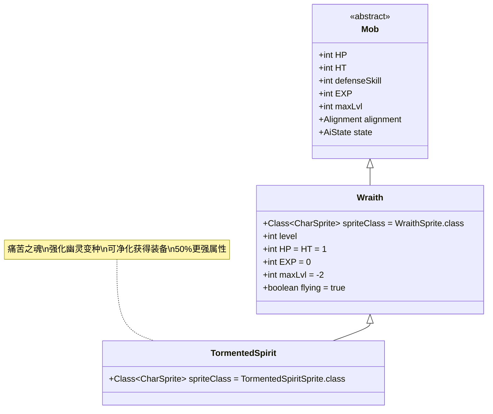

# TormentedSpirit 类文档

## 1. 基本信息
| 属性 | 值 |
|------|-----|
| 文件路径 | core/src/main/java/com/shatteredpixel/shatteredpixeldungeon/actors/mobs/TormentedSpirit.java |
| 包名 | com.shatteredpixel.shatteredpixeldungeon.actors.mobs |
| 类类型 | public class |
| 继承关系 | extends Wraith |
| 代码行数 | 86行 |

## 2. 类职责说明
TormentedSpirit（痛苦之魂）是Wraith（幽灵）的强化变种，具有更强的伤害和攻击能力。与普通幽灵不同，痛苦之魂可以通过特定方式被净化，净化后会掉落一件强力的装备（武器或护甲），并且装备必定未被诅咒且带有附魔。痛苦之魂主要通过特殊的生成机制出现，而不是自然生成。

## 4. 继承与协作关系


## 静态常量表
| 常量名 | 类型 | 值 | 说明 |
|--------|------|-----|------|
| spriteClass | Class<? extends CharSprite> | TormentedSpiritSprite.class | 怪物精灵类 |

## 实例字段表
| 字段名 | 类型 | 修饰符 | 说明 |
|--------|------|--------|------|
| (继承自Wraith) | | | |
| level | int | protected | 幽灵等级，影响所有战斗属性 |

## 属性标记
TormentedSpirit继承自Wraith，具有以下特殊属性：
- **UNDEAD**: 不死族
- **INORGANIC**: 无机物
- **flying**: 飞行能力

## 7. 方法详解

### 构造函数块 {}
**功能**: 初始化TormentedSpirit的基本属性
**实现逻辑**: 设置spriteClass为TormentedSpiritSprite.class（第41行）

### damageRoll()
**签名**: `public int damageRoll()`
**功能**: 计算攻击伤害范围（强化版）
**返回值**: int - 伤害值
**实现逻辑**: 
- 返回Random.NormalIntRange(1 + Math.round(1.5f*level)/2, 2 + Math.round(1.5f*level))（第46行）
- **对比普通幽灵**: 比普通幽灵高50%的伤害成长（普通: level/2 → 2+level）

### attackSkill(Char target)
**签名**: `public int attackSkill(Char target)`
**功能**: 计算攻击技能等级（强化版）
**参数**: target - 目标角色
**返回值**: int - 攻击技能值
**实现逻辑**: 返回10 + Math.round(1.5f*level)（第53行）
- **对比普通幽灵**: 比普通幽灵高50%的准确度成长（普通: 10+level）

### cleanse()
**签名**: `public void cleanse()`
**功能**: 净化痛苦之魂，获得奖励装备
**实现逻辑**:
1. **音效和消息**: 播放鬼魂音效并显示感谢消息（第57-58行）
2. **装备生成**:
   - 50%概率生成武器，50%概率生成护甲（第62-67行）
   - 装备必定未被诅咒且已识别（第69-70行）
   - 装备必定带有附魔（武器）或铭文（护甲）（第64, 67行）
   - 50%概率将0级装备升级到+1（第72-74行）
3. **掉落处理**: 在当前位置掉落装备（第76行）
4. **死亡动画**:
   - 销毁实体并播放死亡动画（第78-79行）
   - 恢复正常色调（第80行）
   - 显示光柱和光芒特效（第81-82行）

## 继承的核心机制（来自Wraith类）

### 基础属性
- **生命值**: HP = HT = 1（极其脆弱）
- **经验值**: EXP = 0（不提供经验）
- **最大等级**: maxLvl = -2（特殊生成）
- **飞行能力**: 可以飞越障碍物
- **不死特性**: 具有UNDEAD和INORGANIC属性

### 等级系统
- **动态调整**: adjustStats(level)方法根据等级调整所有属性（第85-89行）
- **防御计算**: defenseSkill = attackSkill(null) * 5（极高防御）
- **视野**: enemySeen = true（始终能看到敌人）

### 生成机制
- **特殊生成**: spawnAt()和spawnAround()方法用于生成幽灵（第102-173行）
- **变种概率**: 默认有1/100的概率生成痛苦之魂（受RatSkull影响）（第144-150行）
- **生成延迟**: 2回合的生成延迟（SPAWN_DELAY = 2f）
- **位置处理**: 自动处理生成位置被阻挡的情况（第122-138行）

### 战斗行为
- **高防御**: defenseSkill = (10 + level) * 5，使其极难被命中
- **低生命**: 只有1点生命值，任何有效伤害都能击杀
- **自动追踪**: 生成后立即进入HUNTING状态
- **透明出现**: 使用淡入动画显示（AlphaTweener）

## 战斗行为
- **强化属性**: 所有战斗属性比普通幽灵强50%
- **极高防御**: 极难被玩家命中
- **一击必杀**: 任何有效伤害都能立即击杀
- **飞行移动**: 可以自由穿越地形障碍
- **被动生成**: 不会自然生成，只能通过特殊机制出现

## 特殊机制
- **净化系统**: 可以通过特定方式净化，获得强力装备奖励
- **装备保证**: 净化获得的装备必定未被诅咒且带有附魔/铭文
- **升级概率**: 50%概率将0级装备提升到+1
- **视觉特效**: 净化时有特殊的光柱和光芒特效
- **挑战粒子**: 生成时显示ChallengeParticle特效（区别于普通幽灵的ShadowParticle）

## 11. 使用示例
```java
// 创建痛苦之魂实例
TormentedSpirit spirit = new TormentedSpirit();
spirit.adjustStats(Dungeon.scalingDepth());

// 痛苦之魂的基础属性（取决于地牢深度）
int currentLevel = Dungeon.scalingDepth();
int damage = Random.NormalIntRange(1 + Math.round(1.5f*currentLevel)/2, 2 + Math.round(1.5f*currentLevel));
int attackSkill = 10 + Math.round(1.5f*currentLevel);
int defenseSkill = attackSkill * 5;

// 净化机制示例
// spirit.cleanse();
// 播放音效和消息
// 生成未诅咒的附魔装备
// 显示净化特效

// 生成机制示例
Wraith.spawnAt(position, TormentedSpirit.class);
// 或者
// 默认生成中有1/100概率生成TormentedSpirit
Wraith.spawnAt(position);
```

## 注意事项
1. 痛苦之魂不会在常规地牢中自然生成，只能通过特殊事件触发
2. 装备奖励的价值很高，是获取强力装备的重要途径
3. 由于只有1点生命值，需要确保能够命中才能获得奖励
4. 极高的防御技能使其很难被普通攻击命中
5. 净化后的装备必定可用，无需担心诅咒问题

## 最佳实践
1. 玩家应准备高命中率的武器或能力来对抗痛苦之魂
2. 利用净化机制作为获取强力装备的稳定来源
3. 在设计类似奖励机制时，可参考其装备保证系统
4. 平衡高防御与低生命的属性关系
5. 考虑使用特殊生成概率来控制稀有敌人的出现频率