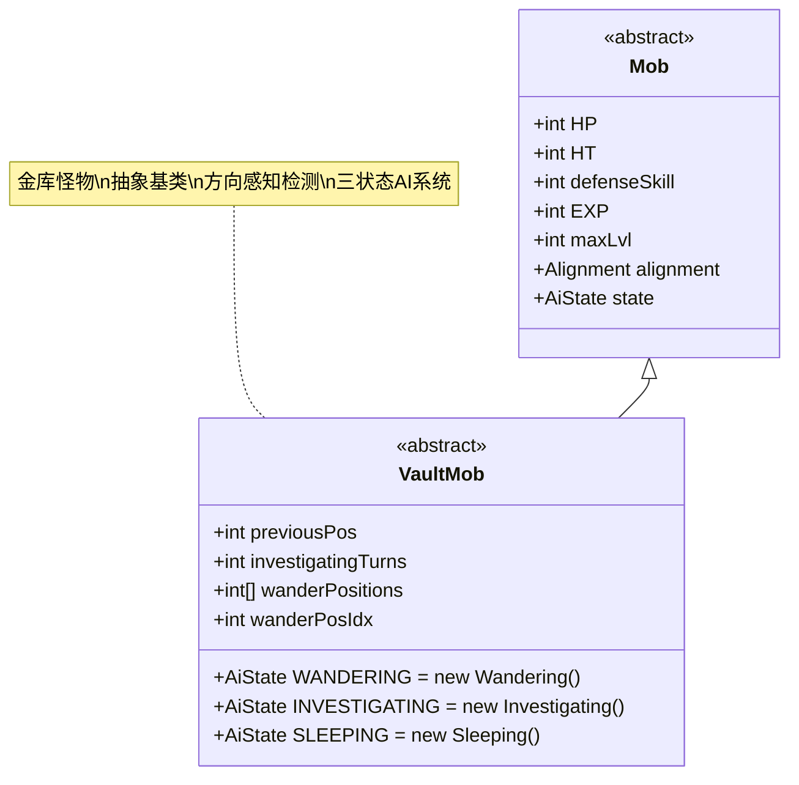

# VaultMob 类文档

## 1. 基本信息
| 属性 | 值 |
|------|-----|
| 文件路径 | core/src/main/java/com/shatteredpixel/shatteredpixeldungeon/actors/mobs/VaultMob.java |
| 包名 | com.shatteredpixel.shatteredpixeldungeon.actors.mobs |
| 类类型 | public abstract class |
| 继承关系 | extends Mob |
| 代码行数 | 225行 |

## 2. 类职责说明
VaultMob（金库怪物）是一个抽象基类，专门为金库区域的特殊敌人设计。它具有复杂的AI行为系统，包括三种状态：睡眠(SLEEPING)、游荡(WANDERING)和调查(INVESTIGATING)。金库怪物具有方向感知的检测机制，能够根据移动方向调整视野锥度，并在检测到玩家时触发特殊的调查状态。

## 4. 继承与协作关系


## 实例字段表
| 字段名 | 类型 | 修饰符 | 说明 |
|--------|------|--------|------|
| previousPos | int | private | 上一个位置，用于计算移动方向 |
| investigatingTurns | int | - | 调查状态的回合数 |
| wanderPositions | int[] | public | 游荡位置数组 |
| wanderPosIdx | int | public | 游荡位置索引 |

## 7. 方法详解

### 构造函数块 {}
**功能**: 初始化VaultMob的基本状态
**实现逻辑**:
- 设置WANDERING、INVESTIGATING、SLEEPING状态为自定义内部类（第35-37行）
- 初始状态设为SLEEPING（第39行）

### move(int step, boolean travelling)
**签名**: `public void move(int step, boolean travelling)`
**功能**: 移动处理，追踪移动方向并触发视觉效果
**参数**: 
- step - 目标位置
- travelling - 是否在移动状态
**实现逻辑**:
1. 记录previousPos（第48行）
2. 调用父类move方法（第49行）
3. 如果满足条件（不可见且距离≤6），触发爆炸波视觉效果：
   - HUNTING状态：红色爆炸波（第52行）
   - INVESTIGATING状态：橙色爆炸波（第53行）
   - 其他状态：默认颜色爆炸波（第55行）

### storeInBundle(Bundle bundle) 和 restoreFromBundle(Bundle bundle)
**功能**: 保存和恢复状态
**实现逻辑**: 保存/恢复所有VaultMob特有的字段（第65-85行）

### Investigating (内部类)
**功能**: 自定义调查AI状态
**核心逻辑**:
- **回合计数**: 记录连续看到敌人的回合数（第93-99行）
- **检测概率**: 根据距离和隐身值计算，第一回合有惩罚（第105-111行）

### Wandering (内部类)
**功能**: 自定义游荡AI状态
**核心逻辑**:
- **方向感知检测**: 
  - 90度视野锥内：高检测概率（1/(distance/2 + stealth)）（第134-135行）
  - 180度视野锥内：标准检测概率（1/(distance + stealth)）（第137-138行）
  - 其他方向：极低检测概率（第140-147行）
- **敌人发现**: 发现敌人后切换到调查状态并通知英雄（第151-162行）
- **随机目标**: 按照预设的wanderPositions数组循环移动（第165-188行）

### Sleeping (内部类)
**功能**: 自定义睡眠AI状态
**核心逻辑**:
- **唤醒处理**: 唤醒后初始化游荡位置并可能切换到调查状态（第193-209行）
- **检测概率**: 使用平方衰减的检测概率（1/(distance + stealth)^2）（第215-222行）

## AI状态系统

### 状态转换
- **SLEEPING → INVESTIGATING**: 发现敌人时
- **WANDERING → INVESTIGATING**: 发现敌人时  
- **任何状态 → HUNTING**: 进入标准狩猎逻辑
- **HUNTING → INVESTIGATING**: 特殊的金库逻辑（不同于普通Mob）

### 检测机制
VaultMob具有三种不同的检测模式：

1. **睡眠检测**: 最宽松，使用平方衰减
2. **游荡检测**: 方向感知，基于移动方向的视野锥
3. **调查检测**: 最严格，但第一回合有惩罚

### 视觉反馈
- **爆炸波**: 移动时显示不同颜色的爆炸波效果
- **调查动画**: 切换到调查状态时显示特殊动画
- **意识Buff**: 通过TalismanOfForesight.CharAwareness通知英雄被发现

## 特殊机制
- **方向计算**: 使用PointF.angle()计算移动和敌人方向的角度差
- **视野锥度**: 90度高敏感区，180度标准区，其余极低敏感区
- **位置管理**: 支持预设的游荡路径，可循环执行
- **状态持久化**: 所有状态都能正确保存和加载

## 11. 使用示例
```java
// VaultMob是抽象类，不能直接实例化
// 需要创建具体的子类，如VaultRat

// 配置游荡路径
vaultMob.wanderPositions = new int[]{pos1, pos2, pos3};
vaultMob.wanderPosIdx = 0;

// 状态转换示例
// 当vaultMob发现敌人时：
// if (vaultMob.state == WANDERING) {
//     vaultMob.state = INVESTIGATING;
//     vaultMob.sprite.showInvestigate();
// }

// 方向检测示例
float movementDir = PointF.angle(prevPoint, currentPoint) / PointF.G2R;
float enemyDir = PointF.angle(currentPoint, enemyPoint) / PointF.G2R;
if (Math.abs(enemyDir - movementDir) <= 45f) {
    // 在90度视野锥内，高检测概率
}
```

## 注意事项
1. VaultMob是抽象基类，必须通过子类使用
2. 检测概率计算考虑了玩家的stealth属性
3. 爆炸波视觉效果仅在玩家不可见但距离较近时触发
4. 调查状态会持续直到失去敌人视野
5. 游荡路径可以是单点（原地徘徊）或多点（巡逻）

## 最佳实践
1. 在金库等特殊区域使用VaultMob作为基础AI
2. 利用方向感知检测增加游戏的真实感
3. 通过预设游荡路径创建复杂的巡逻模式
4. 平衡不同状态下的检测概率以提供适当挑战
5. 在设计类似系统时，可参考其模块化的状态机设计