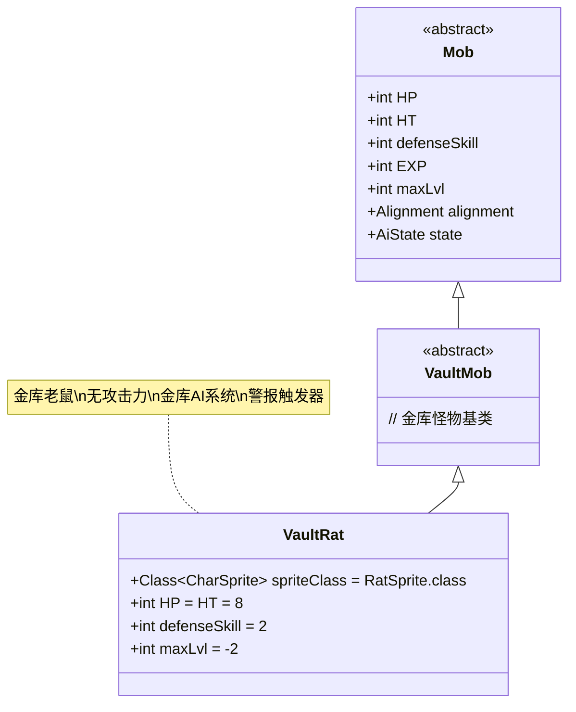

# VaultRat 类文档

## 1. 基本信息
| 属性 | 值 |
|------|-----|
| 文件路径 | core/src/main/java/com/shatteredpixel/shatteredpixeldungeon/actors/mobs/VaultRat.java |
| 包名 | com.shatteredpixel.shatteredpixeldungeon.actors.mobs |
| 类类型 | public class |
| 继承关系 | extends VaultMob |
| 代码行数 | 64行 |

## 2. 类职责说明
VaultRat（金库老鼠）是VaultMob的具体实现，专门用于金库区域的特殊老鼠敌人。它继承了金库怪物的所有复杂AI行为，包括方向感知的检测机制和三状态系统（睡眠、游荡、调查），但具有老鼠的基础属性和外观。值得注意的是，金库老鼠实际上没有攻击力（伤害为0），主要作用是触发警报和增加紧张感。

## 4. 继承与协作关系


## 静态常量表
| 常量名 | 类型 | 值 | 说明 |
|--------|------|-----|------|
| spriteClass | Class<? extends CharSprite> | RatSprite.class | 怪物精灵类 |
| HP/HT | int | 8 | 生命值上限 |
| defenseSkill | int | 2 | 防御技能等级 |
| maxLvl | int | -2 | 最大生成等级（负值表示特殊生成） |

## 实例字段表
| 字段名 | 类型 | 修饰符 | 说明 |
|--------|------|--------|------|
| (继承自VaultMob) | | | |
| previousPos | int | private | 上一个位置，用于计算移动方向 |
| investigatingTurns | int | - | 调查状态的回合数 |
| wanderPositions | int[] | public | 游荡位置数组 |
| wanderPosIdx | int | public | 游荡位置索引 |

## 7. 方法详解

### 构造函数块 {}
**功能**: 初始化VaultRat的基本属性
**实现逻辑**:
- 设置spriteClass为RatSprite.class（第32行）
- 设置HP和HT为8（第34行）
- 设置defenseSkill为2（第35行）
- 设置maxLvl为-2（第37行）

### damageRoll()
**签名**: `public int damageRoll()`
**功能**: 计算攻击伤害范围
**返回值**: int - 伤害值（始终为0）
**实现逻辑**: 返回0（第42行）
**说明**: 金库老鼠实际上没有攻击力，主要用于触发警报

### attackSkill(Char target)
**签名**: `public int attackSkill(Char target)`
**功能**: 计算攻击技能等级
**参数**: target - 目标角色
**返回值**: int - 攻击技能值（固定为8）
**实现逻辑**: 返回8（第46行）

### drRoll()
**签名**: `public int drRoll()`
**功能**: 计算伤害减免
**返回值**: int - 伤害减免值（0-1之间）
**实现逻辑**: 返回super.drRoll() + Random.NormalIntRange(0, 1)（第52行）

### name()
**签名**: `public String name()`
**功能**: 获取名称
**返回值**: String - 名称
**实现逻辑**: 返回标准老鼠的名称（第57行）

### description()
**签名**: `public String description()`
**功能**: 获取描述文本
**返回值**: String - 完整描述
**实现逻辑**: 在标准老鼠描述后追加VaultMob的基础描述（第62行）

## 战斗行为
- **无攻击力**: damageRoll()返回0，无法对玩家造成伤害
- **基础属性**: 低生命值(8)、低防御(2)，与普通老鼠相同
- **金库AI**: 完全继承VaultMob的复杂AI行为系统
- **警报触发**: 主要作用是通过其AI系统触发金库警报
- **特殊生成**: maxLvl为-2，表示不会自然生成

## 特殊机制
- **方向感知**: 继承VaultMob的方向感知检测机制
- **三状态系统**: 睡眠→游荡→调查的状态转换
- **爆炸波效果**: 移动时显示不同颜色的爆炸波视觉效果
- **意识通知**: 通过TalismanOfForesight.CharAwareness通知玩家被发现
- **无战斗威胁**: 由于伤害为0，不会对玩家构成直接威胁

## 11. 使用示例
```java
// 创建金库老鼠实例
VaultRat vaultRat = new VaultRat();

// 基础属性
int ratHP = vaultRat.HP; // 8
int ratDamage = vaultRat.damageRoll(); // 0 (无攻击力)

// AI行为配置
// 设置巡逻路径
vaultRat.wanderPositions = new int[]{pos1, pos2, pos3, pos4};
vaultRat.wanderPosIdx = 0;

// 状态转换
// 当vaultRat发现玩家时：
// vaultRat.state 从 WANDERING 变为 INVESTIGATING
// 触发视觉效果和通知

// 伤害测试
// 即使vaultRat.attackSkill(target)返回8，
// 但由于damageRoll()返回0，实际伤害为0
```

## 注意事项
1. 金库老鼠的主要作用是触发警报而不是战斗
2. 它完全继承了VaultMob的所有AI复杂性
3. 由于伤害为0，玩家可以安全地观察其行为模式
4. 在金库区域中，多个金库老鼠可以创建复杂的巡逻网络
5. 其视觉效果（爆炸波）仅在玩家不可见但距离较近时触发

## 最佳实践
1. 玩家可以利用金库老鼠无攻击力的特点进行观察和规划
2. 在金库关卡设计中，使用金库老鼠作为早期预警系统
3. 通过配置wanderPositions创建复杂的巡逻路径
4. 利用其方向感知特性增加游戏的策略深度
5. 在不增加战斗难度的情况下提升紧张感和沉浸感