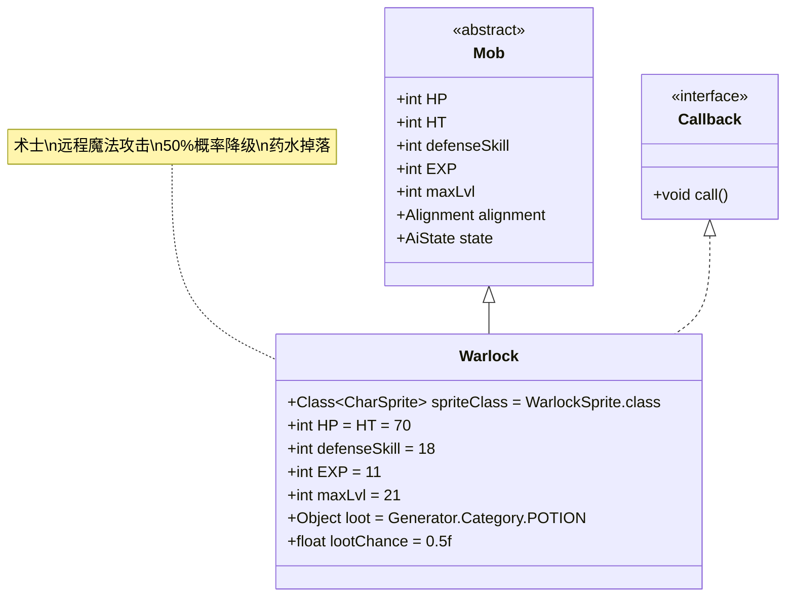

# Warlock 类文档

## 1. 基本信息
| 属性 | 值 |
|------|-----|
| 文件路径 | core/src/main/java/com/shatteredpixel/shatteredpixeldungeon/actors/mobs/Warlock.java |
| 包名 | com.shatteredpixel.shatteredpixeldungeon.actors.mobs |
| 类类型 | public class |
| 继承关系 | extends Mob implements Callback |
| 代码行数 | 167行 |

## 2. 类职责说明
Warlock（术士）是一种具有远程魔法攻击能力的不死族敌人，能够发射暗影魔法箭攻击远处的敌人。术士在魔法攻击时有50%概率对英雄施加降级(Degrade)效果，使其装备暂时失效。术士还会掉落药水，其中包含一定概率的治疗药水，但治疗药水的掉落次数会随着获得次数递减。

## 4. 继承与协作关系


## 静态常量表
| 常量名 | 类型 | 值 | 说明 |
|--------|------|-----|------|
| spriteClass | Class<? extends CharSprite> | WarlockSprite.class | 怪物精灵类 |
| HP/HT | int | 70 | 生命值上限 |
| defenseSkill | int | 18 | 防御技能等级 |
| EXP | int | 11 | 击败后获得的经验值 |
| maxLvl | int | 21 | 最大生成等级 |
| loot | Object | Generator.Category.POTION | 掉落物品类型（药水） |
| lootChance | float | 0.5f | 掉落概率（50%） |
| TIME_TO_ZAP | float | 1.0f | 魔法箭攻击消耗时间 |

## 实例字段表
| 字段名 | 类型 | 修饰符 | 说明 |
|--------|------|--------|------|
| (无额外字段) | | | Warlock没有额外的实例字段 |

## 属性标记
Warlock具有以下特殊属性：
- **UNDEAD**: 不死族

## 7. 方法详解

### 构造函数块 {}
**功能**: 初始化Warlock的基本属性
**实现逻辑**:
- 设置spriteClass为WarlockSprite.class（第50行）
- 设置HP和HT为70（第52行）
- 设置defenseSkill为18（第53行）
- 设置EXP为11，maxLvl为21（第55-56行）
- 设置掉落物品为药水，掉落概率50%（第58-59行）
- 添加UNDEAD属性（第61行）

### damageRoll()
**签名**: `public int damageRoll()`
**功能**: 计算近战伤害范围
**返回值**: int - 伤害值（12-18之间）
**实现逻辑**: 返回Random.NormalIntRange(12, 18)（第66行）

### attackSkill(Char target)
**签名**: `public int attackSkill(Char target)`
**功能**: 计算攻击技能等级
**参数**: target - 目标角色
**返回值**: int - 攻击技能值（固定为25）
**实现逻辑**: 返回25（第71行）

### drRoll()
**签名**: `public int drRoll()`
**功能**: 计算伤害减免
**返回值**: int - 伤害减免值（0-8之间）
**实现逻辑**: 返回super.drRoll() + Random.NormalIntRange(0, 8)（第76行）

### canAttack(Char enemy)
**签名**: `protected boolean canAttack(Char enemy)`
**功能**: 判断是否可以攻击目标
**参数**: enemy - 目标敌人
**返回值**: boolean - 是否可以攻击
**实现逻辑**:
- 满足以下条件之一即可攻击：
  - 父类canAttack返回true（相邻或标准攻击）（第81行）
  - 使用Ballistica验证魔法箭路径无障碍（第82行）

### doAttack(Char enemy)
**签名**: `protected boolean doAttack(Char enemy)`
**功能**: 攻击处理，区分近战和远程魔法攻击
**参数**: enemy - 目标敌人
**返回值**: boolean - 攻击是否完成
**实现逻辑**:
1. 如果满足近战条件（相邻或路径被阻挡），执行普通近战（第87-90行）
2. 否则执行远程魔法攻击：
   - 显示zap动画（如果可见）（第94-96行）
   - 或直接调用zap方法（不可见时）（第98-100行）

### zap()
**签名**: `protected void zap()`
**功能**: 执行魔法箭攻击
**实现逻辑**:
1. 消耗TIME_TO_ZAP(1回合)时间，驱散隐身状态（第108-110行）
2. 检查命中（第112行）
3. **降级效果**: 如果目标是英雄，50%概率施加Degrade效果（第114-117行）
4. **伤害计算**: 
   - 基础伤害：12-18点（第119行）
   - 受升天挑战修正（第120行）
   - 对精英/首领友军造成50%伤害（第123-127行）
5. 造成DarkBolt类型伤害（第129行）
6. 如果杀死英雄，记录特殊死亡并显示消息（第131-135行）
7. 如果未命中，显示防御消息（第137行）

### onZapComplete()
**签名**: `public void onZapComplete()`
**功能**: 魔法箭动画完成后调用
**实现逻辑**: 执行zap攻击并切换到下一回合（第142-144行）

### call()
**签名**: `public void call()`
**功能**: Callback接口实现
**实现逻辑**: 切换到下一回合（第148行）

### createLoot()
**签名**: `public Item createLoot()`
**功能**: 创建掉落物品
**返回值**: Item - 药水物品
**实现逻辑**:
1. **治疗药水概率**: 
   - 1/3 * (8 - 已获得次数)/8 的概率掉落治疗药水（第155行）
   - 最多掉落8次治疗药水（第155行）
2. **其他药水**: 随机选择非治疗药水（第160-163行）

### DarkBolt (内部类)
**功能**: 暗影魔法箭标记类
**说明**: 用于区分近战和魔法攻击，便于抗性系统处理（第105行）

## 战斗行为
- **双模式攻击**: 近战(12-18伤害)和远程魔法(12-18伤害)
- **远程优先**: 只要路径无障碍，优先使用远程魔法攻击
- **降级机制**: 50%概率在魔法攻击英雄时施加降级效果
- **路径验证**: 使用Ballistica.MAGIC_BOLT确保魔法箭直线飞行
- **升天挑战**: 魔法伤害受AscensionChallenge.statModifier修正

## 特殊机制
- **降级效果**: Degrade效果使英雄装备暂时失效
- **治疗药水递减**: 治疗药水掉落概率随获得次数线性递减
- **友军保护**: 对精英/首领友军只造成50%伤害
- **特殊死亡**: 被魔法箭杀死会触发特殊成就"Badges.validateDeathFromEnemyMagic()"
- **抗性区分**: 通过DarkBolt类区分魔法和物理伤害

## 11. 使用示例
```java
// 创建术士实例
Warlock warlock = new Warlock();

// 术士的基础属性
int warlockHP = warlock.HP; // 70
int warlockDamage = warlock.damageRoll(); // 12-18 (近战)

// 魔法箭攻击示例
// 当warlock.doAttack(enemy)且满足远程条件时：
// warlock.sprite.zap(enemy.pos); // 显示动画
// warlock.onZapComplete(); // 动画完成后执行实际攻击

// 治疗药水掉落概率
// 第1次: (1/3) * (8/8) = 33.3%
// 第2次: (1/3) * (7/8) = 29.2%
// ...
// 第8次: (1/3) * (1/8) = 4.2%
// 第9次及以后: 0%

// 降级效果示例
// warlock.zap();
// if (enemy == Dungeon.hero && Random.Int(2) == 0) {
//     Buff.prolong(enemy, Degrade.class, Degrade.DURATION);
// }
```

## 注意事项
1. 术士对英雄的威胁主要来自降级效果而非伤害
2. 魔法箭只能直线飞行，会被墙壁和障碍物阻挡
3. 治疗药水最多只能掉落8次，之后只会掉落其他药水
4. 对友军精英/首领的伤害减半，防止意外击杀
5. 被魔法箭杀死会解锁特殊成就

## 最佳实践
1. 玩家应利用障碍物阻挡术士的视线来避免远程攻击
2. 准备应对降级效果的备用装备或快速击杀策略
3. 在早期尽可能收集治疗药水掉落
4. 在设计类似敌人时，可参考其降级机制和掉落递减系统
5. 平衡远程和近战伤害，确保不同战斗距离都有威胁