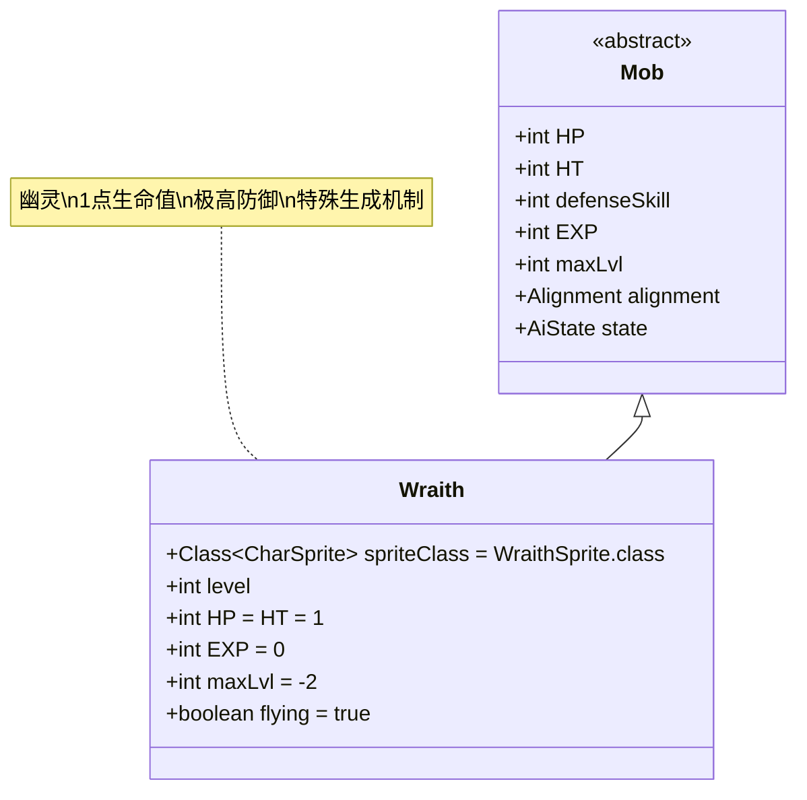

# Wraith 类文档

## 1. 基本信息
| 属性 | 值 |
|------|-----|
| 文件路径 | core/src/main/java/com/shatteredpixel/shatteredpixeldungeon/actors/mobs/Wraith.java |
| 包名 | com.shatteredpixel.shatteredpixeldungeon.actors.mobs |
| 类类型 | public class |
| 继承关系 | extends Mob |
| 代码行数 | 175行 |

## 2. 类职责说明
Wraith（幽灵）是一种极其脆弱但防御能力极高的特殊敌人，只有1点生命值但具有极高的防御技能。幽灵不会自然生成，只能通过特殊的生成机制（如死亡时、特定事件等）出现。它们具有飞行能力，可以穿越地形障碍，并且在生成时有1/100的概率变异为更强大的痛苦之魂(TormentedSpirit)。

## 4. 继承与协作关系


## 静态常量表
| 常量名 | 类型 | 值 | 说明 |
|--------|------|-----|------|
| spriteClass | Class<? extends CharSprite> | WraithSprite.class | 怪物精灵类 |
| HP/HT | int | 1 | 生命值上限 |
| EXP | int | 0 | 击败后获得的经验值 |
| maxLvl | int | -2 | 最大生成等级（负值表示特殊生成） |
| flying | boolean | true | 飞行能力 |
| SPAWN_DELAY | float | 2.0f | 生成延迟时间 |

## 实例字段表
| 字段名 | 类型 | 修饰符 | 说明 |
|--------|------|--------|------|
| level | int | protected | 幽灵等级，影响所有战斗属性 |

## 属性标记
Wraith具有以下特殊属性：
- **UNDEAD**: 不死族
- **INORGANIC**: 无机物

## 7. 方法详解

### 构造函数块 {}
**功能**: 初始化Wraith的基本属性
**实现逻辑**:
- 设置spriteClass为WraithSprite.class（第47行）
- 设置HP和HT为1（第49行）
- 设置EXP为0（第50行）
- 设置maxLvl为-2（第52行）
- 设置flying为true（第54行）
- 添加UNDEAD和INORGANIC属性（第56-57行）

### storeInBundle(Bundle bundle) 和 restoreFromBundle(Bundle bundle)
**功能**: 保存和恢复状态
**实现逻辑**:
- 保存时：存储level字段（第65行）
- 恢复时：读取level字段并调用adjustStats方法（第71-73行）

### damageRoll()
**签名**: `public int damageRoll()`
**功能**: 计算攻击伤害范围
**返回值**: int - 伤害值
**实现逻辑**: 返回Random.NormalIntRange(1 + level/2, 2 + level)（第77行）

### attackSkill(Char target)
**签名**: `public int attackSkill(Char target)`
**功能**: 计算攻击技能等级
**参数**: target - 目标角色
**返回值**: int - 攻击技能值
**实现逻辑**: 返回10 + level（第82行）

### adjustStats(int level)
**签名**: `public void adjustStats(int level)`
**功能**: 根据等级调整所有战斗属性
**参数**: level - 目标等级
**实现逻辑**:
- 设置this.level为指定等级（第86行）
- 设置defenseSkill为attackSkill(null) * 5（第87行）
- 设置enemySeen为true（始终能看到敌人）（第88行）

### spawningWeight()
**签名**: `public float spawningWeight()`
**功能**: 获取生成权重
**返回值**: float - 生成权重（始终为0）
**说明**: 幽灵不会通过常规方式生成（第93行）

### reset()
**签名**: `public boolean reset()`
**功能**: 重置状态
**返回值**: boolean - 始终返回true
**实现逻辑**: 设置state为WANDERING（第98行）

### spawnAround(int pos) 和 spawnAt(int pos)
**功能**: 在指定位置周围或指定位置生成幽灵
**参数**: pos - 生成位置
**返回值**: Wraith - 生成的幽灵实例
**实现逻辑**:
- **spawnAround**: 在指定位置的4个相邻格子生成幽灵（第102-109行）
- **spawnAt**: 在指定位置生成单个幽灵（第112-118行）

### spawnAt(int pos, Class<? extends Wraith> wraithClass, boolean allowAdjacent)
**签名**: `private static Wraith spawnAt(int pos, Class<? extends Wraith> wraithClass, boolean allowAdjacent)`
**功能**: 私有生成方法，处理位置冲突和变种生成
**参数**: 
- pos - 目标位置
- wraithClass - 幽灵类型（可为null）
- allowAdjacent - 是否允许相邻位置生成
**返回值**: Wraith - 生成的幽灵实例（失败返回null）
**实现逻辑**:
1. **位置处理**: 如果目标位置被阻挡，尝试相邻位置（第122-138行）
2. **类型选择**: 
   - 如果wraithClass为null，有1/100概率生成TormentedSpirit（第144-150行）
   - 否则使用指定类型（第151-153行）
3. **属性设置**: 调用adjustStats(Dungeon.scalingDepth())（第154行）
4. **状态设置**: 设置pos和state为HUNTING（第155-156行）
5. **添加到场景**: 使用SPAWN_DELAY延迟添加（第157行）
6. **视觉效果**: 
   - 淡入动画（AlphaTweener）（第160-161行）
   - TormentedSpirit显示ChallengeParticle特效（第163-164行）
   - 普通幽灵显示ShadowParticle特效（第165-167行）

## 战斗行为
- **极端属性**: 极低生命值(1)但极高防御(defenseSkill = (10+level)*5)
- **一击必杀**: 任何有效伤害都能立即击杀
- **高等级成长**: 所有属性随level线性增长
- **自动追踪**: 生成后立即进入HUNTING状态
- **飞行移动**: 可以自由穿越地形障碍

## 特殊机制
- **特殊生成**: 只能通过spawnAt/spawnAround方法生成，不会自然出现
- **变种概率**: 默认有1/100的概率生成TormentedSpirit变种
- **等级系统**: 使用Dungeon.scalingDepth()作为等级基准
- **视觉反馈**: 生成时有淡入动画和粒子特效
- **位置容错**: 自动处理生成位置被阻挡的情况

## 11. 使用示例
```java
// 生成单个幽灵
Wraith wraith = Wraith.spawnAt(position);
if (wraith != null) {
    // 幽灵生成成功
    int wraithLevel = wraith.level; // 等于Dungeon.scalingDepth()
    int damage = wraith.damageRoll(); // 1 + level/2 到 2 + level
    int attackSkill = wraith.attackSkill(null); // 10 + level
    int defenseSkill = wraith.defenseSkill; // (10 + level) * 5
}

// 在位置周围生成多个幽灵
Wraith.spawnAround(position);

// 生成指定类型的幽灵
Wraith.spawnAt(position, TormentedSpirit.class);

// 幽灵的基础属性计算
int currentDepth = Dungeon.scalingDepth();
Wraith wraith = new Wraith();
wraith.adjustStats(currentDepth);
// wraith.HP = 1
// wraith.defenseSkill = (10 + currentDepth) * 5
// wraith.enemySeen = true (始终能看到敌人)
```

## 注意事项
1. 幽灵的防御技能极高，普通攻击很难命中
2. 由于只有1点生命值，一旦命中就能立即击杀
3. 变种生成概率受RatSkull.exoticChanceMultiplier()影响
4. 生成延迟为2回合，给玩家反应时间
5. 幽灵不会提供任何经验值

## 最佳实践
1. 玩家应准备高命中率的武器或能力来对抗幽灵
2. 利用幽灵的低生命值进行快速连击
3. 在设计类似敌人时，可参考其极端属性对比机制
4. 平衡高防御与低生命的属性关系
5. 使用特殊生成机制控制稀有敌人的出现频率