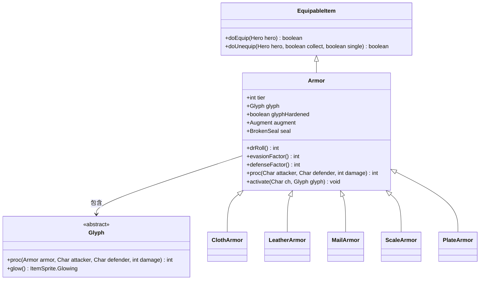

# Armor 类文档

## 1. 基本信息
| 属性 | 值 |
|------|-----|
| 文件路径 | core/src/main/java/com/shatteredpixel/shatteredpixeldungeon/items/armor/Armor.java |
| 包名 | com.shatteredpixel.shatteredpixeldungeon.items.armor |
| 类类型 | class |
| 继承关系 | extends EquipableItem |
| 代码行数 | 919 |

## 2. 类职责说明
Armor是所有护甲的基类，提供了防御计算、符文系统、诅咒机制和强化系统。护甲是游戏中最基础的防御装备，通过闪避和减伤来保护角色。

## 4. 继承与协作关系


## 内部枚举 - Augment
| 值 | evasionFactor | defenseFactor | 说明 |
|----|---------------|---------------|------|
| EVASION | 2f | -1f | 闪避强化 |
| DEFENSE | -2f | 1f | 防御强化 |
| NONE | 0f | 0f | 无强化 |

## 实例字段表
| 字段名 | 类型 | 修饰符 | 说明 |
|--------|------|--------|------|
| tier | int | public | 护甲等级(1-5) |
| glyph | Glyph | public | 护甲符文 |
| glyphHardened | boolean | public | 符文是否硬化 |
| curseInfusionBonus | boolean | public | 诅咒注入加成 |
| masteryPotionBonus | boolean | public | 精通药水加成 |
| augment | Augment | public | 护甲改造类型 |
| seal | BrokenSeal | protected | 战士印章 |

## 7. 方法详解

### drRoll()
**签名**: `public int drRoll()`
**功能**: 计算伤害减免值
**返回值**: DR数值
**实现逻辑**: 
- 基础DR = tier * (2 + level)
- 考虑诅咒状态和加成

### evasionFactor(int level)
**签名**: `public int evasionFactor(int level)`
**功能**: 计算闪避修正
**参数**: `level` - 护甲等级
**返回值**: 闪避修正值

### defenseFactor(int level)
**签名**: `public int defenseFactor(int level)`
**功能**: 计算防御修正
**参数**: `level` - 护甲等级
**返回值**: 防御修正值

### proc(Char attacker, Char defender, int damage)
**签名**: `public int proc(Char attacker, Char defender, int damage)`
**功能**: 触发护甲特效
**参数**: `attacker`-攻击者, `defender`-防御者, `damage`-原始伤害
**返回值**: 修正后的伤害

### doEquip(Hero hero)
**签名**: `public boolean doEquip(Hero hero)`
**功能**: 装备护甲
**参数**: `hero` - 英雄
**返回值**: 成功返回true
**实现逻辑**:
- 检查力量要求
- 检查职业限制
- 触发符文激活

## 护甲等级对照表

| tier | 护甲类型 | 基础DR | 力量需求 |
|------|----------|--------|----------|
| 1 | 布甲 | 0-2 | 10 |
| 2 | 皮甲 | 1-4 | 11 |
| 3 | 锁甲 | 2-6 | 12 |
| 4 | 鳞甲 | 3-8 | 13 |
| 5 | 板甲 | 4-10 | 14 |

## 符文系统

### 正面符文 (Glyphs)
| 符文名 | 效果 |
|--------|------|
| Affection | 魅惑攻击者 |
| AntiMagic | 魔法伤害减免 |
| Brimstone | 硫磺火，免疫灼烧 |
| Camouflage | 草丛隐身 |
| Entanglement | 根缠攻击者 |
| Flow | 水流加速 |
| Obfuscation | 隐匿提升 |
| Potential | 电能充能 |
| Repulsion | 击退攻击者 |
| Stone | 石化减伤 |
| Swiftness | 移动加速 |
| Thorns | 反弹伤害 |
| Viscosity | 延迟伤害 |

### 负面诅咒 (Curses)
| 诅咒名 | 效果 |
|--------|------|
| AntiEntropy | 反熵，随机传送 |
| Bulk | 臃肿，无法通过窄道 |
| Corrosion | 腐蚀云 |
| Displacement | 传送自己 |
| Metabolism | 饥饿加速 |
| Multiplicity | 分裂镜像 |
| Overgrowth | 过度生长 |
| Stench | 恶臭云 |

## 11. 使用示例

```java
// 装备护甲
Armor armor = new PlateArmor();
if (hero.STR() >= armor.STRReq()) {
    armor.doEquip(hero);
}

// 检查DR
int dr = armor.drRoll();

// 强化护甲
armor.upgrade();
```

## 注意事项

1. **力量要求**: 力量不足会大幅降低闪避
2. **符文识别**: 使用后才能识别符文
3. **诅咒风险**: 升级诅咒护甲会移除诅咒
4. **战士印章**: 可以镶嵌印章获得额外效果