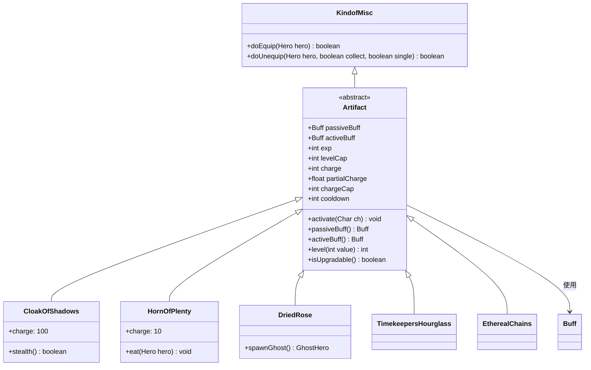

# Artifact 类文档

## 1. 基本信息
| 属性 | 值 |
|------|-----|
| 文件路径 | core/src/main/java/com/shatteredpixel/shatteredpixeldungeon/items/artifacts/Artifact.java |
| 包名 | com.shatteredpixel.shatteredpixeldungeon.items.artifacts |
| 类类型 | abstract class |
| 继承关系 | extends KindofMisc |
| 代码行数 | 301 |

## 2. 类职责说明
Artifact是所有神器的抽象基类，提供了充能系统、被动效果和主动能力框架。神器是特殊的装备，通常需要充能或满足特定条件才能发挥作用，且不可升级但可以通过使用获得成长。

## 4. 继承与协作关系


## 实例字段表
| 字段名 | 类型 | 修饰符 | 说明 |
|--------|------|--------|------|
| passiveBuff | Buff | protected | 被动效果Buff |
| activeBuff | Buff | protected | 主动效果Buff |
| exp | int | protected | 经验值 |
| levelCap | int | protected | 等级上限 |
| charge | int | protected | 当前充能 |
| partialCharge | float | protected | 部分充能 |
| chargeCap | int | protected | 最大充能 |
| cooldown | int | protected | 冷却时间 |

## 7. 方法详解

### activate(Char ch)
**签名**: `public void activate(Char ch)`
**功能**: 激活神器被动效果
**参数**: `ch` - 持有者
**实现逻辑**: 创建并附加passiveBuff

### passiveBuff()
**签名**: `protected abstract Buff passiveBuff()`
**功能**: 获取被动效果Buff
**返回值**: 被动效果Buff实例

### activeBuff()
**签名**: `protected Buff activeBuff()`
**功能**: 获取主动效果Buff
**返回值**: 主动效果Buff实例，默认返回null

### level(int value)
**签名**: `public int level(int value)`
**功能**: 设置或获取神器等级
**参数**: `value` - 设置值，-1表示只获取
**返回值**: 当前等级

### isUpgradable()
**签名**: `public boolean isUpgradable()`
**功能**: 是否可升级
**返回值**: 始终返回false（神器不可升级）

### isIdentified()
**签名**: `public boolean isIdentified()`
**功能**: 是否已鉴定
**返回值**: 神器始终已鉴定

## 神器列表

| 神器名 | 充能方式 | 主要功能 |
|--------|----------|----------|
| CloakOfShadows | 每回合充能 | 潜行隐身 |
| DriedRose | 击杀充能 | 召唤幽灵 |
| EtherealChains | 无需充能 | 穿墙抓取 |
| HornOfPlenty | 吃食物充能 | 生成食物 |
| LloydsBeacon | 无需充能 | 传送标记 |
| MasterThievesArmband | 拾取金币充能 | 偷窃能力 |
| SandalsOfNature | 踩草充能 | 植物相关 |
| TalismanOfForesight | 探索充能 | 预知陷阱 |
| TimekeepersHourglass | 无需充能 | 时间暂停 |
| UnstableSpellbook | 充能 | 随机法术 |
| AlchemistsToolkit | 无需充能 | 炼金工具 |
| CapeOfThorns | 受击充能 | 反弹伤害 |
| ChaliceOfBlood | 受击充能 | 生命汲取 |
| HolyTome | 施法充能 | 圣光法术 |
| SkeletonKey | 无需充能 | 钥匙存储 |

## 充能机制

### 充能类型
1. **时间充能**: 每回合自动获得
2. **事件充能**: 特定行为触发
3. **消耗充能**: 使用后消耗

### 充能公式
```
charge += partialCharge
if (charge >= chargeCap) {
    charge = chargeCap
}
```

## 11. 使用示例

```java
// 装备神器
Artifact artifact = new CloakOfShadows();
artifact.doEquip(hero);

// 使用主动效果
if (artifact.charge >= 10) {
    Buff buff = artifact.activeBuff();
    if (buff != null) {
        buff.attachTo(hero);
    }
}

// 检查等级
int level = artifact.level();
```

## 注意事项

1. **唯一性**: 同类型神器只能装备一个
2. **不可升级**: 神器通过使用成长，不可用升级卷轴
3. **充能管理**: 合理使用充能，避免浪费
4. **职业适配**: 部分神器与特定职业有协同效果

## 最佳实践

1. 盗贼专属神器：CloakOfShadows
2. 战士推荐：CapeOfThorns, ChaliceOfBlood
3. 法师推荐：UnstableSpellbook
4. 猎人推荐：HornOfPlenty, SandalsOfNature