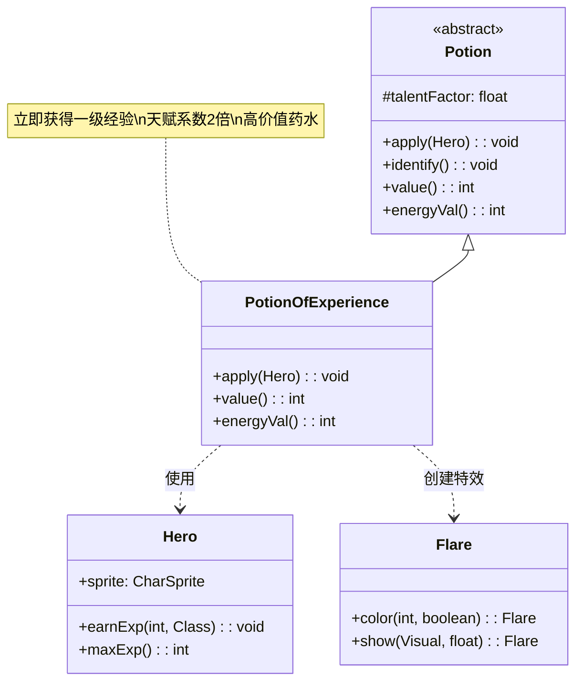

# PotionOfExperience 类文档

## 1. 基本信息
| 属性 | 值 |
|------|-----|
| 文件路径 | core/src/main/java/com/shatteredpixel/shatteredpixeldungeon/items/potions/PotionOfExperience.java |
| 包名 | com.shatteredpixel.shatteredpixeldungeon.items.potions |
| 类类型 | class |
| 继承关系 | extends Potion |
| 代码行数 | 57 |

## 2. 类职责说明
PotionOfExperience 是经验药水类，饮用后立即给予英雄相当于升一级所需的经验值。这是一个非常有价值的药水，因为它可以快速提升英雄等级，从而获得属性提升和技能点。该药水的天赋触发系数为2，意味着使用时天赋效果更强。

## 4. 继承与协作关系


## 静态常量表
| 常量名 | 类型 | 值 | 说明 |
|--------|------|-----|------|
| 无 | - | - | 本类无静态常量 |

## 实例字段表
| 字段名 | 类型 | 修饰符 | 说明 |
|--------|------|--------|------|
| icon | int | (初始化块) | ItemSpriteSheet.Icons.POTION_EXP |
| bones | boolean | (初始化块) | true，可出现在遗骨中 |
| talentFactor | float | (初始化块) | 2f，天赋触发强度为普通药水的2倍 |

## 7. 方法详解

### apply(Hero hero)
**签名**: `@Override public void apply(Hero hero)`
**功能**: 英雄饮用经验药水的效果
**参数**:
- hero: Hero - 饮用药水的英雄
**实现逻辑**:
```java
// 第40-46行
identify(); // 鉴定药水

// 显示经验获取状态
hero.sprite.showStatusWithIcon(
    CharSprite.POSITIVE, 
    Integer.toString(hero.maxExp()), 
    FloatingText.EXPERIENCE
);

// 给予等于升级所需经验的经验值
hero.earnExp(hero.maxExp(), getClass());

// 显示光效
new Flare(6, 32)
    .color(0xFFFF00, true)
    .show(curUser.sprite, 2f);
```
- 饮用后立即鉴定
- 获得的经验值 = 当前等级升到下一级所需经验
- 显示黄色光效和浮动文字

### value()
**签名**: `@Override public int value()`
**功能**: 返回药水的金币价值
**返回值**: int - 药水价值
**实现逻辑**:
```java
// 第49-51行
return isKnown() ? 50 * quantity : super.value();
```
- 已鉴定的经验药水价值50金币/瓶
- 比普通治疗药水(30金币)更贵

### energyVal()
**签名**: `@Override public int energyVal()`
**功能**: 返回药水的能量值（用于商店兑换）
**返回值**: int - 能量值
**实现逻辑**:
```java
// 第54-56行
return isKnown() ? 10 * quantity : super.energyVal();
```
- 已鉴定的经验药水能量值10/瓶
- 比普通药水(6)更高

## 11. 使用示例

### 饮用经验药水
```java
// 创建经验药水
PotionOfExperience potion = new PotionOfExperience();

// 英雄饮用
potion.apply(hero);

// 效果：
// 1. 鉴定药水
// 2. 显示"+XXX EXP"浮动文字
// 3. 英雄获得等于升级所需的经验值
// 4. 显示黄色光芒特效
```

### 经验计算示例
```java
// 假设英雄等级为5，升级需要100经验
hero.lvl = 5;
hero.maxExp() = 100;

// 使用经验药水后
hero.earnExp(100, PotionOfExperience.class);
// 英雄获得100经验，可能升级
```

## 注意事项

1. **经验量**: 给予的经验等于当前等级升一级所需的经验，不是固定值

2. **天赋加成**: talentFactor = 2，意味着使用此药水时：
   - 天赋触发效果更强
   - 适合配合药水相关天赋使用

3. **高价值**: 
   - 金币价值50，比治疗药水(30)高67%
   - 能量价值10，比普通药水(6)高67%

4. **遗骨出现**: bones = true，意味着可在遗骨中找到

## 最佳实践

1. **升级时机**: 在刚升级后使用效果最佳，因为此时升级所需经验最高

2. **天赋配合**: 配合药水相关天赋可获得额外收益

3. **等级规划**: 高等级时升级所需经验更多，经验药水的相对价值更高