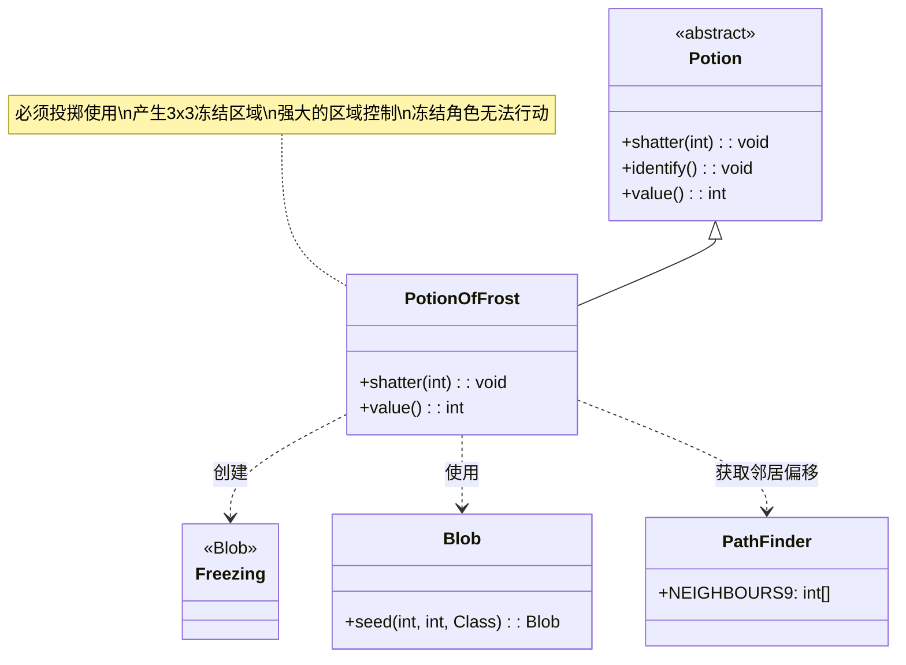

# PotionOfFrost 类文档

## 1. 基本信息
| 属性 | 值 |
|------|-----|
| 文件路径 | core/src/main/java/com/shatteredpixel/shatteredpixeldungeon/items/potions/PotionOfFrost.java |
| 包名 | com.shatteredpixel.shatteredpixeldungeon.items.potions |
| 类类型 | class |
| 继承关系 | extends Potion |
| 代码行数 | 63 |

## 2. 类职责说明
PotionOfFrost 是冰霜药水类，是一种必须投掷使用的药水。投掷后会在目标位置及周围9格（3x3区域）产生冻结效果。被冻结的角色无法行动，这是一种强大的区域控制手段，特别适合对付密集的敌人群或阻止敌人追击。

## 4. 继承与协作关系


## 静态常量表
| 常量名 | 类型 | 值 | 说明 |
|--------|------|-----|------|
| 无 | - | - | 本类无静态常量 |

## 实例字段表
| 字段名 | 类型 | 修饰符 | 说明 |
|--------|------|--------|------|
| icon | int | (初始化块) | ItemSpriteSheet.Icons.POTION_FROST |

## 7. 方法详解

### shatter(int cell)
**签名**: `@Override public void shatter(int cell)`
**功能**: 药水投掷碎裂时的效果，产生冻结区域
**参数**:
- cell: int - 目标格子坐标
**实现逻辑**:
```java
// 第40-57行
splash(cell); // 显示溅射效果

// 如果在英雄视野内
if (Dungeon.level.heroFOV[cell]) {
    identify(); // 鉴定药水
    Sample.INSTANCE.play(Assets.Sounds.SHATTER); // 播放碎裂音效
}

// 遍历目标及周围8格（共9格）
for (int offset : PathFinder.NEIGHBOURS9) {
    // 只在非实体格子上生成冻结
    if (!Dungeon.level.solid[cell + offset]) {
        GameScene.add(Blob.seed(cell + offset, 10, Freezing.class));
    }
}
```
- 在目标位置及周围8格产生冻结效果
- 气体量=10，影响冻结持续时间
- 只在非实体格子（可通过的格子）上生效

### value()
**签名**: `@Override public int value()`
**功能**: 返回药水的金币价值
**返回值**: int - 药水价值
**实现逻辑**:
```java
// 第60-62行
return isKnown() ? 30 * quantity : super.value();
```
- 已鉴定的冰霜药水价值30金币/瓶
- 与治疗药水相同

## 11. 使用示例

### 投掷冰霜药水
```java
// 创建冰霜药水
PotionOfFrost potion = new PotionOfFrost();

// 投掷到敌人位置
potion.cast(hero, enemyCell);

// 效果：
// 1. 药水碎裂
// 2. 在3x3区域内产生冻结效果
// 3. 范围内的角色被冻结，无法行动
// 4. 如果在视野内自动鉴定
```

### 冻结效果详解
```java
// PathFinder.NEIGHBOURS9 包含：
// [-1,-1] [0,-1] [1,-1]
// [-1, 0] [ 0, 0] [1, 0]
// [-1, 1] [0, 1] [1, 1]
// 即目标格子和周围8格

// 冻结效果：
// - 角色被冻结后无法移动和行动
// - 冻结持续数回合
// - 可以被攻击但不受额外伤害
// - 冻结结束后角色恢复正常
```

### 战术应用
```java
// 场景1：控制敌群
// 敌人聚集时投掷，冻结多目标
if (enemyCount >= 3) {
    potion.cast(hero, centerOfEnemyGroup);
    // 冻结3个或更多敌人
}

// 场景2：逃跑
// 冻结追击的敌人
potion.cast(hero, blockingPosition);
// 敌人被冻结，无法追击

// 场景3：Boss战
// 冻结Boss获得喘息机会
potion.cast(hero, bossPosition);
// Boss被暂时冻结
```

## 注意事项

1. **必须投掷**: 此药水在 `mustThrowPots` 集合中，必须投掷使用

2. **区域范围**: 3x3区域（共9格），但只影响可通过的格子

3. **冻结效果**:
   - 角色无法移动和行动
   - 不造成直接伤害
   - 冻结持续时间由气体量(10)决定

4. **实体格子**: 冻结不会在墙壁等实体格子上生成

5. **价值**: 30金币，属于基础价值药水

6. **鉴定**: 投掷时如果在视野内自动鉴定

## 最佳实践

1. **群体控制**: 对密集敌群使用效果最佳

2. **逃跑工具**: 冻结追击者后安全撤离

3. **战术配合**:
   - 冻结后使用范围伤害武器
   - 冻结后调整位置
   - 冻结Boss后恢复生命

4. **位置选择**: 投掷到敌人中心位置以最大化影响范围

5. **避免误伤**: 注意不要冻结友军（如果有）