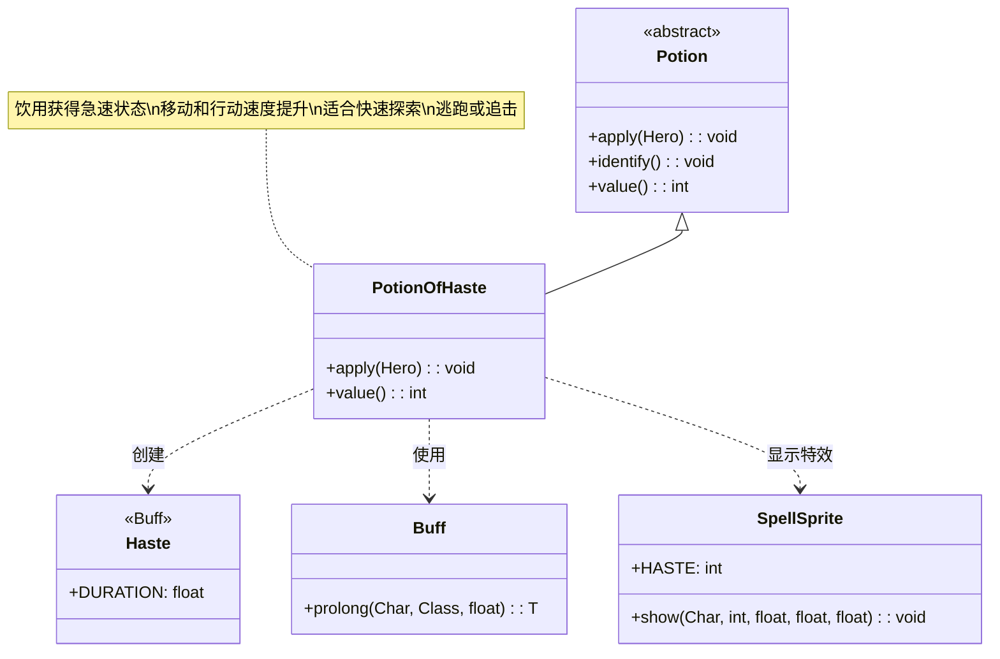

# PotionOfHaste 类文档

## 1. 基本信息
| 属性 | 值 |
|------|-----|
| 文件路径 | core/src/main/java/com/shatteredpixel/shatteredpixeldungeon/items/potions/PotionOfHaste.java |
| 包名 | com.shatteredpixel.shatteredpixeldungeon.items.potions |
| 类类型 | class |
| 继承关系 | extends Potion |
| 代码行数 | 51 |

## 2. 类职责说明
PotionOfHaste 是急速药水类，饮用后使英雄获得急速状态。急速状态下，英雄的所有行动都会加快，移动速度翻倍，攻击速度提升。这是一个非常适合快速探索、逃跑或追击的战术药水。

## 4. 继承与协作关系


## 静态常量表
| 常量名 | 类型 | 值 | 说明 |
|--------|------|-----|------|
| 无 | - | - | 本类无静态常量 |

## 实例字段表
| 字段名 | 类型 | 修饰符 | 说明 |
|--------|------|--------|------|
| icon | int | (初始化块) | ItemSpriteSheet.Icons.POTION_HASTE |

## 7. 方法详解

### apply(Hero hero)
**签名**: `@Override public void apply(Hero hero)`
**功能**: 英雄饮用急速药水的效果
**参数**:
- hero: Hero - 饮用药水的英雄
**实现逻辑**:
```java
// 第39-45行
identify(); // 鉴定药水

// 显示急速消息
GLog.w(Messages.get(this, "energetic"));

// 施加急速Buff，持续标准时间
Buff.prolong(hero, Haste.class, Haste.DURATION);

// 显示急速法术特效（黄色）
SpellSprite.show(hero, SpellSprite.HASTE, 1, 1, 0);
```
- 饮用后立即鉴定
- 显示警告级日志（黄色）
- 施加急速状态
- 显示急速特效（黄色光芒）

### value()
**签名**: `@Override public int value()`
**功能**: 返回药水的金币价值
**返回值**: int - 药水价值
**实现逻辑**:
```java
// 第48-50行
return isKnown() ? 40 * quantity : super.value();
```
- 已鉴定的急速药水价值40金币/瓶
- 与隐形、漂浮药水相同

## 11. 使用示例

### 饮用急速药水
```java
// 创建急速药水
PotionOfHaste potion = new PotionOfHaste();

// 英雄饮用
potion.apply(hero);

// 效果：
// 1. 鉴定药水
// 2. 显示"你感到精力充沛！"
// 3. 英雄获得急速状态
// 4. 显示黄色光芒特效
```

### 急速状态的效果
```java
// 急速状态下：
if (hero.buff(Haste.class) != null) {
    // 1. 移动速度提升
    // 每回合可移动2格（正常1格）
    
    // 2. 攻击速度提升
    // 攻击冷却减少
    
    // 3. 行动速度提升
    // 所有行动耗时减少
}

// 急速持续时间
// Haste.DURATION 定义标准持续时间
```

### 战术应用
```java
// 场景1：快速探索
// 在安全区域使用快速清理
potion.apply(hero);
// 快速移动穿越已知区域

// 场景2：逃跑
if (hero.HP < hero.HT * 0.3) {
    new PotionOfHaste().apply(hero);
    // 快速撤离危险区域
}

// 场景3：追击
// 快速追上逃跑的敌人
potion.apply(hero);
// 移动速度翻倍，轻松追上

// 场景4：战斗优势
// 攻击速度提升，在战斗中占优势
potion.apply(hero);
// 更频繁的攻击
```

## 注意事项

1. **效果持续时间**: 由 `Haste.DURATION` 定义

2. **速度提升**:
   - 移动：每回合可移动2格
   - 攻击：攻击间隔缩短
   - 其他行动也相应加快

3. **消息级别**: 使用 `GLog.w()`（警告级别，黄色显示）

4. **特效颜色**: 黄色光芒（RGB: 1, 1, 0）

5. **价值**: 40金币，属于中等价值药水

## 最佳实践

1. **探索效率**: 在需要快速穿越大区域时使用

2. **紧急逃跑**: 血量低时配合急速快速撤离

3. **战斗配合**: 
   - 急速状态下使用远程武器效果更好
   - 配合高伤害武器在短时间内造成大量伤害

4. **组合使用**:
   - 配合隐形药水：快速且不被发现
   - 配合心眼药水：快速定位敌人

5. **时机选择**: 
   - 在战斗前使用获得先手优势
   - 在逃跑时使用增加存活率

6. **节约使用**: 急速药水有限，用于关键时刻