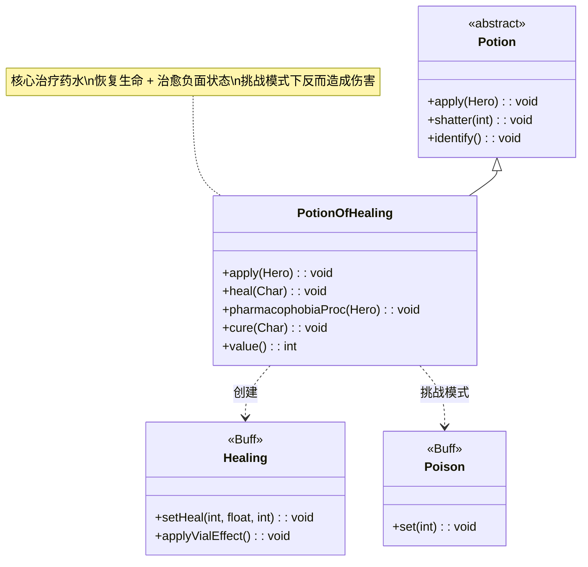

# PotionOfHealing 类文档

## 1. 基本信息
| 属性 | 值 |
|------|-----|
| 文件路径 | core/src/main/java/com/shatteredpixel/shatteredpixeldungeon/items/potions/PotionOfHealing.java |
| 包名 | com.shatteredpixel.shatteredpixeldungeon.items.potions |
| 类类型 | class |
| 继承关系 | extends Potion |
| 代码行数 | 93 |

## 2. 类职责说明
PotionOfHealing 是治疗药水类，提供游戏中最基础的治疗功能。饮用后可以恢复英雄一定比例的生命值，并治愈多种负面状态（中毒、虚弱、流血等）。在"无治疗"挑战模式下，治疗药水会对英雄造成伤害而非治疗。

## 4. 继承与协作关系


## 静态常量表
| 常量名 | 类型 | 值 | 说明 |
|--------|------|-----|------|
| 无 | - | - | 本类无静态常量 |

## 实例字段表
| 字段名 | 类型 | 修饰符 | 说明 |
|--------|------|--------|------|
| icon | int | (初始化块) | ItemSpriteSheet.Icons.POTION_HEALING |
| bones | boolean | (初始化块) | true，可出现在遗骨中 |

## 7. 方法详解

### apply(Hero hero)
**签名**: `@Override public void apply(Hero hero)`
**功能**: 英雄饮用药水时的效果
**实现逻辑**:
```java
// 第51-56行
identify();     // 鉴定药水
cure(hero);     // 治愈负面状态
heal(hero);     // 恢复生命值
```
- 饮用后立即鉴定
- 先治愈负面状态，再恢复生命

### heal(Char ch)
**签名**: `public static void heal(Char ch)`
**功能**: 对角色施以治疗效果
**参数**:
- ch: Char - 接受治疗的角色
**实现逻辑**:
```java
// 第58-70行
if (ch == Dungeon.hero && Dungeon.isChallenged(Challenges.NO_HEALING)){
    // 挑战模式：无治疗挑战下，反而对英雄造成伤害
    pharmacophobiaProc(Dungeon.hero);
} else {
    // 正常模式：应用治疗效果
    Healing healing = Buff.affect(ch, Healing.class);
    // 治疗量：80%最大生命值 + 14
    healing.setHeal((int)(0.8f * ch.HT + 14), 0.25f, 0);
    healing.applyVialEffect(); // 药剂瓶加成效果
    
    if (ch == Dungeon.hero){
        GLog.p(Messages.get(PotionOfHealing.class, "heal"));
    }
}
```
- 治疗量 = 0.8 × 最大生命值 + 14
- 在英雄等级11时，治疗量约等于最大生命值
- 应用药剂瓶的额外效果

### pharmacophobiaProc(Hero hero)
**签名**: `public static void pharmacophobiaProc(Hero hero)`
**功能**: 无治疗挑战模式下，药水对英雄造成伤害
**参数**:
- hero: Hero - 受影响的英雄
**实现逻辑**:
```java
// 第72-75行
// 对英雄造成约40%最大生命值的中毒伤害
Buff.affect(hero, Poison.class).set(4 + hero.lvl/2);
```
- 中毒持续回合 = 4 + 英雄等级/2
- 这是"药理学恐惧症"(Pharmacophobia)挑战的效果

### cure(Char ch)
**签名**: `public static void cure(Char ch)`
**功能**: 治愈角色身上的多种负面状态
**参数**:
- ch: Char - 接受治愈的角色
**实现逻辑**:
```java
// 第77-87行
Buff.detach(ch, Poison.class);      // 中毒
Buff.detach(ch, Cripple.class);     // 残废
Buff.detach(ch, Weakness.class);    // 虚弱
Buff.detach(ch, Vulnerable.class);  // 易伤
Buff.detach(ch, Bleeding.class);    // 流血
Buff.detach(ch, Blindness.class);   // 失明
Buff.detach(ch, Drowsy.class);      // 困倦
Buff.detach(ch, Slow.class);        // 减速
Buff.detach(ch, Vertigo.class);     // 眩晕
```
- 移除9种常见的负面状态
- 但不移除诅咒、饥饿等特殊状态

### value()
**签名**: `@Override public int value()`
**功能**: 返回药水的金币价值
**返回值**: int - 药水价值
**实现逻辑**:
```java
// 第90-92行
return isKnown() ? 30 * quantity : super.value();
```
- 已鉴定的治疗药水价值30金币/瓶
- 未鉴定时使用父类价值

## 11. 使用示例

### 饮用治疗药水
```java
// 英雄饮用治疗药水
PotionOfHealing potion = new PotionOfHealing();
potion.apply(hero);
// 效果：
// 1. 鉴定药水
// 2. 移除中毒、虚弱、流血等负面状态
// 3. 恢复约80%最大生命值+14点生命
```

### 挑战模式下的效果
```java
// 启用"无治疗"挑战时
if (Dungeon.isChallenged(Challenges.NO_HEALING)) {
    // 治疗药水反而造成中毒伤害
    PotionOfHealing.pharmacophobiaProc(hero);
    // 英雄受到4+等级/2回合的中毒
}
```

### 直接治愈负面状态
```java
// 其他物品（如药剂瓶）也可以调用治愈效果
PotionOfHealing.cure(hero);
// 仅治愈负面状态，不恢复生命
```

## 注意事项

1. **挑战模式**: 启用"无治疗"挑战后，治疗药水会转为造成伤害

2. **治疗量公式**: 
   - 基础治疗 = 0.8 × 最大生命值 + 14
   - 实际治疗有0.25的衰减因子

3. **治愈范围**: 仅治愈常见的9种负面状态，不包括：
   - 诅咒（Curse）
   - 饥饿（Hunger）
   - 腐蚀（Corrosion）
   - 冻结（Freeze）

4. **价值差异**: 已鉴定的治疗药水比未鉴定的更有价值

## 最佳实践

1. 在危急情况下优先使用治疗药水，因为它同时治愈多种负面状态

2. 配合药剂瓶（Vial）使用可获得额外效果

3. 在挑战模式下，可以将治疗药水投掷到敌人身上造成溅射效果