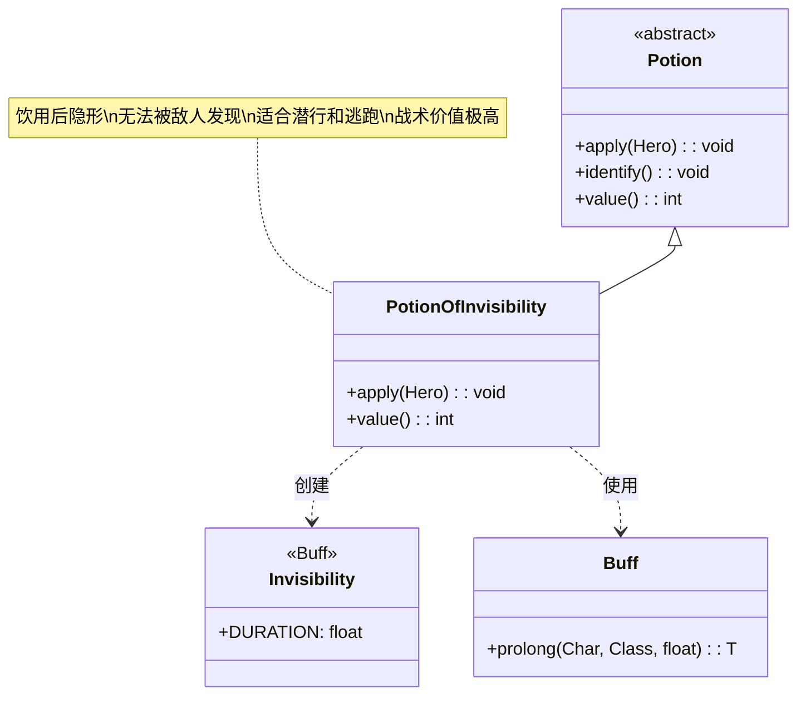

# PotionOfInvisibility 类文档

## 1. 基本信息
| 属性 | 值 |
|------|-----|
| 文件路径 | core/src/main/java/com/shatteredpixel/shatteredpixeldungeon/items/potions/PotionOfInvisibility.java |
| 包名 | com.shatteredpixel.shatteredpixeldungeon.items.potions |
| 类类型 | class |
| 继承关系 | extends Potion |
| 代码行数 | 52 |

## 2. 类职责说明
PotionOfInvisibility 是隐形药水类，饮用后使英雄进入隐形状态一段固定时间。隐形状态下，敌人无法发现英雄，适合用于潜行、逃跑或进行突袭攻击。这是一个战术价值极高的药水，尤其在危险区域或面对强大敌人时。

## 4. 继承与协作关系


## 静态常量表
| 常量名 | 类型 | 值 | 说明 |
|--------|------|-----|------|
| 无 | - | - | 本类无静态常量 |

## 实例字段表
| 字段名 | 类型 | 修饰符 | 说明 |
|--------|------|--------|------|
| icon | int | (初始化块) | ItemSpriteSheet.Icons.POTION_INVIS |

## 7. 方法详解

### apply(Hero hero)
**签名**: `@Override public void apply(Hero hero)`
**功能**: 英雄饮用隐形药水的效果
**参数**:
- hero: Hero - 饮用药水的英雄
**实现逻辑**:
```java
// 第40-45行
identify(); // 鉴定药水

// 施加隐形Buff，持续时间为标准持续时间
Buff.prolong(hero, Invisibility.class, Invisibility.DURATION);

// 显示隐形消息
GLog.i(Messages.get(this, "invisible"));

// 播放融化音效
Sample.INSTANCE.play(Assets.Sounds.MELD);
```
- 饮用后立即鉴定
- 施加隐形状态，持续时间由 Invisibility.DURATION 定义
- 显示日志消息
- 播放特殊的融化音效

### value()
**签名**: `@Override public int value()`
**功能**: 返回药水的金币价值
**返回值**: int - 药水价值
**实现逻辑**:
```java
// 第48-50行
return isKnown() ? 40 * quantity : super.value();
```
- 已鉴定的隐形药水价值40金币/瓶
- 比治疗药水(30)贵，比力量/经验药水(50)便宜

## 11. 使用示例

### 饮用隐形药水
```java
// 创建隐形药水
PotionOfInvisibility potion = new PotionOfInvisibility();

// 英雄饮用
potion.apply(hero);

// 效果：
// 1. 鉴定药水
// 2. 英雄进入隐形状态
// 3. 显示"你变得隐形了"
// 4. 播放融化音效
```

### 隐形状态的应用
```java
// 隐形状态下：
// 1. 敌人无法发现英雄
if (hero.buff(Invisibility.class) != null) {
    // 敌人不会追击
    // 可以安全通过敌人区域
}

// 2. 攻击会打破隐形
hero.attack(enemy);
// 隐形状态消失

// 3. 使用物品可能打破隐形（取决于物品类型）
```

### 战术使用场景
```java
// 场景1：逃跑
if (hero.HP < hero.HT * 0.3) {
    new PotionOfInvisibility().apply(hero);
    // 安全撤离危险区域
}

// 场景2：潜行
// 在高危险区域使用隐形药水安全通过
new PotionOfInvisibility().apply(hero);

// 场景3：突袭
new PotionOfInvisibility().apply(hero);
// 接近敌人后发动攻击，获得先手优势
```

## 注意事项

1. **持续时间**: 隐形持续时间由 `Invisibility.DURATION` 定义

2. **打破隐形**: 以下行为会打破隐形状态：
   - 攻击敌人
   - 使用某些物品（如卷轴、某些法杖）
   - 被敌人发现（某些敌人有特殊感知）

3. **不打破隐形的行为**:
   - 移动
   - 等待
   - 使用某些消耗品（取决于具体实现）

4. **音效**: 使用特殊音效 `Assets.Sounds.MELD`，表示融化消失的感觉

5. **价值**: 40金币，属于中等价值药水

## 最佳实践

1. **逃跑工具**: 在血量低时用于安全撤离

2. **潜行过关**: 在高危险区域安全通过

3. **突袭准备**: 配合高伤害武器发动突袭

4. **搭配使用**: 可以配合：
   - 心眼药水（Mind Vision）：同时看到敌人位置
   - 速度药水（Haste）：快速移动
   - 高伤害武器：突袭时造成最大伤害

5. **时机选择**: 
   - 在敌人聚集时使用可以安全绕过
   - 在Boss战中可以用来重置战斗位置