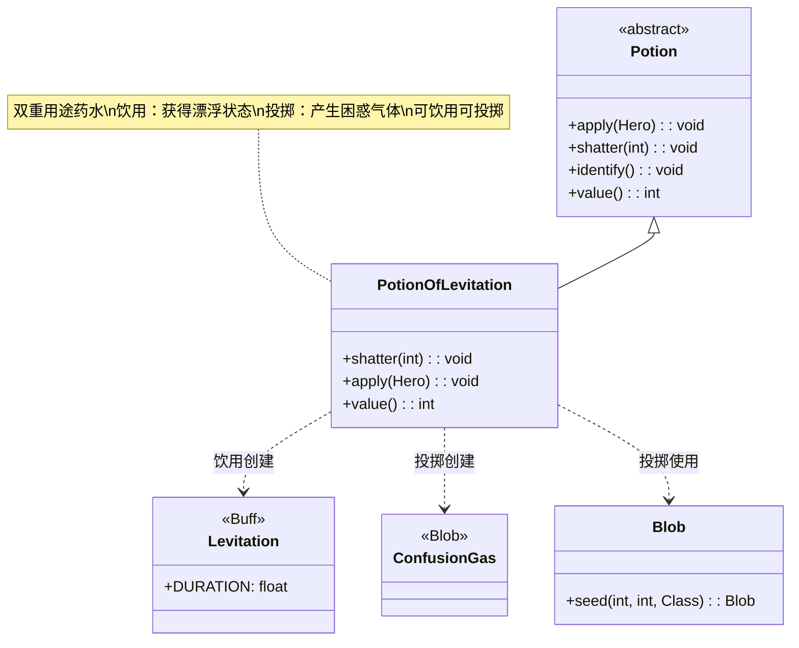

# PotionOfLevitation 类文档

## 1. 基本信息
| 属性 | 值 |
|------|-----|
| 文件路径 | core/src/main/java/com/shatteredpixel/shatteredpixeldungeon/items/potions/PotionOfLevitation.java |
| 包名 | com.shatteredpixel.shatteredpixeldungeon.items.potions |
| 类类型 | class |
| 继承关系 | extends Potion |
| 代码行数 | 68 |

## 2. 类职责说明
PotionOfLevitation 是漂浮药水类，有两种使用方式：饮用后使英雄获得漂浮状态，可以安全通过陷阱和坑洞；投掷后会在目标位置产生一团困惑气体。这种双重用途使它成为一个非常灵活的战术道具。

## 4. 继承与协作关系


## 静态常量表
| 常量名 | 类型 | 值 | 说明 |
|--------|------|-----|------|
| 无 | - | - | 本类无静态常量 |

## 实例字段表
| 字段名 | 类型 | 修饰符 | 说明 |
|--------|------|--------|------|
| icon | int | (初始化块) | ItemSpriteSheet.Icons.POTION_LEVITATE |

## 7. 方法详解

### shatter(int cell)
**签名**: `@Override public void shatter(int cell)`
**功能**: 药水投掷碎裂时的效果，产生困惑气体
**参数**:
- cell: int - 目标格子坐标
**实现逻辑**:
```java
// 第44-55行
splash(cell); // 显示溅射效果

// 如果在英雄视野内
if (Dungeon.level.heroFOV[cell]) {
    identify(); // 鉴定药水
    
    // 播放音效
    Sample.INSTANCE.play(Assets.Sounds.SHATTER);
    Sample.INSTANCE.play(Assets.Sounds.GAS);
}

// 在目标位置生成困惑气体
GameScene.add(Blob.seed(cell, 1000, ConfusionGas.class));
```
- 投掷时在目标位置产生困惑气体
- 气体量为1000（影响范围和持续时间）
- 如果在视野内，自动鉴定

### apply(Hero hero)
**签名**: `@Override public void apply(Hero hero)`
**功能**: 英雄饮用漂浮药水的效果
**参数**:
- hero: Hero - 饮用药水的英雄
**实现逻辑**:
```java
// 第58-62行
identify(); // 鉴定药水

// 施加漂浮Buff，持续标准时间
Buff.prolong(hero, Levitation.class, Levitation.DURATION);

// 显示漂浮消息
GLog.i(Messages.get(this, "float"));
```
- 饮用后获得漂浮状态
- 持续时间由 Levitation.DURATION 定义

### value()
**签名**: `@Override public int value()`
**功能**: 返回药水的金币价值
**返回值**: int - 药水价值
**实现逻辑**:
```java
// 第65-67行
return isKnown() ? 40 * quantity : super.value();
```
- 已鉴定的漂浮药水价值40金币/瓶
- 与隐形药水相同

## 11. 使用示例

### 饮用漂浮药水
```java
// 创建漂浮药水
PotionOfLevitation potion = new PotionOfLevitation();

// 英雄饮用
potion.apply(hero);

// 效果：
// 1. 鉴定药水
// 2. 英雄获得漂浮状态
// 3. 显示"你开始漂浮"
// 4. 可以安全通过陷阱和坑洞
```

### 投掷漂浮药水
```java
// 投掷到敌人位置
potion.cast(hero, enemyCell);

// 效果：
// 1. 药水碎裂
// 2. 产生困惑气体
// 3. 敌人可能进入困惑状态
// 4. 如果在视野内自动鉴定
```

### 漂浮状态的应用
```java
// 漂浮状态下：
if (hero.buff(Levitation.class) != null) {
    // 1. 免疫地面陷阱
    // 不会触发压力板、尖刺陷阱等
    
    // 2. 可以飞越坑洞
    // 可以安全移动到坑洞另一边
    
    // 3. 不受某些地面效果影响
    // 如燃烧地面、毒气等
}

// 移动速度可能受影响
// 漂浮时移动速度略有降低
```

### 困惑气体的效果
```java
// 困惑气体内的角色
for (Char ch : affectedChars) {
    if (ch != hero || !ch.hasResistance(ConfusionGas.class)) {
        // 有概率获得困惑状态
        Buff.prolong(ch, Vertigo.class, duration);
        // 困惑状态：移动方向随机
    }
}
```

## 注意事项

1. **双重用途**:
   - 饮用：获得漂浮状态（对英雄有利）
   - 投掷：产生困惑气体（对敌人有害）

2. **漂浮效果**:
   - 免疫地面陷阱
   - 可飞越坑洞
   - 移动速度可能略有影响

3. **困惑气体**:
   - 气体量1000，中等规模
   - 使范围内角色获得眩晕/困惑状态
   - 对友军也有影响

4. **鉴定**:
   - 饮用时立即鉴定
   - 投掷时如果在视野内也会鉴定

5. **价值**: 40金币，属于中等价值药水

## 最佳实践

1. **陷阱区域**: 在充满陷阱的区域饮用，安全通过

2. **坑洞穿越**: 用于飞越无法跳过的坑洞

3. **敌人控制**: 投掷到敌群中造成困惑，降低其战斗力

4. **组合使用**:
   - 配合隐形药水：完全不被发现
   - 配合加速药水：快速通过危险区域

5. **投掷时机**: 
   - 敌人密集时投掷效果最佳
   - 注意不要误伤友军

6. **探索策略**: 保存至少一瓶用于通过陷阱房间