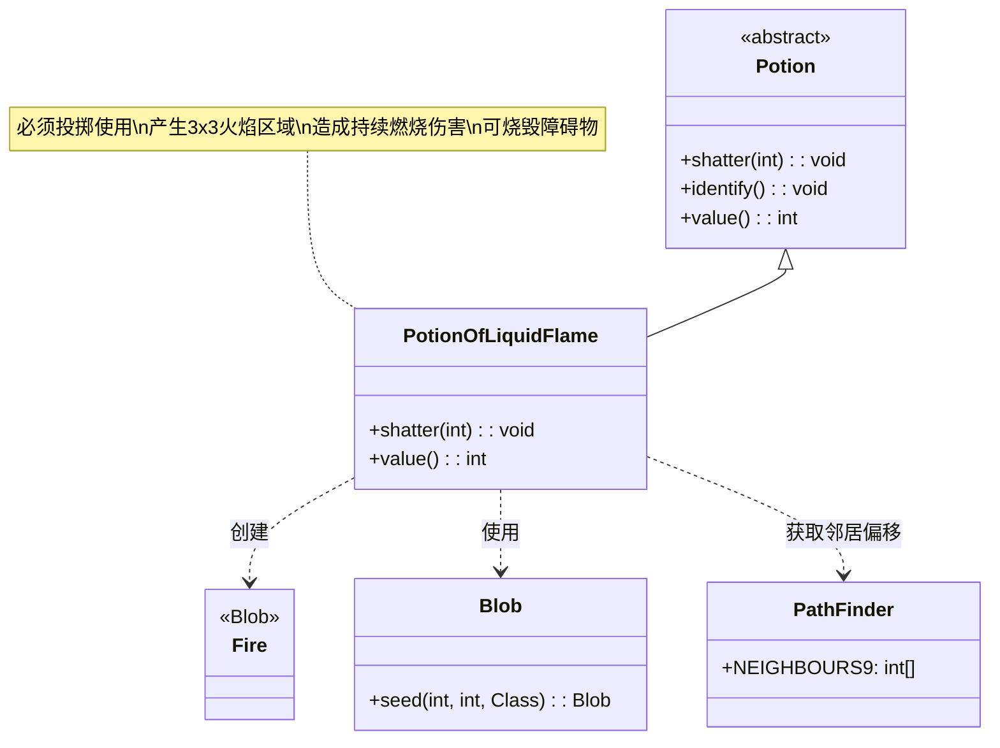

# PotionOfLiquidFlame 类文档

## 1. 基本信息
| 属性 | 值 |
|------|-----|
| 文件路径 | core/src/main/java/com/shatteredpixel/shatteredpixeldungeon/items/potions/PotionOfLiquidFlame.java |
| 包名 | com.shatteredpixel.shatteredpixeldungeon.items.potions |
| 类类型 | class |
| 继承关系 | extends Potion |
| 代码行数 | 63 |

## 2. 类职责说明
PotionOfLiquidFlame 是液火药水类，是一种必须投掷使用的药水。投掷后会在目标位置及周围9格（3x3区域）产生火焰。火焰会对范围内的角色造成燃烧伤害，这是一种强大的区域伤害手段，特别适合对付惧怕火焰的敌人和清除障碍物。

## 4. 继承与协作关系


## 静态常量表
| 常量名 | 类型 | 值 | 说明 |
|--------|------|-----|------|
| 无 | - | - | 本类无静态常量 |

## 实例字段表
| 字段名 | 类型 | 修饰符 | 说明 |
|--------|------|--------|------|
| icon | int | (初始化块) | ItemSpriteSheet.Icons.POTION_LIQFLAME |

## 7. 方法详解

### shatter(int cell)
**签名**: `@Override public void shatter(int cell)`
**功能**: 药水投掷碎裂时的效果，产生火焰区域
**参数**:
- cell: int - 目标格子坐标
**实现逻辑**:
```java
// 第40-57行
splash(cell); // 显示溅射效果

// 如果在英雄视野内
if (Dungeon.level.heroFOV[cell]) {
    identify(); // 鉴定药水
    
    // 播放音效
    Sample.INSTANCE.play(Assets.Sounds.SHATTER);
    Sample.INSTANCE.play(Assets.Sounds.BURNING);
}

// 遍历目标及周围8格（共9格）
for (int offset : PathFinder.NEIGHBOURS9) {
    // 只在非实体格子上生成火焰
    if (!Dungeon.level.solid[cell + offset]) {
        GameScene.add(Blob.seed(cell + offset, 2, Fire.class));
    }
}
```
- 在目标位置及周围8格产生火焰
- 气体量=2，影响火焰持续时间
- 只在非实体格子（可通过的格子）上生效
- 播放碎裂和燃烧双重音效

### value()
**签名**: `@Override public int value()`
**功能**: 返回药水的金币价值
**返回值**: int - 药水价值
**实现逻辑**:
```java
// 第60-62行
return isKnown() ? 30 * quantity : super.value();
```
- 已鉴定的液火药水价值30金币/瓶
- 与治疗药水、冰霜药水相同

## 11. 使用示例

### 投掷液火药水
```java
// 创建液火药水
PotionOfLiquidFlame potion = new PotionOfLiquidFlame();

// 投掷到敌人位置
potion.cast(hero, enemyCell);

// 效果：
// 1. 药水碎裂，播放双重音效
// 2. 在3x3区域内产生火焰
// 3. 范围内的角色受到燃烧伤害
// 4. 如果在视野内自动鉴定
```

### 火焰效果详解
```java
// PathFinder.NEIGHBOURS9 包含：
// [-1,-1] [0,-1] [1,-1]
// [-1, 0] [ 0, 0] [1, 0]
// [-1, 1] [0, 1] [1, 1]
// 即目标格子和周围8格

// 火焰效果：
// - 角色进入火焰区域获得燃烧状态
// - 燃烧造成持续伤害
// - 可烧毁某些障碍物（如草、木门）
// - 火焰持续数回合
```

### 战术应用
```java
// 场景1：群体伤害
// 敌人聚集时投掷，燃烧多目标
if (enemyCount >= 3) {
    potion.cast(hero, centerOfEnemyGroup);
    // 多个敌人被燃烧
}

// 场景2：清除障碍
// 烧毁草丛或木门
potion.cast(hero, woodenDoor);
// 木门被烧毁

// 场景3：对抗火焰弱点敌人
// 某些敌人惧怕火焰
potion.cast(hero, icyEnemy);
// 造成额外伤害
```

## 注意事项

1. **必须投掷**: 此药水在 `mustThrowPots` 集合中，必须投掷使用

2. **区域范围**: 3x3区域（共9格），但只影响可通过的格子

3. **火焰效果**:
   - 造成持续燃烧伤害
   - 可烧毁草丛、木门等
   - 火焰持续时间由气体量(2)决定

4. **音效**: 播放碎裂音效和燃烧音效

5. **价值**: 30金币，属于基础价值药水

6. **鉴定**: 投掷时如果在视野内自动鉴定

7. **误伤风险**: 注意不要烧到自己

## 最佳实践

1. **群体伤害**: 对密集敌群使用效果最佳

2. **障碍清除**: 用于快速打开通道

3. **弱点利用**: 对惧怕火焰的敌人效果更好

4. **安全距离**: 确保自己不在火焰范围内

5. **组合战术**:
   - 先用冰霜药水冻结敌人
   - 再用液火药水造成伤害

6. **环境利用**: 投掷到草丛中可快速清除视野