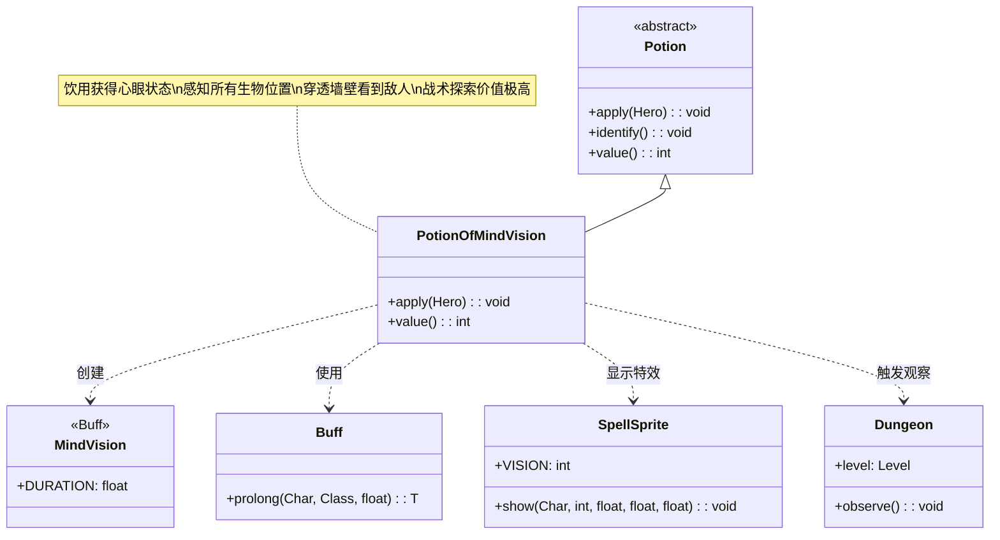

# PotionOfMindVision 类文档

## 1. 基本信息
| 属性 | 值 |
|------|-----|
| 文件路径 | core/src/main/java/com/shatteredpixel/shatteredpixeldungeon/items/potions/PotionOfMindVision.java |
| 包名 | com.shatteredpixel.shatteredpixeldungeon.items.potions |
| 类类型 | class |
| 继承关系 | extends Potion |
| 代码行数 | 57 |

## 2. 类职责说明
PotionOfMindVision 是心眼药水类，饮用后使英雄获得心眼状态。心眼状态下，英雄可以感知整个地图上所有生物的位置，即使它们在视野之外或被墙壁遮挡。这是一个非常有价值的探索和战术药水，特别适合用于发现隐藏的敌人和规划路线。

## 4. 继承与协作关系


## 静态常量表
| 常量名 | 类型 | 值 | 说明 |
|--------|------|-----|------|
| 无 | - | - | 本类无静态常量 |

## 实例字段表
| 字段名 | 类型 | 修饰符 | 说明 |
|--------|------|--------|------|
| icon | int | (初始化块) | ItemSpriteSheet.Icons.POTION_MINDVIS |

## 7. 方法详解

### apply(Hero hero)
**签名**: `@Override public void apply(Hero hero)`
**功能**: 英雄饮用心眼药水的效果
**参数**:
- hero: Hero - 饮用药水的英雄
**实现逻辑**:
```java
// 第40-51行
identify(); // 鉴定药水

// 施加心眼Buff，持续标准时间
Buff.prolong(hero, MindVision.class, MindVision.DURATION);

// 显示心眼法术特效（青色）
SpellSprite.show(hero, SpellSprite.VISION, 1, 0.77f, 0.9f);

// 触发全局观察，更新视野
Dungeon.observe();

// 根据地图上敌人数量显示不同消息
if (Dungeon.level.mobs.size() > 0) {
    GLog.i(Messages.get(this, "see_mobs"));
} else {
    GLog.i(Messages.get(this, "see_none"));
}
```
- 饮用后立即鉴定
- 施加心眼状态
- 显示青色光芒特效
- 触发全局观察更新
- 根据敌人存在显示不同消息

### value()
**签名**: `@Override public int value()`
**功能**: 返回药水的金币价值
**返回值**: int - 药水价值
**实现逻辑**:
```java
// 第54-56行
return isKnown() ? 30 * quantity : super.value();
```
- 已鉴定的心眼药水价值30金币/瓶
- 与治疗、冰霜、液火药水相同

## 11. 使用示例

### 饮用心眼药水
```java
// 创建心眼药水
PotionOfMindVision potion = new PotionOfMindVision();

// 英雄饮用
potion.apply(hero);

// 效果：
// 1. 鉴定药水
// 2. 英雄获得心眼状态
// 3. 显示青色光芒特效
// 4. 显示敌人感知消息
```

### 心眼状态的效果
```java
// 心眼状态下：
if (hero.buff(MindVision.class) != null) {
    // 1. 看到所有敌人位置
    for (Mob mob : Dungeon.level.mobs) {
        // 敌人图标可见，即使隔着墙
    }
    
    // 2. 看到友军位置
    // 所有NPC和盟友可见
    
    // 3. 穿透墙壁
    // 不受视野遮挡限制
    
    // 4. 持续时间
    // MindVision.DURATION 定义
}
```

### 战术应用
```java
// 场景1：探索新区域
potion.apply(hero);
// 查看所有敌人位置，规划安全路线

// 场景2：检查房间
// 进入新房间前使用
potion.apply(hero);
// 知道房间内敌人数量和位置

// 场景3：寻找隐藏敌人
// 某些敌人会隐藏
potion.apply(hero);
// 揭示所有隐藏敌人

// 场景4：逃跑规划
// 知道敌人位置后选择最佳逃跑路线
potion.apply(hero);
// 避开敌人聚集区域

// 场景5：Boss战准备
// 查看Boss和其召唤物的位置
potion.apply(hero);
// 战术规划
```

## 注意事项

1. **效果范围**: 全地图，不受距离和墙壁限制

2. **显示内容**:
   - 所有敌人位置
   - 所有友军位置
   - 但不显示物品和陷阱

3. **消息提示**: 根据敌人数量显示不同消息
   - 有敌人："你感知到了敌人的存在"
   - 无敌人："这里很安静"

4. **特效颜色**: 青色光芒（RGB: 1, 0.77, 0.9）

5. **价值**: 30金币，基础价值

6. **观察更新**: 会触发 `Dungeon.observe()` 更新视野

## 最佳实践

1. **房间清理**: 进入新房间前使用，了解敌人分布

2. **路线规划**: 在复杂地牢中选择安全路线

3. **敌人追踪**: 追踪特定敌人（如逃跑的Boss）

4. **组合使用**:
   - 配合隐形药水：安全绕过敌人
   - 配合急速药水：快速到达目标
   - 配合远程武器：远程攻击已知位置敌人

5. **资源管理**: 心眼药水有限，用于关键探索

6. **陷阱规避**: 虽然不显示陷阱，但知道敌人位置有助于避开危险区域