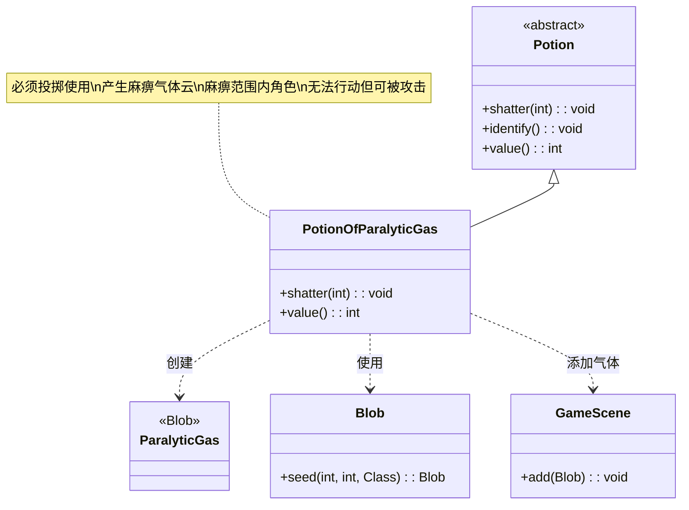

# PotionOfParalyticGas 类文档

## 1. 基本信息
| 属性 | 值 |
|------|-----|
| 文件路径 | core/src/main/java/com/shatteredpixel/shatteredpixeldungeon/items/potions/PotionOfParalyticGas.java |
| 包名 | com.shatteredpixel.shatteredpixeldungeon.items.potions |
| 类类型 | class |
| 继承关系 | extends Potion |
| 代码行数 | 56 |

## 2. 类职责说明
PotionOfParalyticGas 是麻痹气体药水类，是一种必须投掷使用的药水。投掷后会在目标位置产生大量麻痹气体云。麻痹气体使范围内的角色陷入麻痹状态，无法进行任何行动。这是一种强大的区域控制手段，特别适合对付无法抵抗麻痹的敌人。

## 4. 继承与协作关系


## 静态常量表
| 常量名 | 类型 | 值 | 说明 |
|--------|------|-----|------|
| 无 | - | - | 本类无静态常量 |

## 实例字段表
| 字段名 | 类型 | 修饰符 | 说明 |
|--------|------|--------|------|
| icon | int | (初始化块) | ItemSpriteSheet.Icons.POTION_PARAGAS |

## 7. 方法详解

### shatter(int cell)
**签名**: `@Override public void shatter(int cell)`
**功能**: 药水投掷碎裂时的效果，产生麻痹气体云
**参数**:
- cell: int - 目标格子坐标
**实现逻辑**:
```java
// 第39-50行
splash(cell); // 显示溅射效果

// 如果在英雄视野内
if (Dungeon.level.heroFOV[cell]) {
    identify(); // 鉴定药水
    
    // 播放音效
    Sample.INSTANCE.play(Assets.Sounds.SHATTER);
    Sample.INSTANCE.play(Assets.Sounds.GAS);
}

// 在目标位置生成麻痹气体，气体量1000
GameScene.add(Blob.seed(cell, 1000, ParalyticGas.class));
```
- 在目标位置产生大量麻痹气体
- 气体量=1000，产生较大范围的气体云
- 播放碎裂和气体双重音效

### value()
**签名**: `@Override public int value()`
**功能**: 返回药水的金币价值
**返回值**: int - 药水价值
**实现逻辑**:
```java
// 第53-55行
return isKnown() ? 40 * quantity : super.value();
```
- 已鉴定的麻痹气体药水价值40金币/瓶
- 比基础药水(30)更贵

## 11. 使用示例

### 投掷麻痹气体药水
```java
// 创建麻痹气体药水
PotionOfParalyticGas potion = new PotionOfParalyticGas();

// 投掷到敌人位置
potion.cast(hero, enemyCell);

// 效果：
// 1. 药水碎裂，播放音效
// 2. 产生大量麻痹气体云
// 3. 范围内的角色被麻痹
// 4. 如果在视野内自动鉴定
```

### 麻痹效果详解
```java
// 麻痹气体效果：
// 1. 扩散
// 气体从目标位置向外扩散
// 影响范围随时间增大

// 2. 麻痹效果
for (Char ch : affectedChars) {
    if (!ch.immunizedBuffs().contains(Paralysis.class)) {
        // 角色被麻痹
        Buff.prolong(ch, Paralysis.class, duration);
        // 无法移动、攻击、使用物品
        // 但可以被动挨打
    }
}

// 3. 持续时间
// 由气体量和角色抗性决定
```

### 战术应用
```java
// 场景1：控制危险敌人
// 麻痹强力敌人后安全攻击
potion.cast(hero, bossPosition);
while (boss.isParalyzed()) {
    hero.attack(boss);
    // 安全攻击被麻痹的敌人
}

// 场景2：逃跑
// 麻痹追击的敌人
potion.cast(hero, blockingPosition);
// 敌人被麻痹，无法追击

// 场景3：房间清理
// 先麻痹敌人再逐个击破
potion.cast(hero, roomCenter);
// 多个敌人被麻痹

// 场景4：对付免疫较弱的敌人
// 某些敌人无法抵抗麻痹
// 如普通哥布林、鼠人等
```

## 注意事项

1. **必须投掷**: 此药水在 `mustThrowPots` 集合中，必须投掷使用

2. **气体量**: 1000，产生较大范围的气体云

3. **麻痹效果**:
   - 角色无法移动、攻击、使用物品
   - 但可以被动挨打
   - 不造成直接伤害

4. **抗性**: 某些敌人免疫麻痹（如机械敌人、Boss等）

5. **扩散**: 气体会向外扩散，影响范围随时间增大

6. **价值**: 40金币，属于中等价值药水

## 最佳实践

1. **控制强力敌人**: 麻痹后安全攻击

2. **逃跑工具**: 麻痹追击者后快速撤离

3. **群战策略**: 先麻痹一群敌人再逐个击破

4. **Boss战**: 麻痹Boss后调整位置或恢复生命

5. **避免误伤**: 注意不要让自己进入气体范围

6. **配合使用**:
   - 先麻痹敌人，再用范围伤害
   - 配合液火药水造成伤害

7. **敌人选择**: 对麻痹免疫弱的敌人效果更好