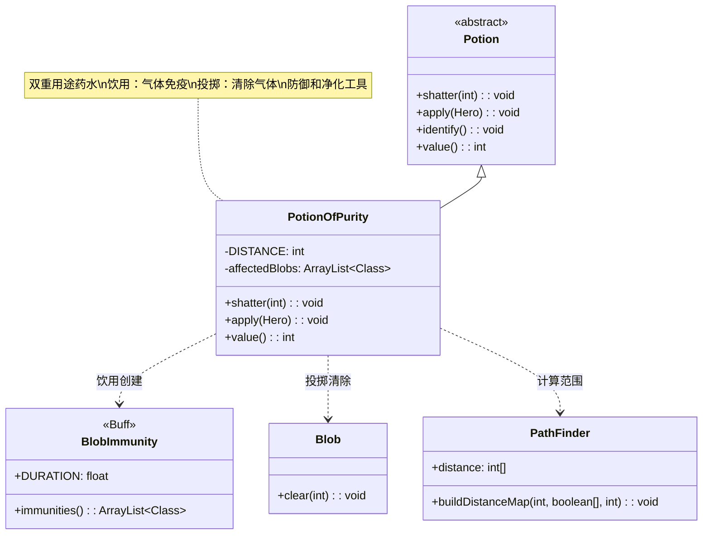

# PotionOfPurity 类文档

## 1. 基本信息
| 属性 | 值 |
|------|-----|
| 文件路径 | core/src/main/java/com/shatteredpixel/shatteredpixeldungeon/items/potions/PotionOfPurity.java |
| 包名 | com.shatteredpixel.shatteredpixeldungeon.items.potions |
| 类类型 | class |
| 继承关系 | extends Potion |
| 代码行数 | 104 |

## 2. 类职责说明
PotionOfPurity 是净化药水类，是一种可饮用也可投掷的双重用途药水。饮用后获得BlobImmunity（气体免疫）状态，免疫所有气体效果；投掷后清除目标区域内的所有有害气体和云雾。这是一种强大的防御和净化工具，特别适合在充满气体的危险环境中使用。

## 4. 继承与协作关系


## 静态常量表
| 常量名 | 类型 | 值 | 说明 |
|--------|------|-----|------|
| DISTANCE | int | 3 | 投掷时清除气体的范围半径 |

## 实例字段表
| 字段名 | 类型 | 修饰符 | 说明 |
|--------|------|--------|------|
| icon | int | (初始化块) | ItemSpriteSheet.Icons.POTION_PURITY |
| affectedBlobs | ArrayList<Class> | private static | 受影响的气体类型列表，从BlobImmunity获取 |

## 7. 方法详解

### shatter(int cell)
**签名**: `@Override public void shatter(int cell)`
**功能**: 药水投掷碎裂时的效果，清除区域内的气体
**参数**:
- cell: int - 目标格子坐标
**实现逻辑**:
```java
// 第55-90行
// 1. 构建距离地图，计算影响范围
PathFinder.buildDistanceMap(cell, BArray.not(Dungeon.level.solid, null), DISTANCE);

// 2. 收集存在的气体Blob
ArrayList<Blob> blobs = new ArrayList<>();
for (Class c : affectedBlobs) {
    Blob b = Dungeon.level.blobs.get(c);
    if (b != null && b.volume > 0) {
        blobs.add(b);
    }
}

// 3. 清除范围内的气体
for (int i = 0; i < Dungeon.level.length(); i++) {
    if (PathFinder.distance[i] < Integer.MAX_VALUE) {
        // 清除每种气体
        for (Blob blob : blobs) {
            blob.clear(i);
        }
        
        // 显示净化特效
        if (Dungeon.level.heroFOV[i]) {
            CellEmitter.get(i).burst(Speck.factory(Speck.DISCOVER), 2);
        }
    }
}

// 4. 显示溅射效果和消息
splash(cell);
if (Dungeon.level.heroFOV[cell]) {
    Sample.INSTANCE.play(Assets.Sounds.SHATTER);
    identify();
    GLog.i(Messages.get(this, "freshness"));
}
```
- 计算半径3格内的所有非实体格子
- 清除范围内所有有害气体
- 显示净化特效

### apply(Hero hero)
**签名**: `@Override public void apply(Hero hero)`
**功能**: 英雄饮用净化药水的效果
**参数**:
- hero: Hero - 饮用药水的英雄
**实现逻辑**:
```java
// 第93-98行
// 显示保护消息
GLog.w(Messages.get(this, "protected"));

// 施加气体免疫状态，持续标准时间
Buff.prolong(hero, BlobImmunity.class, BlobImmunity.DURATION);

// 显示净化特效
SpellSprite.show(hero, SpellSprite.PURITY);

identify(); // 鉴定药水
```
- 饮用后获得气体免疫状态
- 免疫所有气体效果
- 显示净化特效

### value()
**签名**: `@Override public int value()`
**功能**: 返回药水的金币价值
**返回值**: int - 药水价值
**实现逻辑**:
```java
// 第101-103行
return isKnown() ? 40 * quantity : super.value();
```
- 已鉴定的净化药水价值40金币/瓶

## 11. 使用示例

### 饮用净化药水
```java
// 创建净化药水
PotionOfPurity potion = new PotionOfPurity();

// 英雄饮用
potion.apply(hero);

// 效果：
// 1. 显示"你感到被保护了！"
// 2. 英雄获得气体免疫状态
// 3. 免疫所有气体效果
// 4. 鉴定药水
```

### 投掷净化药水
```java
// 投掷到气体区域
potion.cast(hero, gasCenter);

// 效果：
// 1. 清除半径3格内的所有气体
// 2. 显示净化特效
// 3. 如果在视野内自动鉴定
```

### 气体免疫状态
```java
// 气体免疫状态下：
if (hero.buff(BlobImmunity.class) != null) {
    // 免疫的气体类型包括：
    // - ToxicGas（毒气）
    // - ParalyticGas（麻痹气体）
    // - ConfusionGas（困惑气体）
    // - CorrosiveGas（腐蚀气体）
    // - Freezing（冻结）
    // - Fire（火焰）
    // - StenchGas（臭气）
    // - StormCloud（风暴云）
    // - ShroudingFog（迷雾）
    // 等等...
}
```

### 战术应用
```java
// 场景1：进入气体房间
// 饮用后安全通过
new PotionOfPurity().apply(hero);
// 免疫所有气体伤害

// 场景2：被毒气包围
// 投掷清除周围毒气
potion.cast(hero, hero.pos);
// 清除半径3格内的毒气

// 场景3：Boss战
// 某些Boss会释放气体
new PotionOfPurity().apply(hero);
// 免疫Boss的气体攻击

// 场景4：救援队友
// 清除队友周围的危险气体
potion.cast(hero, allyPos);
// 清除气体保护队友
```

## 注意事项

1. **双重用途**: 
   - 饮用：获得气体免疫
   - 投掷：清除区域气体

2. **投掷范围**: 半径3格（约7x7区域）

3. **免疫范围**: 免疫BlobImmunity中定义的所有气体类型

4. **持续时间**: BlobImmunity.DURATION 定义

5. **特效**: 显示净化光芒特效

6. **价值**: 40金币，中等价值

## 最佳实践

1. **预防性使用**: 进入已知有气体的区域前饮用

2. **紧急救援**: 被气体包围时投掷清除

3. **Boss战准备**: 对付会释放气体的Boss

4. **组合使用**:
   - 配合隐形药水：安全通过危险区域
   - 配合心眼药水：了解敌人位置后制定策略

5. **资源管理**: 净化药水有限，用于关键情况

6. **优先投掷**: 如果只是为了清除气体，投掷比饮用更节省