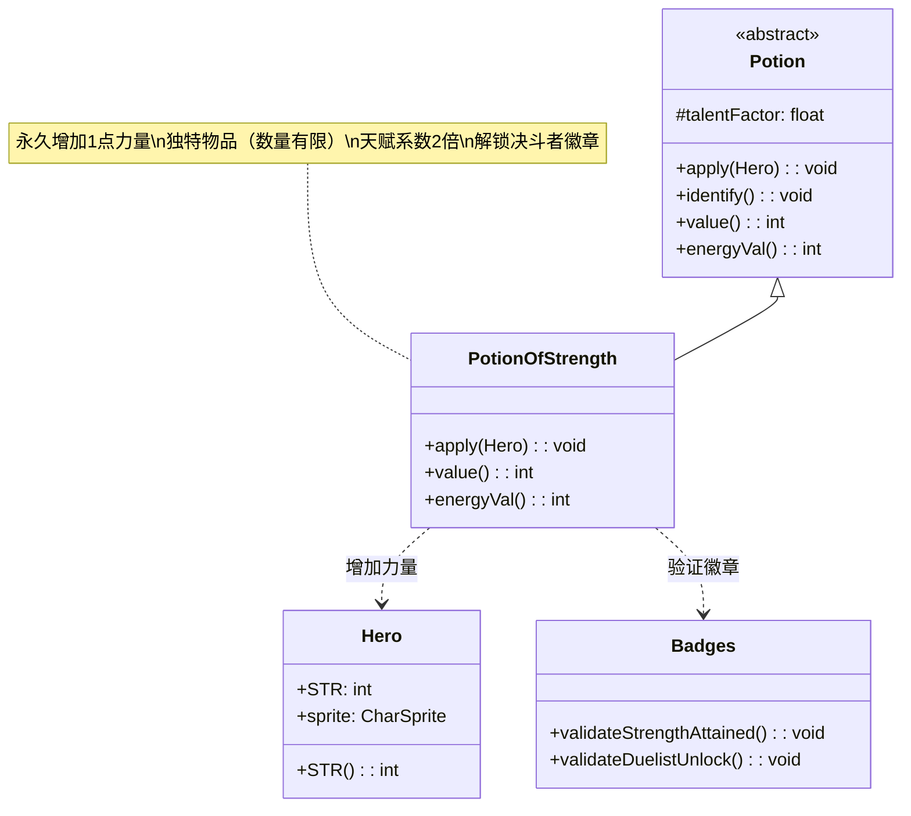

# PotionOfStrength 类文档

## 1. 基本信息
| 属性 | 值 |
|------|-----|
| 文件路径 | core/src/main/java/com/shatteredpixel/shatteredpixeldungeon/items/potions/PotionOfStrength.java |
| 包名 | com.shatteredpixel.shatteredpixeldungeon.items.potions |
| 类类型 | class |
| 继承关系 | extends Potion |
| 代码行数 | 64 |

## 2. 类职责说明
PotionOfStrength 是力量药水类，饮用后永久增加英雄1点力量属性。力量属性影响近战伤害和装备穿戴要求，是游戏中最珍贵的属性之一。该药水被标记为 unique（独特），每局游戏数量有限。同时天赋触发系数为2，使用时天赋效果更强。

## 4. 继承与协作关系


## 静态常量表
| 常量名 | 类型 | 值 | 说明 |
|--------|------|-----|------|
| 无 | - | - | 本类无静态常量 |

## 实例字段表
| 字段名 | 类型 | 修饰符 | 说明 |
|--------|------|--------|------|
| icon | int | (初始化块) | ItemSpriteSheet.Icons.POTION_STRENGTH |
| unique | boolean | (初始化块) | true，独特物品，每局游戏数量有限 |
| talentFactor | float | (初始化块) | 2f，天赋触发强度为普通药水的2倍 |

## 7. 方法详解

### apply(Hero hero)
**签名**: `@Override public void apply(Hero hero)`
**功能**: 英雄饮用力量药水的效果
**参数**:
- hero: Hero - 饮用药水的英雄
**实现逻辑**:
```java
// 第42-53行
identify(); // 鉴定药水

hero.STR++; // 永久增加1点力量

// 显示力量提升状态
hero.sprite.showStatusWithIcon(
    CharSprite.POSITIVE, 
    "1", 
    FloatingText.STRENGTH
);

// 显示日志消息
GLog.p(Messages.get(this, "msg", hero.STR()));

// 验证徽章
Badges.validateStrengthAttained();
Badges.validateDuelistUnlock();
```
- 饮用后立即鉴定
- 直接增加英雄的力量属性
- 显示"+1 STR"浮动文字
- 记录当前总力量值
- 验证力量相关徽章成就

### value()
**签名**: `@Override public int value()`
**功能**: 返回药水的金币价值
**返回值**: int - 药水价值
**实现逻辑**:
```java
// 第56-58行
return isKnown() ? 50 * quantity : super.value();
```
- 已鉴定的力量药水价值50金币/瓶
- 与经验药水相同

### energyVal()
**签名**: `@Override public int energyVal()`
**功能**: 返回药水的能量值（用于商店兑换）
**返回值**: int - 能量值
**实现逻辑**:
```java
// 第61-63行
return isKnown() ? 10 * quantity : super.energyVal();
```
- 已鉴定的力量药水能量值10/瓶
- 与经验药水相同

## 11. 使用示例

### 饮用力量药水
```java
// 创建力量药水
PotionOfStrength potion = new PotionOfStrength();

// 英雄饮用前
int beforeSTR = hero.STR(); // 假设为10

// 英雄饮用
potion.apply(hero);

// 饮用后
int afterSTR = hero.STR(); // 现在为11

// 效果：
// 1. 鉴定药水
// 2. 力量+1
// 3. 显示"+1 STR"
// 4. 日志显示新力量值
// 5. 验证徽章
```

### 力量对战斗的影响
```java
// 力量影响近战伤害
// 基础伤害 = 武器伤害
// 额外伤害 = (力量 - 武器力量需求) × 修正系数

// 力量影响装备穿戴
// 装备需求：str > item.strReq()
if (hero.STR() >= armor.strReq()) {
    // 可以穿戴
}
```

## 注意事项

1. **独特物品**: `unique = true` 意味着：
   - 每局游戏数量有限
   - 不通过普通掉落大量获取
   - 主要通过固定位置（力量房间）获取

2. **永久效果**: 力量提升是永久的，不受死亡或重置影响

3. **天赋加成**: talentFactor = 2，使用时天赋效果翻倍

4. **徽章关联**: 
   - validateStrengthAttained(): 验证力量达标徽章
   - validateDuelistUnlock(): 验证决斗者解锁条件

5. **高价值**: 
   - 金币价值50，能量价值10
   - 是最有价值的普通药水之一

## 最佳实践

1. **优先使用**: 力量药水非常珍贵，遇到就应使用

2. **装备需求**: 在需要穿戴高级装备时，确保有足够力量

3. **伤害优化**: 力量超过武器需求会增加伤害，适合近战流派

4. **保存策略**: 如果已有足够力量穿戴装备，可以保存药水用于更高需求的装备