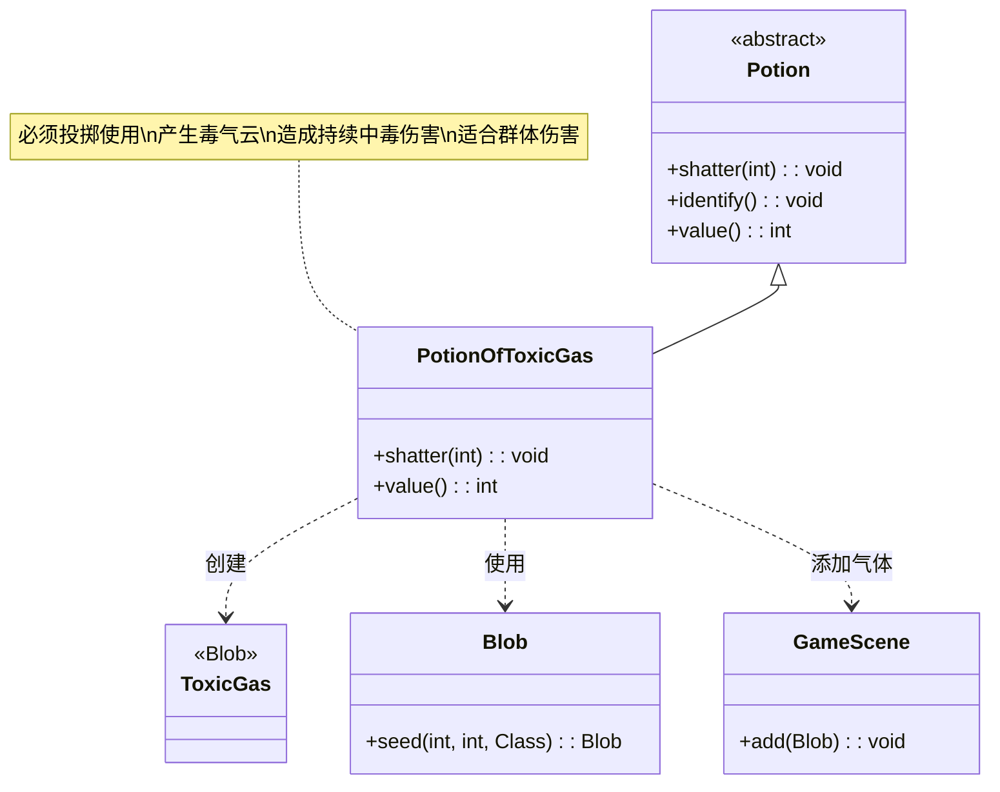

# PotionOfToxicGas 类文档

## 1. 基本信息
| 属性 | 值 |
|------|-----|
| 文件路径 | core/src/main/java/com/shatteredpixel/shatteredpixeldungeon/items/potions/PotionOfToxicGas.java |
| 包名 | com.shatteredpixel.shatteredpixeldungeon.items.potions |
| 类类型 | class |
| 继承关系 | extends Potion |
| 代码行数 | 56 |

## 2. 类职责说明
PotionOfToxicGas 是毒气药水类，是一种必须投掷使用的药水。投掷后会在目标位置产生大量毒气云。毒气会对范围内的角色造成持续的中毒伤害，这是一种强大的区域伤害手段，特别适合对付无法抵抗毒素的敌人和清理密集敌群。

## 4. 继承与协作关系


## 静态常量表
| 常量名 | 类型 | 值 | 说明 |
|--------|------|-----|------|
| 无 | - | - | 本类无静态常量 |

## 实例字段表
| 字段名 | 类型 | 修饰符 | 说明 |
|--------|------|--------|------|
| icon | int | (初始化块) | ItemSpriteSheet.Icons.POTION_TOXICGAS |

## 7. 方法详解

### shatter(int cell)
**签名**: `@Override public void shatter(int cell)`
**功能**: 药水投掷碎裂时的效果，产生毒气云
**参数**:
- cell: int - 目标格子坐标
**实现逻辑**:
```java
// 第39-50行
splash(cell); // 显示溅射效果

// 如果在英雄视野内
if (Dungeon.level.heroFOV[cell]) {
    identify(); // 鉴定药水
    
    // 播放音效
    Sample.INSTANCE.play(Assets.Sounds.SHATTER);
    Sample.INSTANCE.play(Assets.Sounds.GAS);
}

// 在目标位置生成毒气，气体量1000
GameScene.add(Blob.seed(cell, 1000, ToxicGas.class));
```
- 在目标位置产生大量毒气
- 气体量=1000，产生较大范围的气体云
- 播放碎裂和气体双重音效

### value()
**签名**: `@Override public int value()`
**功能**: 返回药水的金币价值
**返回值**: int - 药水价值
**实现逻辑**:
```java
// 第53-55行
return isKnown() ? 30 * quantity : super.value();
```
- 已鉴定的毒气药水价值30金币/瓶
- 属于基础价值药水

## 11. 使用示例

### 投掷毒气药水
```java
// 创建毒气药水
PotionOfToxicGas potion = new PotionOfToxicGas();

// 投掷到敌人位置
potion.cast(hero, enemyCell);

// 效果：
// 1. 药水碎裂，播放音效
// 2. 产生大量毒气云
// 3. 范围内的角色中毒
// 4. 如果在视野内自动鉴定
```

### 毒气效果详解
```java
// 毒气效果：
// 1. 扩散
// 气体从目标位置向外扩散
// 影响范围随时间增大

// 2. 中毒效果
for (Char ch : affectedChars) {
    if (!ch.immunizedBuffs().contains(Poison.class)) {
        // 角色中毒
        Buff.affect(ch, Poison.class).set(duration);
        // 每回合受到伤害
        // 伤害随时间衰减
    }
}

// 3. 持续时间
// 由气体量和角色抗性决定
```

### 战术应用
```java
// 场景1：群体伤害
// 对密集敌群使用
if (enemyCount >= 3) {
    potion.cast(hero, centerOfEnemyGroup);
    // 多个敌人中毒，持续受到伤害
}

// 场景2：清理弱敌
// 毒气可以杀死较弱的敌人
potion.cast(hero, weakEnemies);
// 弱敌可能直接被毒死

// 场景3：持续伤害
// 配合其他攻击
potion.cast(hero, enemies);
// 敌人中毒后继续攻击

// 场景4：对付毒素弱点敌人
// 某些敌人惧怕毒素
potion.cast(hero, vulnerableEnemy);
// 造成更大伤害
```

## 注意事项

1. **必须投掷**: 此药水在 `mustThrowPots` 集合中，必须投掷使用

2. **气体量**: 1000，产生较大范围的气体云

3. **中毒效果**:
   - 造成持续伤害
   - 伤害随时间衰减
   - 不立即杀死角色

4. **抗性**: 某些敌人免疫毒素（如骷髅、机械敌人等）

5. **扩散**: 气体会向外扩散，影响范围随时间增大

6. **价值**: 30金币，属于基础价值药水

7. **安全距离**: 确保自己不在气体范围内

## 最佳实践

1. **群体伤害**: 对密集敌群使用效果最佳

2. **弱敌清理**: 快速杀死较弱的敌人

3. **持续伤害**: 配合其他攻击手段

4. **弱点利用**: 对毒素弱点敌人效果更好

5. **安全距离**: 确保自己不在气体范围内

6. **组合战术**:
   - 先用麻痹气体控制敌人
   - 再用毒气造成伤害

7. **环境利用**: 在封闭空间使用，气体不易消散

8. **敌人选择**: 对无法抵抗毒素的敌人效果更好