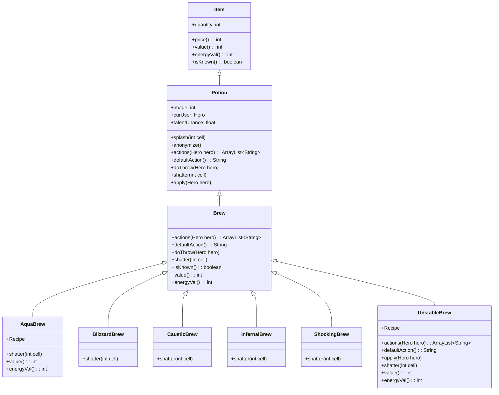

```mermaid
classDiagram
    class Item {
        +quantity: int
        +price(): int
        +value(): int
        +energyVal(): int
        +isKnown(): boolean
    }
    
    class Potion {
        +image: int
        +curUser: Hero
        +talentChance: float
        +splash(int cell)
        +anonymize()
        +actions(Hero hero): ArrayList~String~
        +defaultAction(): String
        +doThrow(Hero hero)
        +shatter(int cell)
        +apply(Hero hero)
    }
    
    class Brew {
        +actions(Hero hero): ArrayList~String~
        +defaultAction(): String
        +doThrow(Hero hero)
        +shatter(int cell)
        +isKnown(): boolean
        +value(): int
        +energyVal(): int
    }
    
    class AquaBrew {
        +shatter(int cell)
        +value(): int
        +energyVal(): int
        +Recipe
    }
    
    class BlizzardBrew {
        +shatter(int cell)
    }
    
    class CausticBrew {
        +shatter(int cell)
    }
    
    class InfernalBrew {
        +shatter(int cell)
    }
    
    class ShockingBrew {
        +shatter(int cell)
    }
    
    class UnstableBrew {
        +actions(Hero hero): ArrayList~String~
        +defaultAction(): String
        +apply(Hero hero)
        +shatter(int cell)
        +value(): int
        +energyVal(): int
        +Recipe
    }
    
    Item <|-- Potion
    Potion <|-- Brew
    Brew <|-- AquaBrew
    Brew <|-- BlizzardBrew
    Brew <|-- CausticBrew
    Brew <|-- InfernalBrew
    Brew <|-- ShockingBrew
    Brew <|-- UnstableBrew
```