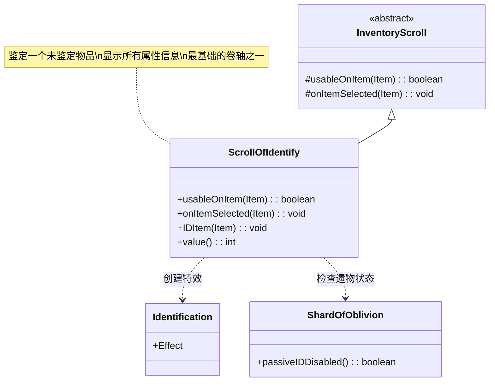

# ScrollOfIdentify 类文档

## 1. 基本信息
| 属性 | 值 |
|------|-----|
| 文件路径 | core/src/main/java/com/shatteredpixel/shatteredpixeldungeon/items/scrolls/ScrollOfIdentify.java |
| 包名 | com.shatteredpixel.shatteredpixeldungeon.items.scrolls |
| 类类型 | class |
| 继承关系 | extends InventoryScroll |
| 代码行数 | 87 |

## 2. 类职责说明
ScrollOfIdentify 是鉴定卷轴类，使用后可以选择一个未鉴定的物品进行完全鉴定。鉴定后的物品会显示所有属性、附魔、诅咒状态等信息。这是游戏中最基础也最重要的卷轴之一，因为它可以让玩家了解物品的真实属性。

## 4. 继承与协作关系


## 静态常量表
| 常量名 | 类型 | 值 | 说明 |
|--------|------|-----|------|
| 无 | - | - | 本类无静态常量 |

## 实例字段表
| 字段名 | 类型 | 修饰符 | 说明 |
|--------|------|--------|------|
| icon | int | (初始化块) | ItemSpriteSheet.Icons.SCROLL_IDENTIFY |
| bones | boolean | (初始化块) | true，可出现在遗骨中 |

## 7. 方法详解

### usableOnItem(Item item)
**签名**: `@Override protected boolean usableOnItem(Item item)`
**功能**: 检查物品是否可以被鉴定
**参数**:
- item: Item - 待检查的物品
**返回值**: boolean - 是否可以鉴定
**实现逻辑**:
```java
// 第45-47行
return !item.isIdentified();
```
- 只有未鉴定的物品可以被选择

### onItemSelected(Item item)
**签名**: `@Override protected void onItemSelected(Item item)`
**功能**: 当玩家选择物品后执行鉴定效果
**参数**:
- item: Item - 被选中的物品
**实现逻辑**:
```java
// 第50-55行
// 显示鉴定特效
curUser.sprite.parent.add(
    new Identification(curUser.sprite.center().offset(0, -16))
);

// 执行鉴定
IDItem(item);
```

### IDItem(Item item)
**签名**: `public static void IDItem(Item item)`
**功能**: 静态方法，鉴定指定物品
**参数**:
- item: Item - 要鉴定的物品
**实现逻辑**:
```java
// 第57-81行
// 检查是否禁用被动鉴定（遗物效果）
if (ShardOfOblivion.passiveIDDisabled()) {
    // 武器、护甲、戒指、法杖：设置为"准备鉴定"状态
    if (item instanceof Weapon) {
        ((Weapon) item).setIDReady();
        GLog.p(Messages.get(ShardOfOblivion.class, "identify_ready"), item.name());
        return;
    }
    // ... 类似处理 Armor, Ring, Wand
    
    // 其他物品直接鉴定
    item.identify();
    GLog.i(Messages.get(ScrollOfIdentify.class, "it_is", item.title()));
    Badges.validateItemLevelAquired(item);
}
```
- 处理遗物"遗忘碎片"的特殊机制
- 普通情况直接鉴定物品

### value()
**签名**: `@Override public int value()`
**功能**: 返回卷轴的金币价值
**返回值**: int - 卷轴价值
**实现逻辑**:
```java
// 第84-86行
return isKnown() ? 30 * quantity : super.value();
```
- 已鉴定的鉴定卷轴价值30金币

## 11. 使用示例

### 使用鉴定卷轴
```java
// 创建鉴定卷轴
ScrollOfIdentify scroll = new ScrollOfIdentify();

// 使用卷轴
scroll.execute(hero, Scroll.AC_READ);

// 流程：
// 1. 打开物品选择界面（只显示未鉴定物品）
// 2. 玩家选择一个物品
// 3. 物品被完全鉴定
// 4. 显示鉴定特效
```

### 直接鉴定物品（程序调用）
```java
// 直接调用静态方法鉴定物品
Item unknownItem = new Weapon();
ScrollOfIdentify.IDItem(unknownItem);

// 效果：
// - 物品被完全鉴定
// - 显示日志消息
// - 验证徽章成就
```

### 遗物效果下的鉴定
```java
// 当拥有"遗忘碎片"遗物时
// 鉴定卷轴不会立即鉴定，而是设置"准备鉴定"状态
// 物品需要通过使用来触发鉴定

if (ShardOfOblivion.passiveIDDisabled()) {
    // 武器设置为"准备鉴定"
    weapon.setIDReady();
    // 使用武器一段时间后自动鉴定
}
```

## 注意事项

1. **选择限制**: 只能选择未鉴定的物品

2. **遗物影响**: 遗忘碎片遗物会改变鉴定机制

3. **鉴定范围**: 完全鉴定，包括：
   - 物品等级
   - 附魔/符文
   - 诅咒状态
   - 所有属性

4. **价值**: 30金币，基础价值

## 最佳实践

1. **优先鉴定**: 优先鉴定价值高、使用频繁的装备

2. **未知物品**: 对未知效果的物品使用鉴定可以了解其属性

3. **诅咒检查**: 鉴定是发现诅咒的安全方法

4. **遗物配合**: 配合遗忘碎片遗物可以更快鉴定装备