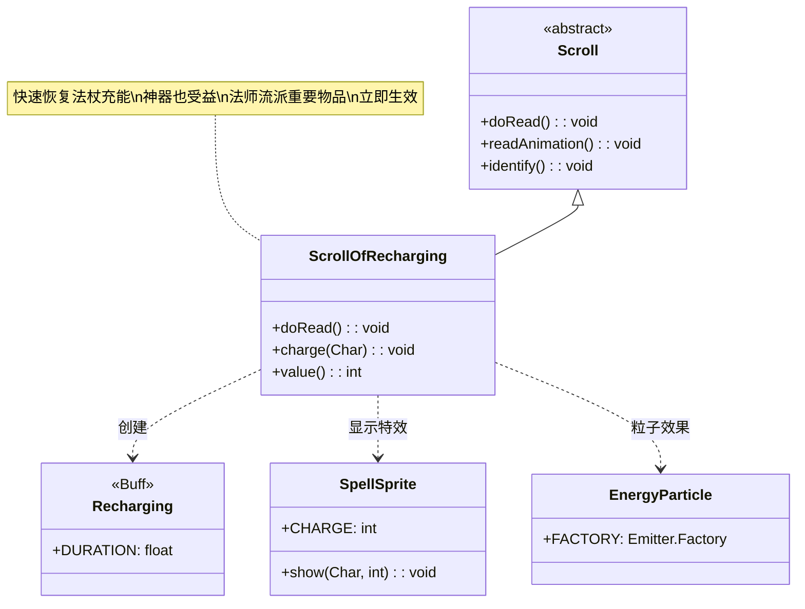

# ScrollOfRecharging 类文档

## 1. 基本信息
| 属性 | 值 |
|------|-----|
| 文件路径 | core/src/main/java/com/shatteredpixel/shatteredpixeldungeon/items/scrolls/ScrollOfRecharging.java |
| 包名 | com.shatteredpixel.shatteredpixeldungeon.items.scrolls |
| 类类型 | class |
| 继承关系 | extends Scroll |
| 代码行数 | 70 |

## 2. 类职责说明
ScrollOfRecharging 是充能卷轴类，使用后使英雄进入充能状态。在充能状态下，法杖和神器会以更快的速度恢复充能。这是法师流派的重要物品，可以快速恢复法杖的使用次数，让英雄能够更频繁地使用魔法。该卷轴不需要选择物品，使用后立即生效。

## 4. 继承与协作关系


## 静态常量表
| 常量名 | 类型 | 值 | 说明 |
|--------|------|-----|------|
| 无 | - | - | 本类无静态常量 |

## 实例字段表
| 字段名 | 类型 | 修饰符 | 说明 |
|--------|------|--------|------|
| icon | int | (初始化块) | ItemSpriteSheet.Icons.SCROLL_RECHARGE |

## 7. 方法详解

### doRead()
**签名**: `@Override public void doRead()`
**功能**: 执行阅读卷轴的效果，施加充能状态
**实现逻辑**:
```java
// 第43-57行
// 从背包移除卷轴
detach(curUser.belongings.backpack);

// 施加充能状态，持续标准时间
Buff.affect(curUser, Recharging.class, Recharging.DURATION);

// 显示充能特效
charge(curUser);

// 播放音效
Sample.INSTANCE.play(Assets.Sounds.READ);
Sample.INSTANCE.play(Assets.Sounds.CHARGEUP);

// 显示日志消息
GLog.i(Messages.get(this, "surge"));

// 显示法术特效
SpellSprite.show(curUser, SpellSprite.CHARGE);

// 鉴定卷轴
identify();

// 播放阅读动画
readAnimation();
```
- 施加充能状态
- 显示充能特效和光芒
- 播放双重音效

### charge(Char user)
**签名**: `public static void charge(Char user)`
**功能**: 显示充能粒子特效
**参数**:
- user: Char - 接受特效的角色
**实现逻辑**:
```java
// 第59-64行
if (user.sprite != null) {
    Emitter e = user.sprite.centerEmitter();
    if (e != null) {
        e.burst(EnergyParticle.FACTORY, 15);
    }
}
```
- 在角色中心爆发15个能量粒子

### value()
**签名**: `@Override public int value()`
**功能**: 返回卷轴的金币价值
**返回值**: int - 卷轴价值
**实现逻辑**:
```java
// 第67-69行
return isKnown() ? 30 * quantity : super.value();
```
- 已鉴定的充能卷轴价值30金币

## 11. 使用示例

### 使用充能卷轴
```java
// 创建充能卷轴
ScrollOfRecharging scroll = new ScrollOfRecharging();

// 使用卷轴
scroll.execute(hero, Scroll.AC_READ);

// 效果：
// 1. 英雄进入充能状态
// 2. 显示能量粒子特效
// 3. 播放充能音效
// 4. 法杖和神器快速恢复充能
```

### 充能状态效果
```java
// 充能状态下：
if (hero.buff(Recharging.class) != null) {
    // 法杖充能速度加快
    // 神器充能速度加快
    // 持续时间：Recharging.DURATION
    
    // 充能速度通常是正常的2倍
    // 具体取决于物品类型
}
```

### 战术应用
```java
// 场景1：Boss战前准备
// 使用充能卷轴快速恢复法杖
new ScrollOfRecharging().execute(hero, Scroll.AC_READ);
// 法杖充能恢复，准备战斗

// 场景2：连续施法
// 在需要频繁使用法杖时
scroll.execute(hero, Scroll.AC_READ);
// 快速恢复法杖使用次数

// 场景3：神器充能
// 某些神器也需要充能
// 充能卷轴可以加速恢复
```

## 注意事项

1. **立即生效**: 不需要选择物品，使用后立即生效

2. **充能范围**: 影响所有需要充能的物品：
   - 法杖
   - 神器
   - 其他可充能装备

3. **持续时间**: 由 Recharging.DURATION 定义

4. **音效**: 播放阅读音效和充能音效

5. **价值**: 30金币，基础价值

## 最佳实践

1. **战前准备**: 在Boss战前使用，确保法杖充满

2. **法师流派**: 法师职业应优先保留充能卷轴

3. **连续战斗**: 在长时间战斗中保持法杖可用

4. **神器配合**: 配合需要充能的神器使用效果更好

5. **时机选择**: 在法杖即将耗尽时使用