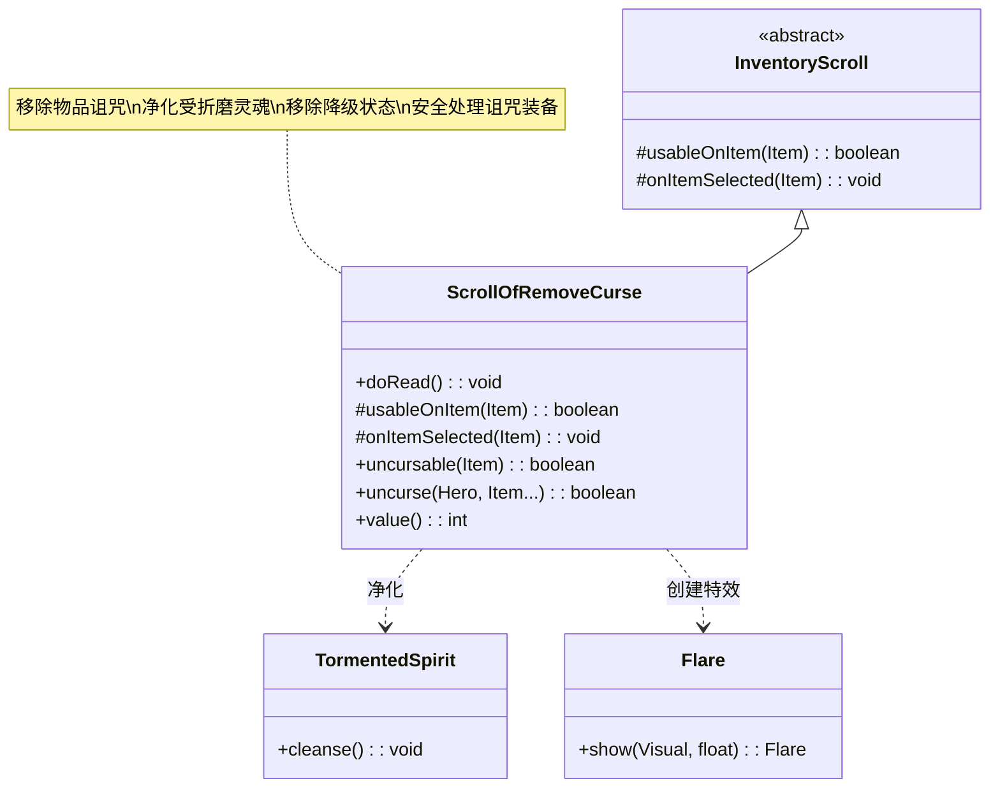

# ScrollOfRemoveCurse 类文档

## 1. 基本信息
| 属性 | 值 |
|------|-----|
| 文件路径 | core/src/main/java/com/shatteredpixel/shatteredpixeldungeon/items/scrolls/ScrollOfRemoveCurse.java |
| 包名 | com.shatteredpixel.shatteredpixeldungeon.items.scrolls |
| 类类型 | class |
| 继承关系 | extends InventoryScroll |
| 代码行数 | 164 |

## 2. 类职责说明
ScrollOfRemoveCurse 是解咒卷轴类，使用后可以选择一个被诅咒的物品来移除诅咒。诅咒会阻止装备脱下并可能带来负面效果。这个卷轴是处理诅咒装备的主要手段，也可以用于净化附近的受折磨灵魂（TormentedSpirit）。此外，它还能移除英雄身上的降级状态（Degrade）。

## 4. 继承与协作关系


## 静态常量表
| 常量名 | 类型 | 值 | 说明 |
|--------|------|-----|------|
| 无 | - | - | 本类无静态常量 |

## 实例字段表
| 字段名 | 类型 | 修饰符 | 说明 |
|--------|------|--------|------|
| icon | int | (初始化块) | ItemSpriteSheet.Icons.SCROLL_REMCURSE |
| preferredBag | Class<? extends Bag> | (初始化块) | Belongings.Backpack.class |

## 7. 方法详解

### doRead()
**签名**: `@Override public void doRead()`
**功能**: 执行阅读卷轴的逻辑，检查是否有受折磨灵魂
**实现逻辑**:
```java
// 第53-78行
// 检查周围是否有受折磨灵魂
TormentedSpirit spirit = null;
for (int i : PathFinder.NEIGHBOURS8) {
    if (Actor.findChar(curUser.pos + i) instanceof TormentedSpirit) {
        spirit = (TormentedSpirit) Actor.findChar(curUser.pos + i);
    }
}

if (spirit != null) {
    // 有受折磨灵魂：直接净化
    identify();
    Sample.INSTANCE.play(Assets.Sounds.READ);
    readAnimation();
    new Flare(6, 32).show(curUser.sprite, 2f);
    
    // 移除降级状态
    if (curUser.buff(Degrade.class) != null) {
        Degrade.detach(curUser, Degrade.class);
    }
    
    detach(curUser.belongings.backpack);
    GLog.p(Messages.get(this, "spirit"));
    spirit.cleanse();
} else {
    // 没有受折磨灵魂：打开物品选择界面
    super.doRead();
}
```
- 优先检查周围的受折磨灵魂
- 有则直接净化，无则打开物品选择

### usableOnItem(Item item)
**签名**: `@Override protected boolean usableOnItem(Item item)`
**功能**: 检查物品是否可以被解咒
**参数**:
- item: Item - 待检查的物品
**返回值**: boolean - 是否可以解咒
**实现逻辑**:
```java
// 第81-83行
return uncursable(item);
```
- 委托给 uncursable() 方法

### uncursable(Item item)
**签名**: `public static boolean uncursable(Item item)`
**功能**: 静态方法，检查物品是否可以被解咒
**参数**:
- item: Item - 待检查的物品
**返回值**: boolean - 是否可以解咒
**实现逻辑**:
```java
// 第85-97行
// 已装备且有降级状态
if (item.isEquipped(Dungeon.hero) && Dungeon.hero.buff(Degrade.class) != null) {
    return true;
}
// 可装备物品：未鉴定或已诅咒
if ((item instanceof EquipableItem || item instanceof Wand) 
    && ((!item.isIdentified() && !item.cursedKnown) || item.cursed)) {
    return true;
}
// 武器有诅咒附魔
if (item instanceof Weapon) {
    return ((Weapon)item).hasCurseEnchant();
}
// 护甲有诅咒符文
if (item instanceof Armor) {
    return ((Armor)item).hasCurseGlyph();
}
return false;
```
- 检查多种诅咒条件

### onItemSelected(Item item)
**签名**: `@Override protected void onItemSelected(Item item)`
**功能**: 当玩家选择物品后执行解咒效果
**参数**:
- item: Item - 被选中的物品
**实现逻辑**:
```java
// 第100-115行
// 显示光芒特效
new Flare(6, 32).show(curUser.sprite, 2f);

// 执行解咒
boolean procced = uncurse(curUser, item);

// 移除降级状态
if (curUser.buff(Degrade.class) != null) {
    Degrade.detach(curUser, Degrade.class);
    procced = true;
}

// 显示结果消息
if (procced) {
    GLog.p(Messages.get(this, "cleansed"));
} else {
    GLog.i(Messages.get(this, "not_cleansed"));
}
```

### uncurse(Hero hero, Item... items)
**签名**: `public static boolean uncurse(Hero hero, Item... items)`
**功能**: 静态方法，移除物品的诅咒
**参数**:
- hero: Hero - 执行解咒的英雄
- items: Item... - 要解咒的物品
**返回值**: boolean - 是否成功移除了诅咒
**实现逻辑**:
```java
// 第117-158行
boolean procced = false;
for (Item item : items) {
    if (item != null) {
        item.cursedKnown = true;  // 标记诅咒状态已知
        if (item.cursed) {
            procced = true;
            item.cursed = false;  // 移除诅咒
        }
    }
    // 移除武器的诅咒附魔
    if (item instanceof Weapon) {
        Weapon w = (Weapon) item;
        if (w.hasCurseEnchant()) {
            w.enchant(null);
            procced = true;
        }
    }
    // 移除护甲的诅咒符文
    if (item instanceof Armor) {
        Armor a = (Armor) item;
        if (a.hasCurseGlyph()) {
            a.inscribe(null);
            procced = true;
        }
    }
    // 更新法杖等级
    if (item instanceof Wand) {
        ((Wand) item).updateLevel();
    }
}

if (procced) {
    // 显示特效
    hero.sprite.emitter().start(ShadowParticle.UP, 0.05f, 10);
    hero.updateHT(false);  // 更新生命上限（力量戒指）
    updateQuickslot();
    Badges.validateClericUnlock();
}

return procced;
```

## 11. 使用示例

### 使用解咒卷轴
```java
// 创建解咒卷轴
ScrollOfRemoveCurse scroll = new ScrollOfRemoveCurse();

// 使用卷轴
scroll.execute(hero, Scroll.AC_READ);

// 流程：
// 1. 检查周围是否有受折磨灵魂
// 2. 有则直接净化
// 3. 无则打开物品选择界面
// 4. 玩家选择一个物品
// 5. 移除物品诅咒
```

### 直接解咒物品
```java
// 直接调用静态方法解咒
Item cursedItem = new Weapon();
cursedItem.cursed = true;

boolean success = ScrollOfRemoveCurse.uncurse(hero, cursedItem);
// success = true，诅咒已移除
```

### 净化受折磨灵魂
```java
// 当英雄站在受折磨灵魂旁边使用卷轴
TormentedSpirit spirit = ...; // 在英雄旁边

scroll.execute(hero, Scroll.AC_READ);
// 效果：灵魂被净化，卷轴消耗
```

## 注意事项

1. **受折磨灵魂优先**: 如果附近有受折磨灵魂，会优先净化

2. **降级状态**: 同时移除英雄身上的降级状态

3. **诅咒类型**: 可以移除：
   - 物品诅咒（无法脱下）
   - 诅咒附魔
   - 诅咒符文

4. **鉴定**: 使用后会标记诅咒状态为已知

5. **价值**: 30金币，基础价值

## 最佳实践

1. **发现诅咒**: 对未知装备使用可以安全检查是否有诅咒

2. **灵魂净化**: 主动寻找受折磨灵魂进行净化

3. **降级恢复**: 配合使用移除降级状态

4. **批量解咒**: 可以同时对多个物品解咒