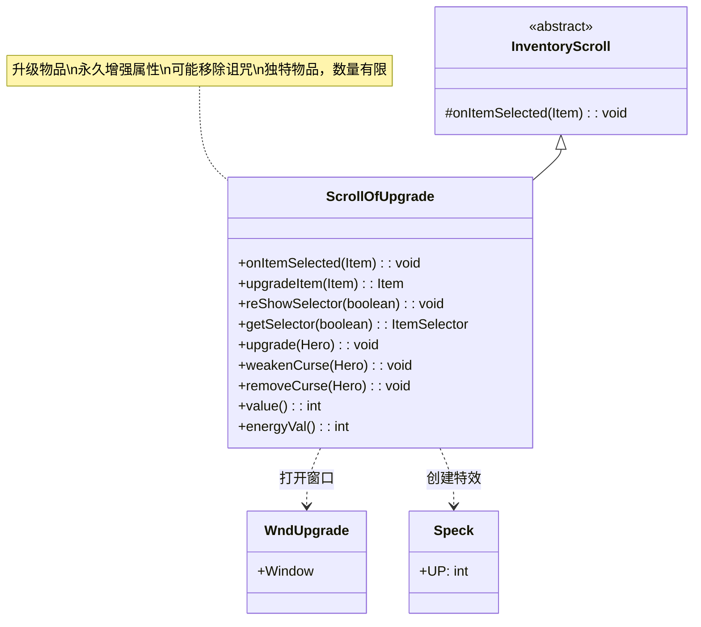

# ScrollOfUpgrade 类文档

## 1. 基本信息
| 属性 | 值 |
|------|-----|
| 文件路径 | core/src/main/java/com/shatteredpixel/shatteredpixeldungeon/items/scrolls/ScrollOfUpgrade.java |
| 包名 | com.shatteredpixel.shatteredpixeldungeon.items.scrolls |
| 类类型 | class |
| 继承关系 | extends InventoryScroll |
| 代码行数 | 173 |

## 2. 类职责说明
ScrollOfUpgrade 是升级卷轴类，使用后可以选择一个可升级的物品进行升级。升级会提升物品的等级，增强其属性，并可能移除诅咒。这是游戏中最珍贵的卷轴之一，因为它可以永久增强装备。升级卷轴被标记为独特物品（unique），每局游戏数量有限。

## 4. 继承与协作关系


## 静态常量表
| 常量名 | 类型 | 值 | 说明 |
|--------|------|-----|------|
| 无 | - | - | 本类无静态常量 |

## 实例字段表
| 字段名 | 类型 | 修饰符 | 说明 |
|--------|------|--------|------|
| icon | int | (初始化块) | ItemSpriteSheet.Icons.SCROLL_UPGRADE |
| preferredBag | Class<? extends Bag> | (初始化块) | Belongings.Backpack.class |
| unique | boolean | (初始化块) | true，独特物品 |
| talentFactor | float | (初始化块) | 2f，天赋触发强度翻倍 |

## 7. 方法详解

### usableOnItem(Item item)
**签名**: `@Override protected boolean usableOnItem(Item item)`
**功能**: 检查物品是否可以升级
**参数**:
- item: Item - 待检查的物品
**返回值**: boolean - 是否可以升级
**实现逻辑**:
```java
// 第57-59行
return item.isUpgradable();
```
- 只有可升级的物品可以被选择

### onItemSelected(Item item)
**签名**: `@Override protected void onItemSelected(Item item)`
**功能**: 当玩家选择物品后打开升级窗口
**参数**:
- item: Item - 被选中的物品
**实现逻辑**:
```java
// 第62-66行
GameScene.show(new WndUpgrade(this, item, identifiedByUse));
```
- 打开专门的升级确认窗口

### upgradeItem(Item item)
**签名**: `public Item upgradeItem(Item item)`
**功能**: 执行物品升级
**参数**:
- item: Item - 要升级的物品
**返回值**: Item - 升级后的物品
**实现逻辑**:
```java
// 第80-147行
// 1. 显示升级特效
upgrade(curUser);

// 2. 移除降级状态
Degrade.detach(curUser, Degrade.class);

// 3. 根据物品类型处理升级
if (item instanceof Weapon) {
    Weapon w = (Weapon) item;
    boolean wasCursed = w.cursed;
    boolean wasHardened = w.enchantHardened;
    boolean hadCursedEnchant = w.hasCurseEnchant();
    boolean hadGoodEnchant = w.hasGoodEnchant();

    item = w.upgrade();

    // 处理诅咒附魔移除
    if (w.cursedKnown && hadCursedEnchant && !w.hasCurseEnchant()) {
        removeCurse(Dungeon.hero);
    } 
    // 处理诅咒减弱
    else if (w.cursedKnown && wasCursed && !w.cursed) {
        weakenCurse(Dungeon.hero);
    }
    // 处理硬化消失
    if (wasHardened && !w.enchantHardened) {
        GLog.w(Messages.get(Weapon.class, "hardening_gone"));
    }
    // 处理良性附魔消失
    else if (hadGoodEnchant && !w.hasGoodEnchant()) {
        GLog.w(Messages.get(Weapon.class, "incompatible"));
    }
}
// 类似处理 Armor, Wand, Ring

// 4. 更新统计和徽章
Badges.validateItemLevelAquired(item);
Statistics.upgradesUsed++;
Badges.validateMageUnlock();
Catalog.countUse(item.getClass());

return item;
```

### upgrade(Hero hero)
**签名**: `public static void upgrade(Hero hero)`
**功能**: 显示升级特效
**参数**:
- hero: Hero - 接受特效的英雄
**实现逻辑**:
```java
// 第149-151行
hero.sprite.emitter().start(Speck.factory(Speck.UP), 0.2f, 3);
```
- 显示3个上升的光点特效

### weakenCurse(Hero hero)
**签名**: `public static void weakenCurse(Hero hero)`
**功能**: 显示诅咒减弱效果
**参数**:
- hero: Hero - 受影响的英雄
**实现逻辑**:
```java
// 第153-156行
GLog.p(Messages.get(ScrollOfUpgrade.class, "weaken_curse"));
hero.sprite.emitter().start(ShadowParticle.UP, 0.05f, 5);
```
- 显示5个上升的阴影粒子

### removeCurse(Hero hero)
**签名**: `public static void removeCurse(Hero hero)`
**功能**: 显示诅咒移除效果
**参数**:
- hero: Hero - 受影响的英雄
**实现逻辑**:
```java
// 第158-162行
GLog.p(Messages.get(ScrollOfUpgrade.class, "remove_curse"));
hero.sprite.emitter().start(ShadowParticle.UP, 0.05f, 10);
Badges.validateClericUnlock();
```
- 显示10个上升的阴影粒子
- 验证牧师解锁徽章

## 11. 使用示例

### 使用升级卷轴
```java
// 创建升级卷轴
ScrollOfUpgrade scroll = new ScrollOfUpgrade();

// 使用卷轴
scroll.execute(hero, Scroll.AC_READ);

// 流程：
// 1. 打开物品选择界面（只显示可升级物品）
// 2. 玩家选择一个物品
// 3. 打开升级确认窗口
// 4. 确认后物品升级
// 5. 显示升级特效
```

### 升级效果
```java
// 武器升级
Weapon weapon = new Sword();
int oldLevel = weapon.level();
weapon.upgrade();
int newLevel = weapon.level(); // oldLevel + 1

// 升级效果：
// - 伤害提升
// - 可能移除诅咒附魔
// - 属性增强
```

## 注意事项

1. **独特物品**: 升级卷轴数量有限，每局游戏固定数量

2. **升级效果**:
   - 提升物品等级
   - 增强属性
   - 可能移除/减弱诅咒
   - 可能移除附魔硬化

3. **附魔变化**: 升级可能导致良性附魔消失

4. **天赋加成**: talentFactor = 2，天赋效果翻倍

5. **价值**: 已鉴定价值50金币，能量价值10

## 最佳实践

1. **优先升级**: 优先升级常用装备

2. **诅咒处理**: 升级可以安全移除诅咒

3. **附魔注意**: 升级可能移除附魔硬化

4. **等级规划**: 合理分配升级卷轴到不同装备

5. **配合使用**: 配合力量药水穿戴高级装备后升级