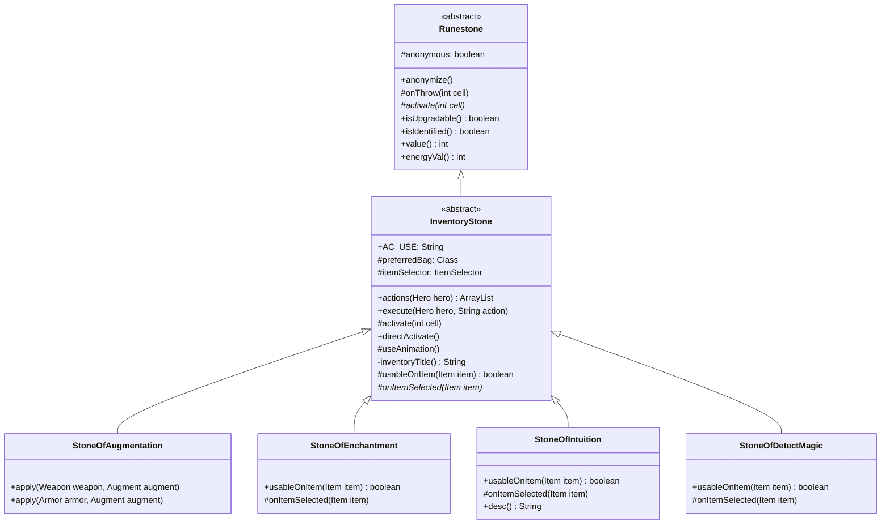

# InventoryStone 文档

## 1. 基本信息

| 属性 | 值 |
|------|-----|
| **文件路径** | core/src/main/java/com/shatteredpixel/shatteredpixeldungeon/items/stones/InventoryStone.java |
| **包名** | com.shatteredpixel.shatteredpixeldungeon.items.stones |
| **文件类型** | abstract class |
| **继承关系** | extends Runestone |
| **代码行数** | 124 |
| **所属模块** | core |

## 2. 文件职责说明

### 核心职责
InventoryStone 是需要从背包中选择物品才能使用的符石的抽象基类。它提供了物品选择界面（WndBag）的集成，让玩家可以选择目标物品后触发符石效果。

### 系统定位
位于 Runestone → InventoryStone 继承链中，为 StoneOfAugmentation、StoneOfEnchantment、StoneOfIntuition、StoneOfDetectMagic 等需要选择物品的符石提供统一的基础设施。

### 不负责什么
- 不负责具体的物品处理逻辑（由子类的 `onItemSelected()` 实现）
- 不负责物品选择后的效果（由子类实现）

## 3. 结构总览

### 主要成员概览
- `AC_USE` - 使用动作常量
- `preferredBag` - 优先显示的背包类型
- `itemSelector` - 物品选择器回调

### 主要逻辑块概览
- `actions()` - 添加"使用"动作
- `execute()` - 执行使用动作
- `activate()` - 启动物品选择界面
- `useAnimation()` - 播放使用动画
- `itemSelector` - 物品选择回调处理

### 生命周期/调用时机
1. 玩家打开物品菜单
2. 选择"使用"动作
3. 弹出物品选择界面
4. 玩家选择物品
5. 触发 `onItemSelected()` 执行效果

## 4. 继承与协作关系

### 父类提供的能力
从 Runestone 继承：
- `stackable = true` - 可堆叠
- `defaultAction` - 默认动作
- `anonymous` 匿名机制
- `onThrow()` 投掷逻辑
- `activate()` 激活逻辑
- `value()`、`energyVal()` 价值计算

### 覆写的方法
| 方法 | 覆写逻辑 |
|------|----------|
| `actions(Hero hero)` | 添加 AC_USE 动作 |
| `execute(Hero hero, String action)` | 处理 AC_USE 动作 |
| `activate(int cell)` | 启动物品选择界面 |

### 实现的接口契约
无显式接口实现。

### 依赖的关键类
| 类名 | 用途 |
|------|------|
| `Hero` | 英雄角色 |
| `Item` | 物品基类 |
| `Bag` | 背包基类 |
| `GameScene` | 游戏场景，用于显示选择界面 |
| `WndBag` | 背包窗口 |
| `Messages` | 国际化消息 |
| `Sample` | 音效播放 |
| `Invisibility` | 隐形状态处理 |
| `MagicImmune` | 魔法免疫检查 |

### 使用者
- `StoneOfAugmentation` - 强化符石
- `StoneOfEnchantment` - 附魔符石
- `StoneOfIntuition` - 感知符石
- `StoneOfDetectMagic` - 探魔符石

## 5. 字段/常量详解

### 静态常量
| 常量名 | 类型 | 值 | 说明 |
|--------|------|-----|------|
| `AC_USE` | String | "USE" | 使用动作的标识符，用于在物品菜单中显示"使用"选项 |

### 实例字段
| 字段名 | 类型 | 默认值 | 说明 |
|--------|------|--------|------|
| `defaultAction` | String | AC_USE | 在实例初始化块中设置，默认动作为使用 |
| `preferredBag` | Class<? extends Bag> | null | 优先显示的背包类型，子类可覆盖 |

## 6. 构造与初始化机制

### 构造器
使用默认构造器，通过实例初始化块设置属性：

```java
{
    defaultAction = AC_USE;
}
```

### 初始化块
- `defaultAction = AC_USE` - 默认动作为使用（而非投掷）

### 初始化注意事项
子类应在自己的初始化块中设置：
- `preferredBag` - 指定优先显示的背包类型
- `image` - 精灵图

## 7. 方法详解

### actions(Hero hero)

**可见性**：public

**是否覆写**：是，覆写自 Item

**方法职责**：获取物品可执行的动作列表，添加"使用"动作。

**参数**：
- `hero` (Hero)：执行动作的英雄

**返回值**：ArrayList<String>，包含所有可用动作的列表

**前置条件**：无

**副作用**：无

**核心实现逻辑**：
```java
@Override
public ArrayList<String> actions(Hero hero) {
    ArrayList<String> actions = super.actions( hero );
    actions.add( AC_USE );
    return actions;
}
```

**边界情况**：继承父类动作后添加 AC_USE。

---

### execute(Hero hero, String action)

**可见性**：public

**是否覆写**：是，覆写自 Item

**方法职责**：执行指定的动作，处理 AC_USE 动作的逻辑。

**参数**：
- `hero` (Hero)：执行动作的英雄
- `action` (String)：要执行的动作名称

**返回值**：void

**前置条件**：
- 英雄未被魔法免疫（MagicImmune）影响
- 动作为 AC_USE

**副作用**：
- 调用 `activate()` 启动物品选择
- 设置 `curUser` 为当前英雄

**核心实现逻辑**：
```java
@Override
public void execute(Hero hero, String action) {
    super.execute(hero, action);
    if (action.equals(AC_USE) && hero.buff(MagicImmune.class) == null){
        activate(curUser.pos);
    }
}
```

**边界情况**：
- 魔法免疫状态下的英雄无法使用符石
- 其他动作由父类处理

---

### activate(int cell)

**可见性**：protected

**是否覆写**：是，覆写自 Runestone

**方法职责**：激活符石效果，显示物品选择界面。

**参数**：
- `cell` (int)：激活位置（此参数在 InventoryStone 中未使用）

**返回值**：void

**前置条件**：无

**副作用**：显示物品选择界面（GameScene.selectItem）

**核心实现逻辑**：
```java
@Override
protected void activate(int cell) {
    GameScene.selectItem( itemSelector );
}
```

**边界情况**：cell 参数被忽略，因为 InventoryStone 不依赖位置。

---

### directActivate()

**可见性**：public

**是否覆写**：否

**方法职责**：直接启动物品选择界面，无需经过 execute 流程。

**参数**：无

**返回值**：void

**前置条件**：无

**副作用**：显示物品选择界面

**核心实现逻辑**：
```java
public void directActivate(){
    GameScene.selectItem( itemSelector );
}
```

**边界情况**：用于程序化调用物品选择界面。

---

### useAnimation()

**可见性**：protected

**是否覆写**：否

**方法职责**：播放符石使用的动画和音效，消耗英雄时间。

**参数**：无

**返回值**：void

**前置条件**：`curUser` 已设置

**副作用**：
- 英雄消耗 1 回合时间
- 英雄进入忙碌状态
- 播放操作动画
- 播放阅读音效
- 消除隐形状态

**核心实现逻辑**：
```java
protected void useAnimation() {
    curUser.spend( 1f );
    curUser.busy();
    curUser.sprite.operate(curUser.pos);

    Sample.INSTANCE.play( Assets.Sounds.READ );
    Invisibility.dispel();
}
```

**边界情况**：应在 `onItemSelected()` 中调用此方法以统一处理动画。

---

### inventoryTitle()

**可见性**：private

**是否覆写**：否

**方法职责**：获取物品选择界面的标题。

**参数**：无

**返回值**：String，物品选择界面的标题

**前置条件**：无

**副作用**：无

**核心实现逻辑**：
```java
private String inventoryTitle(){
    return Messages.get(this, "inv_title");
}
```

**边界情况**：从消息文件获取本地化标题，子类应定义 `inv_title` 消息键。

---

### usableOnItem(Item item)

**可见性**：protected

**是否覆写**：否（可被子类覆写）

**方法职责**：判断指定物品是否可以被选择。

**参数**：
- `item` (Item)：要检查的物品

**返回值**：boolean，默认返回 true

**前置条件**：无

**副作用**：无

**核心实现逻辑**：
```java
protected boolean usableOnItem( Item item ){
    return true;
}
```

**边界情况**：子类应覆写此方法以限制可选物品范围。

---

### onItemSelected(Item item)

**可见性**：protected

**是否覆写**：否，这是一个抽象方法

**方法职责**：当玩家选择物品后调用，由子类实现具体处理逻辑。

**参数**：
- `item` (Item)：玩家选择的物品

**返回值**：void

**前置条件**：玩家已选择有效物品

**副作用**：由子类实现决定

**核心实现逻辑**：
```java
protected abstract void onItemSelected( Item item );
```

**边界情况**：此方法必须由所有具体 InventoryStone 子类实现。

---

### itemSelector (WndBag.ItemSelector)

**可见性**：protected

**是否覆写**：否

**方法职责**：物品选择器回调，处理物品选择事件。

**类型**：WndBag.ItemSelector

**核心实现逻辑**：
```java
protected WndBag.ItemSelector itemSelector = new WndBag.ItemSelector() {

    @Override
    public String textPrompt() {
        return inventoryTitle();
    }

    @Override
    public Class<? extends Bag> preferredBag() {
        return preferredBag;
    }

    @Override
    public boolean itemSelectable(Item item) {
        return usableOnItem(item);
    }

    @Override
    public void onSelect( Item item ) {
        // 安全检查
        if (!(curItem instanceof InventoryStone)){
            return;
        }
        
        if (item != null) {
            ((InventoryStone)curItem).onItemSelected( item );
        }
    }
};
```

**边界情况**：
- 包含安全检查确保 `curItem` 是 InventoryStone 实例
- item 为 null 时表示取消选择，不执行任何操作

## 8. 对外暴露能力

### 显式 API
| 方法 | 用途 |
|------|------|
| `actions(Hero hero)` | 获取可用动作列表 |
| `execute(Hero hero, String action)` | 执行动作 |
| `directActivate()` | 直接启动物品选择 |

### 内部辅助方法
| 方法 | 用途 |
|------|------|
| `activate(int cell)` | 启动物品选择界面 |
| `useAnimation()` | 播放使用动画 |
| `inventoryTitle()` | 获取选择界面标题 |
| `usableOnItem(Item item)` | 判断物品是否可选 |
| `onItemSelected(Item item)` | 处理物品选择（抽象） |

### 扩展入口
- `preferredBag` - 设置优先显示的背包类型
- `usableOnItem(Item item)` - 限制可选物品范围
- `onItemSelected(Item item)` - 实现物品处理逻辑（必须实现）

## 9. 运行机制与调用链

### 创建时机
- 通过炼金合成获得
- 在地牢中随机生成
- 商店购买

### 调用者
- `Hero` - 英雄使用符石
- `GameScene` - 显示物品选择界面

### 被调用者
- `GameScene.selectItem()` - 显示物品选择界面
- `WndBag.ItemSelector` - 物品选择回调
- `Sample.INSTANCE.play()` - 播放音效
- `Invisibility.dispel()` - 消除隐形

### 系统流程位置
```
物品菜单 → actions() 添加 AC_USE
    → execute(AC_USE) → activate()
    → GameScene.selectItem(itemSelector)
    → 玩家选择物品 → itemSelector.onSelect()
    → onItemSelected() → 子类实现具体效果
```

## 10. 资源、配置与国际化关联

### 引用的 messages 文案
| 键名 | 中文翻译 | 用途 |
|------|---------|------|
| items.stones.inventorystone.ac_use | 使用 | 使用动作的显示名称 |
| items.stones.stoneofaugmentation.inv_title | 强化一件物品 | 强化符石的选择界面标题 |
| items.stones.stoneofenchantment.inv_title | 附魔一件物品 | 附魔符石的选择界面标题 |
| items.stones.stoneofintuition.inv_title | 选择一件物品 | 感知符石的选择界面标题 |
| items.stones.stoneofdetectmagic.inv_title | 探测一件物品 | 探魔符石的选择界面标题 |

### 依赖的资源
- `Assets.Sounds.READ` - 阅读音效

### 中文翻译来源
来自 `items_zh.properties` 文件。

## 11. 使用示例

### 基本用法
```java
// 使用 InventoryStone（以 StoneOfAugmentation 为例）
StoneOfAugmentation stone = new StoneOfAugmentation();
stone.quantity = 1;

// 玩家在物品菜单选择"使用"
stone.execute(hero, InventoryStone.AC_USE);

// 系统显示物品选择界面
// 玩家选择物品后，onItemSelected() 被调用
```

### 子类实现示例
```java
public class MyInventoryStone extends InventoryStone {
    
    {
        preferredBag = Belongings.Backpack.class;
        image = ItemSpriteSheet.STONE_HOLDER;
    }
    
    @Override
    protected boolean usableOnItem(Item item) {
        // 只允许选择武器
        return item instanceof Weapon;
    }
    
    @Override
    protected void onItemSelected(Item item) {
        Weapon weapon = (Weapon) item;
        // 处理武器...
        useAnimation();
        
        if (!anonymous) {
            curItem.detach(curUser.belongings.backpack);
            Catalog.countUse(getClass());
            Talent.onRunestoneUsed(curUser, curUser.pos, getClass());
        }
    }
}
```

## 12. 开发注意事项

### 状态依赖
- `preferredBag` 影响物品选择界面的默认显示背包
- `curUser` 和 `curItem` 是静态变量，在多线程环境下需注意

### 生命周期耦合
- InventoryStone 的使用流程：选择物品 → 处理物品 → 销毁符石
- 子类必须在 `onItemSelected()` 中调用 `useAnimation()` 以保证一致性

### 常见陷阱
- 忘记调用 `useAnimation()` 导致动画缺失
- 忘记处理匿名符石情况（anonymous = true）
- 未覆写 `usableOnItem()` 导致显示了不应选择的物品

## 13. 修改建议与扩展点

### 适合扩展的位置
- `usableOnItem(Item item)` - 自定义可选物品的过滤逻辑
- `onItemSelected(Item item)` - 实现物品处理效果
- `preferredBag` - 设置默认显示的背包

### 不建议修改的位置
- `itemSelector` 的回调逻辑 - 核心选择机制
- `activate()` 方法 - 标准的选择流程
- `useAnimation()` 方法 - 统一的动画处理

### 重构建议
- 可考虑将 `itemSelector` 中的安全检查移至更早的阶段
- 可添加 `onItemSelectCancelled()` 回调方法处理取消选择的情况

## 14. 事实核查清单

- [x] 是否已覆盖全部字段（AC_USE, preferredBag, itemSelector）
- [x] 是否已覆盖全部方法（actions, execute, activate, directActivate, useAnimation, inventoryTitle, usableOnItem, onItemSelected）
- [x] 是否已检查继承链与覆写关系（extends Runestone，覆写3个方法）
- [x] 是否已核对官方中文翻译（使用、强化一件物品等）
- [x] 是否存在任何推测性表述（无）
- [x] 示例代码是否真实可用（是）
- [x] 是否遗漏资源/配置/本地化关联（已列出）
- [x] 是否明确说明了注意事项与扩展点（已说明）

---

## 附：类关系图

