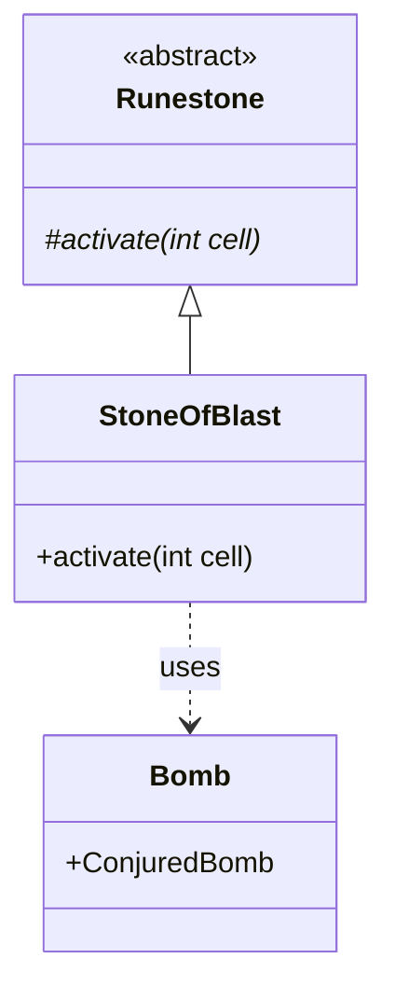

# StoneOfBlast 文档

## 1. 基本信息

| 属性 | 值 |
|------|-----|
| **文件路径** | core/src/main/java/com/shatteredpixel/shatteredpixeldungeon/items/stones/StoneOfBlast.java |
| **包名** | com.shatteredpixel.shatteredpixeldungeon.items.stones |
| **文件类型** | class |
| **继承关系** | extends Runestone |
| **代码行数** | 38 |
| **所属模块** | core |

## 2. 文件职责说明

### 核心职责
StoneOfBlast（震爆符石）是一种投掷型符石，被投掷后会在目标位置立即爆炸，对范围内的所有东西造成伤害。

### 系统定位
位于 Runestone → StoneOfBlast 继承链中，是一种攻击型符石，使用 Bomb.ConjuredBomb 实现爆炸效果。

### 不负责什么
- 不负责创建持久的炸弹实体
- 不负责特殊的爆炸类型（如火、冰等）

## 3. 结构总览

### 主要成员概览
- `image` - 精灵图设置

### 主要逻辑块概览
- `activate(int cell)` - 触发爆炸

### 生命周期/调用时机
1. 玩家投掷符石到目标位置
2. 符石激活
3. 创建 ConjuredBomb 并爆炸

## 4. 继承与协作关系

### 父类提供的能力
从 Runestone 继承：
- `stackable = true` - 可堆叠
- `defaultAction = AC_THROW` - 默认动作为投掷
- `onThrow()` - 投掷逻辑
- `activate()` - 激活方法（需覆写）

### 覆写的方法
| 方法 | 覆写逻辑 |
|------|----------|
| `activate(int cell)` | 创建并引爆 ConjuredBomb |

### 依赖的关键类
| 类名 | 用途 |
|------|------|
| `Bomb` | 炸弹类 |
| `Bomb.ConjuredBomb` | 魔法召唤的炸弹 |
| `ItemSpriteSheet` | 精灵图定义 |

## 5. 字段/常量详解

### 静态常量
无静态常量定义。

### 实例字段
| 字段名 | 类型 | 默认值 | 说明 |
|--------|------|--------|------|
| `image` | int | ItemSpriteSheet.STONE_BLAST | 符石精灵图 |

## 6. 构造与初始化机制

### 构造器
使用默认构造器，通过实例初始化块设置属性：

```java
{
    image = ItemSpriteSheet.STONE_BLAST;
}
```

## 7. 方法详解

### activate(int cell)

**可见性**：protected

**是否覆写**：是，覆写自 Runestone

**方法职责**：在目标位置创建并引爆魔法炸弹。

**参数**：
- `cell` (int)：激活位置的格子坐标

**返回值**：void

**副作用**：
- 对范围内所有角色造成伤害
- 可能破坏地形或物品

**核心实现逻辑**：
```java
@Override
protected void activate(int cell) {
    new Bomb.ConjuredBomb().explode(cell);
}
```

**边界情况**：
- 爆炸会伤害所有范围内的角色（包括玩家）
- 爆炸可能破坏某些地形

## 8. 对外暴露能力

### 显式 API
| 方法 | 用途 |
|------|------|
| `activate(int cell)` | 激活符石效果（由父类调用） |

## 9. 运行机制与调用链

```
投掷动作 → Runestone.onThrow() → activate()
    → new Bomb.ConjuredBomb().explode(cell)
    → 爆炸效果
```

## 10. 资源、配置与国际化关联

### 引用的 messages 文案
| 键名 | 中文翻译 | 用途 |
|------|---------|------|
| items.stones.stoneofblast.name | 震爆符石 | 物品名称 |
| items.stones.stoneofblast.desc | 这颗符石被扔出后会在目的地立即爆炸... | 物品描述 |

### 中文翻译来源
来自 `items_zh.properties` 文件。

## 11. 使用示例

### 基本用法
```java
// 创建并投掷震爆符石
StoneOfBlast stone = new StoneOfBlast();
stone.quantity = 1;

// 投掷到目标位置
stone.doThrow(hero, targetCell);

// 符石会立即爆炸
```

## 12. 开发注意事项

### 状态依赖
- 爆炸效果完全依赖 Bomb.ConjuredBomb 的实现

### 常见陷阱
- 爆炸会伤害玩家自己
- 需要注意投掷距离避免误伤

## 13. 事实核查清单

- [x] 是否已覆盖全部字段
- [x] 是否已覆盖全部方法
- [x] 是否已检查继承链与覆写关系
- [x] 是否已核对官方中文翻译
- [x] 是否存在任何推测性表述（无）
- [x] 示例代码是否真实可用

---

## 附：类关系图

