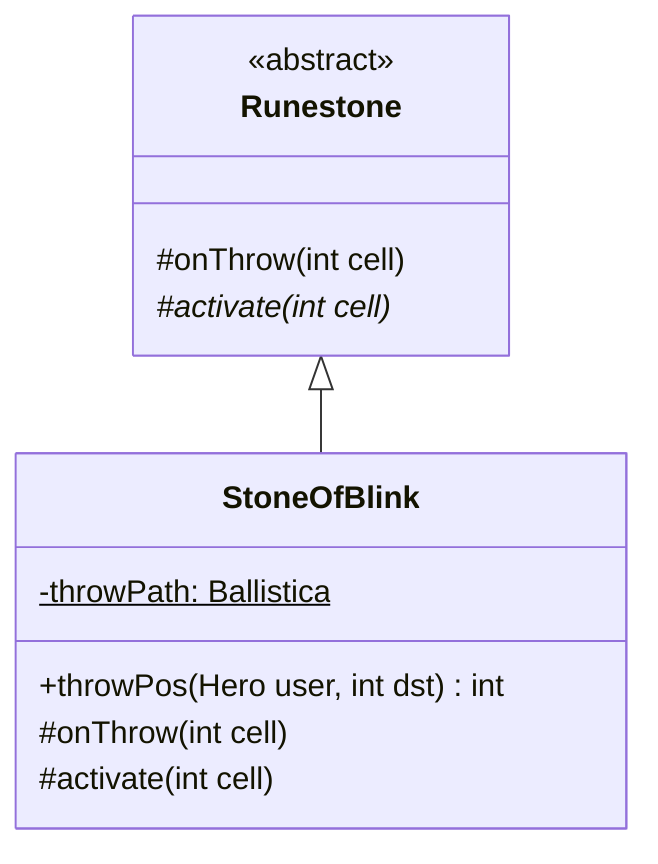

# StoneOfBlink 文档

## 1. 基本信息

| 属性 | 值 |
|------|-----|
| **文件路径** | core/src/main/java/com/shatteredpixel/shatteredpixeldungeon/items/stones/StoneOfBlink.java |
| **包名** | com.shatteredpixel.shatteredpixeldungeon.items.stones |
| **文件类型** | class |
| **继承关系** | extends Runestone |
| **代码行数** | 57 |
| **所属模块** | core |

## 2. 文件职责说明

### 核心职责
StoneOfBlink（闪现符石）是一种投掷型符石，被投掷后会将使用者传送到目标位置。如果目标位置有角色，则传送到路径的前一格。

### 系统定位
位于 Runestone → StoneOfBlink 继承链中，是一种移动型符石，提供短距离传送能力。

### 不负责什么
- 不负责对敌人造成伤害
- 不负责穿越墙壁（受传送规则限制）

## 3. 结构总览

### 主要成员概览
- `image` - 精灵图设置
- `throwPath` - 投掷路径缓存

### 主要逻辑块概览
- `throwPos()` - 计算投掷目标位置
- `onThrow()` - 处理投掷逻辑（覆写）
- `activate()` - 执行传送

### 生命周期/调用时机
1. 玩家选择投掷目标
2. 计算投掷路径
3. 投掷符石
4. 如果目标有角色，调整落点
5. 激活传送效果

## 4. 继承与协作关系

### 父类提供的能力
从 Runestone 继承：
- `stackable = true` - 可堆叠
- `defaultAction = AC_THROW` - 默认动作为投掷
- `onThrow()` - 投掷逻辑（被覆写）
- `activate()` - 激活方法（需覆写）

### 覆写的方法
| 方法 | 覆写逻辑 |
|------|----------|
| `throwPos(Hero user, int dst)` | 计算并缓存投掷路径 |
| `onThrow(int cell)` | 如果目标有角色，调整到路径前一格 |
| `activate(int cell)` | 传送使用者到目标位置 |

### 依赖的关键类
| 类名 | 用途 |
|------|------|
| `Actor` | 查找位置上的角色 |
| `Hero` | 英雄类 |
| `ScrollOfTeleportation` | 传送逻辑实现 |
| `Ballistica` | 弹道计算 |
| `ItemSpriteSheet` | 精灵图定义 |

## 5. 字段/常量详解

### 静态常量
无静态常量定义。

### 静态字段
| 字段名 | 类型 | 默认值 | 说明 |
|--------|------|--------|------|
| `throwPath` | Ballistica | null | 缓存投掷路径，用于调整落点 |

## 6. 构造与初始化机制

### 构造器
使用默认构造器，通过实例初始化块设置属性：

```java
{
    image = ItemSpriteSheet.STONE_BLINK;
}
```

## 7. 方法详解

### throwPos(Hero user, int dst)

**可见性**：public

**是否覆写**：是，覆写自 Item

**方法职责**：计算投掷目标位置并缓存路径。

**参数**：
- `user` (Hero)：投掷者
- `dst` (int)：目标位置

**返回值**：int，碰撞位置

**核心实现逻辑**：
```java
@Override
public int throwPos(Hero user, int dst) {
    throwPath = new Ballistica( user.pos, dst, Ballistica.PROJECTILE );
    return throwPath.collisionPos;
}
```

---

### onThrow(int cell)

**可见性**：protected

**是否覆写**：是，覆写自 Runestone

**方法职责**：处理投掷逻辑，如果目标位置有角色，则调整到路径前一格。

**参数**：
- `cell` (int)：投掷目标位置

**核心实现逻辑**：
```java
@Override
protected void onThrow(int cell) {
    // 如果目标位置有角色且路径距离>=1，传送到路径前一格
    if (Actor.findChar(cell) != null && throwPath.dist >= 1){
        cell = throwPath.path.get(throwPath.dist-1);
    }
    throwPath = null; // 清除缓存
    super.onThrow(cell);
}
```

**边界情况**：
- 目标有角色时传送到前一格，避免传送到敌人位置
- 路径距离为0时不调整

---

### activate(int cell)

**可见性**：protected

**是否覆写**：是，覆写自 Runestone

**方法职责**：将使用者传送到目标位置。

**参数**：
- `cell` (int)：目标位置

**核心实现逻辑**：
```java
@Override
protected void activate(int cell) {
    ScrollOfTeleportation.teleportToLocation(curUser, cell);
}
```

## 8. 对外暴露能力

### 显式 API
| 方法 | 用途 |
|------|------|
| `throwPos(Hero, int)` | 计算投掷位置 |
| `activate(int cell)` | 激活传送效果 |

## 9. 运行机制与调用链

```
选择投掷目标 → throwPos() 计算路径并缓存
    → 投掷动作
    → onThrow() 检查目标是否有角色
        → 有角色：调整到路径前一格
        → 无角色：直接到目标位置
    → Runestone.onThrow() → activate()
    → ScrollOfTeleportation.teleportToLocation()
    → 传送完成
```

## 10. 资源、配置与国际化关联

### 引用的 messages 文案
| 键名 | 中文翻译 | 用途 |
|------|---------|------|
| items.stones.stoneofblink.name | 闪现符石 | 物品名称 |
| items.stones.stoneofblink.desc | 这颗符石被扔出后会把使用者传送到目的地。 | 物品描述 |

### 中文翻译来源
来自 `items_zh.properties` 文件。

## 11. 使用示例

### 基本用法
```java
// 创建并投掷闪现符石
StoneOfBlink stone = new StoneOfBlink();
stone.quantity = 1;

// 投掷到目标位置，玩家会被传送过去
stone.doThrow(hero, targetCell);
```

### 战术应用
```java
// 用于快速穿越战场
// 可用于逃跑或追击
// 注意：不能穿墙
```

## 12. 开发注意事项

### 状态依赖
- 依赖 `throwPath` 静态变量缓存路径
- 传送效果完全依赖 `ScrollOfTeleportation.teleportToLocation()`

### 常见陷阱
- 静态变量 `throwPath` 在多线程环境下可能有问题
- 传送受地形限制（不能穿墙）

## 13. 事实核查清单

- [x] 是否已覆盖全部字段
- [x] 是否已覆盖全部方法
- [x] 是否已检查继承链与覆写关系
- [x] 是否已核对官方中文翻译
- [x] 是否存在任何推测性表述（无）
- [x] 示例代码是否真实可用

---

## 附：类关系图

